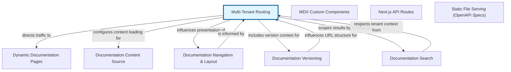

# Multi-Tenant Routing: Directing Traffic to the Right Tenant

Multi-Tenant Routing is a fundamental abstraction in a multi-tenant architecture, serving as the intelligent gateway that interprets incoming requests and identifies which specific customer, or 'tenant', the request belongs to. In a multi-tenant system, a single instance of an application serves multiple distinct customers. The routing mechanism is crucial for ensuring that each tenant receives their own personalized experience and accesses only their permitted resources, such as specific documentation, data, or application settings.

The core function of Multi-Tenant Routing is to extract a tenant identifier from various parts of an incoming HTTP request. This identifier could be found in the subdomain (e.g., 'tenant-a.example.com'), a path segment in the URL (e.g., 'example.com/tenant-b/docs'), a custom HTTP header (e.g., 'X-Tenant-ID'), or even as part of an authentication token. Once the tenant is identified, this context is then passed down through the application stack, informing subsequent layers like data access (filtering database queries by tenant ID) and user interface rendering (loading tenant-specific themes or content).

For a documentation system, Multi-Tenant Routing is paramount. It ensures that when 'Tenant A's users visit their documentation portal, they see only 'Tenant A''s guides, articles, and product information, distinct from what 'Tenant B's users would see on their dedicated portal. This dynamic serving of content based on the identified tenant is central to maintaining data isolation, providing a customized user experience, and preventing accidental exposure of sensitive information between tenants in a shared infrastructure.


## Architecture



## Code Examples

### Subdomain-based Tenant Identification with Flask

This example demonstrates how a web application, using the Flask framework in Python, can identify a tenant based on the subdomain of the incoming request. When a request arrives, Flask's routing mechanism is configured to capture the subdomain as a 'tenant_id'. This 'tenant_id' is then used to look up and serve tenant-specific content, in this case, documentation. This pattern is widely used because subdomains offer a clear, branded, and easily distinguishable entry point for each tenant. For local testing, you typically need to modify your system's 'hosts' file to map custom subdomains (like 'tenant1.localhost') to '127.0.0.1'.


```python
from flask import Flask, request, render_template_string, abort

app = Flask(__name__)

# Simulate a dictionary for tenant-specific documentation
# In a real application, this data would typically come from a database,
# a dedicated file system, or an external content management system.
TENANT_DOCS = {
    'tenant1': {
        'title': 'Tenant 1 Documentation Portal',
        'content': 'Welcome to Tenant 1''s exclusive documentation. Find your specific guides and tutorials here.'
    },
    'tenant2': {
        'title': 'Tenant 2 Knowledge Base',
        'content': 'Hello from Tenant 2! Explore your specific features, FAQs, and support articles.'
    }
}

# A general homepage route for when no specific subdomain is used
@app.route('/')
def index():
    return "<h1>Welcome to the Multi-Tenant Documentation Platform</h1><p>Try accessing documentation via specific subdomains, e.g., 'http://tenant1.localhost:5000/' or 'http://tenant2.localhost:5000/' (after configuring your hosts file).</p>"

# Route to dynamically serve documentation based on the subdomain
# The '<tenant_id>' in 'subdomain=' captures the subdomain part of the hostname.
@app.route('/', subdomain='<tenant_id>')
def tenant_docs(tenant_id):
    if tenant_id not in TENANT_DOCS:
        abort(404, description="Tenant not found or no documentation available for this tenant.")

    doc_info = TENANT_DOCS[tenant_id]
    return render_template_string("""
        <!DOCTYPE html>
        <html lang="en">
        <head>
            <meta charset="UTF-8">
            <meta name="viewport" content="width=device-width, initial-scale=1.0">
            <title>{{ title }}</title>
            <style>
                body { font-family: sans-serif; margin: 2em; line-height: 1.6; }
                h1 { color: #333; }
                p { color: #555; }
                b { color: #007bff; }
            </style>
        </head>
        <body>
            <h1>{{ title }}</h1>
            <p>{{ content }}</p>
            <hr>
            <small>You are viewing documentation for tenant: <b>{{ tenant_id }}</b></small>
        </body>
        </html>
    """, title=doc_info['title'], content=doc_info['content'], tenant_id=tenant_id)

if __name__ == '__main__':
    # To test this application locally:
    # 1. You MUST add entries to your system's hosts file.
    #    - On Linux/macOS: Edit '/etc/hosts'
    #    - On Windows: Edit 'C:\Windows\System32\drivers\etc\hosts'
    #    Add these lines:
    #    127.0.0.1 tenant1.localhost
    #    127.0.0.1 tenant2.localhost
    # 2. Run this Python script.
    # 3. Open your web browser and navigate to:
    #    - 'http://tenant1.localhost:5000/'
    #    - 'http://tenant2.localhost:5000/'
    #    - 'http://localhost:5000/' (for the general index page)
    app.run(debug=True, host='0.0.0.0', port=5000) # 'host='0.0.0.0'' allows access via hostnames

```

## Implementation

Implementing Multi-Tenant Routing involves several key considerations beyond basic tenant identification. First, the chosen method of tenant identification (subdomain, path, header) should align with the application's architecture and user experience goals. For instance, subdomains offer brandability but require DNS configuration, while path-based routing is simpler for DNS but might be less aesthetically pleasing. Once the tenant ID is extracted, it is crucial to establish a 'tenant context' that is available throughout the entire request lifecycle. This context is often stored in thread-local storage or a request-scoped object, allowing all subsequent components, from database queries to template rendering, to access the current tenant's identifier without explicitly passing it around.

Best practices include robust validation of the identified tenant ID to prevent security vulnerabilities or access to non-existent tenants. Caching tenant-specific configurations can significantly reduce latency by avoiding repeated lookups. Integration with an Application Load Balancer (ALB) or reverse proxy (like Nginx) is common in production, where these components can handle the initial routing and potentially even rewrite headers or URLs before passing requests to the application server. Furthermore, it is paramount to ensure that the identified tenant ID is strictly enforced across all layers of the application to prevent 'tenant hopping' or data leakage, reinforcing the principle of tenant isolation.


## Related Concepts

- Multi-Tenancy

- Web Routing

- Domain Name System (DNS)

- Subdomains

- URL Path Parameters

- HTTP Headers

- Request Context

- Application Load Balancer (ALB)

- Reverse Proxy

- Authentication and Authorization

- Tenant Isolation
