# Documentation Versioning: Managing Evolving Content for Each Tenant

Documentation Versioning is a critical abstraction that empowers systems to manage and present multiple iterations of documentation content, specifically tailored for individual tenants. In a multi-tenant environment, this means that 'Tenant A' could be viewing documentation version '1.0' for a product feature, while 'Tenant B' might be viewing version '1.1' if they have already upgraded or are on a different release track. This capability allows administrators to maintain a single source of truth for all documentation while offering a customized, relevant experience to each customer.

The primary purpose of this abstraction is to enable seamless access to historical, current, and even upcoming documentation content. For instance, if a product undergoes a major update, tenants can still access the documentation that corresponds to their currently deployed software version. Conversely, advanced tenants might get early access to documentation for features that are still in beta. This approach prevents confusion, ensures compliance with specific tenant agreements, and supports a flexible product release cycle without forcing all tenants onto the latest documentation immediately.

Fitting into the larger system, Documentation Versioning acts as a bridge between the content management layer and the tenant management layer. It integrates with content publication workflows, ensuring that when new documentation is created or updated, it is appropriately tagged with a version number and associated with the relevant tenants or tenant groups. This ensures that the right documentation is delivered to the right user at the right time, enhancing the overall user experience and reducing support overhead.


## Architecture

```mermaid
flowchart TD
    DocumentationVersion["Documentation Versioning"]
    classDef highlight fill:#e1f5fe,stroke:#01579b,stroke-width:3px
    class DocumentationVersion highlight
    MultiTenantRouting["Multi-Tenant Routing"]
    DynamicDocumentation["Dynamic Documentation Pages"]
    DocumentationContent["Documentation Content Source"]
    MDXCustomComponents["MDX Custom Components"]
    DocumentationNavigat["Documentation Navigation & Layout"]
    NextjsAPIRoutes["Next.js API Routes"]
    StaticFileServingOpe["Static File Serving (OpenAPI Specs)"]
    DocumentationSearch["Documentation Search"]

    %% Relationships
    MultiTenantRouting -->|"includes version context for"| DocumentationVersion
    DynamicDocumentation -->|"presents content based on"| DocumentationVersion
    DocumentationContent -->|"organizes content by"| DocumentationVersion
    DocumentationNavigat -->|"incorporates version selection for"| DocumentationVersion
    DocumentationVersion -->|"influences URL structure for"| MultiTenantRouting
    DocumentationVersion -->|"determines content for"| DynamicDocumentation
    DocumentationVersion -->|"filters available content via"| DocumentationContent
    DocumentationVersion -->|"updates navigation based on"| DocumentationNavigat
    DocumentationVersion -->|"scopes search results by"| DocumentationSearch
    DocumentationSearch -->|"filters by selected version from"| DocumentationVersion
```



## Code Examples

### Backend API for Fetching Versioned Documentation

This backend example demonstrates a Typescript 'Express.js' route handler for fetching documentation. It shows how to extract the tenant identifier and the requested documentation version from the request parameters or query string. The handler then queries a hypothetical 'documentation service' or database, passing both the tenant ID and the specific version to retrieve the correct content. This ensures that even if multiple tenants are requesting documentation for the same document ID, they receive the version relevant to their context. The 'docService.getDocumentationContent' function would encapsulate the logic for looking up the documentation in a data store, potentially with fallback mechanisms if a specific version is not found for a given tenant.


```typescript
import { Request, Response, Router } from 'express';

// Assume this is a service that interacts with your data layer
interface DocumentationService {
    getDocumentationContent(tenantId: string, docId: string, version: string): Promise<string | null>;
    getAvailableVersions(tenantId: string, docId: string): Promise<string[]>;
}

class MockDocumentationService implements DocumentationService {
    private docsStore: Map<string, Map<string, Map<string, string>>> = new Map(); // tenantId -> docId -> version -> content

    constructor() {
        // Populate with some mock data
        this.addDoc('tenant-a', 'getting-started', '1.0', 'Tenant A Getting Started v1.0');
        this.addDoc('tenant-a', 'getting-started', '1.1', 'Tenant A Getting Started v1.1 (new features)');
        this.addDoc('tenant-b', 'getting-started', '1.0', 'Tenant B Getting Started v1.0');
        this.addDoc('tenant-b', 'advanced-config', '2.0', 'Tenant B Advanced Config v2.0');
    }

    private addDoc(tenantId: string, docId: string, version: string, content: string) {
        if (!this.docsStore.has(tenantId)) {
            this.docsStore.set(tenantId, new Map());
        }
        const tenantDocs = this.docsStore.get(tenantId)!;
        if (!tenantDocs.has(docId)) {
            tenantDocs.set(docId, new Map());
        }
        tenantDocs.get(docId)!.set(version, content);
    }

    async getDocumentationContent(tenantId: string, docId: string, version: string): Promise<string | null> {
        const tenantDocs = this.docsStore.get(tenantId);
        if (tenantDocs) {
            const docVersions = tenantDocs.get(docId);
            if (docVersions) {
                return docVersions.get(version) || null;
            }
        }
        return null;
    }

    async getAvailableVersions(tenantId: string, docId: string): Promise<string[]> {
      const tenantDocs = this.docsStore.get(tenantId);
      if (tenantDocs) {
          const docVersions = tenantDocs.get(docId);
          if (docVersions) {
              return Array.from(docVersions.keys()).sort();
          }
      }
      return [];
    }
}

const docService = new MockDocumentationService();
const router = Router();

router.get('/docs/:docId', async (req: Request, res: Response) => {
    const { docId } = req.params;
    const { version } = req.query; // Version can be passed as a query parameter
    const tenantId = req.headers['x-tenant-id'] as string; // Assume tenant ID comes from a header or JWT

    if (!tenantId) {
        return res.status(400).send('Tenant ID is required');
    }

    if (!version) {
        // Optionally, fetch the 'default' or 'latest' version for the tenant
        // For simplicity, we'll require version here.
        return res.status(400).send('Documentation version is required');
    }

    try {
        const content = await docService.getDocumentationContent(tenantId, docId, version as string);

        if (content) {
            res.status(200).send(content);
        } else {
            res.status(404).send('Documentation not found for the specified tenant, document ID, and version.');
        }
    } catch (error) {
        console.error('Error fetching documentation:', error);
        res.status(500).send('Internal server error.');
    }
});

router.get('/docs/:docId/versions', async (req: Request, res: Response) => {
  const { docId } = req.params;
  const tenantId = req.headers['x-tenant-id'] as string;

  if (!tenantId) {
      return res.status(400).send('Tenant ID is required');
  }

  try {
      const versions = await docService.getAvailableVersions(tenantId, docId);
      res.status(200).json(versions);
  } catch (error) {
      console.error('Error fetching available versions:', error);
      res.status(500).send('Internal server error.');
  }
});

export default router; // Export the router for use in an Express app

```

### Frontend Component for Version Selection

This frontend example, using a React-like syntax with Typescript, illustrates a component that displays versioned documentation and allows a user to switch between available versions. It fetches the documentation content based on the currently selected version and the active tenant. A dropdown menu or similar UI element lists the versions, and selecting a new version triggers an update to the displayed content. The component fetches available versions for the tenant and document, then defaults to the latest or a pre-configured version. When a new version is selected, it makes an API call to the backend endpoint shown in the previous example to retrieve the specific content.


```typescript
import React, { useState, useEffect } from 'react';

interface DocVersionSelectorProps {
    tenantId: string;
    docId: string;
    initialVersion?: string;
}

const DocumentationVersionViewer: React.FC<DocVersionSelectorProps> = ({
    tenantId,
    docId,
    initialVersion
}) => {
    const [currentVersion, setCurrentVersion] = useState<string | undefined>(initialVersion);
    const [availableVersions, setAvailableVersions] = useState<string[]>([]);
    const [documentationContent, setDocumentationContent] = useState<string | null>(null);
    const [loading, setLoading] = useState<boolean>(true);
    const [error, setError] = useState<string | null>(null);

    // Simulate API call to fetch available versions
    const fetchAvailableVersions = async (tenant: string, document: string): Promise<string[]> => {
        // In a real application, this would be an actual API call to your backend
        try {
            const response = await fetch(`/api/docs/${document}/versions`, {
                headers: { 'x-tenant-id': tenant }
            });
            if (!response.ok) {
                throw new Error(`HTTP error! status: ${response.status}');
            }
            const versions = await response.json();
            return versions;
        } catch (err) {
            console.error('Failed to fetch available versions:', err);
            return [];
        }
    };

    // Simulate API call to fetch documentation content
    const fetchDocumentationContent = async (tenant: string, document: string, version: string): Promise<string | null> => {
        try {
            setLoading(true);
            setError(null);
            const response = await fetch(`/api/docs/${document}?version=${version}`, {
                headers: { 'x-tenant-id': tenant }
            });
            if (!response.ok) {
                throw new Error(`HTTP error! status: ${response.status}');
            }
            const content = await response.text();
            return content;
        } catch (err: any) {
            setError(`Failed to load documentation: ${err.message}');
            return null;
        } finally {
            setLoading(false);
        }
    };

    useEffect(() => {
        const loadVersionsAndContent = async () => {
            const versions = await fetchAvailableVersions(tenantId, docId);
            setAvailableVersions(versions);

            let versionToLoad = initialVersion;
            if (!versionToLoad && versions.length > 0) {
                // Default to the latest version if no initialVersion is provided
                versionToLoad = versions[versions.length - 1];
            }
            setCurrentVersion(versionToLoad);

            if (versionToLoad) {
                const content = await fetchDocumentationContent(tenantId, docId, versionToLoad);
                setDocumentationContent(content);
            } else {
                setDocumentationContent('No documentation versions available.');
                setLoading(false);
            }
        };
        loadVersionsAndContent();
    }, [tenantId, docId, initialVersion]);

    const handleVersionChange = async (event: React.ChangeEvent<HTMLSelectElement>) => {
        const newVersion = event.target.value;
        setCurrentVersion(newVersion);
        const content = await fetchDocumentationContent(tenantId, docId, newVersion);
        setDocumentationContent(content);
    };

    if (loading && !documentationContent) {
        return <div>Loading documentation...</div>;
    }

    if (error) {
        return <div style={{ color: 'red' }}>Error: {'error'}</div>;
    }

    return (
        <div>
            <h2>Documentation for '{docId}'</h2>
            {availableVersions.length > 1 && (
                <div style={{ marginBottom: '15px' }}>
                    <label htmlFor="doc-version-select">Select Version: </label>
                    <select
                        id="doc-version-select"
                        value={currentVersion || ''}
                        onChange={handleVersionChange}
                        disabled={loading}
                    >
                        {availableVersions.map((version) => (
                            <option key={version} value={version}>
                                {version}
                            </option>
                        ))}
                    </select>
                </div>
            )}
            <div style={{ border: '1px solid #ccc', padding: '15px', minHeight: '200px', backgroundColor: '#f9f9f9' }}>
                {documentationContent ? <pre>{documentationContent}</pre> : 'No documentation content available for this version.'}
            </div>
        </div>
    );
};

// Example usage (in a higher-level component or your app entry point)
// <DocumentationVersionViewer tenantId="tenant-a" docId="getting-started" />
// <DocumentationVersionViewer tenantId="tenant-b" docId="advanced-config" initialVersion="2.0" />

```

## Implementation

Implementing Documentation Versioning requires careful consideration of content storage, API design, and workflow integration. For storage, you might use a database where each documentation record includes fields for 'tenant_id', 'doc_id', 'version_number', and 'content'. Alternatively, file-based storage like Amazon S3 or a Git repository could be used, where versions are represented by distinct file paths (e.g., 's3://bucket/tenant-a/docs/getting-started/v1.0.md') or Git branches/tags. It's crucial to establish a clear versioning scheme, such as semantic versioning ('1.0.0', '1.1.0', '2.0.0') or date-based versions.

The API for retrieving documentation should always accept a 'tenant_id' and a 'version' parameter, either as URL path segments, query parameters, or request headers, ensuring that content is always scoped appropriately. A fallback mechanism is essential: if a specific version requested by a tenant does not exist, the system should ideally revert to a default version (e.g., the latest available, or the last major version for that tenant) rather than returning an error. Content creation and publication workflows must integrate version tagging, allowing content creators to specify which version they are publishing and which tenants it applies to. Finally, the user interface should clearly indicate the currently viewed version and provide an intuitive way for users to switch versions, if permitted for their tenant.


## Related Concepts

- Multi-Tenancy

- Content Management Systems (CMS)

- API Versioning

- Release Management

- Configuration Management

- Access Control Lists (ACLs)

- Internationalization (i18n)
