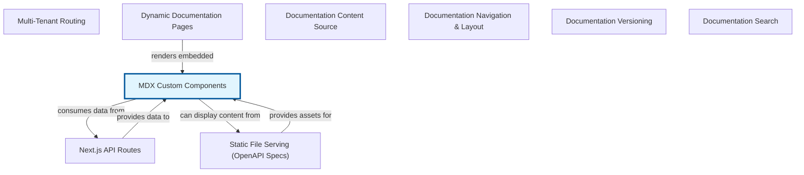

# Embedding Interactivity: MDX Custom Components

MDX Custom Components represent a powerful abstraction that bridges the gap between static documentation and dynamic, interactive experiences. At its core, MDX is an extension of Markdown that allows you to seamlessly write JSX – React components – directly within your Markdown files. While traditional Markdown is excellent for structured text, it lacks the ability to create interactive UI elements, dynamic data visualizations, or complex forms often required in modern documentation.

This is where MDX Custom Components shine. They enable developers to define and use their own React components within MDX files, transforming plain text content into a rich, interactive application. Imagine needing to show a live code editor, an interactive chart that responds to user input, or a step-by-step wizard right within your documentation. Instead of linking out to external examples or providing static screenshots, MDX Custom Components allow you to embed these experiences directly, keeping users engaged and informed without leaving the documentation page.

The beauty of this system lies in its ability to integrate custom functionality precisely where it's needed, leveraging the full power of React within a familiar Markdown syntax. It fits into the larger system of a documentation website (often built with tools like Next.js, Gatsby, or Docusaurus) by providing a flexible framework for content authors to create engaging content that goes beyond mere text, making documentation more useful, illustrative, and enjoyable.


## Architecture



## Code Examples

### 1. Basic Custom Component Usage

This example demonstrates the fundamental process of creating a React component and then importing and using it within an MDX file. The 'components/Callout.tsx' file defines a simple component to display important information. The 'docs/my-document.mdx' file then imports and utilizes this component, showing how custom interactive or styled elements can be embedded alongside regular Markdown.


```typescript
# components/Callout.tsx
import React from 'react';

interface CalloutProps {
  type?: 'info' | 'warning' | 'error';
  children: React.ReactNode;
}

const Callout: React.FC<CalloutProps> = ({ type = 'info', children }) => {
  const styles: React.CSSProperties = {
    padding: '12px 16px',
    borderRadius: '4px',
    margin: '16px 0',
    borderLeft: '4px solid',
  };

  switch (type) {
    case 'warning':
      styles.backgroundColor = '#fff3cd';
      styles.borderColor = '#ffc107';
      styles.color = '#856404';
      break;
    case 'error':
      styles.backgroundColor = '#f8d7da';
      styles.borderColor = '#dc3545';
      styles.color = '#721c24';
      break;
    case 'info':
    default:
      styles.backgroundColor = '#d1ecf1';
      styles.borderColor = '#17a2b8';
      styles.color = '#0c5460';
      break;
  }

  return <div style={styles}>{children}</div>;
};

export default Callout;

---

# docs/my-document.mdx
import Callout from '../components/Callout';

# Getting Started with MDX Custom Components

This is some regular Markdown content.

<Callout type="info">
  Remember to import your custom components at the top of your MDX file.
</Callout>

You can also use different types of callouts:

<Callout type="warning">
  Always test your components thoroughly before deploying.
</Callout>

<Callout type="error">
  This is a critical error message example.
</Callout>

This concludes our introduction to basic custom components.

```

### 2. Passing Props to Custom Components

Building on the previous example, this demonstrates how to pass properties (props) from your MDX file to a custom React component. Props allow components to be dynamic and reusable, accepting data that changes their behavior or appearance. Here, a 'CodeBlock' component is defined to render code with a specified language, making it more flexible than a static block.


```typescript
# components/CodeBlock.tsx
import React from 'react';
import { Prism as SyntaxHighlighter } from 'react-syntax-highlighter';
import { vscDarkPlus } from 'react-syntax-highlighter/dist/esm/styles/prism';

interface CodeBlockProps {
  language: string;
  children: string; // The code itself
}

const CodeBlock: React.FC<CodeBlockProps> = ({ language, children }) => {
  return (
    <SyntaxHighlighter language={language} style={vscDarkPlus}>
      {children.trim()}
    </SyntaxHighlighter>
  );
};

export default CodeBlock;

---

# docs/another-document.mdx
import CodeBlock from '../components/CodeBlock';

# Code Examples in MDX

This section shows how to embed code snippets using a custom component.

<CodeBlock language="typescript">
{`
  function greet(name: string): string {
    return 'Hello, ' + name + '!';
  }

  console.log(greet('MDX User'));
`}
</CodeBlock>

You can easily change the language for different examples:

<CodeBlock language="python">
{`
  def factorial(n):
    if n == 0:
      return 1
    else:
      return n * factorial(n-1)

  print(factorial(5))
`}
</CodeBlock>

Note the use of curly braces '{`...`}' to pass string literals containing newlines, often referred to as a template literal.

```

### 3. Overriding Default HTML Elements

MDX provides a mechanism to globally override the default React components used to render standard HTML elements (like 'p' for paragraphs, 'h1' for headings, 'a' for links, etc.). This is incredibly useful for applying consistent styling, branding, or adding specific functionality to all instances of these elements across your entire documentation site without modifying each MDX file. The example shows how to provide custom components for 'h1' and 'p' elements.


```typescript
# components/CustomH1.tsx
import React from 'react';

const CustomH1: React.FC<{children: React.ReactNode}> = ({ children }) => (
  <h1 style={{ color: '#8b0000', borderBottom: '2px solid #8b0000', paddingBottom: '5px' }}>
    {children}
  </h1>
);

export default CustomH1;

# components/CustomP.tsx
import React from 'react';

const CustomP: React.FC<{children: React.ReactNode}> = ({ children }) => (
  <p style={{ lineHeight: '1.6', fontSize: '1.1em', marginBottom: '1em' }}>
    {children}
  </p>
);

export default CustomP;

---

# app/MDXProvider.tsx (or similar global setup file)
import { MDXProvider } from '@mdx-js/react';
import CustomH1 from './components/CustomH1';
import CustomP from './components/CustomP';

const components = {
  h1: CustomH1,
  p: CustomP,
  // You can override any HTML element here
  // a: CustomLink,
  // pre: CustomPreBlock,
};

interface AppMDXProviderProps {
  children: React.ReactNode;
}

const AppMDXProvider: React.FC<AppMDXProviderProps> = ({ children }) => (
  <MDXProvider components={components}>
    {children}
  </MDXProvider>
);

export default AppMDXProvider;

---

# docs/final-document.mdx (no imports needed for overridden components)
# This is a main heading
This is a paragraph of text. It should now render using the custom 'p' component defined in the global 'MDXProvider'.

## This is a subheading (not overridden, so it uses default 'h2')
And here is another paragraph, also affected by the global override.
This shows how consistent styling can be applied effortlessly.

```

## Implementation

Implementing MDX Custom Components typically involves two main steps. First, you define your React components as you normally would, ensuring they are designed for reusability and accept props where necessary. These components are usually placed in a 'components' directory or a shared component library. Second, you integrate these components into your MDX rendering pipeline.

For directly embedding components (as shown in examples 1 and 2), you simply import them at the top of your '.mdx' file using standard JavaScript 'import' syntax, and then use them like any other JSX element. For globally overriding default HTML elements (as in example 3), you'll use a component called 'MDXProvider' (from '@mdx-js/react'). This provider wraps your entire MDX content and accepts a 'components' prop, which is an object mapping HTML tag names (e.g., 'h1', 'p', 'a') to your custom React components. This setup is usually done once at the root of your application or documentation layout, ensuring consistent styling and behavior across all MDX documents without requiring individual imports in each file. Best practice involves keeping these custom components minimal and focused, abstracting complex logic into separate modules.


## Related Concepts

- MDX (Markdown + JSX)

- React Components

- JSX (JavaScript XML)

- Component-Based Architecture

- Static Site Generators (e.g., Next.js, Gatsby, Docusaurus)

- Content Management Systems (Headless CMS)
