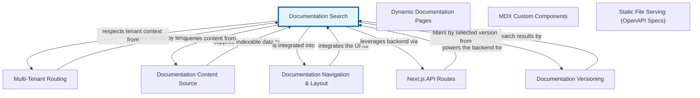

# Documentation Search: Finding Relevant Information

The Documentation Search abstraction provides a vital capability for any system that hosts a significant amount of informational content. Imagine a vast library without an index or a search engine – finding a specific book or article would be nearly impossible. This abstraction solves that problem by allowing users to quickly locate relevant documentation articles using keywords, phrases, or specific terms. It transforms a static collection of documents into an interactive and highly usable resource.

At its core, Documentation Search works by exposing a dedicated API endpoint. When a user enters a query into a search bar, the frontend application sends this query to the search API. The backend then processes the query, searches through its indexed documentation content, and returns a list of matching articles, often ranked by relevance. This significantly enhances the user experience, enabling efficient self-service support, faster problem resolution, and improved knowledge discovery within the system.

From a system perspective, Documentation Search integrates by consuming documentation content, which might come from various sources like Markdown files, database entries, or content management systems. It typically runs an indexing process to prepare this content for fast retrieval, and then serves search results through its API, which is consumed by user-facing applications (e.g., a web portal, a helpdesk interface, or an IDE plugin).


## Architecture



## Code Examples

### Defining a Search API Endpoint (Python Flask)

This example shows how to set up a basic HTTP GET endpoint in a Python Flask application that accepts a 'query' parameter. This endpoint will be responsible for receiving search requests from the client. In a real-world scenario, the 'search_documentation' function would interact with a search engine or database to find relevant articles. We use a simple placeholder to demonstrate the API structure.


```python
from flask import Flask, request, jsonify

app = Flask(__name__)

# This would be your actual search logic, interacting with an index or database
def search_documentation(query):
    # Dummy data for demonstration
    docs = [
        {'id': 'doc-1', 'title': 'Getting Started Guide', 'content': 'This guide helps you start with our platform.'},
        {'id': 'doc-2', 'title': 'Advanced Configuration', 'content': 'Learn about advanced settings and configurations.'},
        {'id': 'doc-3', 'title': 'Troubleshooting Common Issues', 'content': 'Solutions for frequently encountered problems.'},
        {'id': 'doc-4', 'title': 'API Reference', 'content': 'Detailed documentation for our API endpoints.'},
    ]
    results = []
    if query:
        query_lower = query.lower()
        for doc in docs:
            if query_lower in doc['title'].lower() or query_lower in doc['content'].lower():
                results.append({
                    'id': doc['id'],
                    'title': doc['title'],
                    'excerpt': doc['content'][:100] + '...' # Short excerpt
                })
    return results

@app.route('/api/docs/search', methods=['GET'])
def document_search_endpoint():
    query = request.args.get('q', '') # Get the search query from URL parameters
    if not query:
        return jsonify({'error': 'Search query parameter 'q' is missing'}), 400

    search_results = search_documentation(query)
    return jsonify({'query': query, 'results': search_results})

if __name__ == '__main__':
    app.run(debug=True)

```

### Making a Search Request from a Web Client (JavaScript)

This JavaScript code snippet demonstrates how a frontend application can send a search query to the backend API endpoint we defined earlier. It uses the 'fetch' API to make an asynchronous GET request, passing the user's input as a query parameter. The results are then processed and displayed to the user. This illustrates the client-side interaction with the Documentation Search abstraction.


```javascript
async function performSearch() {
    const searchInput = document.getElementById('searchInput');
    const searchTerm = searchInput.value;
    const searchResultsDiv = document.getElementById('searchResults');

    if (!searchTerm) {
        searchResultsDiv.innerHTML = '<p>Please enter a search term.</p>';
        return;
    }

    searchResultsDiv.innerHTML = '<p>Searching...</p>';

    try {
        // Construct the URL for our search API endpoint
        const response = await fetch(`/api/docs/search?q=${encodeURIComponent(searchTerm)}`);

        if (!response.ok) {
            throw new Error(`HTTP error! status: ${response.status}');
        }

        const data = await response.json();

        searchResultsDiv.innerHTML = ''; // Clear previous results

        if (data.results && data.results.length > 0) {
            const ul = document.createElement('ul');
            data.results.forEach(result => {
                const li = document.createElement('li');
                li.innerHTML = `<strong><a href="/docs/${result.id}">${result.title}</a></strong><p>${result.excerpt}</p>`;
                ul.appendChild(li);
            });
            searchResultsDiv.appendChild(ul);
        } else {
            searchResultsDiv.innerHTML = '<p>No results found for your query.</p>';
        }

    } catch (error) {
        console.error('Error fetching search results:', error);
        searchResultsDiv.innerHTML = `<p>An error occurred: ${error.message}</p>';
    }
}

// Example of how you might trigger this (e.g., from an input field and button)
// document.getElementById('searchButton').addEventListener('click', performSearch);
// <input type="text" id="searchInput" placeholder="Search documentation...">
// <button id="searchButton" onclick="performSearch()">Search</button>
// <div id="searchResults"></div>

```

## Implementation

Implementing a robust Documentation Search involves several key components. First, a data source for the documentation content is required, which could be a file system storing Markdown files, a database, or a dedicated Content Management System (CMS). Next, an indexing process is crucial. This process parses the documentation content, extracts relevant text, and builds an 'inverted index' which maps words to the documents containing them. Popular tools for this include Elasticsearch, Apache Solr, or simpler database-based full-text search capabilities like those in PostgreSQL or MySQL.

The API endpoint needs to be designed for performance and scalability, handling concurrent requests and efficiently querying the underlying search index. Considerations include caching frequent search results, implementing relevance ranking algorithms (e.g., TF-IDF, BM25) to ensure the most pertinent results appear first, and handling advanced query features like fuzzy matching, phrase searching, and filtering. For high-volume systems, horizontal scaling of the search infrastructure (e.g., an Elasticsearch cluster) might be necessary to maintain responsiveness.


## Related Concepts

- Full-Text Search

- Inverted Index

- API Design

- Data Indexing

- Information Retrieval

- Content Management System (CMS)

- Relevance Ranking

- Caching
