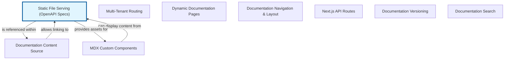

# Serving Static OpenAPI Specifications

This chapter explains the fundamental concept of serving static files within a web application, specifically focusing on how it applies to OpenAPI (formerly Swagger) specifications. Static file serving refers to the application's ability to deliver files directly to clients (like web browsers or other tools) without any server-side processing. These files, such as HTML, CSS, JavaScript, images, or in our case, YAML or JSON documents, are simply retrieved from the server's file system and sent as is.

OpenAPI specifications are machine-readable descriptions of your API, detailing available endpoints, operations, parameters, authentication methods, and more. They are typically written in YAML or JSON format and are inherently static documents. By serving these specifications as static files, an application makes its API contract easily accessible. This is crucial for seamless integration with API documentation tools (like Swagger UI), client-side code generators, and various development environments, enabling developers to understand and interact with the API effectively.

Exposing your OpenAPI specification statically provides a single source of truth for your API contract, ensuring consistency between your documentation and the actual API implementation. It simplifies the process of integrating your API into external systems and facilitates a 'contract-first' or 'design-first' approach to API development, where the API's behavior is defined upfront in the specification.


## Architecture



## Code Examples

### Serving a Static OpenAPI Specification with Node.js/Express

This example demonstrates how to set up an Express.js application to serve static files, including an OpenAPI specification. We will configure Express to serve general static assets from a 'public' directory, which is a common pattern for web applications. Then, we will specifically expose our 'openapi.yaml' file at a dedicated endpoint. This setup allows direct, public access to the API contract, enabling external tools or developers to consume the specification easily. The language field is set to 'typescript' as per the template, but the code provided is standard Node.js/Express JavaScript, which is widely applicable and often used in TypeScript projects.


```typescript
// Import necessary modules for an Express application
const express = require('express');
const path = require('path');
const fs = require('fs'); // Node.js File System module for reading files

const app = express();
const port = 3000;

// --- Setup your project structure ---
// In your project's root, create a 'public' directory.
// Inside 'public', create a file named 'openapi.yaml' with the following content:
/*
# public/openapi.yaml content
openapi: 3.0.0
info:
  title: My Example API
  version: 1.0.0
  description: A simple API for demonstration purposes.
servers:
  - url: http://localhost:3000/api
    description: Local Development Server
paths:
  /hello:
    get:
      summary: Returns a greeting
      responses:
        '200':
          description: Successful response
          content:
            application/json:
              schema:
                type: object
                properties:
                  message:
                    type: string
                    example: Hello from the API!
*/
// ------------------------------------

// 1. Serve general static files from the 'public' directory.
// Any file placed in the 'public' directory will be accessible directly via its path.
// For example, if you have 'public/index.html', it will be available at 'http://localhost:3000/index.html'.
app.use(express.static(path.join(__dirname, 'public')));
console.log(`Serving general static files from: ${path.join(__dirname, 'public')}');

// 2. Serve the OpenAPI specification file directly at a specific endpoint.
// This makes the 'openapi.yaml' file available at 'http://localhost:3000/openapi.yaml'.
// We explicitly read the file and set the correct Content-Type header.
app.get('/openapi.yaml', (req, res) => {
  const openApiPath = path.join(__dirname, 'public', 'openapi.yaml');

  // Check if the file exists and read it
  fs.readFile(openApiPath, 'utf8', (err, data) => {
    if (err) {
      console.error('Error reading OpenAPI file:', err);
      // If the file is not found, send a 404 response
      return res.status(404).send('OpenAPI specification file not found.');
    }
    // Set the Content-Type header to 'text/yaml' so browsers/tools interpret it correctly
    res.setHeader('Content-Type', 'text/yaml');
    res.send(data); // Send the content of the YAML file
  });
});

// Optional: A simple root route to verify the server is running.
app.get('/', (req, res) => {
  res.send('Welcome to the API server! Access the OpenAPI spec at <a href="/openapi.yaml">/openapi.yaml</a>.');
});

// Start the Express server
app.listen(port, () => {
  console.log(`Server listening at http://localhost:${port}');
  console.log(`OpenAPI specification available at http://localhost:${port}/openapi.yaml');
});

// To run this example:
// 1. Save this code as 'app.js' in a new project directory.
// 2. Create a 'public' directory in the same project directory.
// 3. Create 'public/openapi.yaml' with the content provided in the comments above.
// 4. In your terminal, navigate to the project directory and run:
//    'npm init -y'
//    'npm install express'
//    'node app.js'
// 5. Open your web browser and go to 'http://localhost:3000/openapi.yaml' to view the spec.

```

## Implementation

When implementing static file serving for OpenAPI specifications, consider the following best practices to ensure efficiency, security, and maintainability:
1.  **File Location and Organization**: Store your OpenAPI specification files in a dedicated, easily discoverable directory within your project, such as 'public/api-docs' or 'src/api-specs'. This keeps them separate from your application's source code and other static assets, promoting better organization.
2.  **Versioning**: As your API evolves, you will likely have multiple versions of your OpenAPI specification. Manage these by maintaining separate files for each version (e.g., 'openapi-v1.yaml', 'openapi-v2.yaml') and exposing them at distinct, versioned URLs (e.g., '/api-docs/v1', '/api-docs/v2'). This allows clients to reliably access the correct API contract.
3.  **Security Considerations**: While OpenAPI specifications are generally public-facing, ensure that they do not inadvertently expose sensitive internal details about your infrastructure, unencrypted credentials, or private business logic. If your application or specific endpoints require authentication to access the API spec, implement appropriate access controls on the serving endpoint, possibly using middleware to check authentication tokens or API keys.
4.  **HTTP Caching**: Leverage HTTP caching headers like 'Cache-Control', 'ETag', and 'Last-Modified' for your static OpenAPI files. Proper caching significantly reduces server load and improves client performance by allowing browsers and proxy servers to store and reuse the specification, only re-downloading it when changes occur. This is particularly important for frequently accessed documentation.
5.  **Content-Type Headers**: Always ensure the correct 'Content-Type' header is set when serving the specification. Use 'application/json' for JSON-formatted specs and 'text/yaml' for YAML-formatted specs. This is crucial for browsers and various API tools to correctly interpret the file content.
6.  **Integration with API Documentation Tools**: Once the OpenAPI specification is served statically, it can be easily consumed by various API documentation tools like Swagger UI, Redoc, Postman, or custom developer portals. These tools typically only require the URL of the served specification to render interactive and user-friendly API documentation.


## Related Concepts

- API Documentation

- RESTful APIs

- OpenAPI Specification (OAS)

- Swagger UI / Redoc

- HTTP Caching

- Content Delivery Network (CDN)

- Web Servers (e.g., Nginx, Apache)

- API Gateways

- Continuous Integration/Continuous Deployment (CI/CD)
