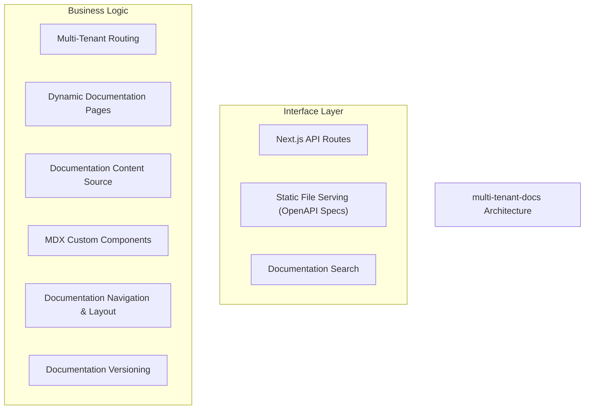
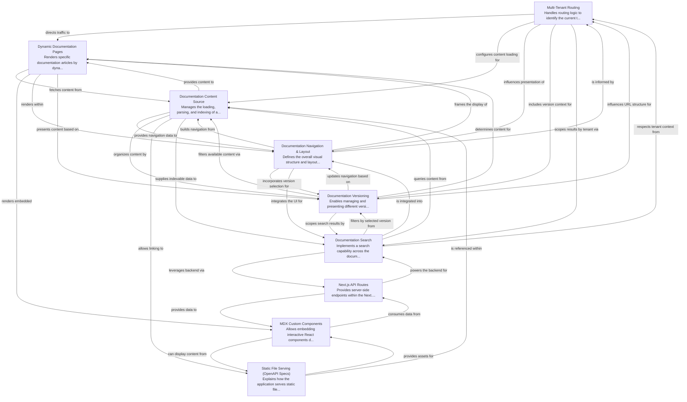

# multi-tenant-docs Tutorial

Welcome to the comprehensive tutorial for multi-tenant-docs. This tutorial is automatically generated from the codebase to help you understand the core concepts and implementation patterns.

## Project Overview

The 'multi-tenant-docs' project is a Next.js application designed to serve dynamic, versioned documentation tailored for multiple tenants. It achieves this by using a multi-tenant router to identify the current tenant and version, dynamically rendering MDX content fetched from a centralized content source. This content can include interactive React components, and is presented within a flexible layout featuring dynamic navigation and a robust search capability.

## System Architecture

## Component Relationships

## Table of Contents

1. [The Documentation Content Source](chapter_01.md) - This abstraction serves as the central repository and manager for all documentation content within our system.
2. [Dynamic Documentation Pages: Building Flexible Content](chapter_02.md) - The 'Dynamic Documentation Pages' abstraction is a powerful mechanism for building highly scalable and easily maintainable documentation websites.
3. [Chapter 3: Documentation Navigation & Layout - Structuring Your Content](chapter_03.md) - The 'Documentation Navigation & Layout' abstraction is fundamental to how users interact with and understand your documentation.
4. [Multi-Tenant Routing: Directing Traffic to the Right Tenant](chapter_04.md) - Multi-Tenant Routing is a fundamental abstraction in a multi-tenant architecture, serving as the intelligent gateway that interprets incoming requests and identifies which specific customer, or 'tenant', the request belongs to.
5. [Documentation Versioning: Managing Evolving Content for Each Tenant](chapter_05.md) - Documentation Versioning is a critical abstraction that empowers systems to manage and present multiple iterations of documentation content, specifically tailored for individual tenants.
6. [Embedding Interactivity: MDX Custom Components](chapter_06.md) - MDX Custom Components represent a powerful abstraction that bridges the gap between static documentation and dynamic, interactive experiences.
7. [Next.js API Routes: Building Backend Endpoints within Your Frontend Project](chapter_07.md) - Next.
8. [Documentation Search: Finding Relevant Information](chapter_08.md) - The Documentation Search abstraction provides a vital capability for any system that hosts a significant amount of informational content.
9. [Serving Static OpenAPI Specifications](chapter_09.md) - This chapter explains the fundamental concept of serving static files within a web application, specifically focusing on how it applies to OpenAPI (formerly Swagger) specifications.

## How to Use This Tutorial

1. Start with Chapter 1 to understand the foundational concepts
2. Each chapter builds upon previous concepts
3. Code examples are provided throughout to illustrate key points
4. Refer to the architecture diagrams for visual understanding
5. Each chapter includes relevant architectural diagrams showing how the component fits into the overall system

## Contributing

This tutorial is auto-generated. To improve it, please update the source code documentation and regenerate.
