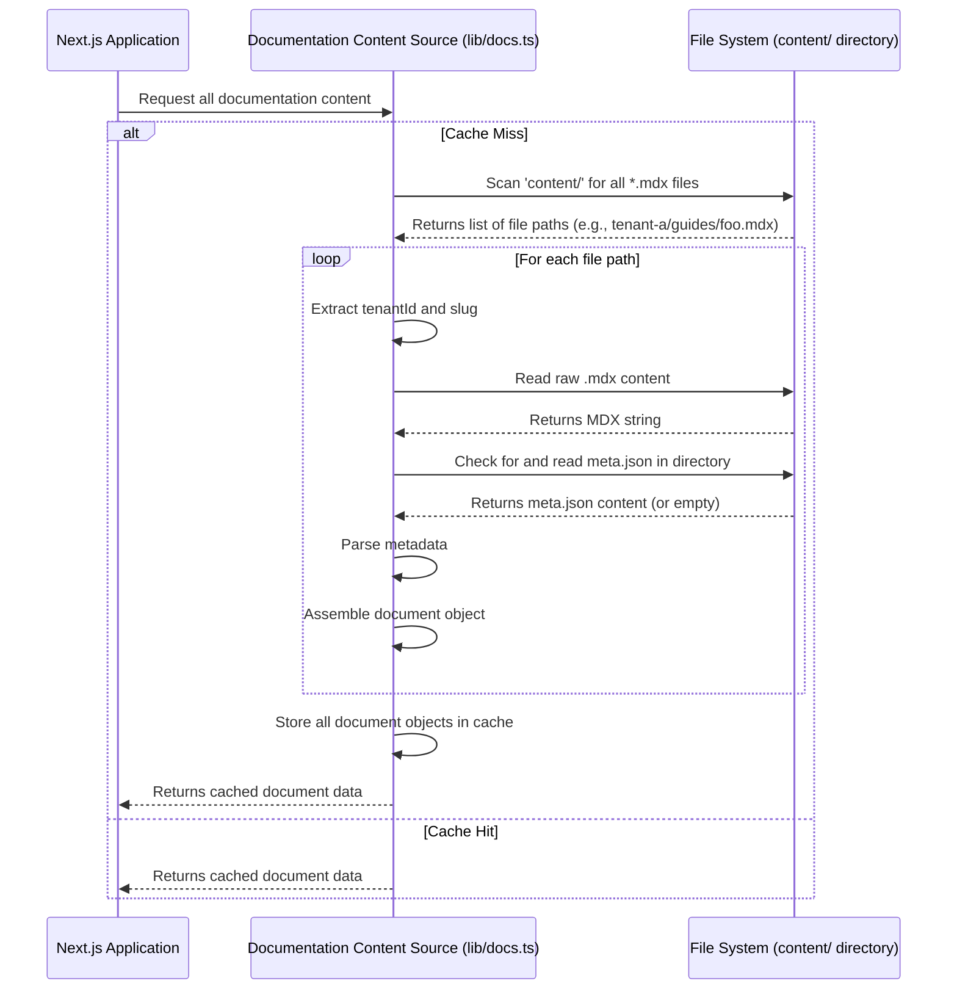
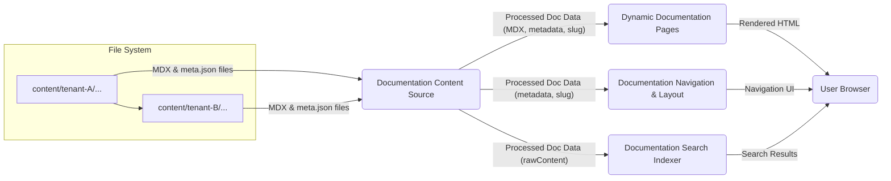

# Chapter 1: Documentation Content Source

This marks the beginning of our journey into building a multi-tenant documentation platform. As the foundational chapter, we'll establish how our system identifies, loads, and processes the raw materials for all documentation: the content itself.

---

### Problem & Motivation

Imagine a sprawling documentation platform hosting separate guides for a dozen different products or customer segments. Each "tenant" needs its own set of articles, tutorials, and API references, completely distinct from the others. The core problem is: **how does our application reliably find, read, and organize all this diverse documentation content so it can be displayed to the right user at the right time?**

Without a robust *Documentation Content Source*, our platform would be a blank canvas. This abstraction is critical because it acts as the primary data pipeline, feeding all subsequent parts of our system—like dynamic page generation, navigation menus, and search indexing—with the necessary information.

Consider a user navigating to `/tenant-a/guides/getting-started`. For this page to render, our application needs to:
1.  Identify that "tenant-a" is the current tenant.
2.  Locate the `getting-started.mdx` file specific to "tenant-a".
3.  Read its content and any associated metadata.
4.  Make this information available to the page component.

The Documentation Content Source is the engine that performs these crucial steps, ensuring our platform is always ready to serve the correct and up-to-date documentation.

---

### Core Concept Explanation

The **Documentation Content Source** is the module responsible for discovering, reading, and preparing all documentation content within our multi-tenant system. It acts as the bridge between our file system, where documentation files reside, and the application layer that needs to render them.

At its heart, this concept revolves around two primary content types:
1.  **MDX Files**: These are Markdown files enhanced with JSX, allowing us to embed interactive React components directly within our documentation. For example, a `button` or a `code editor` component can be seamlessly integrated into an article.
2.  **`meta.json` Files**: These small JSON files live alongside our MDX files and provide crucial metadata for entire documentation sections. This metadata includes information like the display order of pages, their titles, and whether they are hidden from navigation.

The content source module systematically scans a predefined directory (e.g., `content/`) to locate all MDX files and their accompanying `meta.json` files. It then processes these files, extracting their raw content and metadata. This processed information is then stored in an easily accessible format, typically an array of document objects, each containing details like the file path, slug (a URL-friendly identifier), raw MDX content, and any custom metadata. This structured data is then ready to be consumed by other parts of the application for rendering, navigation, and search.

---

### Practical Usage Examples

Let's illustrate how we structure our documentation content and what the processed data looks like.

**1. Content File Structure:**

Our documentation for a specific tenant, say `tenant-a`, would be organized within its own directory, for example, `content/tenant-a/`.

```
content/
├── tenant-a/
│   ├── guides/
│   │   ├── getting-started.mdx
│   │   ├── advanced-topics.mdx
│   │   └── meta.json
│   └── reference/
│       ├── api-overview.mdx
│       └── meta.json
└── tenant-b/
    ├── ...
```
In this structure, `getting-started.mdx` is a documentation page. `meta.json` files, like `content/tenant-a/guides/meta.json`, define metadata for the `guides` section.

**2. Example MDX Content (`getting-started.mdx`):**

```mdx
# Getting Started with Tenant A

Welcome to the documentation for Tenant A!

This guide will help you set up your first project.

<CustomButton text="Start Tutorial" />

For more details, see our [Advanced Topics](/tenant-a/guides/advanced-topics).
```
This is a simple MDX file. Notice the `# Getting Started` heading and the `<CustomButton />` which is a React component that will be explained in a later chapter. The plain text content and Markdown links are standard.

**3. Example Metadata (`content/tenant-a/guides/meta.json`):**

```json
{
  "getting-started": {
    "title": "Getting Started",
    "order": 1
  },
  "advanced-topics": {
    "title": "Advanced Topics",
    "order": 2
  }
}
```
This `meta.json` file dictates that "Getting Started" should appear before "Advanced Topics" in any navigation menu for the `guides` section. The keys (`getting-started`, `advanced-topics`) typically match the filenames (without `.mdx`).

**4. Conceptual Processed Data Output:**

When our Content Source processes these files, it would generate a structured object for each document. A simplified representation for `getting-started.mdx` would look like this:

```js
// Simplified representation of a single document object
{
  tenant: 'tenant-a',
  slug: 'guides/getting-started',
  filePath: 'content/tenant-a/guides/getting-started.mdx',
  rawContent: '# Getting Started with Tenant A...', // The full MDX string
  metadata: {
    title: 'Getting Started',
    order: 1
  }
}
```
This structured data, containing the tenant ID, a unique slug, file path, raw MDX content, and any extracted metadata, is what other parts of the application will use. The `slug` is particularly important as it directly maps to the URL path for the documentation page.

---

### Internal Implementation Walkthrough

The "Documentation Content Source" internally performs a series of steps to achieve its goal. Let's walk through the conceptual process:

#### **Step 1: Discovering Files**

The first step is to locate all relevant documentation files. This typically involves using Node.js file system (`fs`) modules or a library like `glob` to recursively scan a base directory, such as `content/`.

```typescript
// Conceptual: lib/docs.ts
import { glob } from 'glob';
import path from 'path';

async function getAllDocFilePaths(basePath: string): Promise<string[]> {
  // Finds all .mdx files within the base directory.
  const files = await glob('**/*.mdx', { cwd: basePath });
  return files.map(file => path.join(basePath, file));
}
```
This function would return an array of absolute file paths like `['/project/content/tenant-a/guides/getting-started.mdx', ...]`.

#### **Step 2: Extracting Tenant and Slug**

From each file path, we need to determine which tenant it belongs to and its unique slug (the part of the URL path that identifies the page).

```typescript
// Conceptual: lib/docs.ts (continued)
function parseFilePath(filePath: string, basePath: string) {
  const relativePath = path.relative(basePath, filePath);
  // Example: 'tenant-a/guides/getting-started.mdx'
  const [tenantId, ...restPath] = relativePath.split(path.sep);
  const slug = restPath.join(path.sep).replace(/\.mdx$/, '');
  return { tenantId, slug };
}
```
For `content/tenant-a/guides/getting-started.mdx`, this would yield `tenantId: 'tenant-a'` and `slug: 'guides/getting-started'`.

#### **Step 3: Reading File Contents and Metadata**

For each identified `.mdx` file, we read its raw content. Concurrently, we look for an accompanying `meta.json` file in the same directory to gather page-specific metadata.

```typescript
// Conceptual: lib/docs.ts (continued)
import fs from 'fs';

interface DocMetadata {
  title?: string;
  order?: number;
  // ... any other custom metadata
}

async function getDocumentData(filePath: string, tenantId: string, slug: string): Promise<any> {
  const rawContent = fs.readFileSync(filePath, 'utf-8');
  const dir = path.dirname(filePath);
  const metaFilePath = path.join(dir, 'meta.json');
  let metadata: DocMetadata = {};

  if (fs.existsSync(metaFilePath)) {
    const metaContent = fs.readFileSync(metaFilePath, 'utf-8');
    const pageFileName = path.basename(filePath, '.mdx');
    const sectionMeta = JSON.parse(metaContent);
    metadata = sectionMeta[pageFileName] || {};
  }

  return {
    tenant: tenantId,
    slug: slug,
    filePath: filePath,
    rawContent: rawContent,
    metadata: metadata
  };
}
```
This function reads the MDX, checks for `meta.json`, parses it, and then retrieves the metadata relevant to the specific MDX file.

#### **Step 4: Indexing and Caching (Optional but Recommended)**

For large documentation sets, scanning the file system on every request is inefficient. A common practice is to perform this content loading once at build time or on server startup and then cache the results.

```typescript
// Conceptual: lib/docs.ts (final step)
let allDocsCache: any[] | null = null;

export async function getCachedAllDocs(): Promise<any[]> {
  if (allDocsCache) {
    return allDocsCache;
  }

  const basePath = path.join(process.cwd(), 'content'); // Assuming 'content' is root
  const filePaths = await getAllDocFilePaths(basePath);
  const docs = await Promise.all(filePaths.map(async (filePath) => {
    const { tenantId, slug } = parseFilePath(filePath, basePath);
    return getDocumentData(filePath, tenantId, slug);
  }));

  allDocsCache = docs; // Cache the results
  return docs;
}
```
This `getCachedAllDocs` function ensures that the intensive file system operations are only performed once, making subsequent access to documentation content very fast.

#### **Sequence Diagram: Content Loading Process**



---

### System Integration

The "Documentation Content Source" serves as the **backbone** for nearly every other user-facing feature in our multi-tenant documentation platform. Its primary output—the structured array of document objects—is consumed by several key modules:

*   **[Dynamic Documentation Pages](chapter_02.md)**: This is the most direct integration. The data provided by the content source (specifically `rawContent`, `tenant`, and `slug`) is used to dynamically generate the actual web pages for each documentation article. When a user requests `/tenant-a/guides/getting-started`, the "Dynamic Documentation Pages" module queries the content source for the document corresponding to `tenant-a` and `guides/getting-started`, then renders it.

*   **[Documentation Navigation & Layout](chapter_03.md)**: The `metadata` (especially `title` and `order`) and `slug` from the content source are crucial for building hierarchical navigation menus. The navigation system uses this information to display a structured sidebar or table of contents, allowing users to browse through the documentation effectively. It needs to know which pages belong to which sections and their display order.

*   **[Documentation Search](chapter_09.md)**: To provide a useful search experience, the raw `rawContent` (MDX string) from all documents is fed into a search indexing service. This service processes the text, creates an index, and allows users to quickly find relevant documentation pages.

*   **[Multi-Tenant Routing](chapter_07.md)**: While the content source identifies the tenant from the file path, the multi-tenant routing system relies on this content structure to understand which tenants exist and to validate tenant-specific routes.

**Data Flow Overview:**



This diagram illustrates how the raw content from the file system is transformed by the "Documentation Content Source" into structured data, which then powers the core functionalities of the platform.

---

### Best Practices & Tips

*   **Consistent Naming Conventions**: Use lowercase, hyphen-separated names for directories and filenames. This makes paths cleaner and slugs more predictable. For example, `getting-started.mdx` is better than `GettingStarted.mdx`.
*   **Logical Directory Structure**: Organize your documentation logically by tenant, then by major section (e.g., `guides`, `reference`), and then by individual page. This makes content easier to manage and understand.
*   **Keep `meta.json` Simple**: Only include essential metadata in your `meta.json` files (e.g., `title`, `order`). Avoid adding verbose content that should reside within the MDX file itself.
*   **Centralize Content Logic**: Encapsulate all file system reading and parsing logic within a single module (e.g., `lib/docs.ts`). This makes the system easier to maintain, test, and understand.
*   **Leverage Caching**: For any non-trivial number of documentation files, implement caching for the processed content (as shown in `getCachedAllDocs`). This significantly improves performance, especially in serverless or frequently deployed environments, as the file system scan only happens once.
*   **Error Handling**: Implement robust error handling for file system operations (e.g., what if a `meta.json` is malformed, or an MDX file is unreadable?). While not shown in simplified examples, it's crucial for production systems.
*   **Automated Content Checks**: Consider adding build-time checks or linters to ensure `meta.json` files are valid JSON and that all linked MDX files actually exist.

---

### Chapter Conclusion

In this chapter, we've laid the groundwork for our multi-tenant documentation platform by understanding the fundamental role of the **Documentation Content Source**. We learned how it addresses the critical problem of finding, parsing, and making documentation content available. We explored the structure of MDX files and `meta.json` files, walked through the internal process of content discovery and data extraction, and saw how this foundational module integrates with other key parts of our system.

With our content now properly loaded and structured, the next logical step is to display it. In the upcoming chapter, we will delve into **[Dynamic Documentation Pages](chapter_02.md)**, where we'll learn how to take this processed content and render it into interactive web pages using Next.js.