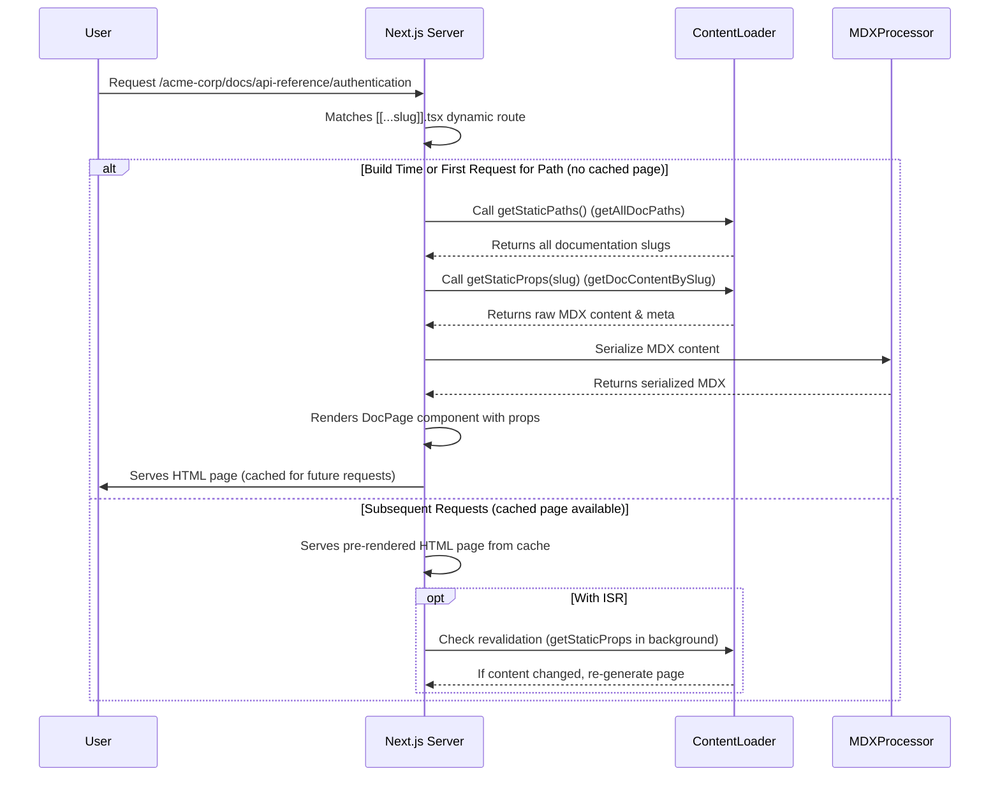

# Chapter 2: Dynamic Documentation Pages

---

Building on the foundation laid in [Chapter 1: Documentation Content Source](chapter_01.md), where we established how our documentation content is loaded, parsed, and indexed, this chapter shifts our focus to *how* that content is presented to the user. We've gathered all the pieces; now it's time to assemble them into viewable documentation pages.

---

### Problem & Motivation

Imagine a user wanting to read the "Getting Started" guide for a specific tenant, perhaps by navigating to a URL like `/my-tenant/guides/getting-started`. The core challenge here is to dynamically serve the correct documentation article based on the URL path. Without a system for dynamic page rendering, we would be forced to manually create a separate page component for every single documentation file, which is clearly unscalable and unmanageable for a platform designed to host numerous tenants with extensive documentation.

This problem highlights the need for a flexible mechanism to interpret URL requests and map them to their corresponding content. In our `multi-tenant-docs` project, it's crucial for efficiently delivering tenant-specific documentation. It allows us to maintain a single, powerful rendering engine that can intelligently display any documentation page, regardless of the tenant or the specific article requested.

**Motivating Use Case:** A user visits `/acme-corp/docs/api-reference/authentication`. Our system needs to intercept this request, identify "acme-corp" as the tenant and "api-reference/authentication" as the desired document slug, fetch the associated MDX content, and render it as a complete web page.

### Core Concept Explanation

At the heart of dynamic documentation pages in Next.js lies the concept of **Dynamic Routes**. Next.js allows you to define routes that can catch an infinite number of paths, making them perfect for content-driven applications like ours. Instead of fixed paths, we use bracket syntax (`[slug]`) or spread syntax (`[...slug]`) in file names within the `pages` directory.

For our multi-tenant documentation, we utilize a "catch-all" dynamic route (`[...slug].tsx`) which can match any path segment after the base URL. This `slug` parameter then becomes the key to fetching the correct MDX content from our pre-indexed source. Alongside dynamic routes, Next.js provides powerful data fetching functions: `getStaticPaths` and `getStaticProps`. `getStaticPaths` tells Next.js *which* paths (slugs) should be pre-rendered at build time, ensuring optimal performance. `getStaticProps`, on the other hand, fetches the actual content for a given path, making it available as props to our React component for rendering. Together, these mechanisms enable us to dynamically create and serve pages for all our documentation articles efficiently.

---

### Practical Usage Examples

Let's illustrate how we set up a dynamic route to serve our documentation pages using Next.js. We'll focus on the `pages/[[...slug]].tsx` file, which is a common pattern for handling catch-all routes at the root, potentially alongside an index page. For a multi-tenant setup, this file might live under `pages/[tenantId]/[[...slug]].tsx` but for now, we'll simplify and show the core dynamic page concept.

#### 1. Defining the Dynamic Route Page Component

First, let's create our dynamic page component. This file, typically named `[[...slug]].tsx` inside a `pages` directory (e.g., `pages/docs/[[...slug]].tsx` or even `pages/[[...slug]].tsx` if it's the main content route), will catch all paths.

```tsx
// pages/[[...slug]].tsx
import { GetStaticProps, GetStaticPaths } from 'next';
import { MDXRemoteSerializeResult } from 'next-mdx-remote';
import { serialize } from 'next-mdx-remote/serialize';
import { MDXRemote } from 'next-mdx-remote';
import path from 'path'; // Assume path utility is needed for content lookup

interface DocPageProps {
  source: MDXRemoteSerializeResult;
  // Other metadata like title, description, etc.
}

export default function DocPage({ source }: DocPageProps) {
  return (
    <article>
      {/* Dynamic content title would go here, fetched from metadata */}
      <MDXRemote {...source} />
    </article>
  );
}
// ... getStaticPaths and getStaticProps will follow
```
This is the basic React component that will render our MDX content. It expects `source` props, which will be the serialized MDX.

#### 2. Generating All Possible Paths with `getStaticPaths`

Next, we need to tell Next.js which paths (`slug` values) this page component should handle. `getStaticPaths` runs at build time and returns an array of possible `params`.

```tsx
// pages/[[...slug]].tsx (continued)
// Assume we have a utility to get all content paths
import { getAllDocPaths } from '../lib/content-loader'; // From Chapter 1 logic

export const getStaticPaths: GetStaticPaths = async () => {
  // `getAllDocPaths` would return something like:
  // [{ params: { slug: ['tenant-a', 'introduction'] } },
  //  { params: { slug: ['tenant-a', 'api', 'auth'] } }, ...]
  const paths = getAllDocPaths().map((p) => ({
    params: { slug: p.split(path.sep) }, // Split path string into array for [...slug]
  }));

  return {
    paths,
    fallback: false, // Set to 'blocking' or true for dynamic paths at runtime
  };
};
```
The `getAllDocPaths()` function (conceptually coming from our Chapter 1 content indexing) provides a list of all available documentation paths. We transform these into the `params` structure expected by Next.js's dynamic routes. `fallback: false` means that any path not returned by `getStaticPaths` will result in a 404 page.

#### 3. Fetching Content for a Specific Path with `getStaticProps`

Finally, for each path generated by `getStaticPaths`, or for a path requested at runtime with `fallback: 'blocking'`, `getStaticProps` fetches the actual MDX content and any associated metadata.

```tsx
// pages/[[...slug]].tsx (continued)
import { getDocContentBySlug } from '../lib/content-loader'; // From Chapter 1 logic

export const getStaticProps: GetStaticProps = async ({ params }) => {
  const slug = params?.slug as string[]; // Get the slug array from the URL

  // Join the slug parts back to a string for content lookup
  const docPath = slug.join(path.sep);

  // `getDocContentBySlug` would fetch the MDX string and metadata
  const { content, meta } = await getDocContentBySlug(docPath);

  if (!content) {
    return {
      notFound: true, // If content not found, return 404
    };
  }

  // Serialize the MDX content for rendering
  const mdxSource = await serialize(content, {
    scope: meta, // Pass metadata as scope for MDX components
    // Other MDX options like plugins can go here
  });

  return {
    props: {
      source: mdxSource,
      meta, // Pass meta data as props
    },
    revalidate: 60, // Revalidate page every 60 seconds (ISR)
  };
};
```
Here, `getDocContentBySlug` (another conceptual utility from Chapter 1) retrieves the raw MDX string and its metadata for the specific `slug`. We then use `next-mdx-remote`'s `serialize` function to transform the MDX string into a renderable format that can be passed to the `MDXRemote` component. `revalidate: 60` enables Incremental Static Regeneration (ISR), allowing pages to be updated after deployment without a full rebuild.

---

### Internal Implementation Walkthrough

Let's trace the journey of a user request for `/acme-corp/docs/api-reference/authentication` and understand how our dynamic page rendering system works internally.

1.  **Request Interception**: The user's browser sends a request to `/acme-corp/docs/api-reference/authentication`. Next.js, upon receiving this request, checks its routing configuration. It identifies that this URL pattern matches our `pages/[[...slug]].tsx` file (or `pages/[tenantId]/[[...slug]].tsx` in a more explicit multi-tenant setup, which we'll cover later). The `slug` parameter will be `['acme-corp', 'docs', 'api-reference', 'authentication']`.

2.  **`getStaticPaths` (Build-Time)**: If the page hasn't been built yet (first build, or a new path requested with `fallback`), Next.js consults `getStaticPaths`. This function, executed *only at build time*, calls `getAllDocPaths()` (from `lib/content-loader` in Chapter 1). This function iterates through our content directory, finds all `.mdx` files, extracts their full paths (e.g., `content/acme-corp/docs/api-reference/authentication.mdx`), and transforms them into an array of `params` objects. For our example, `params: { slug: ['acme-corp', 'docs', 'api-reference', 'authentication'] }` would be one such entry. This pre-renders these pages and optimizes future requests.

3.  **`getStaticProps` (Build-Time or ISR)**: Once `getStaticPaths` has identified the path, or if a previously built page is requested, Next.js executes `getStaticProps` for that specific `slug`.
    *   It receives `params.slug` as `['acme-corp', 'docs', 'api-reference', 'authentication']`.
    *   It constructs the file path (e.g., `acme-corp/docs/api-reference/authentication`) to query the content source.
    *   It calls `getDocContentBySlug(docPath)` (from `lib/content-loader`), which looks up the corresponding `.mdx` file content and its `meta.json` data.
    *   The raw MDX string is then passed to `next-mdx-remote`'s `serialize` function. This step converts the MDX string into a format that the `MDXRemote` component can understand, resolving imports, processing Markdown, and preparing it for rendering.
    *   The `serializedSource` and any extracted `meta`data are returned as `props` to the `DocPage` component.

4.  **Component Rendering**: The `DocPage` React component receives the `source` (serialized MDX) and `meta` as props. It uses the `MDXRemote` component to render the MDX content. Any custom React components defined for MDX (covered in [Chapter 4: MDX Custom Components](chapter_04.md)) are resolved and rendered within this step.

5.  **Browser Display**: The fully rendered HTML page, complete with dynamic content and potentially interactive React components, is then sent to the user's browser.

Here's a simplified sequence diagram to visualize this flow:



### System Integration

The `Dynamic Documentation Pages` abstraction acts as the crucial bridge between our raw content and the user interface.

*   **[Documentation Content Source](chapter_01.md)**: This chapter is entirely dependent on Chapter 1. The `getAllDocPaths` and `getDocContentBySlug` functions are direct interfaces to the content management system we built in the previous chapter. The dynamic pages consume the indexed MDX content and metadata provided by `Documentation Content Source`.

*   **[Documentation Navigation & Layout](chapter_03.md)**: While this chapter focuses on rendering the *content* of a single page, Chapter 3 will focus on wrapping that content within a consistent layout, including headers, footers, and sidebar navigation. The dynamic page component will be nested within this larger layout structure.

*   **[MDX Custom Components](chapter_04.md)**: The `MDXRemote` component used in our `DocPage` is capable of rendering not just standard Markdown, but also custom React components directly embedded within MDX files. This functionality will be fully enabled and explored in Chapter 4, allowing authors to create rich, interactive documentation.

*   **Data Flow**: The flow is unidirectional: `Documentation Content Source` -> `Dynamic Documentation Pages` -> `Documentation Navigation & Layout`. This ensures a clear separation of concerns, with content sourcing isolated from content rendering and presentation.

---

### Best Practices & Tips

*   **Leverage ISR (Incremental Static Regeneration)**: Using `revalidate` in `getStaticProps` is a powerful way to keep your documentation fresh without requiring a full redeploy for every content change. Set `revalidate` to an appropriate interval based on how frequently your documentation updates.
*   **Handle 404s Gracefully**: Always include `notFound: true` in `getStaticProps` when content for a requested slug is not found. This ensures that users land on a proper 404 page instead of a broken page.
*   **Error Boundaries**: Wrap your `MDXRemote` component (or the entire content display area) in React Error Boundaries to gracefully handle potential rendering errors within MDX or custom components.
*   **Performance Considerations**:
    *   Minimize work in `getStaticProps`: Only fetch and process the data absolutely necessary for the current page.
    *   Consider `fallback: 'blocking'` for very large documentation sites where `getStaticPaths` might be too slow to enumerate *all* paths at build time. This allows Next.js to generate pages on demand for paths not pre-rendered.
*   **Clear Content Structure**: Maintain a consistent content directory structure. This makes it easier for `getAllDocPaths` and `getDocContentBySlug` to reliably find and process your MDX files.

---

### Chapter Conclusion

This chapter has demystified the process of transforming static MDX content into dynamic, interactive documentation pages using Next.js. By understanding `getStaticPaths`, `getStaticProps`, and the power of dynamic routes, we've built the core engine that fetches and displays content relevant to any given URL. This capability is fundamental to our multi-tenant platform, allowing us to serve diverse documentation sets from a single codebase.

As we move forward, the content rendered by these dynamic pages will need a user-friendly interface. In the next chapter, we will integrate these pages into a cohesive user experience by designing the **[Documentation Navigation & Layout](chapter_03.md)**, adding global headers, footers, and a functional sidebar navigation system.