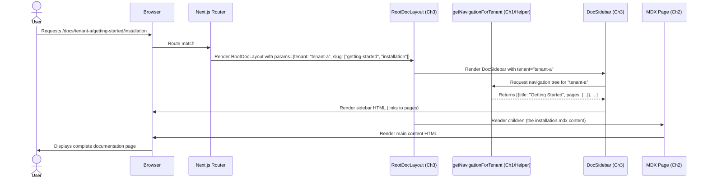

# Chapter 3: Documentation Navigation & Layout

Having successfully learned how to dynamically render individual documentation pages in the previous chapter, [Dynamic Documentation Pages](chapter_02.md), we now face a crucial question: How do users find these pages? A beautifully rendered article is only useful if it can be easily discovered. This chapter addresses that challenge by introducing the core concepts behind documentation navigation and the overall layout structure.

---

## Problem & Motivation

Imagine a vast library without a catalog or shelf labels. That's precisely the problem we solve with documentation navigation and layout. Without a clear structure, users of our multi-tenant documentation platform would be lost, unable to find the specific guides, API references, or tutorials they need. Each tenant's documentation could contain dozens, even hundreds, of pages, making a flat list unmanageable and incredibly frustrating for anyone trying to extract information.

This issue is amplified in a multi-tenant environment. Not only do we need navigation for *one* tenant, but each tenant requires its *own* distinct and customizable navigation structure. A generic, static sidebar simply won't suffice; it needs to dynamically adapt to the active tenant and its specific content hierarchy. The importance of this lies in user experience: a well-structured, intuitive navigation system directly impacts how quickly and efficiently users can find answers, ultimately determining the platform's utility and adoption.

Consider a user accessing "Tenant A's" documentation looking for "Installation Guide" and "API Reference for v2.0". Without a clear sidebar showing these categories and their sub-pages, they'd have to guess URLs or rely solely on search, which isn't always efficient for discovery. Our goal is to provide a comprehensive, easy-to-use navigation system that guides them seamlessly through the content, enhancing their productivity and satisfaction.

---

## Core Concept Explanation

The "Documentation Navigation & Layout" abstraction defines the entire visual and structural framework for our documentation. At its heart, it's about two main things: presenting content within a coherent visual design and enabling users to traverse that content effortlessly. This involves wrapping our dynamically rendered MDX pages with a consistent UI, including elements like a header, sidebar, and footer.

The cornerstone of our dynamic navigation is the `meta.json` files. These small JSON files, located within our documentation directories, dictate the structure, order, and titles of documentation pages and sections. Rather than hardcoding navigation, we build it dynamically by reading and interpreting these metadata files. This allows each tenant to define its unique content hierarchy without requiring any code changes.

The overall layout typically follows a standard web application pattern: a persistent **Header** for branding and global actions (like tenant switching or version selection), a dynamic **Sidebar** containing the hierarchical navigation links, a central **Main Content Area** where the MDX article for the current page is displayed, and often a **Footer** for boilerplate information. By centralizing these layout components, we ensure a consistent look and feel across all documentation pages and tenants, providing a familiar and predictable user experience.

This dynamic approach ensures that as content evolves—new sections are added, pages are reordered, or even entire tenants are introduced—the navigation automatically updates without manual intervention, powered by the structure defined in the `meta.json` files and the components designed to interpret them.

---

## Practical Usage Examples

Let's see how we use `meta.json` to define navigation and how a basic layout component ties it all together.

### Defining Navigation with `meta.json`

The `meta.json` files are incredibly powerful for structuring our documentation. Here's an example of how a `meta.json` might look for a "Getting Started" section within a tenant's docs:

```json
// docs/tenant-a/getting-started/meta.json
{
  "title": "Getting Started",
  "pages": [
    "introduction",
    "installation",
    "first-app",
    "configuration"
  ]
}
```
*Explanation:* This `meta.json` file, placed in the `getting-started` directory, declares that this section should be titled "Getting Started" in the navigation. The `pages` array lists the slugs (filenames without `.mdx` extension) of the documentation pages that belong to this section, and defines their display order.

You can also nest `meta.json` files to create sub-sections:

```json
// docs/tenant-a/api-reference/v1/meta.json
{
  "title": "API v1",
  "pages": [
    "authentication",
    "users",
    "products"
  ]
}
```
*Explanation:* This `meta.json` defines a nested navigation group for "API v1". Pages like `authentication.mdx`, `users.mdx`, and `products.mdx` would appear under this sub-section in the sidebar.

### Implementing the Documentation Layout

The layout component wraps our dynamic content with the necessary navigation and structural elements.

```jsx
// app/docs/[tenant]/[...slug]/layout.tsx
import React from 'react';
import DocHeader from '@/components/DocHeader';
import DocSidebar from '@/components/DocSidebar';
import DocFooter from '@/components/DocFooter';

export default function RootDocLayout({ children, params }) {
  const { tenant } = params; // Get current tenant from URL

  return (
    <div className="flex flex-col min-h-screen">
      <DocHeader tenant={tenant} />
      <div className="flex flex-1">
        <DocSidebar tenant={tenant} />
        <main className="flex-1 p-8 overflow-y-auto">
          {children} {/* This is where our MDX content renders */}
        </main>
      </div>
      <DocFooter />
    </div>
  );
}
```
*Explanation:* This `RootDocLayout` component, using Next.js App Router conventions, provides the overarching structure. It imports `DocHeader`, `DocSidebar`, and `DocFooter` components. The `children` prop is crucial as it represents the actual MDX content for the current page, which is rendered within the `<main>` tag. The `tenant` parameter is passed down to components like `DocHeader` and `DocSidebar` so they can render tenant-specific UI.

### Simplified Sidebar Component Logic

The `DocSidebar` component dynamically generates the navigation links by processing the navigation data derived from the `meta.json` files.

```jsx
// components/DocSidebar.tsx (simplified conceptual view)
import Link from 'next/link';
import { getNavigationForTenant } from '@/lib/navigation'; // Fetches compiled nav data

export default async function DocSidebar({ tenant }) {
  const navigation = await getNavigationForTenant(tenant); // In a real app, this might be fetched or passed down

  if (!navigation) return null;

  return (
    <aside className="w-64 p-4 border-r">
      <nav>
        {navigation.map(section => (
          <div key={section.slug} className="mb-4">
            <h3 className="font-bold text-lg mb-2">{section.title}</h3>
            <ul>
              {section.pages.map(page => (
                <li key={page.slug} className="mb-1">
                  <Link href={`/docs/${tenant}/${page.slug}`} className="hover:underline">
                    {page.title}
                  </Link>
                </li>
              ))}
            </ul>
          </div>
        ))}
      </nav>
    </aside>
  );
}
```
*Explanation:* The `DocSidebar` component asynchronously fetches the `navigation` data relevant to the current `tenant`. This `navigation` object is a structured array derived from all `meta.json` files, representing the hierarchical menu. It then iterates through sections and their pages, using Next.js's `Link` component to create the actual navigation links, dynamically building the sidebar as seen by the user.

---

## Internal Implementation Walkthrough

The journey from a user requesting a page to seeing a fully laid out document with a functional sidebar involves several coordinated steps:

### 1. Data Aggregation and Navigation Tree Construction

As hinted in [Documentation Content Source](chapter_01.md), all `meta.json` files are parsed and indexed during application build or on demand. For navigation, these files are processed to build a comprehensive, hierarchical "navigation tree" for each tenant. This involves:
*   Scanning the `docs/[tenant]` directory.
*   Identifying all `meta.json` files and their parent directories.
*   Reading each `meta.json` to get `title` and `pages` arrays.
*   Recursively building a tree structure that maps directory paths to navigation sections and individual pages. The order of `pages` in `meta.json` determines the order in the sidebar. This resulting data structure is then cached or made available for rendering.

### 2. Layout Component Rendering

When a user requests a documentation page (e.g., `/docs/tenant-a/getting-started/installation`), the Next.js router identifies the `layout.tsx` file in `app/docs/[tenant]/[...slug]/` as the component responsible for wrapping the content. This `layout.tsx` component is then rendered.

### 3. Sidebar Component Logic

Inside the `layout.tsx`, the `DocSidebar` component is rendered. It receives the `tenant` parameter from the URL.
*   The `DocSidebar` component (or a data fetching utility it calls) retrieves the pre-built navigation tree specifically for the identified `tenant`. This tree contains the titles and paths for all relevant documentation pages and sections.
*   It then iterates through this navigation tree, rendering `Link` components for each page and appropriate headings for each section. This results in the dynamic sidebar visible to the user.

### 4. Main Content Area Rendering

Concurrently, the `children` prop passed to the `layout.tsx` component is rendered within the `<main>` section. This `children` prop represents the actual MDX content for the requested page (e.g., `installation.mdx`), processed by the logic discussed in [Dynamic Documentation Pages](chapter_02.md).

Here's a sequence diagram illustrating this flow:



---

## System Integration

The Documentation Navigation & Layout is a central piece that weaves together multiple other abstractions within the `multi-tenant-docs` project:

*   **[Documentation Content Source](chapter_01.md):** This chapter relies heavily on Chapter 1 to provide the raw `meta.json` files and the processed navigation data derived from them. Without this foundational content, the sidebar wouldn't know what to display.
*   **[Dynamic Documentation Pages](chapter_02.md):** The layout component wraps the dynamically rendered MDX content from Chapter 2. It provides the visual context and surrounding UI for the core documentation articles.
*   **[Multi-Tenant Routing](chapter_07.md):** The routing system is fundamental, as it determines which `tenant`'s documentation is being requested. The layout and navigation components then use this tenant identifier to fetch and display the correct tenant-specific content and navigation tree.
*   **[Documentation Versioning](chapter_08.md):** When versioning is introduced, the navigation needs to adapt. The `meta.json` files might exist within version-specific directories (e.g., `docs/tenant-a/v1/meta.json`, `docs/tenant-a/v2/meta.json`), allowing the navigation tree construction to dynamically build a different sidebar based on the selected documentation version.

---

## Best Practices & Tips

*   **Consistent `meta.json` Usage:** Maintain a consistent structure and naming convention for your `meta.json` files. This predictability makes content management easier and the navigation generation more robust.
*   **Performance Optimization:** For very large documentation sets, optimizing how the navigation tree is generated and cached is crucial. Consider static generation (SSG) for navigation data where possible, or efficient memoization for client-side rendering.
*   **Accessibility (A11y):** Ensure your navigation is accessible. Use semantic HTML (`<nav>`, `<ul>`, `<li>`), provide keyboard navigation support, and use ARIA attributes where appropriate to guide users with screen readers.
*   **Responsive Design:** Design your layout components, especially the sidebar, to be responsive. It should gracefully adapt to different screen sizes, perhaps collapsing into a hamburger menu on smaller devices.
*   **Active Link Highlighting:** Implement logic to highlight the currently active page in the sidebar. This provides clear visual feedback to the user about their location within the documentation.
*   **Error Handling:** Implement robust error handling for `meta.json` parsing. If a `meta.json` is malformed, the navigation generation should ideally log an error but still attempt to build a partial navigation, rather than crashing the entire documentation site.

---

## Chapter Conclusion

In this chapter, we've explored the critical role of Documentation Navigation & Layout in making our multi-tenant documentation platform usable and intuitive. We learned how `meta.json` files serve as the blueprint for dynamic sidebars and how a root layout component elegantly wraps our content with consistent UI elements. This abstraction is vital for transforming a collection of individual pages into a navigable, user-friendly documentation site.

While we now have a structured way to present content and help users find it, the content itself can be made even more engaging and interactive. In the next chapter, we'll dive into [MDX Custom Components](chapter_04.md), exploring how to embed rich, interactive React components directly within our MDX documentation.