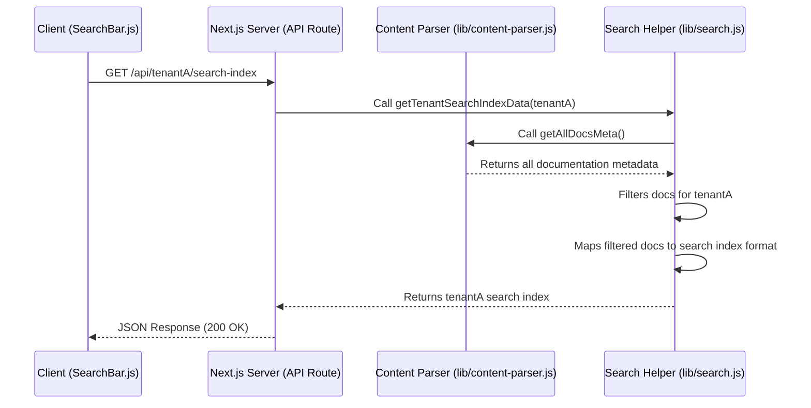

# Chapter 5: Next.js API Routes

In the previous chapter, [MDX Custom Components](chapter_04.md), we explored how to enrich our documentation with interactive React components embedded directly within MDX files. While these components excel at presenting dynamic UI on the client side, they often need to fetch data or perform server-side operations that cannot be handled by client-side JavaScript alone. This is where Next.js API Routes come into play, providing a powerful bridge between our frontend and any necessary backend logic.

---

### Problem & Motivation

Imagine our multi-tenant documentation platform needs to offer a powerful search feature. A client-side search component would need access to an index of all documentation content for the *current tenant*. Building this index on the client side for potentially large documentation sets would be inefficient, slow, and expose all content to the user even if they haven't searched for it. Similarly, we might need to fetch specific, tenant-scoped metadata or trigger server-side actions without building a separate backend application.

This presents a clear problem: how do we provide server-side functionality – like generating a pre-indexed search dataset or fetching sensitive tenant-specific configuration – within our Next.js application without spinning up a completely separate backend? The traditional approach would involve a dedicated API server, adding complexity and maintenance overhead. Our multi-tenant architecture further complicates this, as each tenant might need slightly different data or processing.

Next.js API Routes solve this by enabling us to create server-side endpoints *directly within our Next.js project*. For instance, we can create an API endpoint `/api/my-tenant/search-index` that, when requested, dynamically generates and returns a JSON-formatted search index specifically for "my-tenant". This keeps our server-side logic tightly coupled with our frontend, simplifying deployment and ensuring tenant-awareness.

---

### Core Concept Explanation

Next.js API Routes allow you to build API endpoints as part of your Next.js application. They live within the `pages/api` directory and are treated as serverless functions. This means that instead of rendering a React component, they execute server-side code and return a response, typically JSON, XML, or plain text.

The fundamental idea is that any file inside `pages/api` becomes an API endpoint. For example, `pages/api/hello.js` would correspond to the `/api/hello` endpoint. These routes benefit from Next.js's file-system based routing, meaning you can also have dynamic API routes, such as `pages/api/[tenantSlug]/search-index.js`, which allows `tenantSlug` to be a dynamic part of the URL.

When a request comes into an API route, Next.js provides `req` (the incoming request object) and `res` (the outgoing response object) as arguments to the default export function. Within this function, you can access request headers, query parameters, the request body, and then process data, interact with databases, or perform any server-side logic before sending a response back to the client. This tightly integrates backend capabilities directly into our frontend framework.

```javascript
// Example: pages/api/hello.js
export default function handler(req, res) {
  res.status(200).json({ name: 'John Doe' });
}
```
*This basic API route returns a JSON object with a name, demonstrating how to handle a request and send a JSON response.*

---

### Practical Usage Examples

Let's implement our motivating use case: providing a tenant-specific search index. We'll create a dynamic API route that, given a tenant slug, returns a simplified index of its documentation content.

#### 1. Creating the API Route File

First, we define the API route under `pages/api`. Since it needs to be tenant-specific, we'll use a dynamic segment.

```javascript
// pages/api/[tenantSlug]/search-index.js
import { getTenantSearchIndexData } from '../../../lib/search'; // More on this later

export default async function handler(req, res) {
  const { tenantSlug } = req.query; // Extract tenantSlug from the URL

  if (!tenantSlug) {
    return res.status(400).json({ error: 'Tenant slug is required.' });
  }

  try {
    // Call a helper function to get the actual search data
    const searchIndex = await getTenantSearchIndexData(tenantSlug);
    res.status(200).json(searchIndex);
  } catch (error) {
    console.error(`Failed to generate search index for ${tenantSlug}:`, error);
    res.status(500).json({ error: 'Failed to generate search index.' });
  }
}
```
*This code defines an API route that will respond to paths like `/api/my-tenant/search-index`. It extracts the `tenantSlug` from the URL, calls a utility function (to be defined), and returns the generated search index as JSON.*

#### 2. Client-Side Consumption

Now, a frontend component can easily fetch this data.

```javascript
// components/SearchBar.js (simplified example)
import React, { useState, useEffect } from 'react';

function SearchBar({ tenantSlug }) {
  const [searchIndex, setSearchIndex] = useState([]);
  const [loading, setLoading] = useState(true);

  useEffect(() => {
    async function fetchSearchIndex() {
      const response = await fetch(`/api/${tenantSlug}/search-index`);
      const data = await response.json();
      setSearchIndex(data);
      setLoading(false);
    }
    fetchSearchIndex();
  }, [tenantSlug]);

  if (loading) return <div>Loading search index...</div>;

  // Render your search input and use searchIndex to filter results
  return (
    <input
      type="text"
      placeholder="Search documentation..."
      onChange={(e) => { /* filter searchIndex based on e.target.value */ }}
    />
  );
}
```
*This `SearchBar` component demonstrates how to fetch the tenant-specific search index from our newly created API route. It uses `useEffect` to make the fetch request when the component mounts, ensuring the search data is available for filtering.*

---

### Internal Implementation Walkthrough

Let's detail the flow of how `pages/api/[tenantSlug]/search-index.js` works, focusing on the `getTenantSearchIndexData` helper. This helper would interact with our content source (from [Documentation Content Source](chapter_01.md)) to gather the necessary data.

1.  **Request Initiation**: A client-side component (e.g., `SearchBar.js`) makes an `HTTP GET` request to `/api/my-tenant/search-index`.

2.  **Next.js Routing**: Next.js intercepts this request. Recognizing the `pages/api` prefix and the dynamic segment `[tenantSlug]`, it routes the request to the `handler` function exported by `pages/api/[tenantSlug]/search-index.js`.

3.  **Parameter Extraction**: Inside `handler`, `req.query.tenantSlug` captures `'my-tenant'` from the URL.

4.  **Data Generation (in `lib/search.js`)**:
    The `getTenantSearchIndexData` function is called with `tenantSlug`.

    ```javascript
    // lib/search.js (Simplified for illustration)
    import { getAllDocsMeta } from './content-parser'; // From Chapter 1

    export async function getTenantSearchIndexData(tenantSlug) {
      const allDocs = await getAllDocsMeta(); // Get all content metadata
      const tenantDocs = allDocs.filter(doc => doc.tenantSlug === tenantSlug);

      // Map to a simplified search format
      return tenantDocs.map(doc => ({
        slug: doc.slug,
        title: doc.title,
        description: doc.description, // Or content snippet
      }));
    }
    ```
    *This helper function is crucial. It simulates fetching all documentation metadata (as established in Chapter 1), filters it by the provided `tenantSlug`, and then transforms it into a lightweight format suitable for a search index. In a real scenario, this might involve more sophisticated full-text indexing.*

5.  **Response Formation**: The `getTenantSearchIndexData` function returns the array of search items. The API route's `handler` then serializes this array into JSON using `res.json()` and sends it back to the client with a `200 OK` status.

#### Sequence Diagram for Search Index Request


*This sequence diagram illustrates the flow from a client request to an API route, how the API route leverages a helper function, and how that helper interacts with our content parsing logic to construct and return the tenant-specific search index.*

---

### System Integration

Next.js API Routes are a core utility for integrating server-side logic into our multi-tenant documentation platform.

-   **Frontend Interaction**: API routes are primarily consumed by client-side React components. Components like the search bar, tenant switchers, or analytics dashboards would `fetch` data from these endpoints. This decouples data fetching logic from presentation, making components cleaner and more reusable.
-   **Content Data Layer**: API routes frequently rely on the data processing utilities established in [Documentation Content Source](chapter_01.md). For instance, our `getTenantSearchIndexData` function directly imports `getAllDocsMeta` from `lib/content-parser.js`. This ensures that API routes can access and process the same source of truth for documentation content.
-   **Dynamic Routing**: The dynamic nature of `[tenantSlug]` in API routes aligns perfectly with our multi-tenant routing strategy, allowing endpoints to be inherently tenant-aware.
-   **Future Integrations**: API routes can also serve as an intermediary for external services (e.g., sending analytics data to a third-party service, interacting with a database for user preferences, or fetching dynamic configuration) without exposing API keys directly to the client.

---

### Best Practices & Tips

-   **Abstract Logic**: Keep your API route handlers thin. Move complex data fetching, processing, or database interactions into separate utility files (e.g., `lib/search.js`, `lib/tenant-config.js`). This improves testability and readability.
-   **Error Handling**: Always wrap your core logic in `try...catch` blocks to gracefully handle errors and return appropriate HTTP status codes (e.g., `400 Bad Request`, `404 Not Found`, `500 Internal Server Error`).
-   **Security**: Be mindful of what data you expose. Sanitize inputs (`req.query`, `req.body`) and never expose sensitive information (like API keys or database credentials) directly in the client-side code that calls the API route. If an API route requires authentication, implement it.
-   **Performance & Caching**: For frequently accessed data that doesn't change often (like a search index), consider implementing server-side caching mechanisms within your API route or utilizing Next.js's data fetching strategies (like `getServerSideProps` for pre-fetching data when rendering pages, though for pure API calls, manual caching might be needed).
-   **HTTP Methods**: Use appropriate HTTP methods (GET for fetching, POST for creating, PUT/PATCH for updating, DELETE for deleting) to make your API routes RESTful and predictable. Next.js API routes can explicitly check `req.method`.

```javascript
// Example: Restricting HTTP methods
export default function handler(req, res) {
  if (req.method === 'GET') {
    // Process GET request
    res.status(200).json({ message: 'This is a GET request' });
  } else if (req.method === 'POST') {
    // Process POST request
    res.status(200).json({ message: 'This is a POST request' });
  } else {
    res.setHeader('Allow', ['GET', 'POST']);
    res.status(405).end(`Method ${req.method} Not Allowed`);
  }
}
```
*This snippet shows how to restrict an API route to specific HTTP methods, providing a more robust and secure API endpoint.*

---

### Chapter Conclusion

Next.js API Routes empower our multi-tenant documentation platform with flexible, scalable server-side capabilities, all within a single Next.js project. We've seen how they solve the problem of fetching dynamic, tenant-specific data, such as a search index, bridging the gap between static content and interactive functionality. By using file-system based routing, abstracting complex logic, and following best practices, we can build robust and performant APIs that seamlessly integrate with our frontend.

Our journey through the platform's core components continues. In the next chapter, we'll explore another server-side concern: how to efficiently serve static files, specifically focusing on handling OpenAPI specifications to provide interactive API documentation.

[Static File Serving (OpenAPI Specs)](chapter_06.md)