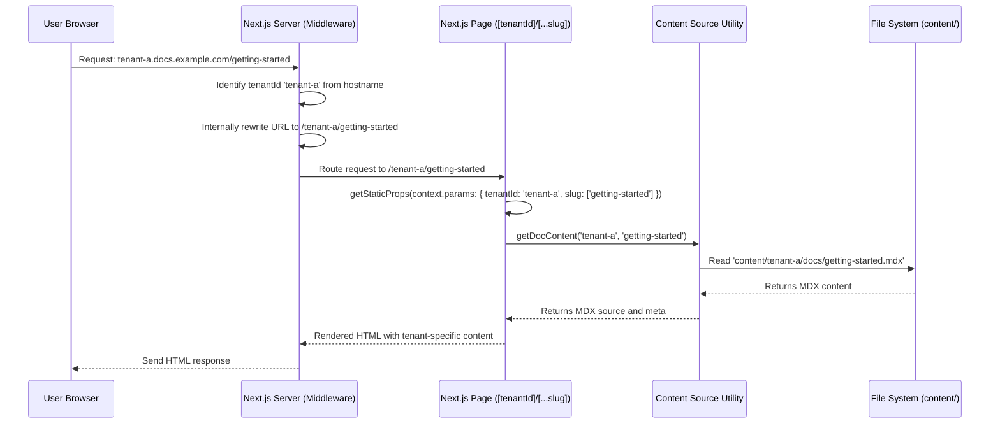

# Chapter 7: Multi-Tenant Routing

In the previous chapter, we explored how the `multi-tenant-docs` platform efficiently handles [Static File Serving (OpenAPI Specs)](chapter_06.md), allowing us to make various static assets, like OpenAPI specifications, available to users. While this ensured content delivery, it didn't address a fundamental requirement of our project: how to serve completely distinct sets of documentation to different user groups or "tenants" from a single, unified application instance. This is precisely where Multi-Tenant Routing becomes indispensable.

---

### Problem & Motivation

The core challenge for the `multi-tenant-docs` project is to provide isolated and customized documentation experiences for multiple tenants, all hosted under a single deployment. Imagine `Acme Corp` and `Globex Inc.` both using our platform. `Acme Corp` needs to see their own product documentation, while `Globex Inc.` requires a completely different set of documents, layouts, and even custom components, all without either company seeing the other's content. Without a robust multi-tenant routing mechanism, all users would be directed to the same generic documentation, defeating the purpose of a multi-tenant platform.

This problem is crucial for scalability, cost-effectiveness, and data isolation. Instead of deploying separate Next.js applications for each tenant, which would be resource-intensive and complex to manage, we aim to build one application that intelligently routes requests to the correct tenant's content. For example, a request to `acme.docs.example.com` should load content from `content/acme/`, while `globex.docs.example.com` should load from `content/globex/`. This dynamic content serving, based on tenant identification, is the backbone of our platform's multi-tenancy.

---

### Core Concept Explanation

Multi-tenant routing is the process of identifying the specific "tenant" associated with an incoming request and then directing that request to the appropriate resources (documentation content, static files, API endpoints) for that tenant. In our `multi-tenant-docs` project, a *tenant* represents an independent entity (e.g., a company or project) that hosts its documentation on our platform. The primary method for identifying a tenant is typically through the request's hostname or a specific path segment.

Next.js provides powerful tools for implementing multi-tenant routing, primarily through its dynamic routing capabilities and, more robustly, through [Middleware](https://nextjs.org/docs/app/building-your-application/routing/middleware). Middleware allows us to intercept a request *before* it reaches a page or API route, examine its properties (like the `hostname`), extract tenant information, and then rewrite the request URL or set specific headers/cookies to make that tenant information available downstream. This approach ensures that the entire application, from content loading to navigation generation, operates within the context of the identified tenant.

The goal is to internally map an external tenant-specific URL (e.g., `tenant-a.docs.example.com/getting-started`) to an internal, generic path that also includes the tenant identifier (e.g., `/tenant-a/getting-started`). This internal path can then be used by our content loading mechanisms to fetch content from `content/tenant-a/docs/getting-started.mdx`. This separation of external presentation and internal processing is key to maintaining a clean and scalable multi-tenant architecture.

---

### Practical Usage Examples

Implementing multi-tenant routing in Next.js typically involves identifying the tenant from the URL (e.g., subdomain) and then adjusting the request's path so that subsequent pages can easily access the tenant context.

#### 1. Identifying Tenant with Next.js Middleware

We'll use Next.js Middleware to extract the tenant ID from the subdomain and rewrite the URL internally. This makes the tenant ID part of the request path, simplifying content fetching later.

Create a `middleware.ts` file in the root of your `src` directory (or project root):

```typescript
// src/middleware.ts
import { NextRequest, NextResponse } from 'next/server';

export const config = {
  matcher: [
    /*
     * Match all request paths except for the ones starting with:
     * - api (API routes)
     * - _next/static (static files)
     * - _next/image (image optimization files)
     * - favicon.ico (favicon file)
     */
    '/((?!api|_next/static|_next/image|favicon.ico).*)',
  ],
};

export function middleware(req: NextRequest) {
  const url = req.nextUrl;
  const hostname = req.headers.get('host') || '';

  // For local development, assume 'localhost:3000' is our base
  // and 'tenant-a.localhost:3000' indicates tenant 'tenant-a'.
  // In production, you'd configure based on your domain setup (e.g., 'docs.example.com').
  const tenantRegex = /^(.*)\.localhost:3000$/; // Matches subdomains for local testing
  const tenantMatch = hostname.match(tenantRegex);

  let tenantId = 'default'; // Fallback tenant

  if (tenantMatch && tenantMatch[1] && tenantMatch[1] !== 'www') {
    tenantId = tenantMatch[1]; // e.g., 'tenant-a'
  }

  // Rewrite the URL to include the tenantId as the first path segment
  // This allows our dynamic pages to easily access the tenant context.
  // Example: 'tenant-a.localhost:3000/docs/guide' becomes '/tenant-a/docs/guide' internally.
  url.pathname = `/${tenantId}${url.pathname}`;
  return NextResponse.rewrite(url);
}
```

This middleware intercepts all relevant requests. It parses the `hostname` to find a subdomain. If a subdomain is found (and it's not 'www'), it treats it as the `tenantId`. Then, it *rewrites* the URL *internally* to prepend this `tenantId` to the path. So, `tenant-a.localhost:3000/getting-started` becomes `/tenant-a/getting-started` for subsequent page rendering. Requests to `localhost:3000/getting-started` would default to `/default/getting-started`.

#### 2. Accessing Tenant Context in Pages

With the URL rewritten by the middleware, our dynamic documentation pages (`src/pages/[...slug].tsx` or `src/app/[tenantId]/[...slug]/page.tsx` for App Router) can now easily access the tenant ID as part of the path parameters.

Consider a page that loads MDX content based on a slug:

```typescript
// src/pages/[tenantId]/[...slug].tsx (example for Pages Router)
import { GetStaticProps, GetStaticPaths } from 'next';
import { useRouter } from 'next/router';
import { getDocContent, getDocSlugs, TenantDocMeta } from '../../utils/content-source';
import { MDXRemote } from 'next-mdx-remote';
import Layout from '../../components/Layout'; // Assuming a layout component

interface DocPageProps {
  tenantId: string;
  slug: string[];
  source: any; // MDX source
  meta: TenantDocMeta;
}

export const getStaticProps: GetStaticProps<DocPageProps> = async (context) => {
  const { tenantId, slug } = context.params as { tenantId: string; slug: string[] };
  const fullSlug = slug.join('/');
  const { mdxSource, meta } = await getDocContent(tenantId, fullSlug);

  return {
    props: {
      tenantId,
      slug,
      source: mdxSource,
      meta,
    },
  };
};

export const getStaticPaths: GetStaticPaths = async () => {
  // This function needs to generate paths for ALL tenants and ALL docs.
  // In a real multi-tenant app, this would involve loading content metadata for all tenants.
  // For simplicity, let's assume we have a way to list all tenants and their slugs.
  const allTenantDocs = await getAllTenantDocSlugs(); // Function to get all slugs for all tenants
  const paths = allTenantDocs.map(({ tenantId, slug }) => ({
    params: { tenantId, slug: slug.split('/') },
  }));

  return {
    paths,
    fallback: 'blocking', // or true if you want to use client-side data fetching
  };
};

export default function DocPage({ tenantId, source, meta }: DocPageProps) {
  const router = useRouter();
  if (router.isFallback) return <div>Loading...</div>;

  return (
    <Layout tenantId={tenantId} pageTitle={meta.title}>
      <h1>{meta.title}</h1>
      <MDXRemote {...source} components={{ /* custom components */ }} />
    </Layout>
  );
}
```

In this `getStaticProps` example, `context.params` now correctly contains `tenantId` and `slug` array, thanks to the middleware rewrite. Our `getDocContent` utility (from [Documentation Content Source](chapter_01.md)) would then use `tenantId` to fetch content from the correct tenant-specific directory (e.g., `content/${tenantId}/docs/${fullSlug}.mdx`).

---

### Internal Implementation Walkthrough

The internal flow for multi-tenant routing orchestrates several Next.js features and our custom content utilities to deliver the correct documentation.

#### 1. Tenant Identification (Middleware)

Upon receiving a request, the `middleware.ts` is the first line of defense. It intercepts the request and inspects the `hostname`.

```typescript
// Simplified middleware.ts logic
// 1. Get hostname: req.headers.get('host')
// 2. Extract tenant ID: Using regex /(.*)\.localhost:3000$/
//    - If tenant-a.localhost:3000, tenantId = 'tenant-a'
//    - If localhost:3000, tenantId = 'default'
```

This step determines *who* the request is for. If no specific tenant is identified (e.g., direct access via `localhost:3000`), a `default` tenant ID is assigned.

#### 2. Path Rewriting & Context Provisioning

After identifying the `tenantId`, the middleware *rewrites* the request URL internally. This doesn't change the URL in the browser's address bar but modifies how Next.js processes the request on the server.

```typescript
// Simplified middleware.ts logic
// 3. Rewrite URL: url.pathname = `/${tenantId}${url.pathname}`
//    - Original: /docs/getting-started (external)
//    - Rewritten: /tenant-a/docs/getting-started (internal)
// 4. Return rewritten response: NextResponse.rewrite(url)
```

This rewrite is crucial because it makes the `tenantId` available as a path parameter to the subsequent page components, specifically within `getStaticProps` or `getServerSideProps`.

#### 3. Tenant-Specific Content Loading

Once a page component (e.g., `src/pages/[tenantId]/[...slug].tsx`) receives the request, its data fetching functions (`getStaticProps`/`getServerSideProps`) are invoked. These functions now have direct access to the `tenantId` via `context.params`.

```typescript
// Simplified getStaticProps (from src/pages/[tenantId]/[...slug].tsx)
// 1. Access tenantId and slug from context.params:
//    const { tenantId, slug } = context.params;
// 2. Call content utility: getDocContent(tenantId, slug.join('/'))
//    - This function knows to look in `content/${tenantId}/docs/`
```

The `getDocContent` utility (detailed in [Documentation Content Source](chapter_01.md)) is then responsible for loading MDX content *specifically* from the directory corresponding to the identified `tenantId`. For example, if `tenantId` is 'acme', it will look in `content/acme/docs/`.

Here's a sequence diagram illustrating this flow:



This structured approach ensures that each tenant's documentation is loaded and rendered in isolation, providing a clean separation of concerns and a personalized experience.

---

### System Integration

Multi-Tenant Routing is a foundational layer that profoundly impacts how various other components of the `multi-tenant-docs` project function:

*   **[Documentation Content Source](chapter_01.md)**: This chapter's utilities become tenant-aware. Instead of a single content root, `getDocContent` and `getDocSlugs` must now accept a `tenantId` parameter to locate and parse MDX files from `content/${tenantId}/` directories. This ensures tenant data isolation at the source.
*   **[Dynamic Documentation Pages](chapter_02.md)**: The dynamic routes, such as `[...slug].tsx`, are modified to `[tenantId]/[...slug].tsx` (or similar in App Router). This change directly incorporates the tenant ID into the routing schema, enabling `getStaticProps` or `getServerSideProps` to fetch content based on the identified tenant.
*   **[Documentation Navigation & Layout](chapter_03.md)**: The sidebar and main layout components must also become tenant-aware. The navigation structure is typically generated from `meta.json` files within each tenant's content directory (e.g., `content/${tenantId}/meta.json`). The layout might also apply tenant-specific branding or styling.
*   **[MDX Custom Components](chapter_04.md)**: While the components themselves might be universal, their behavior or data could be tenant-specific. For example, an "API Explorer" component might fetch schema data from a tenant-specific API endpoint, or an "Interactive Demo" might link to a tenant's specific external service.
*   **[Next.js API Routes](chapter_05.md)**: Any API routes (`/api/...`) that interact with tenant-specific data (e.g., `/api/search-docs` or `/api/feedback`) would also need to identify the tenant. This could be done by parsing the `Referer` header from the client, or if the API routes are also rewritten by the middleware to include `/api/${tenantId}/...`, then the `tenantId` can be accessed directly in the API route.
*   **[Static File Serving (OpenAPI Specs)](chapter_06.md)**: Similar to MDX content, static files like OpenAPI specifications can also be served on a per-tenant basis. For instance, `tenant-a.docs.example.com/openapi.yaml` would fetch `content/tenant-a/static/openapi.yaml`, leveraging the same tenant identification mechanism.

---

### Best Practices & Tips

*   **Consistent Tenant Identification**: Stick to one primary method for identifying tenants (e.g., always subdomain, or always the first path segment). This simplifies middleware and page logic.
*   **Fallback Tenant**: Always define a "default" or "fallback" tenant. This handles cases where no specific tenant can be identified, ensuring the application doesn't break and can display generic or onboarding documentation.
*   **Tenant Isolation**: Crucially, ensure that tenant A cannot accidentally or maliciously access tenant B's documentation or data. The content loading utilities (Chapter 1) must strictly enforce reading only from the identified tenant's directory.
*   **Local Development Setup**: Use `/etc/hosts` (or equivalent) to map subdomains like `tenant-a.localhost` to `127.0.0.1` for easy local testing of multi-tenant routing without needing full DNS configuration.
*   **Scalability**: If you anticipate a very large number of tenants, consider how `getStaticPaths` will scale. Pre-generating all paths for all tenants might become impractical. Dynamic `fallback: 'blocking'` or `fallback: true` might be necessary, alongside robust content caching.
*   **Configuration vs. Hardcoding**: For production, avoid hardcoding tenant logic in middleware. Instead, externalize the domain mapping (e.g., `docs.example.com` vs. `company.com`) into environment variables or a configuration file.
*   **Security for Sensitive Docs**: For highly sensitive documentation, ensure that access control (authentication and authorization) is integrated *after* tenant identification. The multi-tenant routing only directs traffic; it doesn't authorize it.

---

### Chapter Conclusion

Multi-Tenant Routing is the cornerstone of our `multi-tenant-docs` platform, transforming a generic documentation site into a powerful, individualized service for diverse tenants. By intelligently identifying tenants through mechanisms like subdomain analysis and using Next.js Middleware to rewrite internal request paths, we've enabled our application to dynamically serve tenant-specific content, layouts, and interactive components. This robust routing system not only provides a seamless and isolated experience for each tenant but also significantly simplifies the overall architecture and management of the platform.

With the ability to serve distinct documentation sets to different tenants now firmly in place, our next crucial step is to empower those tenants to manage multiple versions of their documentation. This leads us directly into the topic of [Documentation Versioning](chapter_08.md), where we will explore strategies for handling content updates, rollbacks, and parallel documentation releases for each tenant.