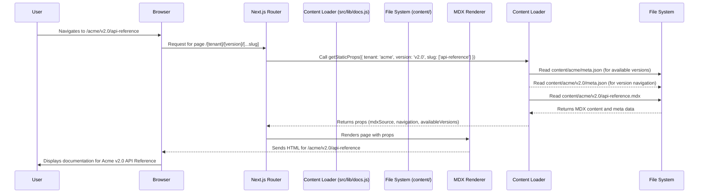

# Chapter 8: Documentation Versioning

In the previous chapter, [Multi-Tenant Routing](chapter_07.md), we established a robust mechanism to serve distinct documentation sets for different tenants based on their unique identifiers in the URL. This ensures that `acme.multi-tenant-docs.com` sees Acme's docs, and `globex.multi-tenant-docs.com` sees Globex's docs. However, just serving the right tenant's documentation isn't always enough. Software, APIs, and products evolve, and with them, their documentation must also change.

---

### Problem & Motivation

Imagine a tenant, "Acme Corp," who has been using your multi-tenant documentation platform. Over the past year, they've released two major versions of their flagship product, `v1.0` and `v2.0`, and they are actively developing `v3.0`. Each product version has distinct features, APIs, and user interfaces, requiring its own set of documentation. If Acme Corp only had a single, ever-updating documentation set, users looking for information on `v1.0` would be confused by `v2.0` content, and developers building against `v3.0` might need early access to `v3.0` specific documentation.

The core problem is the need to maintain, present, and allow users to switch between multiple versions of documentation for *each individual tenant*. Without versioning, documentation quickly becomes outdated or misleading, leading to user frustration, increased support requests, and a loss of trust in the platform's ability to provide accurate information. Our multi-tenant platform must not only serve tenant-specific content but also allow tenants to manage and publish different documentation versions for their products or services. This capability is crucial for accommodating product lifecycles, supporting legacy systems, and providing clear, context-specific information to users.

---

### Core Concept Explanation

Documentation versioning, in the context of our `multi-tenant-docs` project, refers to the systematic organization and presentation of documentation content tied to specific product or API releases. It allows tenants to maintain separate content for, say, `v1.0`, `v2.0`, and a `latest` or `upcoming` version, all simultaneously available to their users. The user can then select which version they wish to view, typically through a dropdown menu or a version segment in the URL.

The fundamental idea is to extend our dynamic routing to include a version identifier. So, instead of just `/tenant-id/doc-slug`, we aim for `/tenant-id/version-id/doc-slug`. This `version-id` acts as a key to a specific content directory within a tenant's documentation structure. For example, `acme.com/v1.0/api-overview` and `acme.com/v2.0/api-overview` would point to two distinct versions of the "API Overview" document, each relevant to its respective product version.

Key terminology includes:
*   **Version Slug**: A URL-friendly identifier for a documentation version (e.g., `v1.0`, `v2.0`, `latest`).
*   **Latest Version**: Often a symbolic link or configuration that points to the most current stable documentation.
*   **Version Selector**: A UI component (e.g., a dropdown) that allows users to switch between available documentation versions.
*   **Versioned Content Directories**: Physical directories on the filesystem that house MDX files specific to a particular version.

---

### Practical Usage Examples

To enable versioning, a tenant's documentation content will be organized into version-specific subdirectories.

First, let's look at the content structure. Imagine `acme`'s documentation residing under `content/acme`. We'd structure it like this:

```
// content/acme/
// ├── v1.0/
// │   ├── api-reference.mdx
// │   ├── getting-started.mdx
// │   └── meta.json
// ├── v2.0/
// │   ├── api-reference.mdx
// │   ├── getting-started.mdx
// │   └── meta.json
// └── latest/
//     ├── api-reference.mdx
//     ├── getting-started.mdx
//     └── meta.json
```

Each version (`v1.0`, `v2.0`, `latest`) gets its own directory, containing its specific MDX files and a `meta.json` file for navigation. The `latest` directory typically mirrors the most current stable version or serves as a development branch.

Next, we need a way to define which versions are available for a given tenant. This can be achieved with a tenant-specific configuration or a `meta.json` file at the root of the tenant's content.

```json
// content/acme/meta.json
{
  "versions": [
    {"slug": "latest", "label": "Latest (v2.0)"},
    {"slug": "v2.0", "label": "Version 2.0"},
    {"slug": "v1.0", "label": "Version 1.0"}
  ],
  "defaultVersion": "latest"
}
```
This `meta.json` (or a similar configuration file) at the tenant root explicitly lists the available versions, their display labels, and which one should be considered the default. This is crucial for dynamically building the version selector UI.

Finally, rendering a versioned page would involve a URL like `acme.multi-tenant-docs.com/v2.0/api-reference`.
The path structure in Next.js would typically be `pages/[tenant]/[version]/[...slug].js`.

A simplified version selector component might look like this:

```tsx
// components/VersionSelector.tsx
import Link from 'next/link';
import { useRouter } from 'next/router';

export function VersionSelector({ versions, currentVersion }) {
  const router = useRouter();
  const { tenant, slug } = router.query;
  const currentPath = Array.isArray(slug) ? slug.join('/') : slug;

  const handleVersionChange = (e) => {
    const newVersion = e.target.value;
    router.push(`/${tenant}/${newVersion}/${currentPath}`);
  };

  return (
    <select onChange={handleVersionChange} value={currentVersion}>
      {versions.map((v) => (
        <option key={v.slug} value={v.slug}>
          {v.label}
        </option>
      ))}
    </select>
  );
}
```
This component receives a list of `versions` and the `currentVersion`. When a user selects a new version, it constructs a new URL that preserves the current tenant and document slug, only changing the version segment, and navigates to it.

---

### Internal Implementation Walkthrough

The core of documentation versioning lies in how Next.js's dynamic routing and data fetching (`getStaticPaths` and `getStaticProps`) are adapted to incorporate the version identifier.

1.  **Route Definition**: The primary page component for documentation would be something like `src/pages/[tenant]/[version]/[...slug].js`.
    *   `[tenant]` captures the tenant identifier (e.g., `acme`).
    *   `[version]` captures the documentation version (e.g., `v1.0`, `latest`).
    *   `[...slug]` captures the rest of the path, representing the specific documentation article (e.g., `getting-started/introduction`).

2.  **`getStaticPaths`**: This function is responsible for pre-rendering all possible combinations of tenant, version, and documentation slugs.
    *   It first retrieves all available tenants.
    *   For each tenant, it reads the tenant's root `meta.json` (or configuration) to get the list of supported `versions`.
    *   For each version, it then scans the `content/[tenant]/[version]` directory to find all MDX files and generates corresponding `slug` paths.
    *   The returned `paths` array would look like: `[{ params: { tenant: 'acme', version: 'v1.0', slug: ['getting-started'] } }, { params: { tenant: 'acme', version: 'v2.0', slug: ['api-reference'] } }, ...]`.

    ```javascript
    // src/pages/[tenant]/[version]/[...slug].js (simplified)
    import { getAllDocPaths, getTenantVersions } from '../../../lib/docs';

    export async function getStaticPaths() {
      const paths = [];
      const tenants = ['acme', 'globex']; // In reality, dynamically fetch tenants

      for (const tenant of tenants) {
        const tenantConfig = await getTenantVersions(tenant); // Reads content/acme/meta.json
        for (const version of tenantConfig.versions) {
          const docPaths = await getAllDocPaths(tenant, version.slug); // Scans content/acme/v1.0/
          for (const docPath of docPaths) {
            paths.push({
              params: { tenant, version: version.slug, slug: docPath.split('/') }
            });
          }
        }
      }
      return { paths, fallback: false };
    }
    ```
    `getAllDocPaths` (from `src/lib/docs.js`) is an internal utility that would traverse the content directory `content/[tenant]/[version]` and return an array of all available documentation slugs. `getTenantVersions` would load the `meta.json` from `content/[tenant]/meta.json` to get the version list.

3.  **`getStaticProps`**: Once a specific path is requested (e.g., `/acme/v2.0/api-reference`), `getStaticProps` fetches the actual MDX content for that specific tenant, version, and slug.
    *   It uses the `tenant`, `version`, and `slug` from `context.params`.
    *   It constructs the path to the specific MDX file: `content/[tenant]/[version]/[...slug].mdx`.
    *   It loads the MDX content, parses it, and also loads the navigation data for *that specific version* (from `content/[tenant]/[version]/meta.json`).
    *   It also fetches the list of available versions for the current tenant from the root `meta.json` (`content/[tenant]/meta.json`) to pass to the `VersionSelector` component.

    ```javascript
    // src/pages/[tenant]/[version]/[...slug].js (simplified)
    import { getMDXContent, getDocNavigation, getTenantVersions } from '../../../lib/docs';

    export async function getStaticProps(context) {
      const { tenant, version, slug } = context.params;
      const mdxSource = await getMDXContent(tenant, version, slug);
      const navigation = await getDocNavigation(tenant, version); // For the sidebar
      const { versions, defaultVersion } = await getTenantVersions(tenant); // For version selector

      return {
        props: {
          tenant,
          version,
          slug: Array.isArray(slug) ? slug.join('/') : slug,
          mdxSource,
          navigation,
          availableVersions: versions,
          defaultVersion,
        },
      };
    }
    ```

Here's a simplified flow diagram illustrating how a request for versioned documentation is processed:



---

### System Integration

Documentation versioning deeply integrates with several other core abstractions:

*   **[Multi-Tenant Routing](chapter_07.md)**: This chapter builds directly on multi-tenant routing. The version identifier becomes another mandatory segment in the URL, nested *within* the tenant's namespace. The route now follows the pattern `/tenant-id/version-id/doc-slug`.
*   **[Documentation Content Source](chapter_01.md)**: The content loading utilities must be updated to accept a `version` parameter. When `getMDXContent` or `getDocNavigation` are called, they prepend the version slug to the content path. For example, `getMDXContent('acme', 'v2.0', 'api-reference')` would look in `content/acme/v2.0/api-reference.mdx`.
*   **[Documentation Navigation & Layout](chapter_03.md)**: The sidebar navigation needs to be version-specific. When a user switches versions, the entire sidebar for that tenant should refresh to display the navigation relevant to the *selected version*, as defined by its `content/[tenant]/[version]/meta.json`. The main layout component also needs to incorporate the `VersionSelector` component, making the current version clearly visible and switchable.
*   **[Documentation Search](chapter_09.md)**: The search functionality (to be covered in the next chapter) must be version-aware. A search within `acme.com/v1.0/...` should only return results from `v1.0` documentation, not `v2.0`. This means the search index and query logic must incorporate the version filter.

---

### Best Practices & Tips

*   **Consistent Version Naming**: Use a consistent naming convention for version directories (e.g., `v1.0`, `v2.1`, `latest`). Avoid using ambiguous names.
*   **`latest` Version Management**: The `latest` version should ideally be a canonical name that points to the current stable release. This can be achieved by copying the latest stable release's content to the `latest` directory or by configuring `latest` to dynamically resolve to a specific version (`v2.0` in our example `meta.json`).
*   **Default Version Redirection**: Configure the application to redirect requests for `/tenant-id/doc-slug` (without a version) to the tenant's `defaultVersion` (e.g., `/tenant-id/latest/doc-slug`). This provides a cleaner URL for the most common use case.
*   **Archiving Old Versions**: While older versions should be accessible, consider marking very old or deprecated versions clearly in the UI. For extremely old versions, you might choose to archive them off the live platform onto static storage.
*   **Minimize Duplication**: While versioning implies some content duplication, try to keep common components or assets (e.g., images that are version-agnostic) outside version-specific directories and link to them centrally to reduce maintenance overhead.
*   **Testing**: Thoroughly test version switching to ensure the correct navigation and content are loaded for each version and that cross-version links (if any) are handled gracefully.
*   **Performance**: Pre-rendering all versions can lead to a large number of static pages. While Next.js handles this efficiently, be mindful of build times and consider `fallback: true` for less frequently accessed older versions if build times become an issue.

---

### Chapter Conclusion

Documentation versioning is a vital capability for any evolving product or service, especially within a multi-tenant platform. By structuring our content with version-specific directories and extending our dynamic routing, we've enabled tenants to provide clear, context-specific documentation that aligns with their product lifecycles. This ensures users always find the relevant information, regardless of the product version they are interacting with.

With the ability to manage documentation versions, our multi-tenant platform now offers a robust content delivery system. The next crucial step is to enable users to quickly find information across this potentially vast, versioned, and tenant-specific documentation. In the upcoming chapter, [Documentation Search](chapter_09.md), we will explore how to implement a powerful and efficient search functionality that intelligently navigates these complexities.