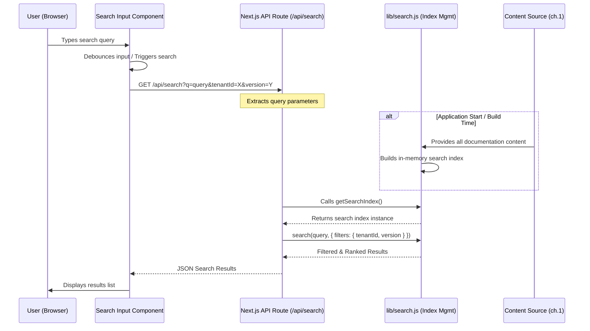

# Chapter 9: Documentation Search

In the journey of building a powerful multi-tenant documentation platform, we've explored how to structure content, render dynamic pages, customize components, manage routing for different tenants, and even handle multiple versions of documentation. Our previous chapter, [Documentation Versioning](chapter_08.md), provided users with the ability to navigate through different historical or future states of documentation content. However, simply organizing and presenting content, no matter how well-structured or versioned, isn't enough when dealing with large volumes of information.

---

### Problem & Motivation

Imagine a user landing on a tenant's documentation portal. They might be looking for a specific piece of information, like "how to configure webhooks" or "API authentication methods." While the navigation sidebar provides a structured way to browse, it's often inefficient to click through multiple sections and pages, especially if the user isn't sure where the information might reside. This manual browsing can lead to frustration, increased support requests, and a less productive user experience.

The core problem is efficient information retrieval. Users need a quick, intuitive way to pinpoint relevant documentation articles across potentially hundreds of pages, multiple versions, and specific tenant contexts. A robust search capability transforms a browsable content repository into an instantly accessible knowledge base, significantly enhancing user satisfaction and the overall utility of the `multi-tenant-docs` platform. For instance, a developer needing to integrate with an API might use search to immediately find all relevant articles related to "OAuth2" across all available documentation versions for their specific tenant.

---

### Core Concept Explanation

Documentation search, at its heart, is about enabling users to find relevant content quickly. It typically involves two main phases: **indexing** and **querying**. During indexing, the content of all documentation files (titles, slugs, body text, metadata like tenant and version) is processed and stored in a structured format, known as a search index. This index is optimized for rapid lookups, much like a book's index helps you find specific topics without reading every page.

When a user performs a search, their query (e.g., "API authentication") is matched against this pre-built index. The search engine then retrieves articles that are most relevant to the query, often applying algorithms to rank results based on factors like keyword frequency, location (e.g., title vs. body), and proximity. In the `multi-tenant-docs` project, this search capability is exposed through a dedicated Next.js API endpoint, providing a server-side mechanism to process queries and return filtered, tenant- and version-specific results.

This approach ensures that search queries are handled efficiently on the server, leveraging the full content corpus, and allows for more sophisticated search logic than purely client-side solutions might offer. It's like having a dedicated librarian (the search API) who knows exactly where to find every piece of information in the entire multi-tenant library, rather than just relying on the user to browse individual sections.

---

### Practical Usage Examples

Implementing search in `multi-tenant-docs` involves a user interface component for input and a backend API endpoint for processing queries. Let's look at how a user would interact with it and how the frontend communicates with the search API.

#### User Interaction

A user typically interacts with a search input field, often located in the header or a dedicated search modal.

```html
<!-- Example of a simple search input field in a React component -->
<input
  type="text"
  placeholder="Search documentation..."
  onChange={handleSearchInput}
/>
<button onClick={executeSearch}>Search</button>
```

When the user types a query and triggers a search, the frontend sends a request to the search API.

#### Frontend API Call Example

The frontend, likely a React component, would make an asynchronous call to the Next.js API route for search. This request would include the user's query and potentially the current `tenantId` and `version` to ensure relevant results.

```javascript
// Example of fetching search results from a React component
async function fetchSearchResults(query, tenantId, version) {
  const params = new URLSearchParams({ q: query, tenantId, version });
  const response = await fetch(`/api/search?${params.toString()}`);
  if (!response.ok) {
    throw new Error('Failed to fetch search results');
  }
  const data = await response.json();
  return data;
}

// Usage in a component:
// const results = await fetchSearchResults('api authentication', 'tenantA', 'v1');
// console.log(results);
```
This JavaScript snippet demonstrates how a client-side component constructs a URL with the search query, tenant ID, and version parameters, then uses the `fetch` API to send a request to our backend search endpoint. It then parses the JSON response containing the search results.

#### Example API Response

Upon a successful search query, the API endpoint responds with a JSON array of relevant documentation articles. Each item typically includes enough information to display a search result link and a brief context.

```json
[
  {
    "title": "API Authentication with OAuth2",
    "slug": "/api-guides/authentication-oauth2",
    "excerpt": "Learn how to secure your API access using OAuth2. This guide covers token generation and validation.",
    "version": "v1",
    "tenantId": "tenantA"
  },
  {
    "title": "Webhook Configuration for Events",
    "slug": "/integration-guides/webhooks",
    "excerpt": "Set up webhooks to receive real-time notifications about events in your system.",
    "version": "v1",
    "tenantId": "tenantA"
  }
]
```
This JSON structure provides the necessary details for the frontend to render clickable search results, showing the article's title, a short excerpt for context, and its direct URL path (`slug`).

---

### Internal Implementation Walkthrough

The search functionality in `multi-tenant-docs` is orchestrated through a Next.js API Route that interacts with a pre-built or dynamically generated search index.

#### 1. Search Index Generation

The foundation of search is the index. Ideally, this index is built during the application's build process (e.g., using `getStaticProps` or a custom build script) to ensure it's performant and available for all serverless functions.
When the application is built, all MDX documentation files and their associated metadata (like `meta.json` from [Chapter 1: Documentation Content Source](chapter_01.md)) are processed. For each document, relevant fields such as `title`, `slug`, `content` (plain text), `tenantId`, and `version` are extracted and added to an in-memory search index. This index could use a library like `flexsearch` or a simpler custom data structure if the content volume is small.

#### 2. The Search API Route (`pages/api/search.js`)

This is the core server-side component that handles search queries. It resides in `pages/api/search.js` (or `app/api/search/route.ts` if using the app router).

```javascript
// pages/api/search.js (conceptual)
// Note: In a real app, the searchIndex would be loaded or initialized globally
// or passed via a build-time process for SSG.
import { getSearchIndex } from '../../lib/search'; // Assuming a helper for index management

export default async function handler(req, res) {
  if (req.method === 'GET') {
    const { q, tenantId, version } = req.query;

    if (!q) {
      return res.status(400).json({ message: 'Query parameter "q" is required.' });
    }

    // Load or retrieve the pre-built search index
    const searchIndex = getSearchIndex();

    // Perform the search
    const results = searchIndex.search(q, {
      filters: { tenantId, version }
    });

    // Limit results for performance/UX
    const limitedResults = results.slice(0, 10);

    return res.status(200).json(limitedResults);
  } else {
    res.setHeader('Allow', ['GET']);
    res.status(405).end(`Method ${req.method} Not Allowed`);
  }
}
```
This API route takes the search query `q`, `tenantId`, and `version` from the request URL. It then queries the `searchIndex` (which encapsulates the search logic) and returns the filtered and ranked results as JSON.

#### 3. Search Index Logic (`lib/search.js`)

The `lib/search.js` file would contain the actual search index implementation, including how content is added to the index and how queries are processed.

```javascript
// lib/search.js (conceptual)
// This module would manage the in-memory search index.
let _searchIndex = null; // Private variable to hold the index

export function initializeSearchIndex(allDocs) {
  // allDocs would come from the content processing pipeline (Ch.1)
  // This function would build the actual search index from `allDocs`.
  // Example using a conceptual 'SimpleSearchEngine'
  _searchIndex = new SimpleSearchEngine();
  allDocs.forEach(doc => {
    _searchIndex.addDocument({
      id: doc.slug,
      title: doc.frontmatter.title,
      content: doc.plainTextContent, // Extracted from MDX
      slug: doc.slug,
      tenantId: doc.tenantId,
      version: doc.version
    });
  });
  console.log('Search index initialized with', allDocs.length, 'documents.');
}

export function getSearchIndex() {
  if (!_searchIndex) {
    // In a production setup, this would ideally be populated during build.
    // For development, you might re-initialize or lazy-load here.
    console.warn('Search index not initialized. This might be a development setup issue.');
    // Potentially load dummy data or throw error.
  }
  return _searchIndex;
}

// Conceptual SimpleSearchEngine for demonstration (not a full implementation)
class SimpleSearchEngine {
  constructor() {
    this.documents = [];
  }

  addDocument(doc) {
    this.documents.push(doc);
  }

  search(query, options = {}) {
    const lowerQuery = query.toLowerCase();
    const { filters = {} } = options;

    return this.documents
      .filter(doc => {
        // Apply tenant and version filters
        if (filters.tenantId && doc.tenantId !== filters.tenantId) return false;
        if (filters.version && doc.version !== filters.version) return false;

        // Basic text matching (can be expanded with fuzzy matching, scoring, etc.)
        return (
          doc.title.toLowerCase().includes(lowerQuery) ||
          doc.content.toLowerCase().includes(lowerQuery)
        );
      })
      .map(doc => ({
        title: doc.title,
        slug: doc.slug,
        excerpt: doc.content.substring(0, 150) + '...' // Simple excerpt
      }));
  }
}
```
The `initializeSearchIndex` function takes all processed documentation content and populates the search engine. The `getSearchIndex` function provides access to this index. The `SimpleSearchEngine` demonstrates basic filtering by `tenantId` and `version`, and a simple case-insensitive text match on title and content. More advanced implementations would use dedicated search libraries for better performance and relevance.

#### Sequence Diagram of Search Workflow


This diagram illustrates the flow from a user typing a query to the frontend receiving and displaying search results, highlighting the role of the Next.js API route and the underlying search index.

---

### System Integration

The Documentation Search abstraction seamlessly integrates with several other core components of the `multi-tenant-docs` project:

*   **[Documentation Content Source](chapter_01.md):** This chapter is fundamental. The content processing pipeline described in Chapter 1 is responsible for loading, parsing, and making all MDX content and its associated metadata (`meta.json`) available. This entire corpus of data is what the search index consumes to build its comprehensive list of searchable documents. Without the robust content sourcing, there would be nothing to search.
*   **[Multi-Tenant Routing](chapter_07.md):** A crucial aspect of our multi-tenant platform is ensuring that search results are tenant-specific. The search API endpoint receives the `tenantId` (derived from the routing context) and uses it to filter the search index, guaranteeing that users only see documentation relevant to their active tenant.
*   **[Documentation Versioning](chapter_08.md):** Similarly, the platform supports multiple documentation versions. The search API accepts a `version` parameter, allowing the search index to filter results to only display content from the currently selected documentation version, making the search highly relevant to the user's active context.
*   **[Next.js API Routes](chapter_05.md):** Chapter 5 provides the underlying framework for creating server-side endpoints within Next.js. The `/api/search` endpoint is a direct application of this concept, demonstrating how API routes can be used to perform complex server-side logic (like searching a large index) and deliver data to the client.

These integrations ensure that the search functionality is not just an isolated feature, but a deeply embedded and context-aware part of the overall multi-tenant documentation experience.

---

### Best Practices & Tips

To ensure your documentation search is efficient, accurate, and provides a great user experience, consider these best practices:

*   **Pre-build the Search Index:** For optimal performance, especially for static sites or serverless functions, generate your search index during the Next.js build process. This prevents the need to build the index on every API request.
*   **Filter by Tenant and Version:** Always pass `tenantId` and `version` parameters to your search API and strictly enforce these filters on the server. This is critical for maintaining the multi-tenant and versioned integrity of your documentation.
*   **Debounce Search Input:** On the frontend, implement debouncing for the search input field. This prevents sending an API request on every keystroke, reducing server load and improving client-side performance.
*   **Provide Clear Feedback:** When users search, show loading indicators, "no results found" messages, and clear error messages to manage expectations and improve usability.
*   **Optimize Relevance:** Basic keyword matching is a start, but consider implementing more sophisticated relevance scoring. This might involve:
    *   **Boosting:** Giving higher scores to matches in titles or headings.
    *   **Fuzzy Matching:** Allowing for typos or slight variations in query terms.
    *   **Synonyms:** Mapping common terms (e.g., "auth" to "authentication").
*   **Limit Results:** Returning thousands of results is overwhelming. Limit the number of results returned by the API (e.g., top 10 or 20) and consider implementing pagination for very large result sets.
*   **Consider Scalability:** For projects with massive amounts of documentation or very high search traffic, an in-memory solution might not suffice. Explore dedicated search services like Algolia, ElasticSearch, or MeiliSearch, which offer powerful features and handle scalability.
*   **Security:** If your documentation has different access levels, ensure your search API respects those permissions, only returning results that the current user is authorized to view.

---

### Chapter Conclusion

This chapter has demystified the implementation of a powerful search capability within our `multi-tenant-docs` platform. We've seen how by combining an efficient indexing strategy with a dedicated Next.js API route, we can provide users with rapid and relevant access to documentation, significantly enhancing their experience. From understanding the core concepts of indexing and querying, through practical examples of API interaction, to a detailed walkthrough of the internal mechanics and integration points, we've covered the essential aspects of building an effective search system.

The search functionality is the final piece in creating a truly comprehensive and user-friendly documentation platform. It transforms a collection of organized articles into an interactive and accessible knowledge base, empowering users to find exactly what they need, regardless of tenant or version. With this, we conclude our exploration of building the `multi-tenant-docs` project.