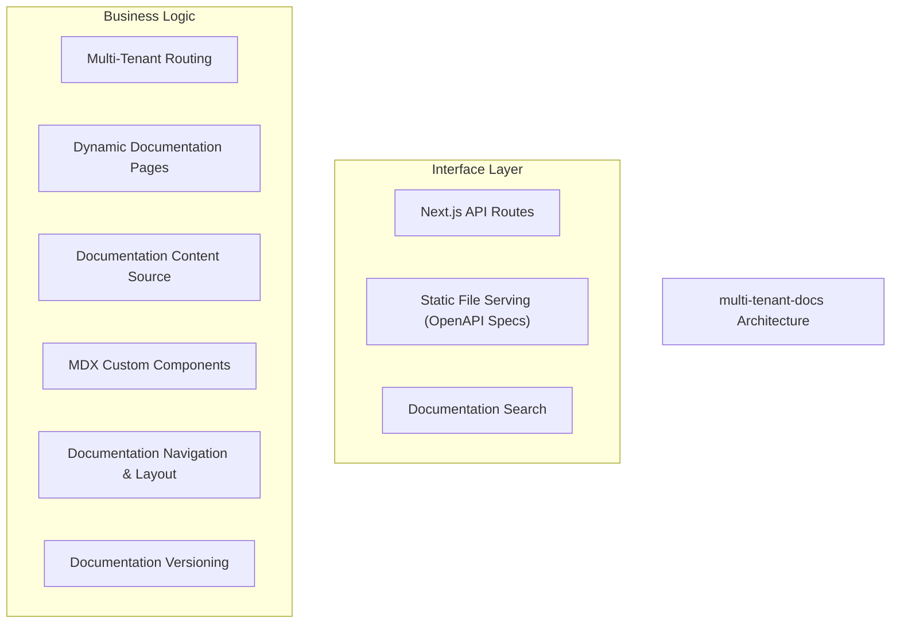
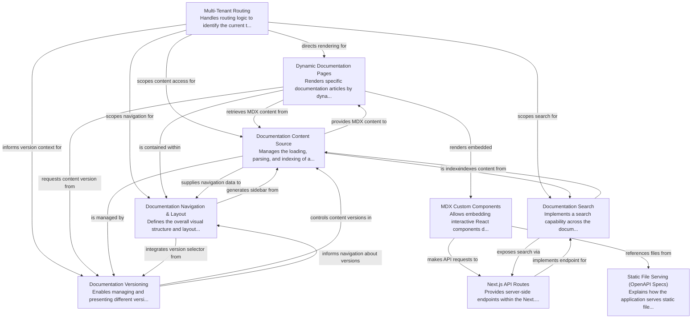

# multi-tenant-docs Tutorial

Welcome to the comprehensive tutorial for multi-tenant-docs. This tutorial is automatically generated from the codebase to help you understand the core concepts and implementation patterns.

## Project Overview

This project is a multi-tenant documentation platform built with Next.js, designed to host distinct documentation sets for various tenants. It leverages a dynamic routing system to identify tenants, serving their specific MDX content, which can be enhanced with interactive React components and managed with versioning. The platform also includes comprehensive navigation, layout, and search capabilities.

## System Architecture

## Component Relationships

## Table of Contents

1. [Chapter 1: Documentation Content Source](chapter_01.md) - Comprehensive documentation for Documentation Content Source following structured methodology...
2. [Chapter 2: Dynamic Documentation Pages](chapter_02.md) - Comprehensive documentation for Dynamic Documentation Pages following structured methodology...
3. [Chapter 3: Documentation Navigation & Layout](chapter_03.md) - Comprehensive documentation for Documentation Navigation & Layout following structured methodology...
4. [Chapter 4: MDX Custom Components](chapter_04.md) - Comprehensive documentation for MDX Custom Components following structured methodology...
5. [Chapter 5: Next.js API Routes](chapter_05.md) - Comprehensive documentation for Next.
6. [Chapter 6: Static File Serving (OpenAPI Specs)](chapter_06.md) - Comprehensive documentation for Static File Serving (OpenAPI Specs) following structured methodology...
7. [Chapter 7: Multi-Tenant Routing](chapter_07.md) - Comprehensive documentation for Multi-Tenant Routing following structured methodology...
8. [Chapter 8: Documentation Versioning](chapter_08.md) - Comprehensive documentation for Documentation Versioning following structured methodology...
9. [Chapter 9: Documentation Search](chapter_09.md) - Comprehensive documentation for Documentation Search following structured methodology...

## How to Use This Tutorial

1. **Start with Chapter 1** to understand the foundational concepts
2. **Follow the sequence** - each chapter builds upon previous concepts
3. **Practice with code examples** - every chapter includes practical examples
4. **Refer to diagrams** - use architecture diagrams for visual understanding
5. **Cross-reference concepts** - chapters link to related topics

## Tutorial Features

- **Progressive Learning**: Concepts are introduced in logical order
- **Code Examples**: Every chapter includes practical, executable code
- **Visual Diagrams**: Mermaid diagrams illustrate complex relationships
- **Cross-References**: Easy navigation between related concepts
- **Beginner-Friendly**: Written for newcomers to the codebase

## Contributing

This tutorial is auto-generated from the codebase. To improve it:
1. Update the source code documentation
2. Add more detailed comments to key functions
3. Regenerate the tutorial using the documentation system

---

*Generated using AI-powered codebase analysis*
