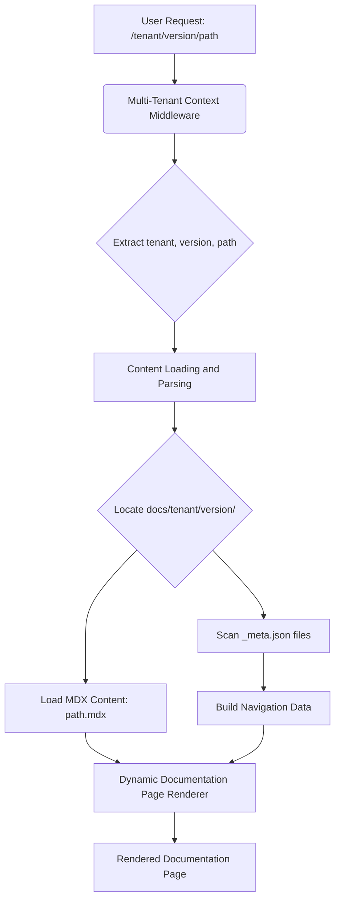

# Chapter 1: Documentation Content Structure

Welcome to the foundational chapter of the 'multi-tenant-docs' project! This is the first step in understanding how our project empowers dynamic and flexible documentation serving.

---

### Problem & Motivation

In today's complex software landscape, organizations often need to maintain documentation for multiple products, different versions of those products, and even tailored content for various customer segments or "tenants." Manually managing this sprawl can quickly become a nightmare: scattered files, inconsistent navigation, and a lack of clear version control. Imagine a software company trying to serve documentation for "Product X v1.0" to their Enterprise customers (Tenant A) while simultaneously providing "Product X v2.0" docs to their SMB customers (Tenant B), and also "Product Y v1.1" to everyone. Without a structured approach, developers would spend more time searching for the correct files than writing valuable content.

This challenge highlights the critical need for a predictable and scalable way to organize documentation. Our project aims to solve this by imposing a clear, hierarchical filesystem structure. This structure ensures that documentation for different tenants and versions can coexist cleanly, making content discovery, management, and dynamic retrieval straightforward. It's about bringing order to potential chaos, enabling maintainers to easily locate, update, and publish content without fear of conflicting versions or tenant-specific variations.

---

### Core Concept Explanation

The 'Documentation Content Structure' is the blueprint for how all documentation assets are arranged on your filesystem. At its heart, it defines a rigid yet flexible hierarchy that maps directly to the concepts of tenants, versions, and content pages. Think of it like a meticulously organized library: the main building (`/docs`) contains different sections for various topics (tenants), each section has different shelves for different editions of books (versions), and on those shelves are individual books (MDX files) and a catalog (`_meta.json`) telling you what books are there and in what order.

This hierarchical structure typically follows a pattern like: `/docs/{tenant}/{version}/{category}/{page.mdx}`. Each segment of the path plays a crucial role:
*   **Tenant**: Represents a specific customer segment, product line, or logical group.
*   **Version**: Denotes a specific release or iteration of the documentation.
*   **Category (Optional)**: Groups related documentation pages, enhancing navigation.
*   **MDX Files**: These are the actual content files, combining Markdown with JSX components for rich, interactive documentation.
*   **`_meta.json`**: These special files act as configuration for their respective directories, defining the order, titles, and visibility of pages within that section. They are essential for building navigation menus.

By enforcing this clear organization, the system can efficiently locate and serve the correct documentation based on the incoming URL context, ensuring the right content reaches the right audience at the right version.

---

### Practical Usage Examples

Let's illustrate this structure with a concrete example. Suppose we want to document "My Awesome App" for two tenants, "enterprise" and "standard", and two versions, "1.0" and "2.0".

Here’s how the filesystem structure would look:

```
docs/
├── enterprise/
│   ├── 1.0/
│   │   ├── _meta.json
│   │   ├── getting-started.mdx
│   │   └── features/
│   │       ├── _meta.json
│   │       └── advanced-feature-a.mdx
│   └── 2.0/
│       ├── _meta.json
│       └── what-is-new.mdx
└── standard/
    └── 1.0/
        ├── _meta.json
        └── basic-guide.mdx
```
This structure clearly separates content. An MDX file contains the actual documentation text, potentially with embedded React components.

**Example `getting-started.mdx` for `enterprise/1.0`:**
```mdx
import { Callout } from '@/components/Callout';

# Getting Started with Enterprise 1.0

Welcome to the Enterprise 1.0 documentation!

<Callout type="info">
  This guide will help you set up your first project.
</Callout>

Start by configuring your environment.
```
This MDX file provides the primary content. Its path, combined with its containing `_meta.json`, determines its visibility and title in the navigation.

**Example `_meta.json` for `docs/enterprise/1.0/`:**
```json
{
  "getting-started": "Getting Started Guide",
  "features": {
    "title": "Core Features",
    "type": "menu"
  }
}
```
This `_meta.json` file dictates the navigation for the `enterprise/1.0` section. It specifies that "getting-started" should appear as "Getting Started Guide" and that "features" is a menu item.

**Example `_meta.json` for `docs/enterprise/1.0/features/`:**
```json
{
  "advanced-feature-a": "Advanced Feature A"
}
```
This nested `_meta.json` defines the content within the "features" category, ensuring "Advanced Feature A" is listed correctly.

---

### Internal Implementation Walkthrough

The project's rendering pipeline relies heavily on this predefined content structure. When a request comes in for documentation, the system first parses the URL to identify the requested tenant, version, and content path.

1.  **URL Parsing**: The `Multi-Tenant Context Middleware` (Chapter 4) extracts tenant and version information from the URL. For example, a URL like `/enterprise/1.0/getting-started` would identify `tenant: 'enterprise'` and `version: '1.0'`.
2.  **Content Resolution**: Using the identified `tenant` and `version`, the `Content Loading and Parsing` module (Chapter 3) then navigates to the corresponding directory (e.g., `docs/enterprise/1.0/`).
3.  **Metadata Aggregation**: Within this directory and its subdirectories, the system actively searches for `_meta.json` files. These files are crucial for constructing the navigation menu. Each `_meta.json` provides a mapping of file/directory names to human-readable titles and specifies the display order. This is a recursive process, aggregating metadata from all levels.
4.  **MDX File Loading**: Once the specific content path (e.g., `getting-started`) is identified, the system loads the corresponding MDX file (`getting-started.mdx`).
5.  **Dynamic Rendering**: The content of the MDX file, combined with the contextual metadata, is then passed to the `Dynamic Documentation Page Renderer` (Chapter 5) to generate the final HTML page.

This sequence ensures that content is always resolved from the correct location based on the structured filesystem and that navigation is built dynamically from the `_meta.json` files.


*Figure 1.1: Simplified Content Resolution Flow*

---

### System Integration

The 'Documentation Content Structure' is the backbone that enables all other core components of the `multi-tenant-docs` project.

*   **[Documentation Source Configuration](chapter_02.md)**: This chapter will detail how the root path (`docs/` in our examples) and other content-related configurations are defined, which then informs where the content structure *starts*.
*   **[Content Loading and Parsing](chapter_03.md)**: This module directly consumes the structured files and `_meta.json` data, parsing MDX content into renderable components and aggregating navigation metadata.
*   **[Multi-Tenant Context Middleware](chapter_04.md)**: This component relies on the tenant/version segments of the URL to know which part of the structured filesystem to target for content retrieval.
*   **[Dynamic Documentation Page Renderer](chapter_05.md)**: The renderer expects the MDX content and its associated metadata to be provided based on this structure.
*   **[Documentation Navigation and Version UI](chapter_06.md)**: This crucial UI component *builds* its interactive menus and version switchers directly from the hierarchy and metadata provided by the `_meta.json` files aggregated from the content structure.

Essentially, a well-defined content structure is prerequisite for the entire system to function correctly, enabling a seamless flow from URL to rendered documentation.

---

### Best Practices & Tips

*   **Consistency is Key**: Always adhere to the `tenant/version/category/page.mdx` pattern. Deviations will lead to unpredictable behavior and broken links.
*   **Thoughtful `_meta.json` Usage**:
    *   Use `_meta.json` to define logical order, not just alphabetical. This ensures a coherent narrative flow in your documentation.
    *   Keep titles descriptive but concise.
    *   Avoid deep nesting within `_meta.json` unless absolutely necessary, as it can complicate navigation.
*   **Clear Naming Conventions**: Use kebab-case for filenames and directory names (e.g., `getting-started.mdx`, `advanced-features/`). This improves readability and URL consistency.
*   **Version Management**: When updating a tenant's documentation, create a new version directory (e.g., `2.0/`) rather than overwriting existing content in `1.0/`. This preserves historical documentation.
*   **MDX Best Practices**: Leverage MDX's capabilities for rich content, but don't overdo custom components in every file. Strive for reusability.
*   **Troubleshooting Missing Pages**: If a page isn't appearing, double-check:
    1.  Its filename matches the entry in its parent `_meta.json`.
    2.  The `_meta.json` itself exists in the correct directory.
    3.  The file extensions are `.mdx`.

---

### Chapter Conclusion

This chapter has laid the groundwork for understanding how documentation content is meticulously organized within the 'multi-tenant-docs' project. We've explored the hierarchical filesystem, the roles of MDX content files and `_meta.json` metadata, and how this structure underpins the entire documentation serving pipeline. A well-defined content structure is not just about tidiness; it's a fundamental enabler for scalability, maintainability, and dynamic content delivery.

Next, we'll delve into how this structured content is actually *discovered* and configured for the system. We will explore how the project identifies its documentation roots and other crucial settings in the next chapter.

[Documentation Source Configuration](chapter_02.md)