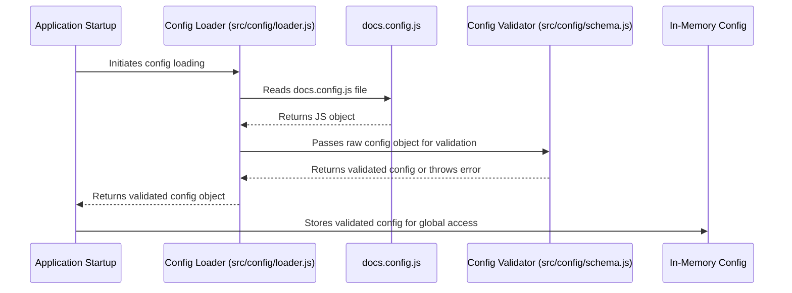

# Chapter 2: Documentation Source Configuration

In the [previous chapter on Documentation Content Structure](chapter_01.md), we established a hierarchical file system layout for organizing documentation content. We learned how directories represent tenants and versions, and MDX files contain the actual content, complemented by `meta.json` files for additional metadata. However, merely having content organized on the file system isn't enough; the system needs to *know* about these tenants, their available versions, and where exactly to find their content. This is where the **Documentation Source Configuration** comes into play.

---

### Problem & Motivation

Imagine building a documentation platform for several distinct products or client teams. Each might have multiple versions of their documentation (e.g., `v1.0`, `v2.0`, `latest`). Without a central manifest, our application would have no idea which tenants exist, which versions are supported for each, or where their respective content directories are located. Hardcoding these details directly into the application logic would quickly become unmanageable as new tenants or versions are added, leading to rigid, unscalable, and error-prone code.

The core problem this abstraction solves is providing a **dynamic, declarative, and scalable way to define and manage all available documentation sources**. It acts as the "source of truth" for the entire documentation system.

Consider a practical use case: A new tenant, "Acme Corp," wants to host documentation for their product "Rocket Launcher" with two versions, `v1.0` and `v2.0`. Simultaneously, an existing tenant, "Example Inc.," adds a new `v2.0` of their "Widget Platform" docs. Manually updating routes or scanning the file system for every change is impractical and inefficient. The Documentation Source Configuration allows us to simply update a single configuration file to reflect these changes, and the application dynamically adapts without requiring code modifications or redeployments.

---

### Core Concept Explanation

The **Documentation Source Configuration** is a central configuration object that serves as the manifest for all documentation available within the `multi-tenant-docs` project. Think of it as the project's **master catalog or directory**. Just as a library catalog lists all available books, their authors, and where to find them, this configuration lists all available tenants, their documentation versions, and the file system paths where their content resides.

It essentially **maps logical identifiers (like tenant and version slugs)** to physical locations on the file system and provides associated metadata (like user-friendly names). This mapping is crucial because it decouples the application's runtime logic from the physical content storage. When a user requests documentation for `acme-corp/v2.0`, the system consults this configuration to determine that `acme-corp` is a valid tenant, `v2.0` is a valid version for it, and the content for this combination can be found at a specific relative path, such as `./docs/acme-corp/v2.0`.

Key terminologies involved are:

*   **`tenantSlug`**: A unique, URL-friendly identifier for a tenant (e.g., `acme-corp`).
*   **`versionSlug`**: A unique, URL-friendly identifier for a documentation version within a tenant (e.g., `v1.0`, `latest`).
*   **`name`**: A human-readable display name for the tenant or version (e.g., "Acme Corporation", "Version 2.0").
*   **`path`**: The relative file system path from a base directory to where the content for that specific tenant/version pair is stored. This path corresponds directly to the hierarchical structure defined in Chapter 1.

By centralizing this information, the configuration enables dynamic routing, content loading, and UI generation for navigation elements, ensuring consistency and manageability across the entire documentation platform.

---

### Practical Usage Examples

Let's illustrate how this configuration is defined. Typically, this would reside in a dedicated file, often named `docs.config.js` or `config.json`, at the root of your documentation content directory.

Here’s a basic `docs.config.js` that declares "Acme Corp" with two versions and "Example Inc." with one version:

```javascript
// docs.config.js
module.exports = {
  tenants: [
    {
      tenantSlug: 'acme-corp',
      name: 'Acme Corporation Docs',
      versions: [
        {
          versionSlug: 'v2.0',
          name: 'Version 2.0 (Latest)',
          path: './docs/acme-corp/v2.0' // Path relative to project root
        },
        {
          versionSlug: 'v1.0',
          name: 'Version 1.0',
          path: './docs/acme-corp/v1.0'
        }
      ]
    },
    {
      tenantSlug: 'example-inc',
      name: 'Example Inc. Platform Docs',
      versions: [
        {
          versionSlug: 'v1.0',
          name: 'Version 1.0',
          path: './docs/example-inc/v1.0'
        }
      ]
    }
  ]
};
```
This configuration defines an array of `tenants`. Each tenant object includes its unique `tenantSlug`, a display `name`, and an array of `versions`. Each version has its own `versionSlug`, `name`, and crucially, a `path` that points to the content directory.

For our "Acme Corp" use case, if we wanted to add a `v3.0` documentation, we would simply update this file:

```javascript
// docs.config.js (updated to include v3.0 for Acme Corp)
module.exports = {
  tenants: [
    {
      tenantSlug: 'acme-corp',
      name: 'Acme Corporation Docs',
      versions: [
        {
          versionSlug: 'v3.0', // New version added!
          name: 'Version 3.0 (Beta)',
          path: './docs/acme-corp/v3.0'
        },
        {
          versionSlug: 'v2.0',
          name: 'Version 2.0 (Latest)',
          path: './docs/acme-corp/v2.0'
        },
        // ... other versions
      ]
    },
    // ... other tenants
  ]
};
```
By modifying this single file, the system instantly becomes aware of the new `v3.0` for "Acme Corp," enabling dynamic routing and display without any changes to the core application logic. The `path` directly corresponds to the file system structure we discussed in Chapter 1.

---

### Internal Implementation Walkthrough

The `multi-tenant-docs` project needs to load, parse, and validate this `docs.config.js` file at application startup or during build time. Let's walk through the typical internal process:

1.  **Configuration Loading:** The application first identifies the location of the `docs.config.js` file (e.g., from a known path or an environment variable). It then uses Node.js's module system (`require()`) or a similar mechanism to load the JavaScript object exported by the file.

    ```javascript
    // src/config/loader.js
    const path = require('path');

    function loadDocumentationConfig() {
      try {
        const configPath = process.env.DOCS_CONFIG_PATH || path.resolve(process.cwd(), 'docs.config.js');
        const config = require(configPath);
        console.log('Documentation config loaded successfully.');
        return config;
      } catch (error) {
        console.error(`Error loading documentation config: ${error.message}`);
        process.exit(1); // Exit if config cannot be loaded
      }
    }

    module.exports = { loadDocumentationConfig };
    ```
    This `loadDocumentationConfig` function attempts to load the configuration file. If the file is not found or malformed, the application exits, indicating a critical setup error.

2.  **Schema Validation:** Once loaded, the raw configuration object needs to be validated against a predefined schema. This step is crucial for ensuring data integrity and preventing runtime errors caused by malformed or incomplete configurations. Tools like Zod or Joi are often used for this.

    ```javascript
    // src/config/schema.js
    const Joi = require('joi');

    const versionSchema = Joi.object({
      versionSlug: Joi.string().alphanum().required(),
      name: Joi.string().min(1).required(),
      path: Joi.string().required() // Path to content on filesystem
    });

    const tenantSchema = Joi.object({
      tenantSlug: Joi.string().alphanum().required(),
      name: Joi.string().min(1).required(),
      versions: Joi.array().items(versionSchema).min(1).required()
    });

    const configSchema = Joi.object({
      tenants: Joi.array().items(tenantSchema).min(1).required()
    });

    function validateConfig(config) {
      const { error } = configSchema.validate(config);
      if (error) {
        throw new Error(`Documentation config validation error: ${error.details.map(d => d.message).join('; ')}`);
      }
      return config;
    }

    module.exports = { validateConfig };
    ```
    The `validateConfig` function checks if the loaded configuration adheres to the defined structure, ensuring all required fields (like `tenantSlug`, `versionSlug`, `path`) are present and correctly formatted.

3.  **In-Memory Representation:** After successful loading and validation, the configuration object is typically stored in memory, making it readily available to other parts of the application. This could be a singleton, a global state, or passed down through context.

The entire process can be visualized as follows:


This sequence ensures that the application operates with a reliable and well-defined set of documentation sources, preventing potential issues before any content is even requested.

---

### System Integration

The **Documentation Source Configuration** is a foundational piece that integrates with several other core abstractions within the `multi-tenant-docs` project:

*   **[Content Loading and Parsing](chapter_03.md)**: The configuration provides the absolute necessity: the `path` for each tenant and version. When the system needs to load content for `acme-corp/v2.0/introduction`, it first consults the configuration to find the base path (`./docs/acme-corp/v2.0`) and then appends the page slug (`/introduction.mdx`) to locate the exact file. Without the configured paths, the content loader wouldn't know where to look.

    ```mermaid
    graph TD
        A[Documentation Source Configuration] --> B{Content Loader};
        B --> C[File System Path (e.g., ./docs/tenant/version)];
        C --> D[MDX Files for Parsing];
    ```

*   **[Multi-Tenant Context Middleware](chapter_04.md)**: This middleware relies heavily on the configuration. It uses the `tenantSlug` and `versionSlug` definitions to determine if a requested URL corresponds to a valid tenant and version combination. It can also inject the list of available tenants and versions into the request context for dynamic UI elements.

*   **[Dynamic Documentation Page Renderer](chapter_05.md)**: While rendering, the renderer might need access to tenant-specific or version-specific metadata (like `name` fields from the config) for displaying page titles or breadcrumbs. It leverages the paths provided by the config, retrieved via the content loader, to present the correct documentation.

*   **[Documentation Navigation and Version UI](chapter_06.md)**: The UI components for switching between tenants and documentation versions are directly driven by the data within this configuration. The `tenantSlug`, `name`, `versionSlug`, and `name` fields populate dropdowns and navigation links, enabling users to easily browse available documentation.

    ```javascript
    // Example: Populating a version dropdown based on config
    import { getAvailableVersionsForTenant } from '../config/utils'; // hypothetical utility

    function VersionSwitcher({ currentTenantSlug }) {
      const availableVersions = getAvailableVersionsForTenant(currentTenantSlug);

      return (
        <select>
          {availableVersions.map(version => (
            <option key={version.versionSlug} value={version.versionSlug}>
              {version.name}
            </option>
          ))}
        </select>
      );
    }
    ```
    This snippet shows how UI components directly consume the structured data from our configuration to render interactive elements.

---

### Best Practices & Tips

*   **Centralized Location:** Always keep your `docs.config.js` or equivalent file in a well-known, accessible location, typically at the root of your documentation content or project.
*   **Clear Naming Conventions:** Use consistent and descriptive `tenantSlug` and `versionSlug` values. These will often appear in URLs, so keep them URL-friendly (lowercase, kebab-case).
*   **Schema Validation:** Implement robust schema validation (as shown in the internal walkthrough) to catch configuration errors early in the development cycle. This prevents runtime crashes and makes debugging easier.
*   **Version Control:** Treat your configuration file like source code. Keep it under version control (Git) to track changes, collaborate, and revert if necessary.
*   **Environment Variables for Base Paths:** For highly flexible setups, you might define a base content directory via an environment variable (`DOCS_CONTENT_BASE_PATH`) and make the `path` values in `docs.config.js` relative to that.
*   **Default Version:** Consider adding a `defaultVersion` property to your tenant schema to automatically redirect users to a stable version if no specific version is requested.
*   **Avoid Redundancy:** Ensure that your configuration perfectly mirrors your file system structure. Any mismatch will lead to content not being found.

---

### Chapter Conclusion

The **Documentation Source Configuration** is the declarative heart of the `multi-tenant-docs` project. It provides a flexible, scalable, and maintainable way to manage the entire landscape of documentation sources. By defining a clear mapping between logical tenant/version identifiers and their physical content paths, it empowers dynamic content loading, routing, and UI generation. This abstraction solves the critical problem of knowing *what* documentation is available and *where* to find it, laying the groundwork for all subsequent content-related operations.

Now that our system knows *which* tenants and versions exist and *where* to find their content on the filesystem, the next logical step is to actually retrieve that content, parse it, and make it ready for display. This leads us directly to the process of **[Content Loading and Parsing](chapter_03.md)**.