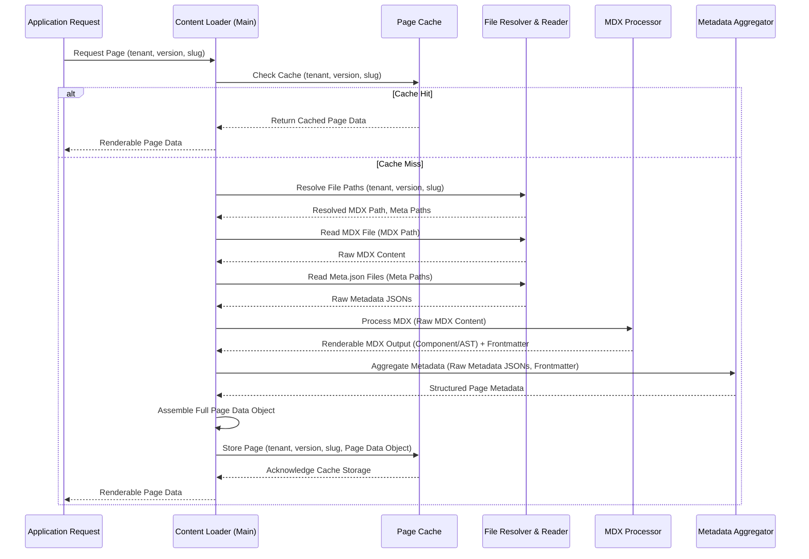
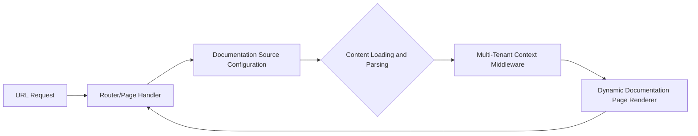

# Chapter 3: Content Loading and Parsing

In the [previous chapter, Documentation Source Configuration](chapter_02.md), we established how our 'multi-tenant-docs' project defines its content sources, linking tenants and versions to their respective filesystem paths. This configuration provides the blueprint for where to *find* documentation. However, a blueprint alone isn't enough to build a house; we need the tools and processes to transform raw materials into usable components. This is precisely the role of the Content Loading and Parsing abstraction.

---

### Problem & Motivation

Imagine you're building a website that needs to display documentation for various products, each with multiple versions. Your content lives as static MDX files (`.mdx`) and metadata files (`meta.json`) organized in a specific directory structure on your server. When a user requests `/product-a/v2/guides/installation`, your application receives this URL. The immediate challenge is twofold: first, how do you locate the correct `installation.mdx` file corresponding to 'product-a' and 'v2' within your filesystem? Second, once you find it, how do you transform that raw text content, which might contain Markdown, JSX, and frontmatter, into something that your web application can actually render as a dynamic HTML page?

This abstraction solves these critical problems by acting as the crucial bridge between the static filesystem and the dynamic web application. It's essential because raw MDX files are just text; they need to be read, interpreted, and processed into a structured data format that includes both the renderable content and its associated metadata (like title, description, order in navigation). Without this layer, our application wouldn't be able to access or display any of the valuable documentation content defined in our source configurations.

Our guiding use case for this chapter will be: a user navigates to a specific documentation page, and the system needs to efficiently find, load, and prepare that page's content for display, including its title and body.

---

### Core Concept Explanation

The Content Loading and Parsing abstraction is the engine that brings our documentation files to life. At its core, it's a set of functions and processes designed to take a logical path (like `tenantA/v1/guides/getting-started`) and produce a fully prepared, renderable documentation page object.

This involves several key steps and concepts. First, **File Resolution** maps the logical tenant/version/page path to its physical location on the filesystem. This relies heavily on the `basePath` information provided by the [Documentation Source Configuration](chapter_02.md). Once located, the system performs **Content Loading**, which simply means reading the raw text from the MDX file and any accompanying `meta.json` files from disk.

Next comes **MDX Parsing**. MDX files are powerful because they allow Markdown and JSX components to coexist. To render this in a web browser, the MDX needs to be transformed. This often involves converting the Markdown into an Abstract Syntax Tree (AST), processing any JSX components, and ultimately compiling it into a format that can be dynamically rendered by a React or similar frontend framework. Simultaneously, **Metadata Extraction** processes any YAML frontmatter embedded within the MDX file (e.g., `--- title: My Page ---`) and merges it with data from `meta.json` files found in the content directories. This combined metadata provides essential information like the page's title, description, navigation order, and whether it should be hidden from indices.

The final output of this abstraction is a structured **Page Data Object**. This object typically contains the renderable MDX content (e.g., a React component or an HTML string), extracted frontmatter, and any other relevant metadata, all ready for consumption by downstream rendering components. This entire process is often optimized with caching mechanisms to prevent redundant file reads and parsing operations, significantly improving performance for frequently accessed pages.

---

### Practical Usage Examples

Let's look at how this abstraction would be used to retrieve and prepare content for our application, focusing on our motivating use case: loading a specific documentation page.

#### Example 1: Loading a Single Documentation Page

To load a single documentation page based on a tenant, version, and page slug, we would typically interact with a `contentLoader` module that encapsulates the parsing logic.

```javascript
// src/lib/content-loader.js (Conceptual module)

/**
 * Loads and parses a single documentation page.
 * @param {string} tenantSlug - The slug of the tenant (e.g., 'tenantA').
 * @param {string} versionSlug - The slug of the version (e.g., 'v1').
 * @param {string} pagePath - The relative path to the page (e.g., 'guides/getting-started').
 * @returns {Promise<Object|null>} A promise resolving to the parsed page data or null if not found.
 */
export async function loadDocumentationPage(tenantSlug, versionSlug, pagePath) {
  // In a real implementation, this would determine the full file path,
  // read the file, parse MDX, extract metadata, and return a structured object.
  console.log(`Attempting to load: /${tenantSlug}/${versionSlug}/${pagePath}.mdx`);
  
  // Simulate fetching and parsing
  const rawContent = `---
title: Getting Started with Tenant A
description: A comprehensive guide to kickstarting your experience.
---
# Welcome to Tenant A!
This is the **getting started** guide for version \`${versionSlug}\`.`;

  const metaData = {
    title: "Getting Started with Tenant A",
    description: "A comprehensive guide to kickstarting your experience.",
    // parsed MDX content would go here, e.g., as a React component or HTML
    content: `<h1>Welcome to Tenant A!</h1><p>This is the <strong>getting started</strong> guide for version <code>${versionSlug}</code>.</p>`
  };

  return metaData; // Return the parsed page data
}
```

This conceptual `loadDocumentationPage` function acts as the public interface for fetching a specific document. It hides the complexity of file system access, MDX parsing, and metadata extraction behind a simple call.

```javascript
// Usage example in a page component or API route
import { loadDocumentationPage } from '../lib/content-loader';

async function getPageData(params) {
  const { tenant, version, slug } = params; // from URL path
  const pageData = await loadDocumentationPage(tenant, version, slug.join('/'));

  if (!pageData) {
    console.warn(`Page not found for ${tenant}/${version}/${slug.join('/')}`);
    return { notFound: true };
  }
  
  return {
    props: {
      title: pageData.title,
      content: pageData.content // The renderable MDX content
    }
  };
}

// Example invocation:
// getPageData({ tenant: 'tenantA', version: 'v1', slug: ['guides', 'getting-started'] })
// Expected Output (conceptual, for pageData.title): "Getting Started with Tenant A"
// Expected Output (conceptual, for pageData.content): Renderable HTML/React component
```
After the `loadDocumentationPage` function completes, `pageData` will contain structured information about the requested page, including its title and the processed content, making it ready to be passed to a rendering component.

#### Example 2: Loading Navigation Structure

Often, we need to load not just a single page, but a list of pages within a directory to build navigation menus. This also leverages the content loading and parsing capabilities, but focuses on metadata.

```javascript
// src/lib/content-loader.js (Conceptual, added to previous module)

/**
 * Loads navigation items for a given path, typically using meta.json.
 * @param {string} tenantSlug - The slug of the tenant.
 * @param {string} versionSlug - The slug of the version.
 * @param {string} relativePath - The relative path to the directory (e.g., 'guides').
 * @returns {Promise<Array<Object>>} A promise resolving to an array of navigation items.
 */
export async function loadNavigationItems(tenantSlug, versionSlug, relativePath = '') {
  console.log(`Loading navigation for: /${tenantSlug}/${versionSlug}/${relativePath}`);
  
  // In a real implementation, this would read meta.json files
  // and content files within the specified directory.
  const mockNavData = {
    '': [
      { title: 'Overview', slug: 'overview', type: 'page' },
      { title: 'Guides', slug: 'guides', type: 'folder' },
      { title: 'API Reference', slug: 'api-reference', type: 'page' },
    ],
    'guides': [
      { title: 'Getting Started', slug: 'guides/getting-started', type: 'page' },
      { title: 'Installation', slug: 'guides/installation', type: 'page' },
    ]
  };

  const navItems = mockNavData[relativePath] || [];
  return navItems;
}
```

This `loadNavigationItems` function would internally read the `meta.json` file in the specified directory to determine the order and structure of child pages and sub-folders, without necessarily parsing the full MDX content of each.

```javascript
// Usage example in a navigation component or API route
import { loadNavigationItems } from '../lib/content-loader';

async function getNavData(tenant, version, currentPath = '') {
  const navItems = await loadNavigationItems(tenant, version, currentPath);
  return {
    props: {
      navigation: navItems
    }
  };
}

// Example invocation:
// getNavData('tenantA', 'v1', 'guides')
// Expected Output (conceptual, for navigation array):
// [ { title: 'Getting Started', slug: 'guides/getting-started', type: 'page' }, ... ]
```
These examples demonstrate how the content loading and parsing abstraction provides the foundational data necessary for both displaying individual pages and constructing navigational elements across our multi-tenant documentation site.

---

### Internal Implementation Walkthrough

The "Content Loading and Parsing" abstraction is typically implemented as a series of coordinated modules, each responsible for a specific task. Let's trace the journey of a documentation page request through these internal mechanisms.

#### High-Level Flow:

1.  **Request Initiation**: A request comes in, specifying a tenant, version, and page path (e.g., `tenantA/v1/overview`).
2.  **Path Resolution**: The system uses the [Documentation Source Configuration](chapter_02.md) to determine the base filesystem path for `tenantA` and `v1`. It then constructs the full path to `overview.mdx` and any `meta.json` in the same or parent directories.
3.  **File Reading**: The raw content of `overview.mdx` and `meta.json` (if present) are read directly from the filesystem.
4.  **Metadata Extraction**: Frontmatter from the MDX file and data from `meta.json` are parsed and combined. This includes titles, descriptions, navigation order, etc.
5.  **MDX Transformation**: The raw MDX content is processed. This is where Markdown is converted to HTML, and any embedded JSX components are prepared for rendering. Libraries like `remark` and `rehype` with their extensive plugin ecosystems are commonly used here.
6.  **Page Object Assembly**: All extracted metadata and the transformed content are bundled into a single, comprehensive page data object.
7.  **Caching (Optional but Recommended)**: The fully processed page object is stored in an in-memory or disk-based cache, keyed by its tenant, version, and page path. This prevents redundant processing for subsequent requests.
8.  **Return Value**: The assembled page data object is returned to the caller, ready for rendering.

#### Conceptual Modules:

*   **`fs-resolver.js`**: Given a logical path (tenant/version/page), this module constructs the absolute filesystem path to the MDX file and its related `meta.json` files.
*   **`file-reader.js`**: A utility for securely reading file contents from the resolved filesystem paths.
*   **`mdx-processor.js`**: Contains the logic for parsing MDX, extracting frontmatter, and transforming the content into a renderable format (e.g., a React component string or an AST). It would integrate tools like `next-mdx-remote` or similar for server-side MDX compilation.
*   **`metadata-aggregator.js`**: Responsible for reading and merging metadata from `meta.json` files at various levels of the directory hierarchy, and combining it with frontmatter from the MDX file.
*   **`page-cache.js`**: An in-memory cache that stores the fully processed page objects. This prevents re-reading and re-parsing for common requests, significantly boosting performance.

#### Internal Workflow with Sequence Diagram:

The following diagram illustrates a typical sequence of operations when a request for a documentation page is received and processed internally:



This sequence highlights the cooperative nature of these modules. The `Content Loader` orchestrates the entire process, delegating specific tasks to specialized modules like the `MDX Processor` and `Metadata Aggregator`. Caching plays a pivotal role in ensuring that once a page has been processed, subsequent requests can be served much faster.

---

### System Integration

The Content Loading and Parsing abstraction serves as a foundational data provider within the 'multi-tenant-docs' project, integrating closely with several other core components.

1.  **Input from [Documentation Source Configuration](chapter_02.md)**:
    This abstraction heavily relies on the configuration defined in Chapter 2. The `Documentation Source Configuration` provides the mapping from tenant/version slugs (e.g., `tenantA/v1`) to their physical `basePath` on the filesystem (e.g., `content/tenantA/v1`). Without this, the Content Loader wouldn't know where to begin searching for content files. It uses this base path to resolve the full file paths for MDX content and `meta.json` files.

    ```mermaid
    graph TD
        A[Documentation Source Configuration] --> B{Content Loading and Parsing};
        B --> C[File System Access];
        A -- Provides base paths --> B;
    ```

2.  **Output to [Multi-Tenant Context Middleware](chapter_04.md)**:
    The processed page data (renderable content, metadata) is consumed by the `Multi-Tenant Context Middleware`. This middleware's responsibility is to make the currently active tenant, version, and documentation content available globally or to specific routes within the application. It acts as a bridge, taking the structured output from Content Loading and Parsing and injecting it into the request context, where it can be easily accessed by rendering components.

    ```mermaid
    graph TD
        B{Content Loading and Parsing} --> D[Multi-Tenant Context Middleware];
        B -- Provides parsed page data --> D;
    ```

3.  **Providing Data for [Dynamic Documentation Page Renderer](chapter_05.md)**:
    Ultimately, the primary consumer of the output from this abstraction is the `Dynamic Documentation Page Renderer`. This renderer takes the `renderable MDX output` (e.g., compiled React components or HTML string) and the associated `metadata` from the parsed page object and displays it to the user. The Content Loader effectively prepares all the ingredients for the renderer to bake the final documentation page.

    ```mermaid
    graph TD
        B{Content Loading and Parsing} --> E[Dynamic Documentation Page Renderer];
        B -- Provides renderable content & metadata --> E;
    ```

#### Data Flow Summary:

The flow of information typically starts with the configuration, which informs the content loader. The content loader then prepares the documentation content, which is passed to the middleware to enrich the application context, and finally consumed by the renderer to display the page.



This integrated approach ensures a clear separation of concerns: configuration defines sources, content loading prepares data, middleware provides context, and the renderer displays it.

---

### Best Practices & Tips

To ensure that the Content Loading and Parsing abstraction is robust, performant, and maintainable, consider these best practices:

*   **Implement Robust Caching**: File I/O and MDX parsing are expensive operations. Implement an efficient caching strategy (e.g., in-memory cache, Redis) for parsed content. Cache invalidation strategies are crucial; ensure content is re-parsed when source files change (especially in development mode or via webhooks in production).
*   **Schema Validation for Metadata**: Validate the structure of `meta.json` files and frontmatter using a schema (e.g., JSON Schema, Zod). This prevents runtime errors due to malformed metadata and ensures consistency across documentation.
*   **Error Handling and Fallbacks**: What happens if a file is not found, or an MDX file contains syntax errors? Implement graceful error handling, such as returning a `null` page object or rendering a "Page Not Found" component. Provide informative error messages for developers.
*   **Asynchronous Operations**: All file system operations should be asynchronous to prevent blocking the main thread, crucial for server performance.
*   **Pluggable MDX Processing**: Use an MDX parsing library that supports plugins (e.g., `remark`, `rehype`). This allows for custom transformations, syntax highlighting, image optimization, and extensibility without modifying the core parsing logic.
*   **Development Mode Watchers**: For development, implement a file watcher that triggers re-parsing and cache invalidation when `mdx` or `meta.json` files are modified. This provides an excellent developer experience with hot-reloading documentation changes.
*   **Content ID/Slug Generation**: Ensure a consistent and unique way to generate slugs (URL-friendly identifiers) for each page. This might involve sanitizing filenames or using slugs defined in frontmatter/metadata.
*   **Version and Tenant Scoping**: Always ensure that content loading operations are explicitly scoped by tenant and version. This prevents accidental cross-tenant content exposure and ensures correct content retrieval.
*   **Security Considerations**: Be mindful of path traversal vulnerabilities when constructing file paths from user-provided URLs. Always sanitize and validate input to prevent unauthorized file access.

---

### Chapter Conclusion

In this chapter, we've explored the Content Loading and Parsing abstraction, a pivotal component of the 'multi-tenant-docs' project. We've understood its vital role in transforming raw MDX files and metadata into structured, renderable page data. From resolving file paths and reading content to parsing MDX and aggregating metadata, this layer acts as the primary data pipeline for our documentation.

We examined practical examples of how to load individual pages and navigation structures, and delved into the internal mechanisms that orchestrate this process, including the crucial role of caching. Finally, we saw how this abstraction seamlessly integrates with the configuration, middleware, and rendering layers, providing the foundation for dynamic content display. By adhering to best practices, we can ensure this layer is performant, reliable, and extensible.

With our content now loaded and parsed into a usable format, the next logical step is to make this content available throughout our application within the correct tenant and version context. This will be the focus of the next chapter: [Multi-Tenant Context Middleware](chapter_04.md).