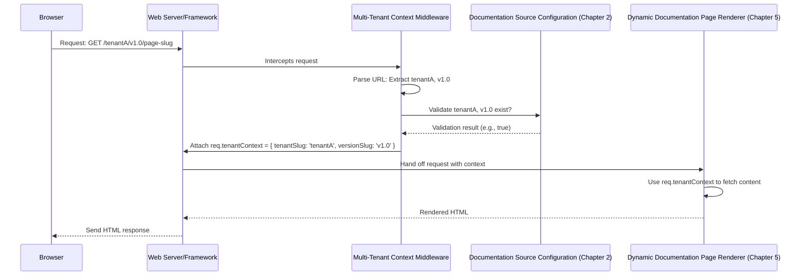

# Chapter 4: Multi-Tenant Context Middleware

Having explored how our documentation content is structured on the filesystem in [Documentation Content Structure](chapter_01.md) and how we define its availability via the [Documentation Source Configuration](chapter_02.md), we then moved on to the crucial task of [Content Loading and Parsing](chapter_03.md) to make that content ready for display. However, processing all content is only half the battle. We still need a way to dynamically determine *which* specific piece of documentation to show a user when they visit a particular URL. This is where the Multi-Tenant Context Middleware comes into play, acting as the intelligent traffic controller for our documentation system.

---

### Problem & Motivation

In a multi-tenant documentation system, the core challenge is serving the correct content to the right user at the right time. Imagine a scenario where you host documentation for `tenantA` and `tenantB`, each with multiple versions like `v1.0` and `v2.0`. When a user navigates to a URL like `/tenantA/v1.0/getting-started`, how does the system know to fetch `tenantA`'s `v1.0` content and not `tenantB`'s? Without a mechanism to interpret the incoming URL and extract this vital information, every request would be a guess, leading to incorrect content display or broken pages.

The problem this abstraction solves is bridging the gap between a generic incoming web request and the specific data required to fulfill it. It ensures that the subsequent steps in our rendering pipeline, such as fetching and rendering the MDX content, operate within the correct tenant and version scope. This capability is fundamental for a system designed to serve dynamic, versioned, and tenant-specific documentation.

Consider a practical use case: A user clicks a link that leads to `/awesome-corp/2.1/api-reference/endpoints`. Our system needs to quickly identify that `awesome-corp` is the active tenant and `2.1` is the requested version. This extracted context then guides the rest of the content retrieval and rendering process, preventing a jumbled mess of documentation.

### Core Concept Explanation

The Multi-Tenant Context Middleware is a specialized software component that sits between an incoming web request and the main application logic. Its primary role is to intercept HTTP requests and analyze their URL paths to automatically identify the active tenant and its desired documentation version. Once identified, this crucial contextual information is then attached to the request object, making it readily available for all subsequent processing steps.

Think of this middleware as a highly efficient receptionist at a large office building. When you arrive, the receptionist (middleware) checks your appointment details (the URL path), confirms which company (tenant) and which department (version) you're visiting, and then gives you a visitor's badge (sets the context in the request object). This badge ensures that as you move through the building, everyone knows where you're supposed to be and what information you need.

The core mechanism involves parsing specific segments of the URL path. Our project expects a pattern where the first segment after the base path is typically the `tenantSlug` and the second is the `versionSlug`. The middleware extracts these slugs, performs a quick validation against our predefined [Documentation Source Configuration](chapter_02.md) to ensure they are valid, and then makes them accessible. This process is entirely automatic, dynamic, and fundamental for serving tenant-specific content without hardcoding tenant or version information into the rendering logic.

---

### Practical Usage Examples

Let's illustrate how such a middleware might be implemented in a common web framework context, like a Next.js or Express.js application. Our goal is to take an incoming request and enrich it with `tenantSlug` and `versionSlug`.

```javascript
// pages/api/docs/[...slug].js or within a custom server middleware
// A simplified middleware function structure

function multiTenantContextMiddleware(req, res, next) {
  const pathParts = req.url.split('/').filter(Boolean); // e.g., ['awesome-corp', '2.1', 'api-reference', 'endpoints']

  // Assuming URL structure like /<tenantSlug>/<versionSlug>/...
  const tenantSlug = pathParts[0];
  const versionSlug = pathParts[1];

  if (tenantSlug && versionSlug) {
    // Attach the context to the request object for later use
    req.tenantContext = {
      tenantSlug: tenantSlug,
      versionSlug: versionSlug,
    };
  } else {
    // Handle cases where slugs are missing, e.g., redirect or 404
    req.tenantContext = null;
  }

  next(); // Pass control to the next handler in the chain
}
```
This code snippet shows a basic middleware function. It splits the URL path, extracts the first two significant parts as `tenantSlug` and `versionSlug`, and then attaches them to a `req.tenantContext` object. The `next()` call ensures that the request continues its journey through the server.

Let's see an example of how this context would be available:

**Input URL:** `/awesome-corp/2.1/api-reference/endpoints`

```javascript
// In a subsequent route handler or component
function DocumentationPageHandler(req, res) {
  if (req.tenantContext) {
    console.log(`Active Tenant: ${req.tenantContext.tenantSlug}`);
    console.log(`Active Version: ${req.tenantContext.versionSlug}`);
    // Now you can use these values to fetch content
  } else {
    console.log('Tenant context not found. Handle accordingly.');
  }
  // ... render page based on context ...
}

// Expected console output if the URL was /awesome-corp/2.1/...
// Active Tenant: awesome-corp
// Active Version: 2.1
```
After the `multiTenantContextMiddleware` has run, any subsequent part of your application that receives the `req` object will have access to `req.tenantContext.tenantSlug` and `req.tenantContext.versionSlug`. This is the key mechanism for providing the necessary context without manual parsing in every single component.

---

### Internal Implementation Walkthrough

The internal workings of the Multi-Tenant Context Middleware involve a precise sequence of steps to ensure accurate context identification:

1.  **Request Interception:** The web server or framework directs the incoming HTTP request to this middleware as part of its processing pipeline.
2.  **URL Path Parsing:** The middleware accesses the full URL path (`req.url`). It then carefully parses this path to extract the segments designated for the tenant and version slugs. Typically, this involves splitting the path string by `/` and identifying the relevant parts based on a predefined URL structure (e.g., `/<tenantSlug>/<versionSlug>/<pagePath>`).
3.  **Slug Extraction:** From the parsed segments, the `tenantSlug` and `versionSlug` are isolated. For instance, in `/my-docs/1.0/getting-started`, `my-docs` would be the `tenantSlug` and `1.0` would be the `versionSlug`.
4.  **Configuration Validation:** A crucial step is to validate the extracted `tenantSlug` and `versionSlug` against the project's [Documentation Source Configuration](chapter_02.md). This ensures that the requested tenant and version actually exist and are configured within our system. If they don't, the middleware can gracefully handle the error, perhaps by redirecting to a default page or serving a 404 "Not Found" error.
    ```javascript
    // Example validation against a config object
    import { docConfig } from '../config/documentation-source-config'; // Refers to Chapter 2 config

    function validateTenantAndVersion(tenantSlug, versionSlug) {
      const tenant = docConfig.tenants.find(t => t.slug === tenantSlug);
      if (!tenant) return false;

      const version = tenant.versions.find(v => v.slug === versionSlug);
      return !!version; // Return true if version exists, false otherwise
    }
    ```
5.  **Context Attachment:** If the slugs are valid, the middleware constructs a context object (e.g., `{ tenantSlug, versionSlug }`) and attaches it to the request object (e.g., `req.tenantContext` or `res.locals.context`). This makes the context accessible to all subsequent route handlers and rendering components.
6.  **Pass Control:** Finally, the middleware invokes the `next()` function, passing control to the next middleware or the ultimate route handler responsible for rendering the documentation page.

Here's a sequence diagram illustrating this flow:



---

### System Integration

The Multi-Tenant Context Middleware plays a pivotal role in connecting various parts of the `multi-tenant-docs` project.

-   **Input:** Its primary input is the raw `URL` path of an incoming HTTP request.
-   **Output:** Its primary output is an enriched request object, specifically `req.tenantContext` (or a similar construct), containing the identified `tenantSlug` and `versionSlug`.

Here's how it integrates with other key abstractions:

1.  **Dependency on [Documentation Source Configuration](chapter_02.md):** The middleware relies heavily on the configuration defined in Chapter 2. It uses this configuration to validate whether the extracted `tenantSlug` and `versionSlug` are legitimate and available within the system. Without a valid configuration, the middleware cannot correctly identify or confirm the requested content scope.
    ```mermaid
    graph LR
        A[Incoming URL Path] --> B(Multi-Tenant Context Middleware)
        B --> C[Documentation Source Configuration (Chapter 2)]
        C --> B
        B --> D[Enriched Request Object (req.tenantContext)]
    ```

2.  **Provider for [Content Loading and Parsing](chapter_03.md):** Once the `tenantSlug` and `versionSlug` are established by the middleware, they become the essential parameters for the content loading and parsing abstraction. The functions described in Chapter 3, which are responsible for reading MDX files and their metadata, will consume this context to retrieve the *specific* documentation content for the identified tenant and version.
    ```mermaid
    graph LR
        A[Enriched Request Object (req.tenantContext)] --> B(Content Loading and Parsing (Chapter 3))
        B --> C[Specific MDX Content & Metadata]
    ```

3.  **Pre-requisite for [Dynamic Documentation Page Renderer](chapter_05.md):** The most direct consumer of the middleware's output is the page renderer. With the `tenantContext` readily available in the request, the renderer (which we'll explore in the next chapter) can confidently fetch the correct content, pass it to the MDX rendering engine, and compose the final documentation page. Without this context, the renderer would have no way of knowing which content to display.

This clear flow ensures that each part of the system has the necessary information, making the entire documentation serving pipeline robust and coherent.

---

### Best Practices & Tips

To ensure the Multi-Tenant Context Middleware operates efficiently and reliably, consider these best practices:

*   **Robust URL Parsing:** Anticipate variations in URL structures. While a common pattern is `/<tenant>/<version>/...`, some systems might use `/<version>/<tenant>/...` or even query parameters. Design the parsing logic to be flexible or strictly enforce a single pattern.
*   **Comprehensive Validation:** Always validate extracted slugs against your [Documentation Source Configuration](chapter_02.md). This prevents serving incorrect content or exposing internal configuration details through error messages. Invalid slugs should result in a clear 404 error or a redirect to a default/homepage.
*   **Error Handling and Fallbacks:** If a tenant or version is not found, define a clear fallback strategy. This could be rendering a generic "Documentation Not Found" page, redirecting to the tenant's latest available version, or redirecting to the main documentation homepage.
*   **Performance Considerations:** URL parsing is generally fast, but if your middleware performs complex lookups or database queries for validation, consider caching the results. However, for validation against a static `documentation-source-config.json` file, performance overhead is minimal.
*   **Clear Context Naming:** Name the context object property on the request (e.g., `req.tenantContext`) clearly and consistently. This improves code readability and maintainability for other developers.
*   **Test Thoroughly:** Write unit and integration tests for your middleware. Test valid URLs, invalid tenant slugs, invalid version slugs, missing slugs, and edge cases to ensure it behaves as expected under all conditions.

---

### Chapter Conclusion

This chapter has demystified the crucial role of the Multi-Tenant Context Middleware. We've seen how this intelligent intermediary intercepts incoming requests, parses their URLs, and, like a diligent usher, identifies the specific tenant and documentation version a user intends to access. By enriching the request object with this vital context, the middleware acts as the linchpin that connects a raw web request to our system's ability to fetch and present the correct documentation content.

We've covered its problem-solving capabilities, core concepts, practical usage with concise code examples, and a detailed internal walkthrough, including a visual representation of its process flow. Understanding its integration points with the [Documentation Source Configuration](chapter_02.md) and [Content Loading and Parsing](chapter_03.md) highlights its central position in our project's architecture.

With the context for the active tenant and version now firmly established, our system is ready for the next logical step: taking this context and using it to render the actual documentation page. In the upcoming [Dynamic Documentation Page Renderer](chapter_05.md) chapter, we will explore how this extracted context drives the rendering pipeline to dynamically generate interactive and accurate documentation pages.