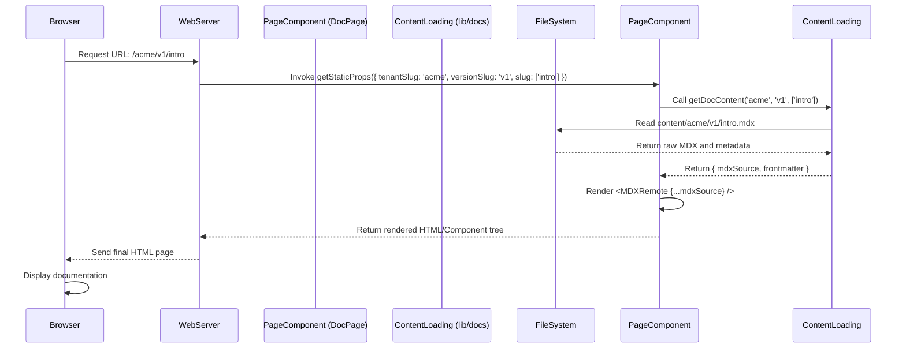

# Chapter 5: Dynamic Documentation Page Renderer

Our journey through the `multi-tenant-docs` project has so far established a robust foundation. We've defined how documentation content is structured on the filesystem ([Documentation Content Structure](chapter_01.md)), configured our tenants and versions ([Documentation Source Configuration](chapter_02.md)), and implemented the logic to load and parse that content ([Content Loading and Parsing](chapter_03.md)). Most recently, the [Multi-Tenant Context Middleware](chapter_04.md) ensured that for any incoming request, we can correctly identify the active tenant and its documentation version. Now, with all this context prepared, the next crucial step is to *actually display* the correct documentation page to the user.

---

### Problem & Motivation

Imagine a user navigating to a specific documentation page, such as `/acme/v2/guides/getting-started`. By this point, our system knows that `acme` is the tenant, `v2` is the version, and `guides/getting-started` is the relative path to the content within that tenant and version. However, without a dedicated mechanism, this resolved context remains purely internal. The core challenge is: how do we translate this resolved URL context into a rendered webpage containing the corresponding MDX documentation?

The problem this chapter addresses is the need for a generic, flexible, and dynamic page component capable of rendering *any* documentation page given the resolved tenant, version, and content path. Without this, the entire content loading and context resolution pipeline would be incomplete, as there would be no visible output for the user. It's the critical "last mile" that brings the documentation content to life in the user's browser, providing the actual textual and interactive elements they came to see.

---

### Core Concept Explanation

The **Dynamic Documentation Page Renderer** is the primary UI component responsible for fetching and presenting the final processed documentation content. Think of it as the display screen for our entire documentation system. It doesn't just display static content; it's *dynamic* because it adapts its output based on the URL-derived context (tenant, version, and page slug).

At its heart, this component acts as a bridge between the data layer (the parsed MDX content) and the presentation layer (the user interface). It uses the information extracted by the [Multi-Tenant Context Middleware](chapter_04.md) – specifically, the tenant slug, version slug, and the remaining path segments that constitute the page slug – to request the corresponding MDX content. Once the content, often in a processed format ready for rendering, is retrieved from the [Content Loading and Parsing](chapter_03.md) abstraction, the renderer component takes over, converting that MDX into interactive HTML.

This abstraction typically manifests as a "catch-all" route in modern web frameworks (like `pages/[tenantSlug]/[versionSlug]/[...slug].tsx` in Next.js). This allows a single page component to handle an infinite number of documentation pages without needing to define a route for each one manually. It leverages the framework's data-fetching capabilities to retrieve content at build time (for static sites) or request time (for server-rendered pages), ensuring both performance and flexibility.

---

### Practical Usage Examples

Let's illustrate how a dynamic page renderer, often built using a framework like Next.js, would fetch and display content. We'll use a `[...slug].tsx` file which catches all routes dynamically.

First, we need to define the paths that our documentation pages will cover. This is typically done using `getStaticPaths` for static site generation.

```typescript
// pages/[tenantSlug]/[versionSlug]/[...slug].tsx

import { GetStaticProps, GetStaticPaths } from 'next';
import { getDocPaths, getDocContent } from '../../../lib/docs'; // Assume this is from Chapter 3

export const getStaticPaths: GetStaticPaths = async () => {
  // getDocPaths would traverse the filesystem based on our configuration
  // to find all available documentation pages across all tenants/versions.
  const paths = await getDocPaths();

  return {
    paths, // e.g., [{ params: { tenantSlug: 'acme', versionSlug: 'v1', slug: ['getting-started'] } }]
    fallback: 'blocking', // or false, or true based on requirements
  };
};
```
*Explanation*: The `getStaticPaths` function tells Next.js which documentation URLs should be pre-rendered at build time. It uses a helper function, `getDocPaths` (conceptualized from [Content Loading and Parsing](chapter_03.md)), to gather all possible tenant, version, and page slug combinations. `fallback: 'blocking'` means if a path isn't pre-rendered, the server will try to generate it on demand.

Next, we fetch the actual content for a specific path using `getStaticProps`.

```typescript
// pages/[tenantSlug]/[versionSlug]/[...slug].tsx (continued)

export const getStaticProps: GetStaticProps = async ({ params }) => {
  const tenantSlug = params?.tenantSlug as string;
  const versionSlug = params?.versionSlug as string;
  const pageSlug = params?.slug as string[]; // e.g., ['guides', 'getting-started']

  try {
    // getDocContent fetches MDX source and frontmatter based on the slugs
    const { mdxSource, frontmatter } = await getDocContent(
      tenantSlug,
      versionSlug,
      pageSlug
    );

    return {
      props: {
        mdxSource,
        frontmatter,
      },
      revalidate: 60, // Re-generate page every 60 seconds (ISR)
    };
  } catch (error) {
    console.error('Error fetching doc content:', error);
    return { notFound: true }; // If content not found, return 404
  }
};
```
*Explanation*: `getStaticProps` is executed for each path returned by `getStaticPaths`. It receives the `params` from the URL, such as `tenantSlug`, `versionSlug`, and `pageSlug`. It then uses `getDocContent` (another conceptual helper from [Content Loading and Parsing](chapter_03.md)) to retrieve the processed MDX content and any associated metadata (frontmatter). This data is then passed as `props` to our React component.

Finally, the React component uses these `props` to render the documentation page.

```tsx
// pages/[tenantSlug]/[versionSlug]/[...slug].tsx (continued)

import { MDXRemote } from 'next-mdx-remote'; // Assumed MDX rendering library

interface DocPageProps {
  mdxSource: any; // Typically a serializable form of MDX content
  frontmatter: Record<string, any>;
}

const DocPage: React.FC<DocPageProps> = ({ mdxSource, frontmatter }) => {
  return (
    <div className="doc-container">
      <h1>{frontmatter.title}</h1>
      {/* MDXRemote takes the processed MDX source and renders it */}
      <MDXRemote {...mdxSource} components={{ /* custom components */ }} />
    </div>
  );
};

export default DocPage;
```
*Explanation*: The `DocPage` React component receives the `mdxSource` and `frontmatter` as props. It uses an MDX rendering library (like `next-mdx-remote`) to transform the `mdxSource` into actual HTML elements, displaying the documentation content. The `frontmatter.title` is used to set the page's main heading, demonstrating how metadata can be incorporated.

---

### Internal Implementation Walkthrough

The internal workings of the Dynamic Documentation Page Renderer primarily revolve around the data flow and transformation within a server-side rendering (SSR) or static site generation (SSG) context. Let's trace the journey of a request for `/acme/v1/introduction`:

1.  **Request Reception**: The web server (e.g., Next.js server) receives the URL `/acme/v1/introduction`.
2.  **Route Matching**: The framework matches this URL against the dynamic route `pages/[tenantSlug]/[versionSlug]/[...slug].tsx`. It extracts `tenantSlug: 'acme'`, `versionSlug: 'v1'`, and `slug: ['introduction']`.
3.  **Data Fetching Execution**:
    *   If `getStaticPaths` is used, the system checks if a page for `/acme/v1/introduction` was pre-generated.
    *   Regardless of pre-generation, `getStaticProps` (or `getServerSideProps` for fully dynamic content) is invoked with these extracted parameters.
4.  **Content Retrieval (Interaction with Chapter 3)**:
    *   Inside `getStaticProps`, a call is made to a utility function, typically from the [Content Loading and Parsing](chapter_03.md) layer, like `getDocContent('acme', 'v1', ['introduction'])`.
    *   This function uses the provided tenant, version, and page slug to locate the corresponding MDX file (e.g., `content/acme/v1/introduction.mdx`).
    *   It reads the MDX file, extracts frontmatter, and processes the MDX source into a serializable format suitable for rendering (e.g., a compiled MDX representation).
    *   The processed `mdxSource` and `frontmatter` are returned.
5.  **Page Component Props**: The `mdxSource` and `frontmatter` are then passed as `props` to the `DocPage` React component.
6.  **MDX Rendering**:
    *   The `DocPage` component receives these props.
    *   It utilizes an MDX rendering library (e.g., `MDXRemote` from `next-mdx-remote`) to transform the `mdxSource` into a tree of React components or plain HTML.
    *   During this process, any custom components defined within the MDX file (e.g., `<Button>Click me</Button>`) are resolved and rendered.
7.  **Final HTML Generation**: The React component tree is rendered into a complete HTML string (on the server for SSR/SSG).
8.  **Client-Side Hydration**: This HTML is sent to the browser. On the client, React "hydrates" the static HTML, making it interactive.

Here's a simplified sequence diagram to visualize this process:



---

### System Integration

The **Dynamic Documentation Page Renderer** sits at the culmination of several previous abstractions, acting as the final consumer of processed data and resolved context.

*   **Dependency on [Multi-Tenant Context Middleware](chapter_04.md)**: While not directly calling the middleware in the code example above (as Next.js `params` implicitly provide the context), the *logic* of how the `tenantSlug` and `versionSlug` are extracted from the URL is fundamentally handled by the principles established in the context middleware. The middleware ensures that these slugs are correctly parsed and available to the page component.
*   **Interaction with [Content Loading and Parsing](chapter_03.md)**: This is a direct and critical dependency. The renderer explicitly calls functions like `getDocContent` from the content loading abstraction. It relies on this layer to provide the MDX content in a pre-processed, renderable format, along with its associated metadata. Without the content loading, the renderer would have nothing to display.
*   **Output to [Documentation Navigation and Version UI](chapter_06.md)**: The `frontmatter` (metadata like `title`, `order`, etc.) fetched by the renderer is often consumed by the navigation components. For example, the current page's title is used for the `<title>` tag in the HTML head, and its slug is used to highlight the active item in a sidebar navigation, which is covered in the next chapter.

The renderer is essentially the "view" layer that brings together the "model" (content from Chapter 3) and the "controller" (context resolution from Chapter 4) into a cohesive user experience.

---

### Best Practices & Tips

*   **Leverage Framework Data Fetching**: For Next.js, prefer `getStaticProps` with `revalidate` (Incremental Static Regeneration - ISR) when possible. This offers the benefits of static sites (fast load times, SEO) while allowing content updates without full rebuilds. Only use `getServerSideProps` if the content truly needs to be dynamic per request (e.g., user-specific content, real-time data), which is less common for documentation.
*   **Error Handling**: Implement robust error handling in `getStaticProps` or `getServerSideProps`. If documentation content is not found (e.g., `getDocContent` throws an error), return `notFound: true` to display a 404 page, rather than crashing or displaying an empty page.
*   **MDX Component Mapping**: Define custom components for your MDX renderer (`components` prop in `MDXRemote`). This allows you to replace default HTML elements (e.g., `h1`, `img`) with styled components or add interactive elements (e.g., tabs, code blocks, alerts), ensuring a consistent UI/UX across your documentation.
*   **Performance Optimization**:
    *   **Bundle Size**: Be mindful of the libraries you import into your page component, especially if they are large. MDX processing can be heavy; ensure it happens at build time (`getStaticProps`) where possible.
    *   **Image Optimization**: Use `next/image` for images within your MDX to ensure they are lazy-loaded and optimized for different screen sizes.
*   **Consistent Styling**: Apply global styles or CSS-in-JS solutions to ensure all rendered MDX content adheres to the project's design system. This includes typography, spacing, and component visual consistency.
*   **Accessibility**: Ensure the rendered content is accessible. Use semantic HTML, provide alt text for images, and ensure keyboard navigability, especially for interactive MDX components.

---

### Chapter Conclusion

The Dynamic Documentation Page Renderer is the crucial final step in our `multi-tenant-docs` pipeline, transforming raw content and contextual information into a tangible, user-facing documentation page. We've seen how it leverages the resolved tenant and version context to dynamically fetch and display the correct MDX content, effectively completing the content delivery cycle. This component is highly adaptable, capable of serving an endless array of documentation pages through a single, intelligent route.

With the core content now rendered, the next challenge is to empower users to easily navigate this content, switch between documentation versions, and understand their current location within the documentation hierarchy. The next chapter, [Documentation Navigation and Version UI](chapter_06.md), will delve into building the interactive elements that provide this essential user experience, completing our journey through the `multi-tenant-docs` project's architecture.