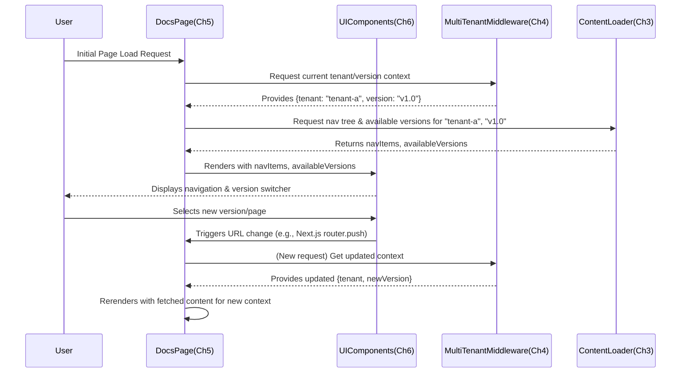

# Chapter 6: Documentation Navigation and Version UI

In the previous chapter, we established the [Dynamic Documentation Page Renderer](chapter_05.md), the core component responsible for fetching and displaying the MDX content for a given tenant and version. While rendering the content is crucial, enabling users to easily find what they're looking for and switch between different versions of documentation is equally important for a truly effective documentation platform. This chapter introduces the user interface elements that provide these essential functionalities.

---

### Problem & Motivation

Imagine a user arriving at the documentation portal of a complex software product. Without clear guidance, they would be lost, unable to find specific topics or understand which version of the product the documentation pertains to. A static, unstructured list of pages, even if beautifully rendered, is highly impractical for anything beyond a few basic articles.

The **multi-tenant-docs** project aims to serve comprehensive documentation for various products, each potentially having multiple active versions. This presents two primary user experience challenges:
1.  **Topic Discovery**: How can users efficiently browse through hundreds of topics, organized hierarchically, to find the specific information they need?
2.  **Version Specificity**: How can users ensure they are viewing documentation relevant to *their* specific product version, and easily switch to another version if desired?

This abstraction solves these problems by providing interactive **sidebar navigation** for topic browsing and a dedicated **version switcher UI** to manage documentation versions. For example, a user might land on the "Getting Started" guide for `Acme Inc. v2.0`. They then need to quickly navigate to the "API Reference" section and perhaps switch to view the "v1.0" documentation to understand a legacy system. Without these UI components, such interactions would be cumbersome, if not impossible, undermining the utility of the entire documentation system.

---

### Core Concept Explanation

The `Documentation Navigation and Version UI` abstraction encompasses two distinct, yet complementary, user interface components: the **Navigation Sidebar** and the **Version Switcher**. Together, they form the primary interactive elements for exploring the documentation.

The **Navigation Sidebar** typically presents a hierarchical list of documentation topics, reflecting the content structure defined in [Chapter 1: Documentation Content Structure](chapter_01.md). Each entry in the sidebar corresponds to a documentation page, and clicking on it loads the respective content via the [Dynamic Documentation Page Renderer](chapter_05.md). The sidebar dynamically highlights the currently active page, providing visual feedback to the user about their location within the documentation structure. It relies on the processed metadata (e.g., `meta.json` files) to construct this tree-like structure, ensuring that the navigation accurately represents the available content.

The **Version Switcher** is a control (often a dropdown menu) that allows users to select a different documentation version for the *current tenant*. For instance, if a tenant's documentation is available in `v1.0`, `v1.1`, and `v2.0`, the switcher will display these options. When a user selects a new version, the UI component intelligently constructs a new URL path that reflects the chosen version (e.g., `/tenant-slug/v2.0/page-slug`), effectively triggering a re-render of the documentation content for that specific version. This component directly utilizes the tenant and version information established by the [Multi-Tenant Context Middleware](chapter_04.md) and the comprehensive configuration from [Chapter 2: Documentation Source Configuration](chapter_02.md).

---

### Practical Usage Examples

Implementing the navigation and version switching UI involves rendering components that interact with the current routing context and the loaded documentation metadata.

#### 1. Basic Navigation Sidebar Component

A simplified React component for the navigation sidebar might receive a structured array of navigation items and the current path to highlight active links. For brevity, we'll assume `buildNavLink(slug)` is a helper that generates the full URL `/tenant/version/slug` and `RecursiveSidebar` is a component that renders child items.

```jsx
// Simplified rendering logic for a DocsSidebar
<nav className="docs-sidebar">
  {navItems.map((item) => ( // navItems from content metadata
    <div key={item.slug}>
      <a href={buildNavLink(item.slug)}
         className={currentPath.includes(item.slug) ? 'active' : ''}>
        {item.title}
      </a>
      {item.children && <RecursiveSidebar navItems={item.children} />}
    </div>
  ))}
</nav>
```
This code snippet illustrates the core rendering logic for the sidebar. It iterates through `navItems` (e.g., from a `meta.json` file processed by Chapter 3). For each item, it creates a link (`<a>`) with a dynamically built URL. The `currentPath.includes(item.slug)` condition applies an `'active'` class for styling, visually indicating the current page. If an item has `children`, a `RecursiveSidebar` component (which would use the same logic for its own `navItems`) is rendered to show nested navigation.

#### 2. Basic Version Switcher Component

The version switcher would typically be a dropdown menu populated with available versions for the current tenant. We assume `tenant`, `version`, and `slug` are available from the router context, and `availableVersions` is an array of version objects.

```jsx
// Simplified rendering and handling for VersionSwitcher
<select onChange={e => {
    const newVersion = e.target.value;
    // Construct new URL, preserving tenant and current page slug
    window.location.href = `/${tenant}/${newVersion}/${slug || 'index'}`;
}} value={version}>
  {availableVersions.map((v) => (
    <option key={v.slug} value={v.slug}>
      {v.name}
    </option>
  ))}
</select>
```
This `select` element displays a list of `availableVersions` (e.g., `[{ slug: 'v1.0', name: 'Version 1.0' }]`) obtained from the project's configuration (Chapter 2). When a user selects a new version, the `onChange` event handler is triggered. It constructs a new URL by replacing the current `version` segment in the path with `newVersion`, while keeping the `tenant` and `slug` (the specific page) consistent. `window.location.href` is then updated to navigate to this new URL, which the [Dynamic Documentation Page Renderer](chapter_05.md) will intercept and render.

---

### Internal Implementation Walkthrough

The "Documentation Navigation and Version UI" components are clients that consume data and context provided by other core abstractions to function correctly.

#### 1. Data Flow for Navigation and Version UI

1.  **Request Initiation**: A user navigates to a documentation page (e.g., `/tenant-a/v1.0/getting-started`).
2.  **Context Establishment**: The [Multi-Tenant Context Middleware](chapter_04.md) intercepts the request, identifies `tenant-a` and `v1.0`, and makes this context available to the rendering process.
3.  **Data Retrieval**: The core `DocsPage` (Chapter 5) or a higher-level layout component requests navigation data and available versions.
    *   **Navigation Data**: The `Content Loading and Parsing` (Chapter 3) abstraction provides a function (e.g., `getNavigationTree(tenantSlug, versionSlug)`) that reads `meta.json` files and content paths to build a hierarchical array of navigation items (title, slug, children).
    *   **Available Versions Data**: The `Content Loading and Parsing` abstraction also provides a function (e.g., `getAvailableVersions(tenantSlug)`) that queries the [Documentation Source Configuration](chapter_02.md) to retrieve all versions configured for the current tenant.
4.  **Component Rendering**: The `UI Components` (Sidebar and Version Switcher) receive this structured `navData` and `versionData` as props. They then render the appropriate HTML elements.
5.  **User Interaction**:
    *   **Navigation Sidebar**: The component uses the current URL path to highlight the active page and renders links that, when clicked, trigger a client-side navigation to the new page within the current tenant and version.
    *   **Version Switcher**: The component displays available versions. When a user selects a new version, it constructs a new URL and programmatically navigates to it, causing a full page re-render for the newly selected version.



---

### System Integration

The `Documentation Navigation and Version UI` components act as the user-facing bridge between the user's intent and the project's backend logic. They are deeply integrated with several other core abstractions:

-   **[Chapter 2: Documentation Source Configuration](chapter_02.md)**: Provides the definitive list of tenants and their available versions. The `Version Switcher` indirectly consumes this data (via Chapter 3) to populate its options.
-   **[Chapter 3: Content Loading and Parsing](chapter_03.md)**: This abstraction is crucial for generating the `navItems` data structure. It reads `meta.json` files and content paths to build the hierarchical navigation tree that the `Navigation Sidebar` renders, and also provides the processed list of available versions for a tenant.
-   **[Chapter 4: Multi-Tenant Context Middleware](chapter_04.md)**: This middleware establishes the current `tenant` and `version` from the URL, which is then accessed by both the `Navigation Sidebar` (to construct correct links) and the `Version Switcher` (to know the current version and construct new URLs).
-   **[Chapter 5: Dynamic Documentation Page Renderer](chapter_05.md)**: While the renderer displays the content, the navigation and version UI components provide the means for users to *change* what the renderer displays. Changes in navigation or version selection directly lead to a new request that the renderer will fulfill. The UI components are typically rendered alongside the `Dynamic Documentation Page Renderer` on the same page layout.

These components are typically rendered within a layout wrapper that surrounds the core documentation content. This ensures they are persistent and accessible regardless of the specific page being viewed.

---

### Best Practices & Tips

Implementing navigation and version switching effectively goes beyond basic functionality.

-   **Accessibility (A11y)**: Ensure both the sidebar and version switcher are accessible. Use semantic HTML (`<nav>`, `<select>`, `<option>`). For the sidebar, use proper `aria-current="page"` attributes for the active link. For dropdowns, ensure keyboard navigation and screen reader compatibility.
-   **Performance Optimization**:
    -   **Navigation Data Memoization**: If the navigation data (`navItems`) is complex and doesn't change often, memoize its generation (`getNavigationTree` function) to avoid redundant computation on every request or re-render.
    -   **Client-side Data Fetching**: For large documentation sets, consider fetching initial navigation data on the server, but updates (e.g., if dynamically loaded) on the client, potentially with incremental static regeneration.
-   **URL Structure Consistency**: Always ensure that links generated by the navigation sidebar and the version switcher adhere to the established URL structure (`/tenant-slug/version-slug/page-slug`). This consistency is vital for the [Multi-Tenant Context Middleware](chapter_04.md) to function correctly.
-   **Responsive Design**: The navigation sidebar often needs to transform into a mobile-friendly menu (e.g., a hamburger menu) on smaller screens. The version switcher should also adapt its presentation for various device sizes.
-   **Error Handling**: What happens if `navItems` is empty or `availableVersions` is `null`? Implement graceful fallback UI (e.g., "No topics found" message).
-   **UI/UX Feedback**: Clearly indicate the active page in the sidebar. For version switching, ensure the currently selected version is obvious. Consider adding a loading state when switching versions if the page takes time to load.
-   **Customization**: Design the UI components with props that allow for easy styling and layout customization, without needing to modify the core logic. For example, allowing custom link components or rendering functions.

---

### Chapter Conclusion

This chapter has covered the essential user interface components that transform raw documentation content into an interactive and navigable experience: the `Documentation Navigation and Version UI`. We've explored how a hierarchical sidebar enables efficient topic discovery and how a dedicated version switcher empowers users to seamlessly transition between different versions of a tenant's documentation. By leveraging context from the [Multi-Tenant Context Middleware](chapter_04.md) and data from [Content Loading and Parsing](chapter_03.md) and [Documentation Source Configuration](chapter_02.md), these UI elements provide a crucial layer of interactivity atop the [Dynamic Documentation Page Renderer](chapter_05.md).

With the completion of this chapter, the **multi-tenant-docs** project now possesses a fully functional documentation system, from content organization and loading to dynamic rendering and intuitive user navigation. The complete tutorial structure has been covered, culminating in a robust and user-friendly platform for serving documentation across multiple tenants and versions.