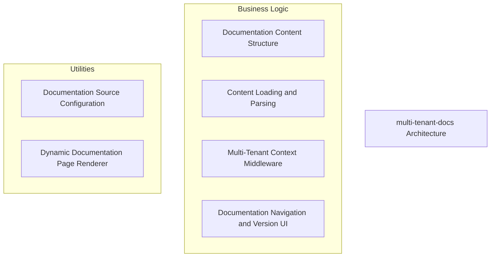
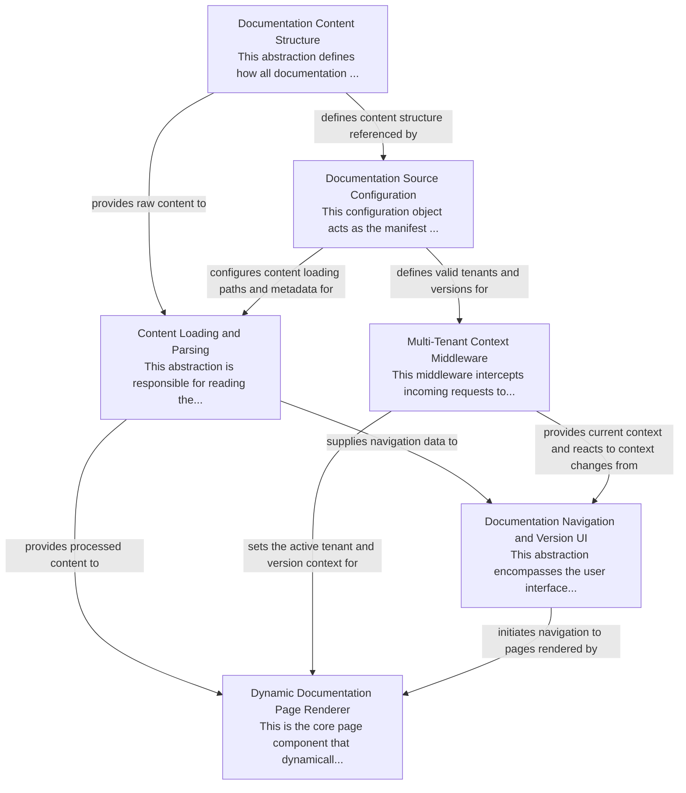

# multi-tenant-docs Tutorial

Welcome to the comprehensive tutorial for multi-tenant-docs. This tutorial is automatically generated from the codebase to help you understand the core concepts and implementation patterns.

## Project Overview

The 'multi-tenant-docs' project provides a flexible framework for serving documentation across multiple tenants and versions. It organizes content hierarchically on the filesystem, leveraging a central configuration to map tenants and versions to their respective 'MDX' files. A dynamic rendering pipeline, driven by 'URL'-based context, ensures the correct documentation is displayed, complemented by interactive navigation and version switching 'UI' components.

## System Architecture

## Component Relationships

## Table of Contents

1. [Chapter 1: Documentation Content Structure](chapter_01.md) - Comprehensive documentation for Documentation Content Structure following structured methodology...
2. [Chapter 2: Documentation Source Configuration](chapter_02.md) - Comprehensive documentation for Documentation Source Configuration following structured methodology...
3. [Chapter 3: Content Loading and Parsing](chapter_03.md) - Comprehensive documentation for Content Loading and Parsing following structured methodology...
4. [Chapter 4: Multi-Tenant Context Middleware](chapter_04.md) - Comprehensive documentation for Multi-Tenant Context Middleware following structured methodology...
5. [Chapter 5: Dynamic Documentation Page Renderer](chapter_05.md) - Comprehensive documentation for Dynamic Documentation Page Renderer following structured methodology...
6. [Chapter 6: Documentation Navigation and Version UI](chapter_06.md) - Comprehensive documentation for Documentation Navigation and Version UI following structured methodo...

## How to Use This Tutorial

1. **Start with Chapter 1** to understand the foundational concepts
2. **Follow the sequence** - each chapter builds upon previous concepts
3. **Practice with code examples** - every chapter includes practical examples
4. **Refer to diagrams** - use architecture diagrams for visual understanding
5. **Cross-reference concepts** - chapters link to related topics

## Tutorial Features

- **Progressive Learning**: Concepts are introduced in logical order
- **Code Examples**: Every chapter includes practical, executable code
- **Visual Diagrams**: Mermaid diagrams illustrate complex relationships
- **Cross-References**: Easy navigation between related concepts
- **Beginner-Friendly**: Written for newcomers to the codebase

## Contributing

This tutorial is auto-generated from the codebase. To improve it:
1. Update the source code documentation
2. Add more detailed comments to key functions
3. Regenerate the tutorial using the documentation system

---

*Generated using AI-powered codebase analysis*
