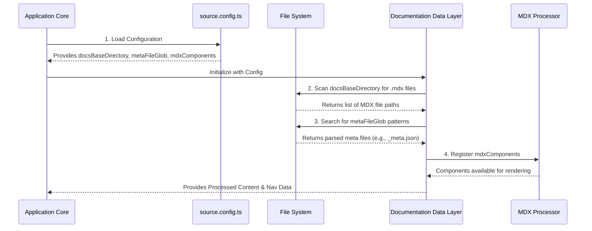

# Chapter 1: Content Sourcing Configuration

This is the inaugural chapter of our documentation series, laying the foundational groundwork for how our multi-tenant documentation system discovers and loads content. As this is our starting point, there's no previous chapter to transition from, allowing us to dive directly into a core architectural component.

---

### Problem & Motivation

In a sophisticated multi-tenant documentation system like "multi-tenant-docs," content isn't just static files; it's a dynamic asset that needs to be located, understood, and presented correctly for various tenants and versions. Imagine a scenario where documentation for 'Tenant A' is located in one directory, while 'Tenant B' uses another, and each might have different versions of their docs. Furthermore, some content might need special interactive elements not available in standard Markdown. Without a clear mechanism to tell the application *where* to find these diverse documentation assets and *how* to interpret specialized content, the system would be unable to function.

The `source.config.ts` file addresses this challenge head-on. It acts as the central manifest for our documentation engine, defining precisely how the application discovers documentation content, processes metadata files, and registers custom MDX components. This configuration is crucial for ensuring that the system can dynamically adapt to new tenants, new documentation versions, and evolving content requirements without requiring core code changes. For instance, if a new tenant, "AcmeCorp," wants to onboard their documentation, `source.config.ts` will specify the base directory where their content resides, allowing the system to automatically pick it up.

---

### Core Concept Explanation: The Content Source Manifest

At the heart of our content discovery mechanism is the `source.config.ts` file. Think of it as the ultimate instruction manual for the documentation system's content loader. This file is a TypeScript configuration that exports an object, guiding the application on three primary aspects of content sourcing:

1.  **`docsBaseDirectory`**: This property tells the system the root location where all documentation content lives. It's the starting point for recursively scanning and finding all MDX files (`.mdx`). This allows for a flexible directory structure where tenants and versions can be organized logically.

2.  **`metaFileGlob`**: Documentation often requires navigation structures or metadata (like page titles, order, or descriptions) that aren't directly part of the MDX content itself. The `metaFileGlob` defines a pattern to identify special "meta" files (e.g., `_meta.json` or `_nav.json`). These files contain crucial information for building navigation trees and providing contextual data for each documentation section.

3.  **`mdxComponents`**: To make our documentation highly interactive and visually rich, we use MDX – Markdown with JSX. This allows us to embed React components directly into our `.mdx` files. The `mdxComponents` property in `source.config.ts` serves as a registry, mapping component names used in MDX to their actual React component implementations. This central registration ensures that all `.mdx` files can consistently access a shared set of interactive elements.

In essence, `source.config.ts` acts as the 'table of contents' and 'tool list' for our documentation system, enabling it to efficiently locate, understand, and render a diverse array of documentation content.

---

### Practical Usage Examples

Let's look at how `source.config.ts` is structured and configured to handle our motivating use case: bringing "AcmeCorp"'s documentation into the system, including their unique content structure and a custom callout component.

First, create the file `source.config.ts` at the root of your project or in a designated configuration directory.

```typescript
// source.config.ts
import { SourceConfig } from '@multi-tenant-docs/core';
import CustomCallout from './components/CustomCallout'; // Custom MDX component

const config: SourceConfig = {
  docsBaseDirectory: './docs', // All docs live under this folder
  metaFileGlob: '**/{_meta,_nav}.json', // Look for _meta.json or _nav.json files
  mdxComponents: {
    CustomCallout: CustomCallout, // Register our custom component
  },
};

export default config;
```
*Explanation*: This configuration establishes the core settings. `docsBaseDirectory` points to `./docs`, indicating where the content scanning should begin. `metaFileGlob` specifies a pattern to locate metadata files, which will be used for navigation and page ordering. Finally, `mdxComponents` registers `CustomCallout`, making it available for use in any MDX file.

Now, imagine AcmeCorp's documentation is structured like this within the `docs` directory:
```
docs/
├── acmecorp/
│   ├── 1.0/
│   │   ├── _meta.json
│   │   ├── getting-started.mdx
│   │   └── features.mdx
│   └── 2.0/
│       ├── _meta.json
│       └── migration-guide.mdx
└── othertenant/
    └── 1.0/
        └── ...
```

An example `_meta.json` file for AcmeCorp v1.0, located at `docs/acmecorp/1.0/_meta.json`:
```json
// docs/acmecorp/1.0/_meta.json
{
  "getting-started": "AcmeCorp v1.0: Getting Started",
  "features": "Key Features & Benefits"
}
```
*Explanation*: This `_meta.json` file is discovered by the `metaFileGlob` pattern. It provides display titles and implicitly defines the order for the `getting-started.mdx` and `features.mdx` pages within this specific version of AcmeCorp's documentation.

Here's how `CustomCallout` might be used in an MDX file, such as `docs/acmecorp/1.0/getting-started.mdx`:
```mdx
// docs/acmecorp/1.0/getting-started.mdx
# Welcome to AcmeCorp!

This guide will help you begin your journey.

<CustomCallout type="info" title="Important Notice">
  Remember to review our API documentation for detailed integration steps.
</CustomCallout>

Proceed to installation.
```
*Explanation*: The `<CustomCallout>` component is embedded directly into the MDX content. Because `CustomCallout` was registered in `source.config.ts`, the application's MDX renderer knows how to resolve this tag to the actual React component and display it with its defined props (`type` and `title`).

---

### Internal Implementation Walkthrough

When the application prepares to serve documentation, the `source.config.ts` file acts as the primary input for the content loading process. Here's a simplified sequence of how the content sourcing configuration drives the internal workflow:

1.  **Configuration Loading**: The application's core documentation data layer (which might operate during build time or server-side rendering, e.g., within Next.js `getStaticProps`) imports and parses the `source.config.ts` file. This makes its properties (`docsBaseDirectory`, `metaFileGlob`, `mdxComponents`) accessible.
2.  **Content Directory Scan**: Using the `docsBaseDirectory` (e.g., `./docs`), the system initiates a recursive scan of the file system. It identifies all `.mdx` files and their relative paths, building an initial registry of all potential documentation pages.
3.  **Metadata Discovery & Parsing**: Concurrently, the `metaFileGlob` pattern (e.g., `**/{_meta,_nav}.json`) is applied across the `docsBaseDirectory`. Any files matching this pattern are loaded, parsed as JSON, and their contents are stored. This metadata is essential for building structured navigation menus and providing page-specific context.
4.  **MDX Component Registration**: The `mdxComponents` object, containing mappings of component names to their implementations, is passed to the MDX runtime environment. This step ensures that when any `.mdx` file is processed, custom components embedded within it (like `<CustomCallout>`) are correctly resolved and rendered as their corresponding React components.

The following diagram illustrates this internal process:


*Explanation*: The `Application Core` first loads the `source.config.ts` file. The `Documentation Data Layer` then uses these configurations to interact with the `File System` to discover both MDX content and metadata. Finally, it registers custom `mdxComponents` with the `MDX Processor`, enabling rich content rendering before passing the fully processed content and navigation data back to the `Application Core` for display.

---

### System Integration

The `source.config.ts` file is a fundamental piece that directly influences several other critical components of the "multi-tenant-docs" project, acting as the initial data provider and configuration orchestrator:

*   **[Content Organization](chapter_02.md)**: The `metaFileGlob` property within `source.config.ts` is the primary mechanism for the system to identify and process files like `_meta.json`. These files are crucial for defining the hierarchical structure of documentation, controlling navigation menus, and setting the order of pages within a section.
*   **[Documentation Data Layer](chapter_03.md)**: This chapter will delve into the services responsible for fetching, parsing, and transforming raw documentation files. `source.config.ts` provides the foundational information (like `docsBaseDirectory`) that the data layer uses to locate and retrieve all documentation assets, making it the entry point for content acquisition.
*   **[Dynamic Documentation Pages](chapter_05.md)**: When a user navigates to a documentation page, the content is dynamically rendered using MDX. The `mdxComponents` defined in `source.config.ts` are injected into this rendering process, allowing our pages to display custom interactive elements and rich components seamlessly.

In essence, `source.config.ts` provides the raw ingredients and fundamental instructions for the entire documentation pipeline, ensuring consistency, discoverability, and rich interactivity across the multi-tenant system.

---

### Best Practices & Tips

*   **Organized `docsBaseDirectory`**: Structure your `docsBaseDirectory` logically to simplify content management and routing. A common and recommended pattern is `docs/{tenant-slug}/{version-slug}/`. This clear organization facilitates the implementation of features like [Multi-Tenancy & Versioning Routing](chapter_04.md).
    ```typescript
    // Good practice: structured base directory
    docsBaseDirectory: './docs',
    ```
*   **Specific `metaFileGlob`**: Be precise with your `metaFileGlob`. While a broad glob like `**/*.json` would find all JSON files, `**/{_meta,_nav}.json` is much more targeted. This improves performance by avoiding unnecessary file parsing and ensures that only relevant metadata files are processed, making your system more efficient.
    ```typescript
    // Good practice: targeted meta file glob
    metaFileGlob: '**/{_meta,_nav}.json',
    ```
*   **Centralized Custom Components**: Register common MDX components that will be used across many tenants or versions in `source.config.ts`. This promotes reusability, maintains a single source of truth for these interactive elements, and simplifies maintenance. For highly tenant-specific components, consider an extension mechanism or dedicated tenant configurations if your project's scale demands such complexity.
*   **Performance Considerations**: For extremely large documentation repositories, a very broad `docsBaseDirectory` or `metaFileGlob` can lead to longer build times due to extensive file system scanning. Regularly monitor your build performance and refine these paths if necessary to optimize content loading.

---

### Chapter Conclusion

In this chapter, we've explored the pivotal role of `source.config.ts` in the "multi-tenant-docs" project. We've seen how this configuration file defines the very foundation of our content sourcing: identifying where documentation resides, how metadata is structured, and which custom MDX components are available for enhancing content. It solves the crucial problem of managing diverse, dynamic content in a scalable way, serving as the initial instruction set for our entire documentation pipeline.

Understanding `source.config.ts` is the first step towards comprehending how our system dynamically delivers rich, tenant-specific, and versioned documentation. With this groundwork laid, we are now ready to delve into how this raw, sourced content is then logically structured and organized for presentation.

Our next stop is [Content Organization](chapter_02.md), where we'll discover how metadata files and directory structures are used to build navigation and content hierarchies.