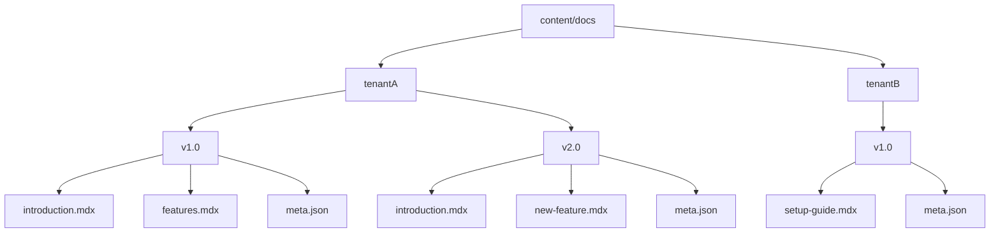

# Chapter 2: Content Organization

In the previous chapter, [Content Sourcing Configuration](chapter_01.md), we explored how `source.config.ts` defines the initial parameters for discovering documentation content, pointing our application to the root directory where all our precious information resides. Now that our system knows *where* to look, the next logical step is to understand *how* that content should be structured so that it can be efficiently processed, routed, and served to the correct audience.

---

### Problem & Motivation

Imagine you're managing documentation for a SaaS product with multiple customer tiers (tenants) and frequently updated features, leading to different versions of the documentation. Without a clear, systematic way to organize these documents, you'd quickly face chaos. How do you ensure `Tenant A` sees only their relevant documentation for `Version 2.0` and not `Tenant B`'s `Version 1.0` content? How do you maintain navigation menus that accurately reflect the pages available for a specific tenant and version?

This project, `multi-tenant-docs`, specifically addresses this challenge. It needs a robust, predictable content structure that allows for easy segregation and retrieval of documentation based on tenant and version. Without this, dynamically serving content would be impossible, leading to a tangled mess of files and a poor user experience. Our goal is to create a content hierarchy that is intuitive for authors and programmatically navigable for the system.

---

### Core Concept Explanation

At the heart of the `multi-tenant-docs` project's content management is a strictly defined file system hierarchy. All documentation content is rooted within the `content/docs` directory. From there, content is organized using a `/{tenantName}/{version}` pattern. This means that for every unique tenant and every specific version of their documentation, there's a distinct directory.

Inside each `content/docs/{tenantName}/{version}` directory, you'll find two primary types of files:
1.  **MDX files**: These are the actual documentation pages. MDX is a powerful format that allows you to write markdown with JSX components, enabling rich, interactive documentation. Each MDX file typically represents a single page of content.
2.  **`meta.json` files**: These configuration files define the navigation structure and metadata for the documentation within that specific tenant and version context. They specify the order of pages, their titles, and how they nest within a sidebar menu.

This dual-layer organization—folders for tenant/version, and files for pages/navigation—provides a clear separation of concerns. The file system handles the large-scale segregation, while `meta.json` handles the finer-grained ordering and presentation within a given context.


*Figure 2.1: Content Directory Structure Overview*

---

### Practical Usage Examples

Let's illustrate this organization with our motivating use case: managing documentation for `tenantA` in both `v1.0` and `v2.0`, and for `tenantB` in `v1.0`.

#### **1. Directory Structure**

Here's how these contents would be laid out in the `content/docs` directory:

```
content/docs
├── tenantA
│   ├── v1.0
│   │   ├── introduction.mdx
│   │   ├── getting-started.mdx
│   │   └── meta.json
│   └── v2.0
│       ├── introduction.mdx
│       ├── new-features.mdx
│       └── meta.json
└── tenantB
    └── v1.0
        ├── overview.mdx
        └── meta.json
```
*This structure clearly separates documentation by tenant and then by version.*

#### **2. Example MDX Content (`content/docs/tenantA/v1.0/introduction.mdx`)**

```mdx
# Welcome to Tenant A's Documentation (v1.0)

This section provides an overview of our platform.

<Alert type="info">
  This is specific to version 1.0.
</Alert>

Discover more in [Getting Started](/tenantA/v1.0/getting-started).
```
*A simple MDX file for a documentation page. Notice the use of a custom `<Alert>` component, which will be covered in [Custom MDX Components](chapter_06.md).*

#### **3. Example `meta.json` (`content/docs/tenantA/v1.0/meta.json`)**

This file defines the navigation and display order for `tenantA`'s `v1.0` documentation.

```json
{
  "pages": [
    {
      "file": "introduction.mdx",
      "title": "Introduction to Tenant A"
    },
    {
      "file": "getting-started.mdx",
      "title": "Getting Started Guide"
    }
  ]
}
```
*This `meta.json` tells the application that `introduction.mdx` should appear first in the navigation for `tenantA` v1.0, followed by `getting-started.mdx`, with specified titles.*

#### **4. More Complex `meta.json` (`content/docs/tenantA/v2.0/meta.json`)**

For `tenantA`'s `v2.0` documentation, the `meta.json` would reflect its unique content:

```json
{
  "pages": [
    {
      "file": "introduction.mdx",
      "title": "Welcome to Tenant A (v2.0)"
    },
    {
      "file": "new-features.mdx",
      "title": "What's New in v2.0",
      "children": [
        {
          "file": "sub-feature-a.mdx",
          "title": "Sub-Feature A Overview"
        }
      ]
    }
  ]
}
```
*Here, we see a nested structure using the `children` array, allowing for sub-sections in the navigation. This demonstrates how `meta.json` can define hierarchical menus.*

---

### Internal Implementation Walkthrough

The effectiveness of this content organization scheme relies on how the application processes it. When the `multi-tenant-docs` system starts up, it uses the configuration from [Content Sourcing Configuration](chapter_01.md) (specifically, the `docsBasePath`) to locate the `content/docs` directory.

1.  **Discovery**: The system recursively scans the `docsBasePath` to identify all unique `/{tenantName}/{version}` paths. Each path represents a distinct documentation context.
2.  **Content Mapping**: For each identified `/{tenantName}/{version}` directory:
    *   It reads the `meta.json` file to understand the intended navigation structure, page titles, and the order of pages.
    *   It identifies all `.mdx` files within that directory, ensuring they correspond to entries in `meta.json`.
3.  **Data Structure Creation**: This raw file system information is then transformed into an in-memory data structure that maps tenants, versions, and page paths to their corresponding MDX content and navigation metadata. This structured data is what the [Documentation Data Layer](chapter_03.md) will primarily work with.
4.  **Content Loading (Lazy)**: The actual MDX content for each page isn't necessarily parsed and loaded immediately for *all* pages. Instead, the system primarily builds an index based on the file paths and `meta.json`. The full MDX processing (parsing, rendering, component resolution) typically occurs when a specific page is requested via its route, optimizing initial load times.

This process ensures that the content organization directly informs the application's understanding of available documentation, without requiring hardcoded paths or complex database queries for navigation.

---

### System Integration

This content organization methodology is foundational and integrates deeply with several other core components of the `multi-tenant-docs` project:

*   **[Content Sourcing Configuration](chapter_01.md)**: The `source.config.ts` file directly points to the `content/docs` directory, making this chapter's organization the blueprint for content discovery. Any changes to the `docsBasePath` would necessitate a re-evaluation of the content structure.
*   **[Documentation Data Layer](chapter_03.md)**: This content structure is the *input* for the data layer. The data layer is responsible for reading these files, parsing the MDX, processing the `meta.json`, and transforming them into a queryable data model. It's where the raw organized files become structured data.
*   **[Multi-Tenancy & Versioning Routing](chapter_04.md)**: The `/{tenantName}/{version}` part of our directory structure directly maps to the Next.js dynamic routes. For example, `content/docs/tenantA/v1.0/introduction.mdx` would correspond to the URL `/tenantA/v1.0/introduction`. This tight coupling allows for predictable and maintainable routing.
*   **[Dynamic Documentation Pages](chapter_05.md)**: When a dynamic route is hit, the page component uses the `tenantName`, `version`, and `pageSlug` (derived from the MDX filename) to fetch the correct content from the data layer, which was originally organized according to this chapter's principles.
*   **[Data API Endpoints](chapter_07.md)**: Even API endpoints, which provide programmatic access to documentation data, rely on this structured organization. They can query specific tenants or versions based on the directory layout.

---

### Best Practices & Tips

1.  **Consistency is Key**: Always follow the `content/docs/{tenantName}/{version}/` pattern strictly. Deviations will lead to content not being discovered or routed correctly.
2.  **Meaningful Naming**: Use clear, descriptive names for your `tenantName` and `version` directories (e.g., `tenantA`, `customer-portal`, `v1.0`, `beta`). This aids readability and debugging.
3.  **`meta.json` Integrity**: Ensure every `/{tenantName}/{version}` directory has a valid `meta.json`. Missing or malformed `meta.json` files can break navigation for that entire section.
4.  **MDX Filename to Slug Mapping**: For clean URLs, keep your MDX filenames simple and URL-friendly (e.g., `getting-started.mdx` -> `/getting-started`). Avoid spaces or special characters.
5.  **Version Control Content**: Treat your `content/docs` directory as code. Store it in Git (or similar VCS) to track changes, enable collaboration, and easily revert to previous versions of documentation. This is especially crucial for managing multiple documentation versions.
6.  **Avoid Deep Nesting in `meta.json`**: While `meta.json` supports nested `children` for navigation, excessively deep nesting can lead to cluttered sidebars and a poor user experience. Aim for 2-3 levels of nesting at most.

#### Troubleshooting Common Issues:

*   **Content Not Appearing**:
    *   Check if the MDX file exists in the correct `/{tenantName}/{version}` directory.
    *   Verify that `meta.json` correctly lists the MDX file with its exact filename.
    *   Ensure the `tenantName` and `version` directories are correctly spelled and match what the routing expects.
*   **Incorrect Navigation Order/Titles**:
    *   Review the `meta.json` file. The order of objects in the `pages` array (and `children` arrays) dictates the navigation order. Titles are taken directly from the `title` property.
*   **Routing Issues**:
    *   If a page isn't accessible at `/tenantName/version/slug`, check that the filename in `meta.json` matches the actual MDX file and that the file path itself aligns with the `/{tenantName}/{version}` structure.

---

### Chapter Conclusion

This chapter has laid the groundwork for how documentation content is structured in the `multi-tenant-docs` project. By adhering to the `content/docs/{tenantName}/{version}` directory pattern and leveraging `meta.json` for navigation, we establish a robust, scalable, and highly maintainable system. This organization is not merely about tidiness; it's the architectural pillar that enables our application to intelligently discover, process, and dynamically serve the right content to the right users at the right time.

With our content now properly organized, the next crucial step is to understand how the application actually consumes and transforms these raw files into usable data. We'll delve into this in detail as we explore the [Documentation Data Layer](chapter_03.md).