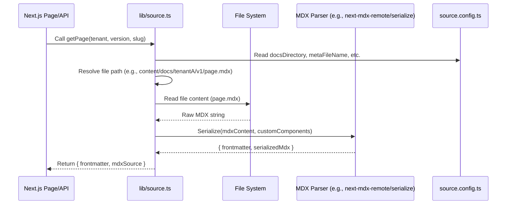

# Chapter 3: Documentation Data Layer

Having established a clear and organized structure for our documentation content in the previous chapter on [Content Organization](chapter_02.md), the next crucial step is to make this content accessible and usable by our Next.js application. Raw MDX files and JSON metadata are static artifacts; they need to be read, parsed, and transformed into a programmatic representation that the application can render dynamically.

---

### Problem & Motivation

Imagine a library filled with books, each containing valuable information, and a catalog system that tells you where to find them. While the books are neatly organized on shelves and the catalog is well-indexed, you still need a librarian or a system to retrieve a specific book or find out what books are available on a certain topic.

In our "multi-tenant-docs" project, the problem is similar:
*   **Static Content Barrier:** Our documentation lives in static MDX files and `meta.json` files within a structured directory. The Next.js application, running server-side or client-side, cannot directly use these file paths to render content or build navigation.
*   **Dynamic Access Requirement:** We need a way to programmatically query this content. For example, "Give me all the navigation links for `Tenant A`'s `Version 1.0` documentation," or "Fetch the content and metadata for the 'Installation' page under `Tenant B`'s `Version 2.1`."
*   **Multi-Tenancy & Versioning Complexity:** Without a dedicated layer, managing content access across different tenants and versions would lead to repetitive, error-prone logic spread throughout the application.

This is precisely the problem the **Documentation Data Layer** solves. It acts as the central intelligence unit for content retrieval, transforming static files into dynamic data structures our application can consume. Without it, our application would be unable to find, process, or display any documentation, making this layer fundamental to the entire system's functionality. A concrete use case for this chapter is **fetching the complete navigation structure for a given tenant and version, and subsequently fetching the content of a specific page within that structure.**

---

### Core Concept Explanation

The **Documentation Data Layer** is embodied primarily by the `lib/source.ts` module. Think of it as the project's **content management engine**. Its core responsibility is to abstract away the complexities of reading files from the file system, parsing different content formats (like MDX and JSON), and structuring that data into a consistent, usable format for the rest of the application.

Here's a breakdown of its key roles:

1.  **Content Discovery & Reading:** It uses the rules defined in `source.config.ts` (our [Content Sourcing Configuration](chapter_01.md)) to locate the correct documentation directories and files based on tenant, version, and page slug. It then reads the raw content from these files.

2.  **MDX Parsing:** For `.mdx` files, it goes beyond just reading the text. It parses the Markdown and JSX, extracts any frontmatter (metadata like `title`, `description`), and prepares the content for rendering by a React component. This process often involves transforming the raw MDX string into a format that can be directly passed to a component like `MDXRemote` from `next-mdx-remote`.

3.  **Metadata Extraction & Navigation Building:** For `meta.json` files, it reads and parses the JSON structure. It then constructs a hierarchical navigation tree, providing all the links, titles, and nested structures required to build sidebars or breadcrumbs for a specific tenant and version.

4.  **Programmatic Interface:** `lib/source.ts` exposes a clean, asynchronous API (e.g., functions like `getNavigation` or `getPage`) that other parts of the application can call without needing to know the underlying file system operations or parsing logic. This separation of concerns makes the system robust and easier to maintain.

In essence, `lib/source.ts` bridges the gap between the static content stored on the file system and the dynamic content required by our Next.js application, acting as the intelligent intermediary.

---

### Practical Usage Examples

Let's see how we can use the `lib/source.ts` module to address our motivating use case: fetching navigation and page content.

#### 1. Fetching Navigation for a Tenant and Version

To build a sidebar, we need the navigation structure. The `getNavigation` function (hypothetically provided by `lib/source.ts`) would achieve this.

```typescript
// lib/source.ts (simplified interface for demonstration)
export interface NavItem {
  title: string;
  path: string;
  items?: NavItem[];
}

export async function getNavigation(
  tenantSlug: string,
  versionSlug: string
): Promise<NavItem[]> {
  // ... actual implementation details (reads meta.json)
  console.log(`Fetching nav for: ${tenantSlug}/${versionSlug}`);
  // In a real scenario, this would read 'content/docs/{tenantSlug}/{versionSlug}/meta.json'
  // and process it.
  return [
    { title: "Introduction", path: "/introduction" },
    { title: "Setup", path: "/setup", items: [{ title: "Install", path: "/setup/install" }] }
  ];
}
```
*Explanation*: This TypeScript code snippet defines the expected structure of a navigation item (`NavItem`) and a function `getNavigation`. When called, this function simulates fetching the navigation data, which would typically involve reading the `meta.json` file for the specified `tenantSlug` and `versionSlug` from the file system, as defined in [Content Organization](chapter_02.md).

Now, let's call this function from a hypothetical Next.js `getServerSideProps` or API route:

```typescript
// pages/api/docs/[...slug].ts or pages/[...slug].tsx (getServerSideProps)
import { getNavigation } from '../../lib/source'; // Adjust path as necessary

async function getDocNav(tenant: string, version: string) {
  const nav = await getNavigation(tenant, version);
  console.log('Fetched Navigation:', nav);
  // Expected output:
  // Fetched Navigation: [
  //   { title: "Introduction", path: "/introduction" },
  //   { title: "Setup", path: "/setup", items: [...] }
  // ]
  return nav;
}

getDocNav('tenantA', 'v1');
```
*Explanation*: Here, we import `getNavigation` and call it with `tenantA` and `v1`. The console output shows a structured array of navigation items, ready to be rendered as a sidebar menu. This simple call abstracts away all the file system access and JSON parsing.

#### 2. Fetching Page Content and Metadata

Once a user clicks a navigation link, we need to retrieve the actual MDX content for that page. The `getPage` function handles this.

```typescript
// lib/source.ts (simplified interface for demonstration)
export interface PageContent {
  frontmatter: Record<string, any>;
  mdxSource: any; // Typically a serialized MDX source for next-mdx-remote
}

export async function getPage(
  tenantSlug: string,
  versionSlug: string,
  pageSlug: string[] // e.g., ['setup', 'install']
): Promise<PageContent | null> {
  console.log(`Fetching page: ${tenantSlug}/${versionSlug}/${pageSlug.join('/')}`);
  // In a real scenario, this would read 'content/docs/{tenantSlug}/{versionSlug}/{pageSlug}.mdx'
  // parse its frontmatter and MDX content.
  const frontmatter = {
    title: "Installation Guide",
    description: "Steps to install our product.",
  };
  const mdxContent = `---
title: Installation Guide
description: Steps to install our product.
---
# Getting Started with Installation

Follow these steps to install...
<CustomCallout type="info">Remember to check dependencies!</CustomCallout>
`;
  // In a real app, 'mdxSource' would be generated by `serialize` from 'next-mdx-remote'
  return { frontmatter, mdxSource: mdxContent /* serialized */ };
}
```
*Explanation*: The `getPage` function takes the tenant, version, and a slug array (representing the file path) to locate the MDX file. It then returns an object containing the page's `frontmatter` (metadata) and the processed `mdxSource` (the content ready for rendering).

Calling `getPage` from a page component:

```typescript
// pages/[tenant]/[version]/[...slug].tsx (inside getServerSideProps)
import { getPage } from '../../lib/source'; // Adjust path as necessary

async function getDocPage(tenant: string, version: string, slug: string[]) {
  const page = await getPage(tenant, version, slug);
  console.log('Fetched Page Frontmatter:', page?.frontmatter);
  // Expected output:
  // Fetched Page Frontmatter: { title: "Installation Guide", description: "..." }
  return page;
}

getDocPage('tenantA', 'v1', ['setup', 'install']);
```
*Explanation*: This snippet shows how a Next.js page could request the content for `/tenantA/v1/setup/install`. The `frontmatter` (like `title` and `description`) is easily accessible, and the `mdxSource` can be passed directly to an MDX rendering component. This demonstrates how the data layer provides structured data, not just raw file content.

---

### Internal Implementation Walkthrough

The `lib/source.ts` module orchestrates several internal processes to provide the clean API we just saw. Here's a step-by-step look at how it generally operates:

1.  **Configuration Loading:** When `lib/source.ts` initializes or its functions are called, it first loads the `source.config.ts`. This configuration tells it crucial information like `docsDirectory` (e.g., `content/docs`), `metaFileName` (e.g., `meta.json`), and any custom MDX components to be used during parsing.

2.  **Path Resolution:** Given a tenant, version, and page slug, the module constructs the absolute file system path to the relevant `meta.json` or `.mdx` file. It combines the `docsDirectory` from the config with the provided tenant, version, and slug parameters.

    *Example path resolution for `tenantA`, `v1`, `intro.mdx`:*
    `path.join(sourceConfig.docsDirectory, 'tenantA', 'v1', 'intro.mdx')`

3.  **File System Read:** It uses Node.js file system APIs (like `fs.promises.readFile`) to asynchronously read the content of the target file. The content is typically read as a string.

4.  **Content Parsing:**
    *   **For `meta.json`:** The raw JSON string is parsed into a JavaScript object (`JSON.parse`). This object is then often recursively processed to resolve relative `path` properties into absolute, routable URLs.
    *   **For `.mdx` files:** This is where the magic happens. The file content is passed to an MDX parser. This parser performs two main tasks:
        *   **Frontmatter Extraction:** It identifies and parses the YAML frontmatter block (the `---` delimited section at the top of the MDX file) into a JavaScript object.
        *   **MDX Serialization:** It converts the remaining MDX content into a serializable format that `next-mdx-remote` can later hydrate and render on the client or server. This process often involves processing remark/rehype plugins (e.g., for syntax highlighting, image handling, custom components).

5.  **Data Structuring:** The parsed metadata and content are then packaged into the defined interfaces (`NavItem[]`, `PageContent`) and returned to the caller.

Here's a sequence diagram illustrating the internal flow for fetching a page:


*Explanation*: This diagram shows the journey from a Next.js component requesting a page to `lib/source.ts`, which then consults the `source.config.ts`, reads from the file system, processes the MDX content using an MDX parser, and finally returns the structured data back to the application.

---

### System Integration

The `lib/source.ts` module sits at a critical junction, forming a data bridge between the raw content and several other core components of the "multi-tenant-docs" system.

*   **Dependency on [Content Sourcing Configuration](chapter_01.md):** The `source.config.ts` file is directly consumed by `lib/source.ts`. It dictates the base directory for documentation, the name of the metadata file (`meta.json`), and can also provide custom MDX components that need to be made available during the MDX parsing process. Without this configuration, `lib/source.ts` wouldn't know *where* to look for content or *how* to process specialized MDX features.

*   **Reads from [Content Organization](chapter_02.md) Structure:** The logical file and directory structure defined in Chapter 2 (e.g., `content/docs/{tenant}/{version}/{page}.mdx`) is directly utilized by `lib/source.ts` to construct file paths and locate content. The data layer is entirely dependent on this predictable structure to function correctly.

*   **Feeds [Multi-Tenancy & Versioning Routing](chapter_04.md):** The data retrieved by `lib/source.ts`—specifically the lists of available tenants, versions, and page slugs—is essential for Next.js's dynamic routing. Functions like `getStaticPaths` or `getServerSideProps` in our routing layer will call `lib/source.ts` to determine which routes should exist, enabling dynamic page generation.

*   **Provides Data for [Dynamic Documentation Pages](chapter_05.md):** Once a route is matched, the actual page content and metadata for rendering come directly from `lib/source.ts`. The `mdxSource` and `frontmatter` objects are passed to the page components to display the documentation.

*   **Underpins [Data API Endpoints](chapter_07.md):** If we decide to expose programmatic access to our documentation data (e.g., for search indices or external applications), the API endpoints will simply wrap the functions provided by `lib/source.ts`. This ensures consistency and leverages the existing content processing logic.

Here's a diagram illustrating these integrations:

```mermaid
graph TD
    A[Content Sourcing Configuration (source.config.ts)] --> B[Documentation Data Layer (lib/source.ts)]
    C[Content Organization (content/docs/)] --> B
    B --> D[Multi-Tenancy & Versioning Routing (pages/[...slug].tsx)]
    B --> E[Dynamic Documentation Pages (MDX rendering)]
    B --> F[Data API Endpoints (pages/api/...)]

    D --> E
```
*Explanation*: This graph visually represents how `lib/source.ts` (the Documentation Data Layer) is central. It consumes from the configuration and organized content, and provides processed data to the routing, page rendering, and API layers.

---

### Best Practices & Tips

To maximize the efficiency and reliability of your Documentation Data Layer:

*   **Implement Caching:** Reading from the file system and parsing MDX can be CPU-intensive, especially for large documentation sets. Consider implementing caching mechanisms:
    *   **Next.js Data Fetching:** For `getStaticProps`, Next.js caches the data on build. For `getServerSideProps`, use `stale-while-revalidate` HTTP headers or an in-memory cache like `node-cache` or `lru-cache` within `lib/source.ts` itself for frequently accessed content.
    *   **Invalidation:** Ensure caches are properly invalidated when content changes (e.g., on redeployment for static sites, or via webhooks for dynamic content updates).
*   **Robust Error Handling:** File system operations can fail (file not found, permission issues). MDX parsing can also fail due to malformed content. Implement `try...catch` blocks and return meaningful errors or `null` values to gracefully handle these scenarios in `lib/source.ts`.
*   **Optimize MDX Parsing:** For very large MDX files, be mindful of the performance impact of remark/rehype plugins. Only include necessary plugins. Consider lazy loading for less critical components or advanced features.
*   **Clear Interface Definitions:** Use TypeScript interfaces (like `NavItem`, `PageContent`) to clearly define the structure of data returned by `lib/source.ts` functions. This enhances type safety and makes it easier for other developers to consume the data.
*   **Centralize File Operations:** Keep all file system access and core parsing logic within `lib/source.ts` or closely related utility modules. Avoid scattering this logic throughout your pages or API routes. This adheres to the single responsibility principle.
*   **Consider Content Validation:** Before parsing, you might want to validate the structure of `meta.json` files or enforce certain frontmatter fields in MDX files to prevent runtime errors.
*   **Performance Considerations for `getStaticPaths`:** When using `getStaticPaths`, `lib/source.ts` might need to list *all* possible content paths. Ensure this operation is efficient and doesn't load full file contents unnecessarily. Often, you only need to read directory names and file names, not the content itself, for `getStaticPaths`.

---

### Chapter Conclusion

The `lib/source.ts` module, our **Documentation Data Layer**, serves as the backbone for transforming static documentation files into dynamic, usable data for the "multi-tenant-docs" application. We've explored how it solves the critical problem of content accessibility, how its core functions like `getNavigation` and `getPage` simplify content retrieval, and how it internally orchestrates file system operations and MDX parsing. Its robust integration with other system components, including the configuration, content organization, and ultimately the rendering of pages, highlights its indispensable role.

By following best practices, we ensure this data layer is not only functional but also performant and maintainable. With the content now readily available in a structured format, the next logical step is to understand how this data fuels our application's navigation and page display. The next chapter, [Multi-Tenancy & Versioning Routing](chapter_04.md), will delve into how Next.js leverages this processed data to dynamically create routes for tenants, versions, and individual documentation pages.