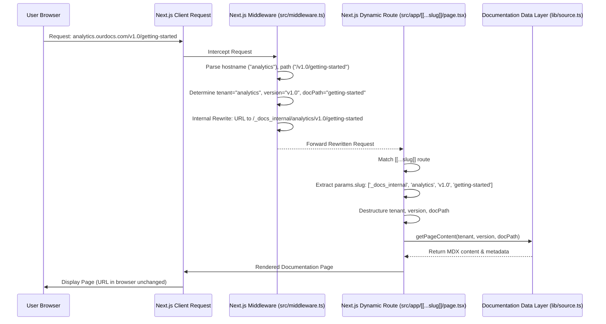

# Chapter 4: Multi-Tenancy & Versioning Routing

In the previous chapter, we explored the [Documentation Data Layer](chapter_03.md), which provides robust programmatic access to our structured content. This layer is crucial for fetching documentation based on specific tenants, versions, and paths. However, simply having a data layer isn't enough; we need a mechanism to translate incoming web requests into these specific content queries. This is precisely where multi-tenancy and versioning routing comes into play.

---

### Problem & Motivation

Imagine building a documentation portal for a large software company that offers several distinct products, each with its own documentation. Furthermore, each product undergoes frequent updates, meaning multiple versions of its documentation must be accessible simultaneously. A traditional single-product, single-version documentation setup simply won't suffice.

The core problem this chapter addresses is: **How do we efficiently and reliably route a user's request (e.g., `docs.myproduct.com/v2.0/api-reference` or `ourdocs.com/another-product/v1.5/getting-started`) to the *correct* set of documentation files (tenant and version) within our highly organized content structure?**

Without a dedicated routing strategy, every new product or version would require custom route definitions, leading to an unmanageable and unscalable system. Our project, `multi-tenant-docs`, aims to solve this by providing a dynamic and configurable routing mechanism that intelligently parses URLs to determine the desired tenant and version, ensuring users always land on the right content. This is critical for delivering a seamless and targeted documentation experience for diverse audiences.

---

### Core Concept Explanation

The heart of our multi-tenancy and versioning routing lies in two powerful Next.js features: **dynamic routes** and **middleware**. Together, they form a flexible pipeline that intercepts, interprets, and directs incoming requests.

**Multi-Tenancy** refers to the architecture where a single instance of an application serves multiple distinct groups of users, or "tenants." In our documentation system, each "tenant" represents a different product or service, with its own dedicated set of documentation. This allows us to host documentation for "Product A" and "Product B" within the same application instance, keeping their content completely separate but accessible through distinct URLs.

**Versioning** is about managing different iterations of a tenant's documentation. As products evolve, their documentation changes. Our system allows for multiple versions (e.g., `v1.0`, `v2.0`, `beta`) of a tenant's documentation to coexist, enabling users to access the relevant information for the product version they are using.

Our routing strategy employs Next.js's **Catch-all Optional Dynamic Routes (`[[...slug]]`)** to capture virtually any incoming path. This route pattern `[[...slug]]` in `src/app/[[...slug]]/page.tsx` (or `src/pages/[[...slug]].tsx` for Pages Router) acts as a wildcard, catching all URL segments and providing them as a `slug` array to our page component. However, the raw `slug` alone doesn't tell us which tenant or version is requested. This is where **Next.js Middleware (`src/middleware.ts`)** steps in. Middleware runs *before* a request reaches the page component. It can inspect the request URL, headers, and even the hostname (for subdomain-based multi-tenancy). Based on this information, the middleware can perform powerful actions like rewriting the URL internally, redirecting the user, or setting request headers, thereby providing crucial context about the `tenant` and `version` to the subsequent page component.

---

### Practical Usage Examples

Let's illustrate how this routing setup works with our example use case: a SaaS company with "AnalyticsPro" and "PaymentsAPI" documentation, each with versions.

#### Scenario 1: Path-based Routing

For path-based multi-tenancy, the URL structure might look like `/analytics-pro/v1.0/getting-started`.

1.  **Define the Catch-all Dynamic Route:**
    Create `src/app/[[...slug]]/page.tsx`. This component will ultimately render the documentation.

    ```tsx
    // src/app/[[...slug]]/page.tsx
    import { notFound } from 'next/navigation';
    import { getPageContent, getNavigation } from '@/lib/source'; // From Chapter 3

    export default async function DocsPage({ params }: { params: { slug?: string[] } }) {
      // The middleware will have pre-processed the tenant and version
      // In a real scenario, these might be passed via headers or rewritten URL segments
      // For this example, let's assume direct slug interpretation
      const [tenant, version, ...restSlug] = params.slug || [];

      if (!tenant || !version) {
        notFound(); // Or redirect to a default docs page
      }

      // We'll use getPageContent and getNavigation in Chapter 5
      // For now, just acknowledge we'd use the parsed tenant/version
      return (
        <div>
          <h1>Tenant: {tenant}, Version: {version}</h1>
          <p>Requested path: /{restSlug.join('/') || 'index'}</p>
          {/* ... render documentation content here (Chapter 5) */}
        </div>
      );
    }
    ```
    *Explanation:* This `page.tsx` catches any path. It then attempts to destructure the `slug` array to extract the `tenant` and `version`. This simplified example shows direct slug interpretation, but in reality, the `middleware.ts` would provide a more robust way to extract these.

2.  **Basic Middleware for Path Interpretation:**
    Create `src/middleware.ts` to log and perhaps rewrite.

    ```typescript
    // src/middleware.ts
    import { NextResponse } from 'next/server';
    import type { NextRequest } from 'next/server';

    export function middleware(request: NextRequest) {
      const url = request.nextUrl.clone();
      const pathSegments = url.pathname.split('/').filter(Boolean); // Remove empty strings

      if (pathSegments.length >= 2) {
        const tenant = pathSegments[0];
        const version = pathSegments[1];
        console.log(`Middleware identified: Tenant=${tenant}, Version=${version}`);
        // Here, we could potentially set headers or rewrite the URL
        // e.g., to a canonical path like /_internal_docs?tenant=X&version=Y&path=Z
        // For simplicity, we'll let the [[...slug]] catch it as is for now.
      }

      return NextResponse.next(); // Continue to the matched page
    }

    export const config = {
      matcher: ['/((?!api|_next/static|_next/image|favicon.ico).*)'], // Exclude static files
    };
    ```
    *Explanation:* The middleware intercepts *all* requests (except those for static assets or API routes). It parses the URL path segments. If enough segments are present, it logs the identified tenant and version. For path-based routing, the `[[...slug]]` route will directly receive these segments as `params.slug`.

#### Scenario 2: Subdomain-based Multi-Tenancy

For subdomain-based multi-tenancy, a user might navigate to `analytics.ourdocs.com/v1.0/setup` or `payments.ourdocs.com/v2.0/integration`. The `middleware.ts` becomes essential here.

```typescript
// src/middleware.ts (Enhanced for subdomain parsing)
import { NextResponse } from 'next/server';
import type { NextRequest } from 'next/server';

export function middleware(request: NextRequest) {
  const url = request.nextUrl.clone();
  const hostname = request.headers.get('host');
  let tenant = 'default'; // Fallback tenant

  // Example: 'analytics.ourdocs.com' -> 'analytics'
  // Or 'localhost:3000' for local development
  if (hostname && hostname.includes('.')) {
    const parts = hostname.split('.');
    if (parts.length > 2) { // e.g., subdomain.domain.com
      tenant = parts[0];
    } else if (parts.length === 2 && parts[0] === 'localhost') { // For local testing
      tenant = 'default'; // Or some predefined local tenant
    }
  }

  // Path segments will typically start with the version
  const pathSegments = url.pathname.split('/').filter(Boolean);
  const version = pathSegments[0] || 'main'; // Default version
  const docPath = pathSegments.slice(1).join('/') || 'index';

  // Rewrite the URL internally to pass context to the [[...slug]] page
  // We'll rewrite to a fixed internal path, appending the tenant, version, and docPath
  // e.g., /_docs_internal/analytics/v1.0/setup
  url.pathname = `/_docs_internal/${tenant}/${version}/${docPath}`;

  // Log for debugging
  console.log(`Rewriting: ${request.nextUrl.pathname} -> ${url.pathname}`);

  return NextResponse.rewrite(url);
}

export const config = {
  matcher: ['/((?!api|_next/static|_next/image|favicon.ico|_docs_internal).*)'],
};
```
*Explanation:*
1.  **`hostname` parsing:** The middleware inspects `request.headers.get('host')` to extract the subdomain, which serves as our `tenant` identifier (e.g., `analytics`).
2.  **Path interpretation:** The remaining path (e.g., `/v1.0/setup`) is then parsed for the `version` and the actual `docPath`.
3.  **`NextResponse.rewrite`:** This is key. Instead of redirecting the user, `rewrite` internally changes the URL that the Next.js router sees. So, `analytics.ourdocs.com/v1.0/setup` is internally treated as if the user requested `/_docs_internal/analytics/v1.0/setup`.
4.  **`matcher` update:** We exclude the `_docs_internal` path from the middleware, preventing infinite loops.

Now, our `src/app/[[...slug]]/page.tsx` needs to be updated to handle this rewritten path. We'd expect `params.slug` to be `['_docs_internal', 'analytics', 'v1.0', 'setup']`.

```tsx
// src/app/[[...slug]]/page.tsx (Updated for middleware rewritten paths)
import { notFound } from 'next/navigation';
// import { getPageContent, getNavigation } from '@/lib/source'; // From Chapter 3

export default async function DocsPage({ params }: { params: { slug?: string[] } }) {
  const slugSegments = params.slug || [];

  // Expecting path like: ['_docs_internal', 'tenant', 'version', 'doc-path-segments...']
  if (slugSegments[0] !== '_docs_internal' || slugSegments.length < 3) {
    notFound(); // If the path isn't structured as expected after middleware
  }

  const [, tenant, version, ...docPathSegments] = slugSegments;
  const docPath = docPathSegments.join('/') || 'index';

  console.log(`Page received: Tenant=${tenant}, Version=${version}, DocPath=${docPath}`);

  // Now, you can use these parameters to fetch content from your data layer (Chapter 3)
  // const content = await getPageContent(tenant, version, docPath);
  // const navigation = await getNavigation(tenant, version);

  return (
    <div>
      <h1>Documentation for {tenant} v{version}</h1>
      <h2>Path: /{docPath}</h2>
      {/* Render content from 'content' and navigation from 'navigation' */}
      <p>This page successfully routed the request using middleware and dynamic routes.</p>
    </div>
  );
}
```
*Explanation:* The page component now expects the specific internal path structure created by the middleware. It reliably extracts the `tenant`, `version`, and `docPath` from the `slug` array, preparing these crucial pieces of information for the content rendering logic.

---

### Internal Implementation Walkthrough

The internal flow for handling a request involves a precise interaction between Next.js's routing mechanisms:

1.  **Request Initiation:** A user types a URL (e.g., `analytics.ourdocs.com/v1.0/getting-started`) into their browser.

2.  **Middleware Interception (`src/middleware.ts`):**
    *   Next.js's runtime intercepts *every* incoming request before it reaches any page or API route.
    *   Our `middleware.ts` is invoked. It accesses the request's `hostname` and `pathname`.
    *   It parses the `hostname` (e.g., `analytics.ourdocs.com`) to identify the `tenant` (`analytics`).
    *   It parses the `pathname` (e.g., `/v1.0/getting-started`) to identify the `version` (`v1.0`) and the rest of the path (`getting-started`).
    *   Crucially, the middleware then uses `NextResponse.rewrite(url)` to internally transform the URL. For instance, `analytics.ourdocs.com/v1.0/getting-started` is rewritten to `/_docs_internal/analytics/v1.0/getting-started`. The user's browser URL remains unchanged.

3.  **Dynamic Route Matching (`src/app/[[...slug]]/page.tsx`):**
    *   After the middleware has potentially rewritten the URL, Next.js proceeds with its routing.
    *   The `[[...slug]]` dynamic route is designed to match any path that hasn't been matched by a more specific route. Since our middleware rewrote the URL to `/_docs_internal/...`, this path now cleanly matches the `[[...slug]]` pattern.
    *   The page component receives the `params.slug` prop, which will be an array corresponding to the segments of the *rewritten* URL (e.g., `['_docs_internal', 'analytics', 'v1.0', 'getting-started']`).

4.  **Parameter Extraction and Content Fetching:**
    *   Inside `src/app/[[...slug]]/page.tsx`, we destructure `params.slug` to extract the `tenant`, `version`, and the remaining `docPath`.
    *   These extracted parameters are then passed to our [Documentation Data Layer](chapter_03.md) functions (e.g., `getPageContent`, `getNavigation`). This layer uses the `tenant`, `version`, and `docPath` to locate and load the correct MDX file and its associated metadata from the `content/docs` directory.

Here's a sequence diagram illustrating this flow:



---

### System Integration

The routing mechanism is a pivotal connector in our `multi-tenant-docs` project, integrating seamlessly with several other core abstractions:

*   **[Documentation Data Layer](chapter_03.md):** The `tenant`, `version`, and `docPath` identified by the routing logic are the *exact* parameters required by the `lib/source.ts` functions (e.g., `getPageContent`, `getNavigation`). The routing provides the "what to fetch" context, and the data layer provides "how to fetch it."
    ```javascript
    // src/app/[[...slug]]/page.tsx (conceptual integration)
    import { getPageContent, getNavigation } from '@/lib/source';

    // ... after extracting tenant, version, docPath ...
    const pageData = await getPageContent(tenant, version, docPath);
    const navData = await getNavigation(tenant, version);
    ```

*   **[Content Organization](chapter_02.md):** The hierarchical structure `content/docs/[tenant]/[version]/[...path].mdx` is directly mirrored by our routing. When the middleware identifies `tenant` and `version`, it's directly mapping to these directories. The `docPath` then points to the specific MDX file within that structure. This ensures that the URL design directly reflects the physical organization of our content.

*   **[Dynamic Documentation Pages](chapter_05.md):** Once the routing has successfully identified the tenant, version, and the specific documentation page to display, these parameters are passed to the page component (covered in Chapter 5). This component then takes these inputs, queries the data layer, and renders the MDX content, navigation, and other UI elements. The routing lays the groundwork for the dynamic rendering of content.

This tight integration ensures a cohesive system where content, data access, and presentation are all orchestrated by a well-defined routing strategy.

---

### Best Practices & Tips

Implementing multi-tenancy and versioning routing effectively requires adherence to certain best practices:

*   **Clear URL Structure:** Design your URLs to be intuitive and predictable. Whether using subdomains (`tenant.docs.com/version/path`) or paths (`docs.com/tenant/version/path`), consistency is key. Our example favors `/tenant/version/path` for `[[...slug]]` after middleware processing.
*   **Robust Middleware Logic:**
    *   **Error Handling:** Implement checks for missing `tenant` or `version` in the URL/hostname. Decide on fallback behavior (e.g., redirect to a default tenant's latest version, show a 404).
    *   **Default Values:** Provide sensible default tenants (e.g., "main") and versions (e.g., "latest" or "main") for requests that don't explicitly specify them.
    *   **Configuration:** Externalize complex middleware logic, perhaps via a configuration file (like `source.config.ts` from Chapter 1) to make it more manageable.
*   **Performance Considerations:** Middleware runs on *every* request. Keep its logic lean and efficient. Avoid heavy computations or blocking I/O operations within `middleware.ts` if possible.
*   **SEO & Canonical URLs:** If you're using `rewrite`, the user's browser URL remains the original one. This is generally good for SEO as the canonical URL is the one visible. If you use `redirect`, ensure you understand the SEO implications (301 for permanent moves, 302 for temporary).
*   **Tenant Isolation:** While routing identifies the tenant, ensure that the data layer (Chapter 3) and page components (Chapter 5) enforce strict tenant data isolation, preventing one tenant's content from being accidentally displayed to another.
*   **Testing:** Thoroughly test your routing logic with various URL patterns, including edge cases like missing segments, invalid tenants/versions, and different environments (local, staging, production).

---

### Chapter Conclusion

This chapter has demystified the crucial role of multi-tenancy and versioning routing in our `multi-tenant-docs` project. We've seen how Next.js's dynamic `[[...slug]]` routes, empowered by the `middleware.ts`, create a sophisticated system for interpreting diverse URL patterns. This allows us to dynamically extract `tenant`, `version`, and `docPath` information from incoming requests, whether they use path-based segments or subdomains.

This routing foundation is essential because it bridges the gap between a user's request and the structured content provided by our [Documentation Data Layer](chapter_03.md). By intelligently directing traffic, we ensure that the correct documentation content is always retrieved. With the request now properly contextualized with `tenant`, `version`, and `docPath`, we are ready to take the next step: using this information to dynamically render the actual documentation pages.

The next chapter will delve into [Dynamic Documentation Pages](chapter_05.md), where we will combine the routing context with our data layer to render interactive and rich MDX-based documentation.