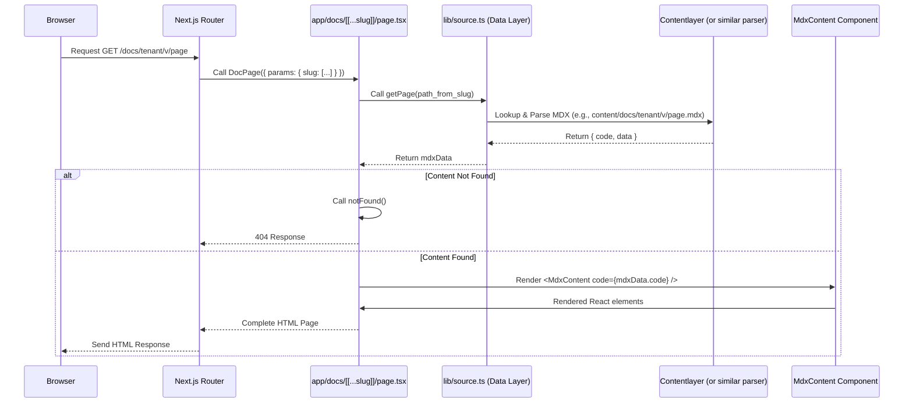

# Chapter 5: Dynamic Documentation Pages

In the previous chapter, [Multi-Tenancy & Versioning Routing](chapter_04.md), we established how our system dynamically routes incoming requests to the correct tenant and documentation version based on the URL. This sophisticated routing mechanism sets the stage for the core functionality of our documentation system: rendering the actual documentation pages. This chapter delves into how these dynamic routes are brought to life, transforming a URL into a fully rendered, interactive documentation page.

---

### Problem & Motivation

The fundamental challenge in any documentation system is displaying content to users. In our `multi-tenant-docs` project, this challenge is amplified by the need to support multiple tenants, various versions of their documentation, and an ever-growing number of individual documentation pages, all without requiring manual setup for each new page. Statically defining routes for every single document would be unmanageable and inflexible, especially for a system designed to scale.

The problem this chapter addresses is how to dynamically render *any* documentation page requested by a user, regardless of its tenant, version, or specific path, using a single, unified Next.js route. This is critical for delivering a seamless user experience, allowing content creators to add new documentation effortlessly, and ensuring the system remains highly scalable and maintainable. Imagine a user navigating to `/docs/mycompany/v2.0/api-reference/authentication`. We need a mechanism to take this URL, locate the corresponding content, process it, and present it beautifully without pre-configuring the "api-reference/authentication" route.

### Core Concept Explanation

At the heart of rendering our dynamic documentation pages is Next.js's powerful **Dynamic Routes** feature, specifically using the "catch-all" segment `[[...slug]]`. This allows a single file, `app/docs/[[...slug]]/page.tsx`, to capture virtually any URL path segment that follows `/docs/`. When a user requests `/docs/tenantA/v1.0/getting-started`, the `params.slug` object in `page.tsx` will receive an array like `['tenantA', 'v1.0', 'getting-started']`.

This dynamic `page.tsx` acts as the orchestrator. It takes the `slug` array, translates it into a content lookup key, and then leverages our pre-built [Documentation Data Layer](chapter_03.md) to fetch the actual MDX content and its associated metadata. Once the raw MDX is retrieved, it's processed and rendered into HTML. This entire process is performed on the server (thanks to Next.js App Router's server components), ensuring fast initial load times and good SEO. The key here is the separation of concerns: routing handles *where* to go, the data layer handles *what* content to get, and the dynamic page handles *how* to display it.

### Practical Usage Examples

Let's walk through how `app/docs/[[...slug]]/page.tsx` handles a typical request. Our goal is to display a page located at `/content/docs/my-tenant/1.0/introduction.mdx` when the user visits `/docs/my-tenant/1.0/introduction`.

First, let's look at the simplified structure of our `page.tsx` file:

```tsx
// app/docs/[[...slug]]/page.tsx
import { notFound } from 'next/navigation';
import { getPage } from '@/lib/source'; // Our data layer
import { MdxContent } from '@/components/mdx/MdxContent'; // Renders MDX

interface DocPageProps {
  params: { slug: string[] };
}

export default async function DocPage({ params }: DocPageProps) {
  const pagePath = params.slug.join('/'); // Reconstruct path from slug

  // Fetch content using our documentation data layer
  const mdxData = await getPage(pagePath);

  if (!mdxData) {
    notFound(); // If content not found, show 404
  }

  return (
    <div className="doc-container">
      <h1>{mdxData.data.title}</h1>
      <MdxContent code={mdxData.code} /> {/* Render MDX */}
    </div>
  );
}
```
**Explanation:**
- The `DocPage` component is an `async` server component, meaning it can fetch data directly.
- `params.slug` is an array containing the path segments from the URL (e.g., `['my-tenant', '1.0', 'introduction']`).
- `params.slug.join('/')` reconstructs the internal content path (`my-tenant/1.0/introduction`).
- `getPage(pagePath)` is a function from our [Documentation Data Layer](chapter_03.md) that fetches and parses the MDX file corresponding to `pagePath`.
- If `mdxData` is not found, Next.js's `notFound()` utility is called, displaying a 404 page.
- `mdxData.data.title` extracts the title from the MDX frontmatter.
- `<MdxContent code={mdxData.code} />` is a client component responsible for dynamically rendering the MDX content using the compiled `code` received from the data layer. (More on this in [Custom MDX Components](chapter_06.md)).

Now, let's consider the `getPage` function from our `lib/source.ts` (simplified for this example):

```typescript
// lib/source.ts (simplified)
import { allDocs } from 'contentlayer/generated'; // Or similar content source

export async function getPage(slugPath: string) {
  // Find the contentlayer document that matches the slug
  const doc = allDocs.find((d) => d._raw.flattenedPath === slugPath);

  if (!doc) {
    return null;
  }

  // Contentlayer automatically provides the compiled code and data
  return {
    code: doc.body.code,
    data: doc, // All frontmatter and metadata
  };
}
```
**Explanation:**
- This `getPage` function (or similar logic depending on the data layer implementation) directly uses the pre-generated `allDocs` from `contentlayer` (or any other content processing library).
- It looks for a document whose `_raw.flattenedPath` matches the `slugPath` derived from the URL.
- If found, it returns an object containing the compiled MDX `code` and `data` (frontmatter and other metadata).

### Internal Implementation Walkthrough

The process of rendering a dynamic documentation page involves several steps, from the user's initial request to the final display of content.

1.  **Request Reception:** The user's browser sends a request, e.g., `GET /docs/my-tenant/v1.0/getting-started`.
2.  **Next.js Routing:** Next.js's App Router intercepts this request. Given the file structure `app/docs/[[...slug]]/page.tsx`, it identifies this file as the handler.
3.  **Parameter Extraction:** The `[[...slug]]` dynamic segment captures `['my-tenant', 'v1.0', 'getting-started']` and makes it available as `params.slug` to `page.tsx`.
4.  **Content Path Derivation:** Inside `page.tsx`, `params.slug.join('/')` constructs the logical path `my-tenant/v1.0/getting-started`.
5.  **Data Layer Call:** The `getPage(pagePath)` function from `lib/source.ts` is invoked.
6.  **Content Lookup & Processing:**
    *   `lib/source.ts` uses its internal mechanisms (e.g., `contentlayer`'s `allDocs` array) to find the `.mdx` file matching the `pagePath`.
    *   If the MDX file is found, its frontmatter is extracted (e.g., `title`, `description`) and the MDX content is compiled into executable JavaScript (`mdxData.code`). This compilation includes processing custom components and plugins.
    *   If not found, `getPage` returns `null`.
7.  **Error Handling (404):** Back in `page.tsx`, if `mdxData` is `null`, `notFound()` is called, halting the render and serving a 404 page.
8.  **MDX Rendering:** If content is found, `mdxData.code` is passed to the `<MdxContent />` component. This component dynamically imports and executes the compiled MDX code, transforming it into React elements. Any custom MDX components defined in our system are used during this rendering process.
9.  **Page Layout & Response:** The rendered MDX content is embedded within the overall page layout (e.g., header, sidebar, footer), and the complete HTML is sent back to the user's browser.

Here's a sequence diagram illustrating this flow:



### System Integration

The `app/docs/[[...slug]]/page.tsx` component is a crucial nexus point, integrating several key abstractions of our `multi-tenant-docs` project:

*   **[Multi-Tenancy & Versioning Routing](chapter_04.md):** This chapter's `page.tsx` file directly consumes the `params.slug` array generated by the dynamic routing mechanism (and potentially modified by `middleware.ts`). The routing ensures that `page.tsx` receives the correct path segments required to locate the specific documentation.
*   **[Documentation Data Layer](chapter_03.md):** The `page.tsx` heavily relies on the `lib/source.ts` module to programmatically fetch, parse, and prepare the MDX content. This separation of concerns means `page.tsx` doesn't need to know the details of file system access or MDX compilation; it just asks the data layer for the content.
*   **[Content Organization](chapter_02.md):** The internal structure of our `content/docs` directory, organized by tenant and version, directly informs how the `slug` is interpreted and how the `getPage` function in the data layer locates the correct MDX file.
*   **[Custom MDX Components](chapter_06.md):** Once `page.tsx` retrieves the compiled MDX, it passes it to an `MdxContent` component (or similar wrapper) which then uses our custom MDX components to render interactive and rich content. Without these custom components, the MDX would be basic text and HTML.

This interconnectedness highlights how each piece of the architecture works in concert to deliver the final user experience.

### Best Practices & Tips

1.  **Robust Error Handling:** Always check if content is found (`if (!mdxData) notFound();`) to prevent crashes and provide a good user experience for non-existent pages. Consider more granular error pages for different scenarios (e.g., `500` for data layer issues).
2.  **Metadata for SEO:** Ensure your `page.tsx` component extracts `title`, `description`, and other SEO-relevant fields from the `mdxData.data` (frontmatter) and passes them to Next.js's `metadata` export for optimal search engine visibility.
    ```tsx
    // app/docs/[[...slug]]/page.tsx (partial)
    import type { Metadata } from 'next';
    // ... other imports

    export async function generateMetadata({ params }: DocPageProps): Promise<Metadata> {
      const pagePath = params.slug.join('/');
      const mdxData = await getPage(pagePath);

      if (!mdxData) {
        return {}; // Or default metadata
      }

      return {
        title: mdxData.data.title,
        description: mdxData.data.description,
        // ... other meta tags
      };
    }

    export default async function DocPage({ params }: DocPageProps) { /* ... */ }
    ```
3.  **Loading States (for client components):** While `page.tsx` is a server component, if you have client-side interactive elements, consider adding loading indicators or skeleton screens to improve perceived performance during data fetching for those parts.
4.  **Performance Optimization:**
    *   **Caching:** The `getPage` function in the data layer can implement caching mechanisms (e.g., `revalidate` in Next.js `fetch` or a custom in-memory cache) to avoid re-parsing MDX for every request, especially for frequently accessed pages.
    *   **Minimize Client-Side JavaScript:** Only hydrate client components where interactivity is truly needed. The majority of your documentation should be rendered statically on the server.
5.  **Dynamic Navigation:** The same `mdxData.data` object often contains information about the page's place in the overall navigation structure (e.g., parent, siblings). Use this to render dynamic sidebars or breadcrumbs, enhancing user navigation.

### Chapter Conclusion

This chapter has illuminated how our `multi-tenant-docs` project dynamically renders documentation pages using Next.js's powerful routing capabilities and our custom data layer. We've explored the problem of serving diverse content efficiently, the core concept of dynamic `page.tsx` components, and walked through its practical implementation and internal workings. By integrating with our data layer and custom MDX components, we achieve a flexible, scalable, and rich documentation experience. This dynamic page generation is the bridge that connects our structured content and clever routing to the end-user's browser.

Next, we'll dive deeper into how we make these pages truly interactive and visually appealing by exploring [Custom MDX Components](chapter_06.md), which transform static markdown into rich, dynamic elements.