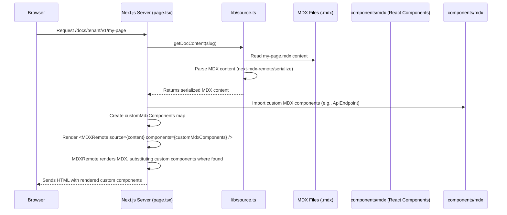

# Chapter 6: Custom MDX Components

In the [previous chapter, Dynamic Documentation Pages](chapter_05.md), we explored how our Next.js application dynamically renders documentation content based on the URL. We saw how `app/docs/[[...slug]]/page.tsx` fetches MDX content and presents it to the user. While dynamically rendered Markdown is powerful for static text, modern documentation often requires more: interactive examples, live code snippets, dynamic data visualizations, or even integrated API callers.

---

### Problem & Motivation

Static documentation, though foundational, often falls short in conveying complex information or enabling user interaction. Imagine a documentation page describing an API endpoint. A purely static description would list the method, URL, and parameters. However, users often want to see real-time examples, try out the API with different inputs, or visualize the response structure. Without these interactive elements, the learning curve is steeper, and the documentation feels less engaging.

In the context of the `multi-tenant-docs` project, this problem is amplified. Each tenant might have unique APIs, specific UI elements, or custom data representations they need to convey. Providing a rigid, one-size-fits-all markdown template would limit their ability to deliver rich, effective documentation. Custom MDX components offer a solution by allowing tenants to embed dynamic, interactive UI directly within their markdown files, making the documentation an active learning tool rather than just a passive reference. For instance, a tenant might want to include an `ApiEndpoint` component that visually details an API, and an `APICaller` component that lets users make live requests to that API, right from the documentation page.

### Core Concept Explanation

MDX (Markdown + JSX) is a powerful tool that combines the simplicity of Markdown with the expressiveness of JSX. This means you can write standard Markdown for text, headings, and lists, and seamlessly embed React components directly within your `.mdx` files. These components behave just like any other React component, accepting props and managing their own state, but they render alongside your static markdown content.

The `multi-tenant-docs` system leverages MDX components to transform static documentation into interactive experiences. When a documentation page is rendered, the MDX parser processes the content. Upon encountering what looks like a React component (e.g., `<ApiEndpoint url="/api/data" method="GET" />`), it renders the corresponding React component instead of treating it as plain text. This allows for rich features like live code playgrounds, dynamic charts, or, as in our guiding use case, interactive API explorers and testers directly within the content. The magic lies in passing a map of your custom components to the MDX rendering library, telling it which React component corresponds to which tag name in your MDX.

---

### Practical Usage Examples

Let's illustrate how to define and use a custom MDX component. We'll start with a simple `Highlight` component and then consider our `ApiEndpoint` example.

First, define your React component. Create a file like `components/mdx/Highlight.tsx`:

```tsx
// components/mdx/Highlight.tsx
import React from 'react';

interface HighlightProps {
  children: React.ReactNode;
  color?: string;
}

const Highlight: React.FC<HighlightProps> = ({ children, color = 'yellow' }) => {
  return (
    <span style={{ backgroundColor: color, padding: '2px 4px', borderRadius: '3px' }}>
      {children}
    </span>
  );
};

export default Highlight;
```
This simple component wraps its children in a `<span>` with a customizable background color.

Next, you need to make this component available to your MDX renderer. In `app/docs/[[...slug]]/page.tsx`, where MDX content is rendered, you typically pass a `components` object:

```tsx
// app/docs/[[...slug]]/page.tsx (snippet)
import { MDXRemote } from 'next-mdx-remote';
import Highlight from '@/components/mdx/Highlight';
// ... other imports

// Define your custom components object
const customMdxComponents = {
  Highlight: Highlight,
  // Add other components here, e.g., ApiEndpoint, APICaller
  // ApiEndpoint: ApiEndpointComponent,
  // APICaller: APICallerComponent,
};

export default async function DocPage({ params }: { params: { slug: string[] } }) {
  // ... (content fetching logic from previous chapter)
  const { content } = await getDocContent(...); // Fetches MDX string

  return (
    <div>
      {/* ... page layout */}
      <MDXRemote
        source={content.code}
        components={customMdxComponents} // Pass your custom components here
      />
    </div>
  );
}
```
Here, we import `Highlight` and include it in `customMdxComponents`. The `MDXRemote` component then uses this map to find and render our component when it encounters `<Highlight>`.

Now, you can use this `Highlight` component directly within any `.mdx` file:

```mdx
# My Awesome Feature

This is a regular paragraph.

You can use the <Highlight>Highlight</Highlight> component to emphasize text.
You can even customize its <Highlight color="lightblue">color</Highlight>!

```
When rendered, this MDX will display "Highlight" with a yellow background and "color" with a lightblue background, transforming the static markdown with dynamic styling.

For our guiding use case, imagine `components/mdx/ApiEndpoint.tsx` and `components/mdx/APICaller.tsx` are defined.
Your `customMdxComponents` object in `page.tsx` would look like this:

```tsx
// app/docs/[[...slug]]/page.tsx (customMdxComponents snippet)
import ApiEndpoint from '@/components/mdx/ApiEndpoint';
import APICaller from '@/components/mdx/APICaller';
import Highlight from '@/components/mdx/Highlight';

const customMdxComponents = {
  Highlight: Highlight,
  ApiEndpoint: ApiEndpoint,
  APICaller: APICaller,
  // ... other components
};
```
And then, in an MDX file, you could use them like this:

```mdx
# User Management API

This section details our API for managing user accounts.

<ApiEndpoint
  method="GET"
  path="/api/v1/users/{userId}"
  description="Retrieve details for a specific user."
  parameters={[
    { name: "userId", type: "string", description: "The ID of the user." }
  ]}
  responseSchema={{ id: "string", name: "string", email: "string" }}
/>

### Try it out!

Use the interactive caller below to fetch user data.

<APICaller
  endpoint="/api/v1/users/123"
  method="GET"
  exampleParams={{ userId: "123" }}
/>
```
This approach allows tenants to embed rich, interactive API documentation directly within their static content, significantly enhancing usability.

---

### Internal Implementation Walkthrough

The integration of custom MDX components involves several key steps within the Next.js application lifecycle.

1.  **Component Definition**: Custom MDX components are standard React components, typically stored in a dedicated directory like `components/mdx`. For example, `components/mdx/ApiEndpoint.tsx` would contain the React code for rendering an interactive API endpoint display. These components can import other React components, utility functions, or even fetch data.

2.  **MDX Content Parsing**: When a documentation page is requested, the `lib/source.ts` module (as discussed in [Chapter 3: Documentation Data Layer](chapter_03.md)) reads the MDX file. It then uses an MDX parser (like `next-mdx-remote/serialize`) to transform the raw MDX string into a format that `next-mdx-remote` can render. During this serialization, MDX component tags are identified.

3.  **Component Mapping**: In `app/docs/[[...slug]]/page.tsx`, before rendering, we create a JavaScript object (e.g., `customMdxComponents`) that maps component tag names (like `'ApiEndpoint'`) to their corresponding React component implementations.

4.  **Dynamic Rendering**: The `MDXRemote` component from `next-mdx-remote` receives the serialized MDX content and this `customMdxComponents` object. When it encounters a custom component tag within the MDX, it looks up the tag name in the `components` object and renders the associated React component, passing any attributes from the MDX tag as props.

Here's a simplified sequence diagram illustrating this flow:



This sequence shows that the `page.tsx` acts as the orchestrator, fetching the MDX, defining the available components, and then passing both to the `MDXRemote` renderer.

---

### System Integration

Custom MDX components are deeply integrated with several other core abstractions in the `multi-tenant-docs` system:

*   **[Dynamic Documentation Pages](chapter_05.md)**: This is the primary integration point. The `app/docs/[[...slug]]/page.tsx` route is responsible for rendering the MDX content. It fetches the raw MDX string from the data layer and then renders it using `next-mdx-remote`, passing the custom components via the `components` prop. Without this dynamic page, the MDX components would have no context to be rendered within.

*   **[Documentation Data Layer](chapter_03.md)**: The `lib/source.ts` module, part of the data layer, is responsible for reading the `.mdx` files and performing the initial MDX serialization. It doesn't directly handle the custom component *rendering*, but it provides the processed MDX content that the `MDXRemote` component then consumes, including the embedded component tags.

*   **[Content Organization](chapter_02.md)**: Custom MDX components are typically stored outside the `content/docs` directory (e.g., in `components/mdx`), but their usage is dictated by the `.mdx` files residing within the content structure. The ability to use these components enhances the content's richness, making the organized content more valuable.

*   **[Content Sourcing Configuration](chapter_01.md)**: While `source.config.ts` primarily deals with file discovery, it could implicitly influence how components are loaded. For instance, a configuration could define a global set of available MDX components, or specify paths where tenant-specific components might reside, though for flexibility, passing components directly in `page.tsx` is often preferred.

In essence, custom MDX components provide the "frontend" interactivity for the "backend" content retrieved and processed by the data layer and rendered by the dynamic pages.

---

### Best Practices & Tips

*   **Keep Components Focused and Reusable**: Design your MDX components to do one thing well. A component for displaying API endpoints (`ApiEndpoint`) should be distinct from one that calls the API (`APICaller`). This promotes reusability across different documentation pages and tenants.
*   **Use Props for Configuration**: Avoid hardcoding values within your MDX components. Instead, pass data and configuration via props from the MDX file (e.g., `<ApiEndpoint method="GET" path="/api/users" />`). This makes the components flexible and adaptable.
*   **Client vs. Server Components**: Be mindful of Next.js's App Router component model. If your MDX component needs client-side interactivity (e.g., state, event handlers, browser APIs), mark it as a Client Component (`'use client';` at the top of the file). Components that only render UI without client-side logic can remain Server Components for better performance.
*   **Data Fetching**: For components that need dynamic data (like `APICaller` fetching real API responses), consider where the data fetching occurs. For static data, it might be prefetched in `page.tsx` and passed as props. For real-time or interactive data, the component itself might fetch data on the client side.
*   **Error Handling and Fallbacks**: Ensure your custom components gracefully handle missing or invalid props. Provide sensible default values or display clear error messages to the user within the documentation.
*   **Performance Considerations**: Large, complex MDX components can impact page load times. Optimize your components, lazy-load heavy dependencies, and consider using React's `memo` for components that don't need to re-render often.
*   **Accessibility**: Always consider accessibility when building interactive components. Ensure keyboard navigation, proper ARIA attributes, and sufficient contrast for text.

---

### Chapter Conclusion

Custom MDX components are an indispensable tool for elevating documentation from static text to rich, interactive experiences. By combining the ease of Markdown with the power of React, the `multi-tenant-docs` system empowers tenants to create highly engaging and informative content, bridging the gap between explanation and practical application. We've seen how to define, integrate, and effectively utilize these components to enhance the clarity and utility of our documentation.

As we move forward, many of these interactive components, like our `APICaller` example, will need to communicate with the outside world to fetch or submit data. This brings us naturally to our next topic: how we provide structured access to this project's underlying data and functionality through dedicated API endpoints.

Continue to the next chapter to explore: [Data API Endpoints](chapter_07.md)