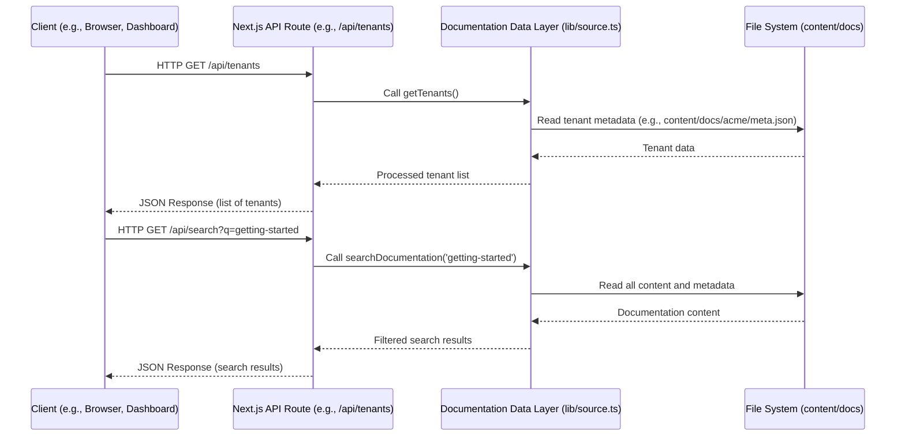

# Chapter 7: Data API Endpoints

In the previous chapter, we explored how [Custom MDX Components](chapter_06.md) can enrich our documentation pages with interactive UI elements, making the content more dynamic and engaging. While MDX components enhance the *presentation* of documentation, there are often scenarios where the *data itself* needs to be programmatically accessible, independent of the rendered pages. This is where Data API Endpoints come into play.

---

## Problem & Motivation

Imagine a scenario where the internal documentation portal needs to integrate with other services. Perhaps a dashboard requires a list of all active tenants in the system, or a search indexing service needs to crawl and update its index based on the latest documentation content without rendering entire pages. The core problem is that our documentation system, while excellent at serving content via Next.js routes, doesn't inherently expose its underlying data in a structured, machine-readable format for external or internal programmatic consumption.

This project, `multi-tenant-docs`, manages a wealth of information: tenant details, documentation versions, navigation structures, and the content of individual MDX files. Without dedicated API endpoints, any external system wanting to leverage this information would have to scrape the rendered HTML pages, which is inefficient, brittle, and not a sustainable solution. Exposing RESTful API endpoints solves this by providing a clean, consistent, and secure interface for external applications, dashboards, or even other parts of the same application (like a client-side search UI) to interact with our documentation data. For instance, a common use case is providing a `/api/search` endpoint that allows client-side JavaScript to perform full-text searches across all tenants' documentation without requiring a full page reload or complex server-side rendering for every search query.

---

## Core Concept Explanation

Data API Endpoints are dedicated routes within our Next.js application that, instead of rendering HTML pages, respond with structured data—typically JSON. These endpoints act as programmatic interfaces to the underlying documentation data layer. Think of them as dedicated data retrieval services that speak the language of other applications.

For the `multi-tenant-docs` project, these endpoints serve several purposes: providing a list of all tenants, enabling a search function across documentation content, or potentially exposing navigation structures. Each endpoint is designed to fulfill a specific data request. For example, a `/api/tenants` endpoint might return an array of tenant objects, while `/api/search` could take a query parameter and return a list of matching documentation pages. Unlike the dynamic documentation pages handled by `app/docs/[[...slug]]/page.tsx`, which focus on content rendering, API routes, usually defined under the `app/api/` directory, are solely concerned with serving raw data. This separation of concerns allows for robust data access independent of the UI.

---

## Practical Usage Examples

Let's look at how we can interact with some hypothetical API endpoints that our `multi-tenant-docs` project might expose. These examples demonstrate how external clients (like a simple `fetch` request or `curl`) can retrieve structured data.

### 1. Listing All Tenants

A common requirement is to get an overview of all tenants configured in the system. The `/api/tenants` endpoint provides this.

```javascript
// client-side or server-side JavaScript
async function getTenants() {
  const response = await fetch('/api/tenants');
  const data = await response.json();
  console.log(data);
}
getTenants();
```

**Expected Output (console.log):**
```json
[
  { "id": "acme", "name": "Acme Corp", "description": "Documentation for Acme Corp products." },
  { "id": "globex", "name": "Globex Inc.", "description": "Globex internal documentation." }
]
```
This example shows a JavaScript `fetch` call to retrieve a list of all tenants. The `response.json()` method parses the JSON response into a JavaScript object. This data can then be used to populate a dropdown, display a list on a dashboard, or feed into another system.

### 2. Performing a Search Query

A powerful feature is enabling a programmatic search across all documentation. The `/api/search` endpoint can accept a `q` (query) parameter to perform this.

```javascript
// client-side or server-side JavaScript
async function searchDocs(query) {
  const response = await fetch(`/api/search?q=${encodeURIComponent(query)}`);
  const data = await response.json();
  console.log(data);
}
searchDocs('getting started');
```

**Expected Output (console.log):**
```json
[
  {
    "title": "Getting Started with Acme",
    "path": "/acme/1.0/getting-started",
    "tenantId": "acme",
    "version": "1.0",
    "excerpt": "This guide helps you to *get started* with our services..."
  },
  {
    "title": "Globex Quickstart Guide",
    "path": "/globex/2.1/quickstart",
    "tenantId": "globex",
    "version": "2.1",
    "excerpt": "Follow these steps for a *quick start* on Globex platform..."
  }
]
```
Here, we make a `fetch` request to `/api/search`, passing our search term as a URL query parameter. The endpoint responds with an array of matching documentation pages, including their title, full path, and a brief excerpt. This is invaluable for building client-side search interfaces.

---

## Internal Implementation Walkthrough

Next.js provides a robust way to create API endpoints through its App Router's `app/api` directory. Any file within this directory ending with `route.ts` (or `.js`, `.mjs`, etc.) becomes an API endpoint. These files export handler functions for different HTTP methods (e.g., `GET`, `POST`, `PUT`, `DELETE`).

Let's walk through the implementation of the `/api/tenants` and `/api/search` endpoints.

### 1. `app/api/tenants/route.ts`

This file handles requests to `/api/tenants`. Its primary job is to retrieve the list of all configured tenants from our [Documentation Data Layer](chapter_03.md) and return them as a JSON response.

```typescript
// app/api/tenants/route.ts
import { NextResponse } from 'next/server';
import { getTenants } from '@/lib/source'; // Our data layer utility

export async function GET() {
  try {
    const tenants = await getTenants(); // Call our data layer to get tenant info
    return NextResponse.json(tenants); // Return as JSON response
  } catch (error) {
    console.error('Failed to fetch tenants:', error);
    return NextResponse.json(
      { message: 'Internal Server Error' },
      { status: 500 }
    );
  }
}
```
**Explanation:**
1.  `import { NextResponse } from 'next/server';`: Imports Next.js's utility for creating API responses.
2.  `import { getTenants } from '@/lib/source';`: Imports the `getTenants` function from our `lib/source.ts` data layer, which is responsible for reading the `meta.json` files and compiling tenant information.
3.  `export async function GET() { ... }`: Defines the handler for HTTP `GET` requests to this endpoint.
4.  Inside `GET`, `getTenants()` is called. The result is then wrapped in `NextResponse.json()` to send it back to the client as a JSON object.
5.  Basic error handling is included to catch issues during data retrieval.

### 2. `app/api/search/route.ts`

This file handles requests to `/api/search` and requires a query parameter.

```typescript
// app/api/search/route.ts
import { NextResponse } from 'next/server';
import { searchDocumentation } from '@/lib/source'; // Our data layer utility

export async function GET(request: Request) {
  const { searchParams } = new URL(request.url);
  const query = searchParams.get('q'); // Get the 'q' query parameter

  if (!query) {
    return NextResponse.json(
      { message: 'Query parameter "q" is required' },
      { status: 400 }
    );
  }

  try {
    const results = await searchDocumentation(query); // Call our data layer search function
    return NextResponse.json(results);
  } catch (error) {
    console.error('Failed to perform search:', error);
    return NextResponse.json(
      { message: 'Internal Server Error' },
      { status: 500 }
    );
  }
}
```
**Explanation:**
1.  `export async function GET(request: Request) { ... }`: The `GET` handler now receives a `Request` object, which contains the URL.
2.  `const { searchParams } = new URL(request.url);`: Extracts the URL's search parameters.
3.  `const query = searchParams.get('q');`: Retrieves the value of the `q` parameter.
4.  A check ensures that `q` is provided; otherwise, a 400 Bad Request error is returned.
5.  `searchDocumentation(query)` (a function within `lib/source.ts`) is called to perform the actual search logic, which would likely involve iterating through content and matching the query.
6.  The search results are returned as JSON.

### Data Flow for API Endpoints

The process for API endpoint requests can be visualized as follows:


This diagram illustrates that the client makes a direct request to the Next.js API route. The API route then leverages the existing [Documentation Data Layer](chapter_03.md) (our `lib/source.ts` module) to fetch or process the required information from the content stored on the file system. Finally, the API route formats this data as JSON and sends it back to the client.

---

## System Integration

Data API Endpoints are a crucial layer for interoperability in the `multi-tenant-docs` system.

*   **Integration with the [Documentation Data Layer](chapter_03.md)**: The API routes (`app/api/.../route.ts`) are direct consumers of the functions exposed by `lib/source.ts`. This data layer encapsulates all the logic for reading, parsing, and processing documentation content and metadata. This ensures a single source of truth for how content is accessed, whether for rendering pages or serving via an API.
*   **Complementing [Multi-Tenancy & Versioning Routing](chapter_04.md)**: While the routing mechanism in `app/docs/[[...slug]]/page.tsx` is responsible for rendering tenant- and version-specific documentation *pages*, the API endpoints provide programmatic access to the *data* behind those tenants and versions. For example, `/api/tenants` provides a list of all tenants, which is metadata that `middleware.ts` might use to validate requests, but the API endpoint makes this accessible externally.
*   **Potential for [Custom MDX Components](chapter_06.md) to consume APIs**: Although less common for simple display components, a more advanced custom MDX component (e.g., an `APISearch` component) could technically make client-side calls to `/api/search` to provide live search results directly within a documentation page. This would connect the interactive UI with the programmatic data access.
*   **External System Interoperability**: The primary integration benefit is enabling other applications (e.g., monitoring dashboards, mobile apps, other microservices) to consume data from `multi-tenant-docs` without needing to understand its internal rendering logic.

---

## Best Practices & Tips

When designing and implementing Data API Endpoints, consider these best practices to ensure they are robust, performant, and maintainable:

*   **Error Handling**: Always provide meaningful error responses (e.g., HTTP status codes like 400 for bad requests, 404 for not found, 500 for server errors) and clear error messages. This helps API consumers diagnose issues.
*   **Authentication & Authorization**: For any sensitive data or write operations, implement proper authentication (e.g., API keys, JWTs, OAuth) and authorization to ensure only legitimate and authorized users/services can access or modify data. While not explicitly implemented in this basic example, it's critical for production systems.
*   **Input Validation**: Validate all incoming query parameters, headers, and request bodies to prevent security vulnerabilities (like injection attacks) and ensure the API behaves predictably. For instance, ensuring the `q` parameter in `/api/search` is a string of a reasonable length.
*   **Caching**: Implement caching strategies (e.g., HTTP caching headers, in-memory caches, CDN caching) for frequently accessed data that doesn't change often. This can significantly improve performance and reduce server load.
*   **Rate Limiting**: Protect your API from abuse or unintentional overload by implementing rate limiting, which restricts the number of requests a client can make within a certain timeframe.
*   **Clear Documentation**: Just as important as documenting the code, document your API endpoints using tools like OpenAPI (Swagger). This provides a clear contract for consumers, detailing available endpoints, parameters, request/response formats, and error codes.
*   **Versioning**: As your API evolves, consider versioning (e.g., `/api/v1/tenants`, `/api/v2/tenants`) to prevent breaking changes for existing consumers.
*   **Consistency**: Maintain consistent naming conventions, data structures, and error formats across all your API endpoints for a better developer experience.

---

## Chapter Conclusion

Data API Endpoints are the backbone of programmatic interaction with our `multi-tenant-docs` system. They transform the content and metadata managed by the application into consumable data streams, enabling powerful integrations with external services, client-side applications, and backend systems. By leveraging Next.js API Routes and integrating them with our well-defined [Documentation Data Layer](chapter_03.md), we've created a versatile and extensible platform.

This chapter concludes our comprehensive documentation of the `multi-tenant-docs` project. We've journeyed from configuring content sources and organizing documentation, through building the data layer, implementing robust routing and dynamic pages, enhancing content with custom components, and finally, exposing data programmatically via APIs. This complete methodology ensures that every aspect of the project is understood, from its core concepts to its detailed implementation and best practices, providing a solid foundation for development, usage, and future enhancements.