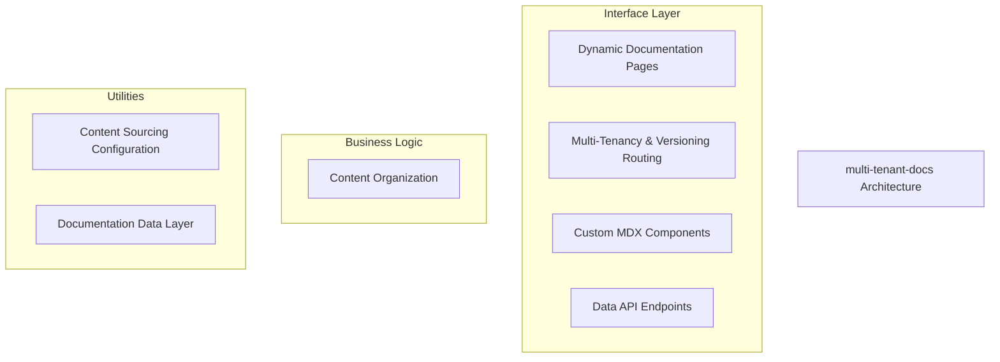
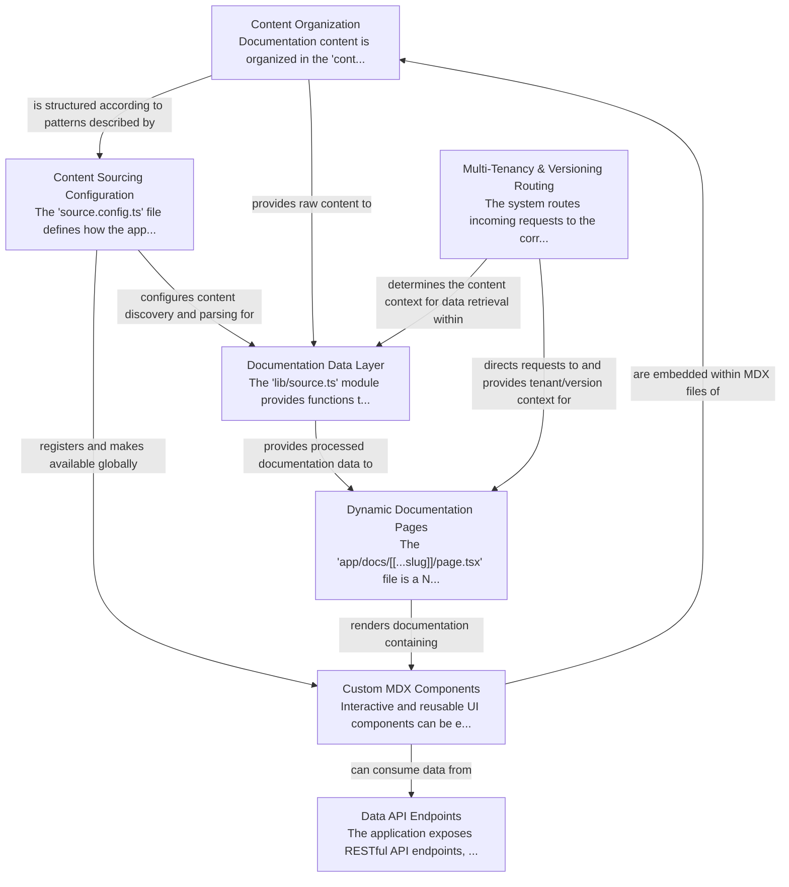

# multi-tenant-docs Tutorial

Welcome to the comprehensive tutorial for multi-tenant-docs. This tutorial is automatically generated from the codebase to help you understand the core concepts and implementation patterns.

## Project Overview

This multi-tenant documentation system organizes content by tenant and version, dynamically serving it via Next.js routes. A configurable data layer processes MDX files, providing content and navigation, while custom MDX components enhance interactivity. The architecture supports robust multi-tenancy and versioning, complemented by API endpoints for programmatic data access.

## System Architecture

## Component Relationships

## Table of Contents

1. [Chapter 1: Content Sourcing Configuration](chapter_01.md) - Comprehensive documentation for Content Sourcing Configuration following structured methodology...
2. [Chapter 2: Content Organization](chapter_02.md) - Comprehensive documentation for Content Organization following structured methodology...
3. [Chapter 3: Documentation Data Layer](chapter_03.md) - Comprehensive documentation for Documentation Data Layer following structured methodology...
4. [Chapter 4: Multi-Tenancy & Versioning Routing](chapter_04.md) - Comprehensive documentation for Multi-Tenancy & Versioning Routing following structured methodology...
5. [Chapter 5: Dynamic Documentation Pages](chapter_05.md) - Comprehensive documentation for Dynamic Documentation Pages following structured methodology...
6. [Chapter 6: Custom MDX Components](chapter_06.md) - Comprehensive documentation for Custom MDX Components following structured methodology...
7. [Chapter 7: Data API Endpoints](chapter_07.md) - Comprehensive documentation for Data API Endpoints following structured methodology...

## How to Use This Tutorial

1. **Start with Chapter 1** to understand the foundational concepts
2. **Follow the sequence** - each chapter builds upon previous concepts
3. **Practice with code examples** - every chapter includes practical examples
4. **Refer to diagrams** - use architecture diagrams for visual understanding
5. **Cross-reference concepts** - chapters link to related topics

## Tutorial Features

- **Progressive Learning**: Concepts are introduced in logical order
- **Code Examples**: Every chapter includes practical, executable code
- **Visual Diagrams**: Mermaid diagrams illustrate complex relationships
- **Cross-References**: Easy navigation between related concepts
- **Beginner-Friendly**: Written for newcomers to the codebase

## Contributing

This tutorial is auto-generated from the codebase. To improve it:
1. Update the source code documentation
2. Add more detailed comments to key functions
3. Regenerate the tutorial using the documentation system

---

*Generated using AI-powered codebase analysis*
