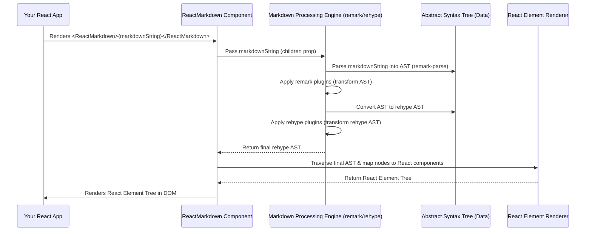

# Chapter 1: ReactMarkdown Component

This is the first chapter in our journey through the `react-markdown` project. We'll start at the very core: the `ReactMarkdown` component itself, the primary interface users interact with.

---

### Problem & Motivation

In modern web development, dynamic content is king. Often, this content comes in the form of plain text that needs to be presented richly—think user-generated comments, blog posts, documentation, or even interactive tutorials. While HTML is the ultimate rendering target, expecting users to write valid and safe HTML is unrealistic and fraught with security risks. Manually converting plain text with formatting into HTML is tedious and error-prone. This leads to a common problem: **How do we allow users to easily format text in a human-readable way, like using headings, bold text, lists, and links, and then safely render that formatted text as interactive UI in a React application?**

This is precisely the problem `react-markdown` solves. It empowers developers to accept **markdown**—a lightweight, easy-to-read, and easy-to-write markup language—and seamlessly transform it into a React component tree. Without `react-markdown`, you'd have to parse markdown, sanitize HTML, and manually create React elements, which is a significant undertaking. The `ReactMarkdown` component abstracts away this complexity, making it crucial for any React application that needs to display dynamic, user-friendly content.

For instance, imagine a blogging platform where authors write their posts in markdown. The `ReactMarkdown` component allows these posts to be rendered beautifully and interactively on the reader's screen, preserving all the author's formatting choices without exposing the application to raw HTML vulnerabilities.

---

### Core Concept Explanation

The `ReactMarkdown` component is the heart of our library. At its most fundamental level, it's a **React component** that takes a string of markdown as its `children` prop and renders it as a tree of standard React elements (like `<h1>`, `<p>`, `<a>`, `<ul>`, etc.). It acts as a bridge, translating the concise, human-readable markdown syntax into the structured, interactive UI that React excels at building.

Behind the scenes, `ReactMarkdown` orchestrates a sophisticated process. When it receives a markdown string, it first passes it to an internal **markdown processing engine**. This engine's job is to interpret the markdown syntax and convert it into an intermediary data structure known as an **Abstract Syntax Tree (AST)**. This AST is a programmatic representation of the markdown's structure, much like how a compiler processes source code.

Once the AST is generated, `ReactMarkdown` then traverses this tree. For each node in the AST (representing a heading, paragraph, link, etc.), it decides which React element should correspond to it. This intelligent mapping is what allows `react-markdown` to convert a simple `# Hello` into a `<h1>Hello</h1>` React element, or `**bold**` into `<strong>bold</strong>`. The component provides extensive options to customize this mapping, apply plugins for advanced processing, and control HTML safety, ensuring flexibility and security.

In essence, you can think of `ReactMarkdown` as a specialized translator. It takes markdown as input, understands its grammar, and outputs a dynamic, interactive user interface built with React, all while handling the intricate conversion steps for you.

---

### Practical Usage Examples

Let's see the `ReactMarkdown` component in action with our blogging platform example.

#### Basic Markdown Rendering

Here's how you'd render a simple markdown string:

```jsx
import React from 'react';
import ReactMarkdown from 'react-markdown';

function BlogPost() {
  const markdownContent = `
# My First Blog Post

This is a paragraph with some **bold text** and *italic text*.

- Item 1
- Item 2

[Read more](https://example.com)
  `;

  return (
    <div className="blog-container">
      <ReactMarkdown>{markdownContent}</ReactMarkdown>
    </div>
  );
}

export default BlogPost;
```

**Explanation:** In this example, we import `ReactMarkdown` and pass our `markdownContent` string as its `children` prop. The component automatically processes this string and renders it as a beautiful HTML-like structure within our React application. You'd see a `<h1>` for the title, `<p>` for the paragraph, `<ul>` with `<li>` for the list, and an `<a>` tag for the link.

---

### Internal Implementation Walkthrough

While `ReactMarkdown` appears simple from the outside, it orchestrates a complex workflow internally. When you provide a markdown string as `children`, a series of transformations occur.

Here's a high-level sequence of events:

1.  **Input Reception:** The `ReactMarkdown` component receives the markdown string via its `children` prop.
2.  **Parsing:** This markdown string is passed to an underlying **markdown processing engine**. This engine (specifically, a unified processor configured with `remark-parse`) is responsible for parsing the raw string into a preliminary **Abstract Syntax Tree (AST)**. This AST is a tree-like data structure that represents the logical structure of the markdown.
3.  **Transformation (remark plugins):** The initial AST then goes through a series of transformations handled by "remark" plugins. These plugins can modify the AST based on various rules or add new information. For instance, a plugin might convert an emoji shortcode (`:smiley:`) into its corresponding emoji character.
4.  **Transformation (rehype plugins):** After remark plugins, the AST is converted into a different type of AST, a "rehype" AST, which is closer to HTML. This second AST is then processed by "rehype" plugins. These plugins are typically used for tasks like syntax highlighting, sanitization, or adding IDs to headings.
5.  **Rendering:** Finally, the processed rehype AST is traversed. For each node in this AST, `ReactMarkdown` determines the appropriate React component to render (e.g., an `<h2>` for a heading, a `<p>` for a paragraph). It uses a default mapping of markdown elements to HTML elements, but this is highly customizable. The result is a tree of React elements which are then displayed in your UI.



**Explanation:** The `ReactMarkdown` component acts as the orchestrator. It receives the markdown, delegates its processing to specialized engines and plugins, and then takes the resulting structural data (the AST) to build the final React UI. This modular approach allows for powerful customization at each step of the process.

---

### System Integration

The `ReactMarkdown` component doesn't operate in a vacuum; it is the public face that integrates several powerful underlying abstractions to achieve its goal. It essentially acts as the *coordinator* for the entire markdown rendering pipeline.

*   **[Markdown Processing Engine](chapter_02.md):** At its core, `ReactMarkdown` relies heavily on an internal markdown processing engine. This engine, built on the `unified` ecosystem, is responsible for the heavy lifting of parsing markdown strings into a structured format. `ReactMarkdown` configures and invokes this engine, feeding it the raw markdown and receiving the processed data back.
*   **[Abstract Syntax Tree (AST)](chapter_03.md):** The markdown processing engine doesn't directly output React elements. Instead, it generates an AST. `ReactMarkdown` then consumes this AST, iterating through its nodes to decide how to render each part of the markdown. The AST is the crucial intermediate representation that allows for complex transformations.
*   **[Custom Component Mapping](chapter_04.md):** `ReactMarkdown` provides a `components` prop that allows developers to override how specific markdown elements (like `h1`, `p`, `a`, `img`) are rendered. This means `ReactMarkdown` uses the AST to identify an element, then looks up if a custom component is provided for it before rendering a default HTML element.
*   **[HTML Safety & Control](chapter_05.md):** To prevent XSS attacks and ensure secure rendering, `ReactMarkdown` integrates with HTML sanitization mechanisms (often via `rehype-sanitize` or similar plugins). It controls which HTML elements and attributes are allowed, ensuring that only safe content makes it into your UI.
*   **[Processing Plugins](chapter_06.md):** `ReactMarkdown` allows the injection of `remark` and `rehype` plugins. These plugins extend the functionality of the markdown processing engine, enabling advanced features like syntax highlighting, footnotes, or custom syntax parsing. `ReactMarkdown` passes these plugins to the internal engine, effectively extending its capabilities.

In essence, `ReactMarkdown` is the user-facing component that sets up the stage, feeds the markdown to the appropriate processors, and then takes the output of those processors to construct and render the final React UI, all while offering hooks for deep customization at various stages.

---

### Best Practices & Tips

To get the most out of the `ReactMarkdown` component and ensure a smooth user experience, consider these best practices:

*   **Memoize `children` and `plugins`:** If the markdown content (`children` prop) or the `plugins` array doesn't change frequently, wrap them in `React.useMemo` or ensure they are stable references. This prevents unnecessary re-renders and re-parsing of the markdown, which can be computationally intensive for large inputs.
    ```jsx
    import React, { useMemo } from 'react';
    import ReactMarkdown from 'react-markdown';
    import remarkGfm from 'remark-gfm';

    function MemoizedMarkdown({ content }) {
      const memoizedContent = useMemo(() => content, [content]);
      const plugins = useMemo(() => [remarkGfm], []); // Statically defined plugins

      return <ReactMarkdown plugins={plugins}>{memoizedContent}</ReactMarkdown>;
    }
    ```
    **Explanation:** By using `useMemo`, we ensure that `react-markdown` only re-processes the content or re-initializes plugins when they *actually* change, not just on every parent component re-render. This significantly boosts performance.

*   **Sanitization is Key:** Always be mindful of the source of your markdown. If it's from user input, make sure to enable HTML sanitization (e.g., using `rehype-sanitize` as a plugin). While `react-markdown` handles some basic safety, explicit sanitization provides robust protection against XSS attacks.
*   **Keep Markdown Simple for User Inputs:** While `react-markdown` supports a rich set of markdown features, consider guiding your users towards simpler markdown syntax if they are the content creators. Overly complex markdown can be harder for users to write correctly and can lead to unexpected rendering.
*   **Error Handling:** In production applications, consider wrapping `ReactMarkdown` in an `ErrorBoundary`. If there's an issue with a plugin or a malformed markdown structure leads to a rendering error, an error boundary can prevent the entire application from crashing.
*   **Avoid Unnecessary Rerenders:** `ReactMarkdown` can be expensive to render for very large markdown documents. If you notice performance issues, profile your component. Often, the issue is not `ReactMarkdown` itself but rather its parent component re-rendering too often with unstable props.

---

### Chapter Conclusion

The `ReactMarkdown` component is your gateway to effortlessly rendering markdown content in React. We've seen how it elegantly tackles the challenge of transforming raw markdown strings into interactive UI, abstracting away the complexities of parsing, AST generation, and rendering. It serves as the central orchestrator, tying together the various parts of the `react-markdown` ecosystem.

Understanding `ReactMarkdown`'s role as the user-facing interface and how it delegates tasks to its internal machinery is crucial. This foundational knowledge will make it easier to grasp the more advanced concepts we'll explore next.

In the upcoming chapter, we'll dive deeper into the **[Markdown Processing Engine](chapter_02.md)**, revealing the intricate steps involved in parsing and transforming markdown into an Abstract Syntax Tree, which forms the bedrock of `react-markdown`'s capabilities.