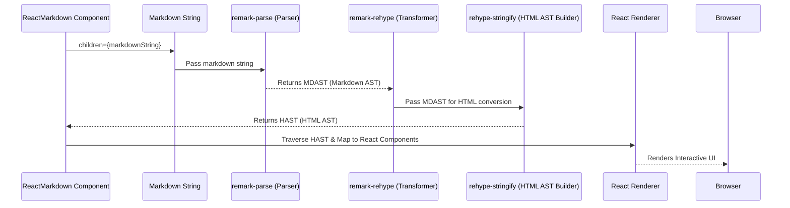

# Chapter 2: Markdown Processing Engine

Welcome back to our journey through `react-markdown`! In the [previous chapter](chapter_01.md), we introduced the `ReactMarkdown` component as the primary interface for users to render markdown content. We saw how easily you can pass a markdown string to it and get beautiful HTML-like output. But how exactly does `ReactMarkdown` transform raw text like `## Hello World` into structured HTML `<h2 id="hello-world">Hello World</h2>`? The magic happens within its powerful **Markdown Processing Engine**.

---

### Problem & Motivation

Imagine you're building a blog, a documentation site, or a chat application where users can input text using markdown syntax. The challenge isn't just displaying the text, but interpreting the markdown (e.g., `*italic*`, `[link](url)`, ````code``` `) and rendering it correctly as interactive HTML elements. Directly parsing markdown into HTML by hand is a complex, error-prone task, often leading to security vulnerabilities (like Cross-Site Scripting, XSS) and inconsistencies across different browsers.

This is the problem the Markdown Processing Engine solves for `react-markdown`. It provides a robust, standardized, and secure way to convert a simple string of markdown into a rich, interactive UI. For our project, it's the fundamental translator that turns a user's `markdown` prop into the structured data that `ReactMarkdown` can then use to generate React components. Without this engine, `react-markdown` would simply be a component that displays raw text, failing to fulfill its core purpose.

A concrete use case throughout this chapter will be a scenario where we receive a markdown string from an API or user input, and we need to display it as a fully rendered, interactive block of content within a React application. For instance, rendering a help article written in markdown.

---

### Core Concept Explanation

At its heart, the Markdown Processing Engine is a pipeline that takes a raw markdown string and transforms it through several stages until it becomes a structured data representation that `react-markdown` can easily interpret and render. This process involves two main conceptual steps: **parsing** and **transformation**.

1.  **Parsing**: This is where the raw markdown text is broken down and analyzed, much like how a compiler parses source code. The output of this stage isn't HTML, but a machine-readable, language-agnostic data structure called an Abstract Syntax Tree (AST). For markdown, this initial AST is often referred to as a **Markdown Abstract Syntax Tree (MDAST)**. Think of it as creating a hierarchical outline of your markdown content, identifying headings, paragraphs, lists, links, and code blocks without yet worrying about *how* they will look as HTML.

2.  **Transformation**: Once we have the MDAST, the next step is to convert it into a structure that is closer to HTML. This involves processing the MDAST and building a new AST, specifically designed for HTML-like structures, known as a **Hypertext Abstract Syntax Tree (HAST)**. During this phase, markdown concepts like "heading level 1" are mapped to HTML concepts like "h1 tag." This stage is crucial because it allows `react-markdown` to work with a standardized HTML representation, regardless of the original markdown syntax.

`react-markdown` leverages the powerful ecosystem of unifiedjs, particularly the `remark` and `rehype` libraries, for these tasks. `remark` handles the markdown parsing into MDAST, and `rehype` takes over to transform the MDAST into HAST, ready for rendering into React elements.

---

### Practical Usage Examples

As users of `react-markdown`, we don't directly interact with the Markdown Processing Engine. Instead, we use the `ReactMarkdown` component, and it *internally* orchestrates the engine's work. This abstraction is a core strength of the library, allowing us to focus on our application's UI while `react-markdown` handles the complex parsing and transformation.

Let's revisit our use case: rendering a simple help article fragment.

#### Example 1: Basic Markdown Rendering

Here's how you'd use `ReactMarkdown` to render a basic markdown string, implicitly engaging the processing engine:

```jsx
import React from 'react';
import ReactMarkdown from 'react-markdown';

function HelpArticle() {
  const markdownContent = `
# Getting Started
Hello **world**! This is a *simple* article.
  `;

  return (
    <div className="help-section">
      <ReactMarkdown>{markdownContent}</ReactMarkdown>
    </div>
  );
}

export default HelpArticle;
```

*   **Explanation**: In this example, `markdownContent` contains our raw markdown. When `ReactMarkdown` receives this string, its internal engine (powered by `remark` and `rehype`) immediately gets to work. It parses `# Getting Started` into an `h1` tag and `Hello **world**! This is a *simple* article.` into a paragraph with bold and italic elements.

#### Example 2: Markdown with a List

The engine seamlessly handles more complex markdown structures like lists.

```jsx
import React from 'react';
import ReactMarkdown from 'react-markdown';

function Checklist() {
  const taskList = `
Here's my todo list:
- Buy groceries
- Walk the dog
- Write chapter documentation
  `;

  return (
    <div className="tasks">
      <h3>Daily Tasks</h3>
      <ReactMarkdown>{taskList}</ReactMarkdown>
    </div>
  );
}

export default Checklist;
```

*   **Explanation**: Here, the engine processes the bullet points (`-`) and transforms them into an `<ul>` (unordered list) HTML element, with each item becoming an `<li>` (list item). The output would be correctly structured HTML ready for browser display.

---

### Internal Implementation Walkthrough

The `ReactMarkdown` component acts as the orchestrator, taking your raw markdown string and feeding it into the unifiedjs processing pipeline. Let's break down the typical flow:

1.  **Input Reception**: The `ReactMarkdown` component receives the `children` prop, which is your markdown string.
    *   *Conceptual Code Reference*: This happens within the `render` or `useEffect` lifecycle of `ReactMarkdown` (e.g., in a file like `src/ReactMarkdown.js`).

2.  **Parsing (with `remark`)**: The markdown string is passed to `remark` (specifically, `remark-parse`). `remark-parse` analyzes the string and builds an MDAST (Markdown Abstract Syntax Tree). Each node in this tree represents a specific markdown construct like a heading, paragraph, list, or code block.

3.  **Transformation (with `rehype`)**: The resulting MDAST is then handed over to `rehype` (specifically, `rehype-stringify` after `remark-rehype` has converted it). `rehype` takes this markdown-specific AST and transforms it into an HTML-specific AST (HAST). This is where the semantic mapping from markdown elements (e.g., `heading`, `list`) to HTML elements (e.g., `h1`, `ul`) occurs.

4.  **Processing by `ReactMarkdown`**: Finally, `ReactMarkdown` receives this HAST. Instead of directly converting it to a raw HTML string (which would be a security risk and limit interactivity), `ReactMarkdown` traverses this HAST and maps each HAST node to a corresponding React component. This is the stage where `react-markdown` generates the actual React elements that are rendered on the screen.

Here's a simplified sequence diagram illustrating this flow:



*   **Explanation**: This diagram shows how your markdown content flows through the `remark` and `rehype` steps to become an HTML-like AST, which `ReactMarkdown` then uses to create the final UI. This modular approach is key to `react-markdown`'s flexibility and extensibility.

---

### System Integration

The Markdown Processing Engine is the central pivot around which much of `react-markdown`'s functionality revolves. It integrates deeply with several other core abstractions:

*   **[ReactMarkdown Component](chapter_01.md)**: As discussed, this component is the entry point. It provides the raw markdown string to the engine and consumes the processed HAST to render the UI. The component essentially "hosts" the engine.

*   **[Abstract Syntax Tree (AST)](chapter_03.md)**: The engine's primary output is the AST (both MDAST and HAST). Understanding the structure of these trees is fundamental to customizing `react-markdown` through component mapping and plugins. The engine produces the AST that subsequent stages of `react-markdown` consume.

*   **[Processing Plugins](chapter_06.md)**: The `remark` and `rehype` libraries used by the engine are designed to be highly extensible via plugins. These plugins operate directly on the ASTs (MDAST or HAST) at various stages of the processing pipeline. The engine provides the hooks and the context for these plugins to transform the content, add features, or even introduce new markdown syntax.

*   **[HTML Safety & Control](chapter_05.md)**: The engine, particularly `rehype`, plays a critical role in sanitizing the output. It ensures that potentially malicious HTML (like `<script>` tags) present in the original markdown is either removed or safely encoded, contributing significantly to the security of the rendered content.

---

### Best Practices & Tips

*   **Understand the Pipeline**: While you don't directly manipulate the engine, understanding its `remark` -> `rehype` flow is crucial for effective use of plugins. Knowing whether a plugin operates on MDAST (markdown syntax level) or HAST (HTML structure level) will guide your choices.
*   **Leverage Plugins for Customization**: Avoid trying to "hack" the engine's output directly after `ReactMarkdown` has rendered it. Instead, use `remark` and `rehype` plugins to modify the AST *before* rendering. This is the idiomatic and most robust way to extend `react-markdown`.
*   **Performance Considerations**: For very large markdown documents, the parsing and transformation steps can be computationally intensive. If you encounter performance issues, consider memoizing your `ReactMarkdown` component or pre-processing markdown on the server if feasible.
*   **Security First**: Be mindful of untrusted user input. The engine, by default, provides good sanitization, but always review the `allowedElements`, `disallowedElements`, `unwrapDisallowed`, and `skipHtml` props of `ReactMarkdown` if you're dealing with external content.

---

### Chapter Conclusion

The Markdown Processing Engine is the unsung hero of `react-markdown`. It's the sophisticated machinery that quietly works behind the scenes, transforming your raw markdown into a structured, renderable format. By leveraging powerful tools like `remark` and `rehype`, it ensures that `react-markdown` is not just a parser but a flexible, extensible, and secure solution for displaying dynamic content. Understanding this engine's role, particularly its output—the Abstract Syntax Tree—is your next step towards mastering `react-markdown`'s full potential.

In the [next chapter](chapter_03.md), we'll dive deeper into the very core of what the engine produces: the **Abstract Syntax Tree (AST)**. We'll explore its structure, how to inspect it, and why it's so fundamental to `react-markdown`'s extensibility.