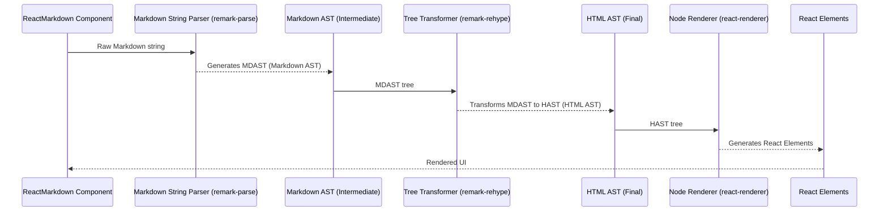

# Chapter 3: Abstract Syntax Tree (AST)

Welcome back to the internals of `react-markdown`! In the previous chapter, [Markdown Processing Engine](chapter_02.md), we explored how `react-markdown` transforms raw markdown text. The crucial output of that engine, and the focus of *this* chapter, is the **Abstract Syntax Tree (AST)**. The AST acts as the foundational blueprint for everything that follows, from custom rendering to plugin manipulation.

---

### Problem & Motivation

Imagine you have a simple markdown string: `## My Heading`. To a computer, this is just a sequence of characters. If you wanted to, for example, replace all level-2 headings (`##`) with a custom React component `<CustomH2>`, how would you identify "My Heading" as a heading, and specifically as a level 2 heading? Parsing plain text to find such patterns can be error-prone and incredibly complex, especially with the myriad of markdown syntax rules.

This is the problem the AST solves. Raw markdown text lacks inherent structure for programmatic access. `react-markdown` needs to understand not just *what* characters are present, but *how* they are organized and what *meaning* they convey. The AST provides this structured, machine-readable representation. It's important because it transforms ambiguous text into a clear, hierarchical data model that can be easily traversed, analyzed, and modified.

For `react-markdown`, the AST is the essential intermediate form that bridges the gap between the raw markdown input and the final interactive React UI. Without it, implementing features like custom component mapping, plugin transformations, or HTML sanitization would be virtually impossible.

---

### Core Concept Explanation

An **Abstract Syntax Tree (AST)** is a tree-like data structure that represents the syntactic structure of source code (or in our case, markdown) in an abstract way. Each node in the tree denotes a construct in the source code. It's "abstract" because it doesn't represent every detail that appears in the real syntax, but only the structural or content-related elements.

Think of an AST like a detailed *outline* or a *table of contents* for your markdown document. The title of the document might be the "root" node. Major sections are its "children." Subsections are children of those sections, and paragraphs, lists, or code blocks within those sections are their respective children. Each entry in this outline isn't just text; it also tells you *what kind* of entry it is (e.g., "heading," "paragraph," "list item").

In the context of `react-markdown`, the processing engine first converts your markdown string into an AST. This AST contains various *nodes*, each representing a specific markdown construct like a `paragraph`, `heading`, `list`, `link`, `image`, or even just `text`. These nodes are organized hierarchically, reflecting the nesting of elements in the markdown. For instance, a `paragraph` node might have `text` nodes and `strong` (bold) nodes as its children. `react-markdown` then traverses this tree, translating each node into a corresponding React element, piece by piece, until the entire markdown document is rendered as a React component tree.

---

### Practical Usage Examples

While `react-markdown` manages the AST internally, understanding its structure is crucial for advanced customization. Let's look at a conceptual AST generated from a simple markdown string.

Consider the following markdown input:

```markdown
# Welcome
Hello **world**!
```

This simple markdown will be transformed into an AST. While `react-markdown` uses the more formal `MDAST` and `HAST` specifications (which we'll touch upon below), a simplified conceptual representation might look like this:

```javascript
// Conceptual AST structure for the markdown above
[
  {
    type: 'heading', // This node represents a heading
    depth: 1,        // It's an H1 heading
    children: [      // Its content are its children
      { type: 'text', value: 'Welcome' }
    ]
  },
  {
    type: 'paragraph', // This node represents a paragraph
    children: [
      { type: 'text', value: 'Hello ' },
      {
        type: 'strong', // This node represents bold text
        children: [
          { type: 'text', value: 'world' }
        ]
      },
      { type: 'text', value: '!' }
    ]
  }
]
```
*Explanation*: The AST is typically an array of root-level nodes. Here, we have a `heading` node and a `paragraph` node. Each node has a `type` describing its markdown construct, and most contain a `children` array that holds nested nodes. `text` nodes are usually leaf nodes, carrying the actual string `value`.

Now, let's see how `react-markdown` would consume this (again, conceptually, as you don't interact with the AST directly in basic usage):

```jsx
import ReactMarkdown from 'react-markdown';

const markdownContent = `# Welcome\nHello **world**!`;

function App() {
  return (
    <div>
      {/* react-markdown internally generates and processes the AST from this string */}
      <ReactMarkdown>{markdownContent}</ReactMarkdown>
    </div>
  );
}

export default App;
```
*Explanation*: When you pass `markdownContent` to `<ReactMarkdown>`, the component first converts it to the AST structure shown above. Then, it traverses that AST: when it encounters the `heading` node, it renders an `<h1>` element. When it sees the `paragraph` node, it renders a `<p>`. Inside the paragraph, `text` nodes become plain text, and `strong` nodes become `<strong>` HTML elements. This process converts the structured data into actual HTML elements for your UI.

---

### Internal Implementation Walkthrough

`react-markdown` leverages the powerful `unified` ecosystem, which is a collection of interfaces and plugins for processing text using syntax trees. Specifically, it uses `remark` for markdown and `rehype` for HTML.

Here’s a simplified sequence of how `react-markdown` internally processes your markdown string to an AST and then to React elements:



1.  **Parsing (Markdown String to MDAST)**:
    *   The `react-markdown` component first sends the raw markdown string to `remark-parse`. This is a `unified` plugin responsible for parsing markdown according to the `CommonMark` specification.
    *   `remark-parse` generates a **Markdown Abstract Syntax Tree (MDAST)**. This tree strictly represents markdown constructs (e.g., `paragraph`, `heading`, `strong`, `list`, `listItem`). Each node in the MDAST adheres to the `unist` (Universal Syntax Tree) specification, which defines a common structure for syntax trees.

2.  **Transformation (MDAST to HAST)**:
    *   Next, the MDAST is passed through `remark-rehype`. This is a crucial transformer plugin that converts the markdown-specific AST (MDAST) into an **HTML Abstract Syntax Tree (HAST)**.
    *   HAST represents HTML elements and their content (e.g., `element` nodes for `<div>`, `<span>`, `text` nodes for text content). This transformation is where markdown constructs like `## heading` become `<h1>` elements.

3.  **Rendering (HAST to React Elements)**:
    *   Finally, `react-markdown` traverses the HAST. For each node in the HAST, it determines the corresponding React component or HTML tag to render.
    *   This is where `react-markdown`’s internal renderer takes over, converting the HAST nodes into actual React Virtual DOM elements, which are then rendered to the browser.

This multi-stage process provides immense flexibility. Plugins can operate on the MDAST (e.g., `remark-gfm` for GitHub Flavored Markdown extensions), or on the HAST (e.g., `rehype-highlight` for syntax highlighting). The AST serves as the stable, structured interface for all these transformations.

---

### System Integration

The Abstract Syntax Tree is the central data structure around which `react-markdown` is built and integrates with various other components:

*   **[Markdown Processing Engine](chapter_02.md)**: As discussed, the processing engine (specifically `remark-parse`) is responsible for *generating* the initial MDAST from the raw markdown string. Without this step, there would be no structured data to work with.

*   **[Custom Component Mapping](chapter_04.md)**: This is where the AST's power becomes directly visible to developers. `react-markdown` allows you to provide a `components` prop (or `renderers` in older versions) to map specific AST node types (e.g., `h1`, `p`, `a`) to your own custom React components. For example, you can tell `react-markdown` that whenever it encounters a `heading` node with `depth: 1` in the AST, it should render your `<MyCustomH1>` component instead of the default `<h1>`.

*   **[Processing Plugins](chapter_06.md)**: The AST is the primary target for plugins. Both `remark` (for MDAST) and `rehype` (for HAST) plugins operate by traversing and modifying the respective ASTs. This allows for powerful transformations, such as adding custom attributes to HTML elements, injecting new nodes, or even removing content based on specific criteria. Understanding the AST structure is paramount for writing or using these plugins effectively.

*   **[Source Position Tracking](chapter_07.md)**: Each node in the AST can optionally carry metadata about its original position in the source markdown string (line, column, offset). This is incredibly useful for debugging, error reporting, or building advanced tooling that needs to link rendered output back to the original source.

The data flow is consistently *raw markdown -> AST -> transformed AST -> React elements*. The AST is the common language spoken by all parts of this pipeline.

---

### Best Practices & Tips

*   **Understand the Node Structure**: If you plan to use advanced features like custom renderers or write plugins, familiarize yourself with the `unist` specification, and specifically the `MDAST` and `HAST` node types. Knowing what properties (like `type`, `children`, `value`, `url`, `alt`, `depth`) each node type has will unlock powerful customization.
*   **Leverage Existing Plugins**: Before writing your own AST manipulation logic, check the vast ecosystem of `remark` and `rehype` plugins. Many common transformations (e.g., syntax highlighting, table of contents generation) already have mature plugins.
*   **Avoid Direct DOM Manipulation for Markdown Content**: When using `react-markdown`, prefer modifying the AST via plugins rather than manipulating the rendered HTML directly. This ensures that your transformations are robust, maintainable, and respect `react-markdown`'s internal rendering process and HTML safety features.
*   **Performance Considerations**: For very large markdown documents, the generation and traversal of the AST can impact performance. While `react-markdown` is highly optimized, be mindful of excessive or complex plugin chains that might introduce overhead.

---

### Chapter Conclusion

The Abstract Syntax Tree (AST) is the silent hero behind `react-markdown`. It transforms a simple string of markdown into a rich, structured, and manipulable data model. This tree-like representation is the foundation upon which `react-markdown` builds its rendering logic, enables powerful plugin ecosystems, and provides extensive customization options. Understanding the AST is key to truly mastering `react-markdown` and unlocking its full potential.

Next, we'll dive into how `react-markdown` uses this AST to map its nodes to actual React components, allowing you to completely customize the output. Proceed to [Custom Component Mapping](chapter_04.md).