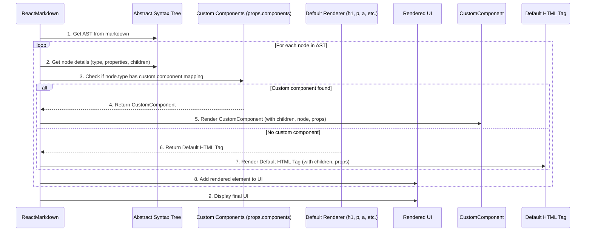

# Chapter 4: Custom Component Mapping

In the [previous chapter](chapter_03.md), we explored the Abstract Syntax Tree (AST) as the structured representation of your markdown content, generated by `react-markdown`'s internal processing engine. The AST provides a consistent and machine-readable format for every element in your markdown, from headings to paragraphs, lists, and links. While the AST defines *what* your content is, it doesn't dictate *how* it should be rendered visually. By default, `react-markdown` translates these AST nodes into standard HTML elements (e.g., `h1` for a top-level heading, `p` for a paragraph, `a` for a link). However, many applications require more than just standard HTML.

---

### Problem & Motivation

Relying solely on default HTML tags can be limiting when you need to align your markdown rendering with a specific design system, brand guidelines, or interactive component library. For instance, you might want all headings to use a custom font family and spacing defined by your `<CustomHeading>` React component, or perhaps transform every `blockquote` into a visually distinct `<CalloutBox>` with an icon. The problem is that standard HTML tags don't carry the semantic meaning or interactive capabilities of your application's specialized React components.

This is where Custom Component Mapping becomes indispensable. It solves the problem of how to seamlessly integrate markdown content into a rich, interactive React application that uses its own component library. Instead of just `<h1>` or `<a>`, you can tell `react-markdown` to render your `markdown`'s `heading` or `link` nodes using your own React components. This allows for unparalleled flexibility, enabling you to apply consistent styling, add custom behavior, or even introduce entirely new semantic elements that go beyond the basic HTML specification, all while still writing content in simple markdown.

Consider a use case where you want all `<blockquote>` elements in your markdown to be rendered as a custom `AlertMessage` component with a distinct UI, and all `<a>` tags to use your application's `<SmartLink>` component which might handle internal routing differently from external links. Without custom mapping, you'd be stuck with basic HTML, requiring complex CSS overrides or post-rendering DOM manipulation.

---

### Core Concept Explanation

Custom Component Mapping in `react-markdown` is achieved through the `components` prop. This prop accepts an object where keys correspond to the types of markdown elements (which typically map to HTML tag names like `h1`, `p`, `a`, `blockquote`, `img`, etc.), and their values are the React components you wish to use for rendering those elements.

When `react-markdown` processes the AST (as discussed in [Chapter 3: Abstract Syntax Tree (AST)](chapter_03.md)), it traverses each node. For every node, it checks if a custom component has been provided in the `components` prop for that specific node type. If a mapping exists, `react-markdown` uses your custom React component to render that part of the markdown. If no custom component is specified for a particular type, it gracefully falls back to rendering the default HTML tag.

Your custom components receive several props, crucially including `children` (the rendered content of the markdown node) and `node` (the original AST node object itself, providing access to properties like `type`, `position`, `url`, `alt`, etc.). This allows your custom components to be highly dynamic and context-aware, making rendering decisions based on the markdown's original structure and data. For example, a custom `Link` component can inspect the `node.properties.href` to determine if it's an internal or external link and render a different UI accordingly.

---

### Practical Usage Examples

Let's illustrate Custom Component Mapping with the use case of transforming `blockquote` elements into a custom `AlertMessage` component and `a` tags into a `<SmartLink>` component.

#### 1. Basic Heading Customization

First, let's map a simple `h1` tag to a custom `MyHeading` component to demonstrate the fundamental principle.

```jsx
import React from 'react';
import ReactMarkdown from 'react-markdown';

const MyHeading = ({ children }) => (
  <h1 style={{ color: 'purple', textDecoration: 'underline' }}>
    ✨ {children} ✨
  </h1>
);

function App() {
  const markdown = '# Hello Custom Heading!';
  return <ReactMarkdown components={{ h1: MyHeading }}>{markdown}</ReactMarkdown>;
}

export default App;
```
*Explanation*: Here, we define a functional React component `MyHeading`. We then pass an object `{ h1: MyHeading }` to the `components` prop of `ReactMarkdown`. Now, any `h1` markdown in the input will be rendered by our `MyHeading` component instead of a standard `<h1>` tag, applying our custom styling and emoji prefix.

#### 2. Customizing Blockquotes into an Alert Message

Now, let's implement our motivating use case: transforming markdown `blockquote` elements into a custom `AlertMessage` component.

```jsx
import React from 'react';
import ReactMarkdown from 'react-markdown';

const AlertMessage = ({ children }) => (
  <div style={{ border: '2px solid orange', padding: '10px', borderRadius: '5px', backgroundColor: '#fffbe6' }}>
    🚨 **Alert:** {children}
  </div>
);

function App() {
  const markdown = '> This is an important message.\n\n_Please pay attention._';
  return (
    <ReactMarkdown components={{ blockquote: AlertMessage }}>
      {markdown}
    </ReactMarkdown>
  );
}

export default App;
```
*Explanation*: We've created `AlertMessage` to render a visually distinct alert box. By mapping `blockquote` to `AlertMessage`, any blockquote markdown like `> This is an important message.` will be wrapped in our custom `div` with specific styling and an "Alert:" prefix. The `children` prop here contains the parsed content of the blockquote itself.

#### 3. Creating a Smart Link Component

Next, let's make a `<SmartLink>` component that distinguishes between internal and external links.

```jsx
import React from 'react';
import ReactMarkdown from 'react-markdown';

const SmartLink = ({ href, children }) => {
  const isInternal = href.startsWith('/');
  const linkStyle = {
    color: isInternal ? 'blue' : 'green',
    fontWeight: 'bold',
    textDecoration: isInternal ? 'underline' : 'none'
  };
  return (
    <a href={href} style={linkStyle} target={isInternal ? '_self' : '_blank'} rel={isInternal ? '' : 'noopener noreferrer'}>
      {children} {isInternal ? '(Internal)' : '(External)'}
    </a>
  );
};

function App() {
  const markdown = '[Visit Google](https://www.google.com) and [Our About Page](/about)';
  return (
    <ReactMarkdown components={{ a: SmartLink }}>
      {markdown}
    </ReactMarkdown>
  );
}

export default App;
```
*Explanation*: The `SmartLink` component receives `href` and `children` props. It checks if the `href` starts with `/` to determine if it's an internal link. Based on this, it applies different styles and `target`/`rel` attributes. Now, `react-markdown` will use `SmartLink` for all markdown links, giving us granular control over their behavior and appearance.

#### 4. Accessing All Node Properties

Sometimes, you need more than just `children` or standard HTML attributes. `react-markdown` passes the full AST `node` object as a prop.

```jsx
import React from 'react';
import ReactMarkdown from 'react-markdown';

const ImageWithCaption = ({ node, ...props }) => {
  const altText = node.properties.alt;
  return (
    <figure>
      
      {altText && <figcaption style={{ fontStyle: 'italic', fontSize: '0.9em', textAlign: 'center' }}>{altText}</figcaption>}
    </figure>
  );
};

function App() {
  const markdown = '';
  return (
    <ReactMarkdown components={{ img: ImageWithCaption }}>
      {markdown}
    </ReactMarkdown>
  );
}

export default App;
```
*Explanation*: Here, `ImageWithCaption` receives the `node` prop, from which we can extract the `alt` text. This allows us to render a `<figure>` and `<figcaption>` HTML structure, using the `alt` text as the caption, which is a common accessibility and design pattern. The `...props` ensures standard image attributes like `src` are passed to the `img` tag.

---

### Internal Implementation Walkthrough

When `react-markdown` receives a markdown string, its internal processing engine (as described in [Chapter 2: Markdown Processing Engine](chapter_02.md)) first converts it into an Abstract Syntax Tree (AST). After the AST is formed, `react-markdown` initiates a traversal process, where it iterates through each node of the AST.

For every AST node it encounters, the component performs a crucial check:
1.  It determines the `type` of the current AST node (e.g., `'paragraph'`, `'heading'`, `'link'`, `'image'`).
2.  It then looks up this `type` in the `components` prop provided by the user.

If a corresponding custom React component is found for that `type` in the `components` object, `react-markdown` will invoke that custom component, passing it the necessary props:
*   `children`: The rendered React elements of the node's descendants in the AST.
*   `node`: The original AST node object itself, containing all its properties like `type`, `position`, `properties` (e.g., `href` for links, `src` for images), etc.
*   Any other HTML-like attributes that would normally be applied to the default HTML element (e.g., `href` for `a`, `src` for `img`).

If no custom component is found for the node's `type`, `react-markdown` falls back to its default rendering mechanism, which involves creating a standard HTML element (e.g., `<h1>`, `<p>`, `<a>`) and passing the same `children` and relevant attributes to it. This process repeats recursively until the entire AST has been traversed and rendered into a tree of React elements.

Here's a simplified sequence of how `react-markdown` decides which component to render:


*Explanation*: The sequence diagram illustrates that for each node in the AST, `react-markdown` first checks if a custom component is mapped. If yes, it uses the custom component; otherwise, it falls back to the default HTML renderer. This decision is made for every node, allowing for fine-grained control over the final output.

---

### System Integration

Custom Component Mapping sits at a critical junction within the `react-markdown` ecosystem, bridging the parsed content (the AST) and the final rendered UI. It directly influences how the data structured by the [Abstract Syntax Tree (AST)](chapter_03.md) is transformed into interactive React elements.

*   **Input from AST**: Each custom component receives the AST node (via the `node` prop) and its processed children. This means the structure and content derived from the markdown are directly fed into your components, allowing for data-driven rendering logic.
*   **Output to React UI**: The components you provide are standard React components. Their output becomes part of the final React element tree that `react-markdown` renders. This integrates seamlessly with the rest of your React application's component hierarchy, styling solutions (CSS-in-JS, Tailwind, etc.), and state management.
*   **Interaction with Plugins**: While custom component mapping changes *how* an AST node is rendered, [Processing Plugins](chapter_06.md) typically modify the AST *itself* before rendering. For example, a plugin might add a `class` property to an AST node. Your custom component for that node type would then receive that `class` property and could apply it during rendering. This shows a powerful synergy where plugins alter the content structure, and custom components interpret and display those alterations.
*   **HTML Safety**: The content within your custom components, especially if they render raw HTML or user-generated content, will still be subject to [HTML Safety & Control](chapter_05.md) mechanisms if you pass it back into `react-markdown` or directly inject HTML. Understanding this interplay is crucial for preventing XSS vulnerabilities.

The `components` prop is essentially the "render layer" of `react-markdown`, allowing you to plug your design system directly into the markdown parsing pipeline.

---

### Best Practices & Tips

1.  **Don't Overuse for Simple Styling**: For basic styling (e.g., changing font size or color of an `h1`), often plain CSS applied to the default `<h1>` element is sufficient. Only create a custom component when you need to introduce new HTML structure, complex logic, interactivity, or integrate with a component library.
2.  **Pass `node` and `...props`**: Always accept the `node` prop if you need access to the original AST node properties. When overriding HTML elements, remember to spread `...props` onto the underlying HTML element in your custom component (`<a {...props}>` or ``). This ensures `react-markdown`'s default attributes like `href`, `src`, `alt`, `title`, and even `className` (potentially added by plugins) are still applied.
3.  **Handle `children` Correctly**: Your custom components will receive `children` which is the rendered output of the markdown node's content. Make sure to render `children` within your component, or your markdown content won't appear.
4.  **Performance Considerations**: Every custom component you provide adds a small overhead compared to default HTML elements. For very large markdown documents with many custom components, ensure your custom components are optimized and avoid unnecessary re-renders.
5.  **Fallback for Unknown Elements**: If you're creating a highly customized renderer, be mindful of elements you *don't* explicitly map. They will render as default HTML. If you want to handle *all* possible elements or provide a generic fallback, you might consider dynamically creating components or having a very generic "wrapper" component for `ReactMarkdown`.
6.  **Avoid Infinite Recursion**: Do not pass a `ReactMarkdown` component as a custom component for one of its own types *without careful consideration*. For example, mapping `p` to a component that itself renders `<ReactMarkdown components={{p: ...}}>` could lead to infinite recursion.
7.  **Prop Drilling**: For deeper customization where a parent custom component needs to pass context to its children (which might also be custom components), consider using React's Context API.

---

### Chapter Conclusion

Custom Component Mapping is a cornerstone of `react-markdown`'s flexibility, empowering developers to transform raw markdown into rich, interactive, and design-system-compliant user interfaces. By understanding how to map markdown element types to your own React components and leveraging the `children`, `node`, and `...props` arguments, you gain granular control over the rendering process. This capability is essential for building dynamic applications where content is authored in markdown but presented with the full power of React components.

Having mastered the art of tailoring the output, our next exploration will focus on ensuring that this dynamic content is also secure. In the [next chapter](chapter_05.md), we will delve into `HTML Safety & Control`, understanding how `react-markdown` protects against potential vulnerabilities when rendering user-generated or external markdown content.