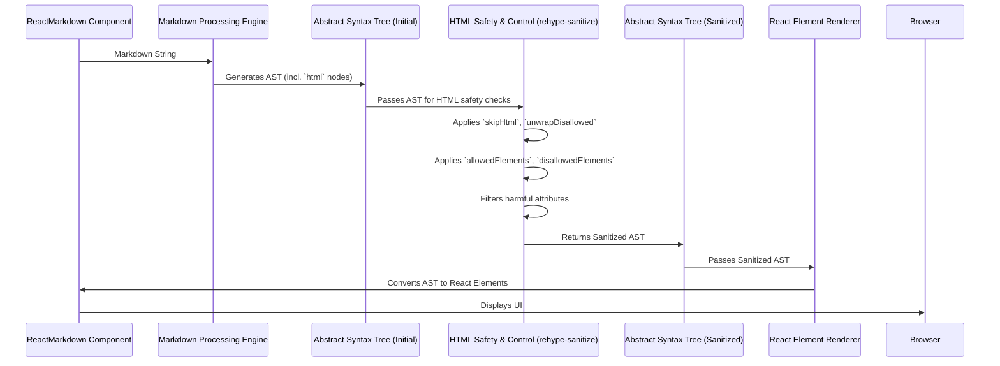

# Chapter 5: HTML Safety & Control

In the previous chapter, [Custom Component Mapping](chapter_04.md), we explored how `react-markdown` empowers developers to completely customize the rendering of standard markdown elements by mapping them to bespoke React components. This gave us immense control over the visual presentation and interactivity of our markdown output. However, markdown isn't just about headings and links; it often allows the embedding of raw HTML. This feature introduces a new set of concerns, primarily around security and unwanted content.

## Problem & Motivation

The ability to embed raw HTML directly within markdown content, while powerful, presents significant security vulnerabilities and control challenges, especially when dealing with untrusted or user-generated input. Imagine a blogging platform where users can submit posts in markdown. If a user were to include a `<script>` tag containing malicious JavaScript, or an `<iframe>` linking to an untrusted site, this could lead to Cross-Site Scripting (XSS) attacks, defacement, or data breaches for other users viewing the content.

The core problem `react-markdown` addresses here is enabling safe rendering of markdown that *might* contain raw HTML, without sacrificing the flexibility of markdown itself. We need mechanisms to explicitly define what HTML is acceptable, what should be completely removed, and what should be stripped of its tags but keep its content. Without these controls, `react-markdown` would expose applications to unacceptable risks, making it unsuitable for many real-world scenarios. For instance, in our blog platform example, we want users to be able to use basic formatting like `<strong>` or `<em>`, but strictly disallow potentially harmful tags like `<script>`, `<iframe>`, or even certain attributes like `onclick`.

## Core Concept Explanation

`HTML Safety & Control` within `react-markdown` refers to the robust set of features designed to manage and sanitize raw HTML present in your markdown input. When the [Markdown Processing Engine](chapter_02.md) encounters raw HTML, it converts these into specific 'html' nodes within the [Abstract Syntax Tree (AST)](chapter_03.md). Before these AST nodes are finally rendered into React elements, `react-markdown` provides a layer of defense to inspect and modify them based on your security and content policies.

This abstraction focuses on preventing unintended rendering of HTML elements and their attributes. It achieves this through a combination of strategies:

1.  **Skipping (Removal):** Completely removing an HTML element and all its children from the output. This is the most stringent approach.
2.  **Unwrapping:** Removing only the HTML tag itself, but preserving its inner text or child elements. This can be useful for removing unwanted structural tags while keeping the content accessible.
3.  **Whitelisting:** Explicitly defining which HTML elements are permitted to be rendered. Any element not on this list is treated as disallowed. This is generally the most secure approach.
4.  **Blacklisting:** Explicitly defining which HTML elements are forbidden. Any element not on this list is permitted (unless other rules apply). This can be riskier as it assumes all non-blacklisted elements are safe.

`react-markdown` provides several key props that allow you to configure these behaviors, ensuring that your rendered content is both safe and aligns with your application's requirements. By default, `react-markdown` employs a secure approach, allowing a basic set of safe HTML elements and attributes, but you have the power to fine-tune this.

## Practical Usage Examples

Let's illustrate how to use `react-markdown`'s HTML safety props to manage embedded HTML effectively. We'll use our blog platform scenario where users might submit various forms of HTML.

### 1. Skipping All Raw HTML

The `skipHtml` prop is the simplest way to completely ignore any raw HTML embedded in your markdown. If set to `true`, `react-markdown` will remove all HTML elements and their contents.

```jsx
import ReactMarkdown from 'react-markdown';

const unsafeMarkdown = `
# My Blog Post
This is some **safe** markdown.
<script>alert('You are hacked!');</script>
<p>This paragraph contains raw HTML.</p>
<div>And this is a div.</div>
`;

function App() {
  return (
    <ReactMarkdown skipHtml={true}>{unsafeMarkdown}</ReactMarkdown>
  );
}
// Expected Output:
// <h1>My Blog Post</h1>
// <p>This is some <strong>safe</strong> markdown.</p>
// (The script, p, and div tags are completely gone.)
```
*Explanation:* By setting `skipHtml={true}`, we instruct `react-markdown` to strip out all encountered HTML tags, including potentially malicious ones like `<script>` and benign ones like `<p>` and `<div>`. This ensures only pure markdown output.

### 2. Unwrapping Disallowed HTML Elements

The `unwrapDisallowed` prop allows `react-markdown` to remove the tags of disallowed HTML elements while keeping their child content. This is useful for retaining the text or inner elements when the containing HTML tag is undesirable. By default, `react-markdown` has a set of allowed HTML elements; anything not in that default list is considered disallowed.

```jsx
import ReactMarkdown from 'react-markdown';

const markdownWithUnwantedWrappers = `
This is a <span>useful message</span>.
<div class="unwanted-container">Content inside a div.</div>
`;

function App() {
  return (
    <ReactMarkdown unwrapDisallowed={true}>
      {markdownWithUnwantedWrappers}
    </ReactMarkdown>
  );
}
// Expected Output:
// <p>This is a useful message.</p>
// <p>Content inside a div.</p>
// (The <span> and <div> tags are removed, but their text content remains.)
```
*Explanation:* `span` and `div` are typically considered disallowed by default in `react-markdown`'s internal sanitization unless explicitly allowed. With `unwrapDisallowed={true}`, their tags are stripped, but their inner text content `useful message` and `Content inside a div.` is preserved and rendered directly as part of the surrounding paragraph.

### 3. Explicitly Allowing Specific HTML Elements (Whitelisting)

The `allowedElements` prop takes an array of HTML tag names that are explicitly permitted. Any HTML element not in this array will be considered disallowed and will be either skipped or unwrapped based on `unwrapDisallowed`. This is the recommended security practice.

```jsx
import ReactMarkdown from 'react-markdown';

const markdownWithAllowedTags = `
You can use <mark>highlighted text</mark> here.
But <blink>blinking text</blink> is not allowed.
<a href="https://example.com">Visit Example</a> is also okay.
<script>alert('XSS');</script>
`;

function App() {
  return (
    <ReactMarkdown
      allowedElements={['mark', 'a']} // Only <mark> and <a> are permitted
      unwrapDisallowed={false} // Other disallowed elements will be skipped
    >
      {markdownWithAllowedTags}
    </ReactMarkdown>
  );
}
// Expected Output:
// <p>You can use <mark>highlighted text</mark> here.</p>
// <p>But is not allowed.</p>
// <p><a href="https://example.com">Visit Example</a> is also okay.</p>
// (Only <mark> and <a> are rendered. <blink> and <script> are completely removed.)
```
*Explanation:* We explicitly whitelist `mark` and `a`. The `<mark>` tag and `<a>` tag are rendered. The `<blink>` and `<script>` tags, not being in `allowedElements`, are completely removed (skipped) because `unwrapDisallowed` is `false`.

### 4. Explicitly Disallowing Specific HTML Elements (Blacklisting)

The `disallowedElements` prop takes an array of HTML tag names that are explicitly forbidden. Any element in this array will be treated as disallowed, overriding `allowedElements` if there's a conflict (disallowed always wins).

```jsx
import ReactMarkdown from 'react-markdown';

const markdownWithDisallowedTags = `
This is a <strong>strong</strong> message.
<p>And a paragraph</p>
<button onclick="alert('click!')">Click Me</button>
<span style="color:red;">Red text</span>
`;

function App() {
  return (
    <ReactMarkdown
      disallowedElements={['button', 'span']} // Explicitly forbid button and span
      unwrapDisallowed={false}
    >
      {markdownWithDisallowedTags}
    </ReactMarkdown>
  );
}
// Expected Output:
// <p>This is a <strong>strong</strong> message.</p>
// <p>And a paragraph</p>
// <p></p>
// <p></p>
// (The <button> and <span> tags are removed, while <strong> and <p> are allowed by default.)
```
*Explanation:* Here, we explicitly disallow `button` and `span`. Even if `span` might be allowed by some default sanitization rules, `disallowedElements` takes precedence, removing both `button` and `span` completely. The `onclick` attribute on the button would also be stripped even if the button itself were allowed, due to `react-markdown`'s default attribute sanitization.

### 5. Combining Whitelisting and Unwrapping

You can combine `allowedElements` with `unwrapDisallowed` for nuanced control.

```jsx
import ReactMarkdown from 'react-markdown';

const mixedMarkdown = `
<section>This is a section</section>
<p>With a paragraph</p>
<mark>And some highlights</mark>
`;

function App() {
  return (
    <ReactMarkdown
      allowedElements={['mark', 'p']} // Only allow <mark> and <p>
      unwrapDisallowed={true}        // Unwrap other disallowed elements
    >
      {mixedMarkdown}
    </ReactMarkdown>
  );
}
// Expected Output:
// <p>This is a section</p>
// <p>With a paragraph</p>
// <mark>And some highlights</mark>
// (The <section> tag is unwrapped, its content becomes part of a paragraph.
// <p> and <mark> are rendered as-is.)
```
*Explanation:* `mark` and `p` are explicitly allowed. The `<section>` tag is not in `allowedElements`, so it's considered disallowed. Because `unwrapDisallowed={true}`, the `<section>` tag itself is removed, and its content (`This is a section`) is retained, effectively being wrapped by a default `<p>` tag during rendering.

## Internal Implementation Walkthrough

The HTML Safety & Control mechanisms are deeply integrated into `react-markdown`'s processing pipeline, acting upon the [Abstract Syntax Tree (AST)](chapter_03.md) after the initial markdown parsing.

Here's a step-by-step breakdown of what happens internally:

1.  **Markdown Parsing:** The [Markdown Processing Engine](chapter_02.md) first converts the raw markdown string into a unified AST. During this phase, any raw HTML within the markdown (e.g., `<p>Hello</p>`, `<script>alert(1)</script>`) is recognized and represented as `html` nodes in the AST. These nodes store the raw HTML string as their `value`.

2.  **Sanitization Plugin Integration:** `react-markdown` internally leverages `rehype-sanitize`, a powerful `rehype` plugin that handles HTML sanitization. This plugin is added to the processing pipeline.

3.  **Configuration Application:** The props you provide to `ReactMarkdown` (`skipHtml`, `unwrapDisallowed`, `allowedElements`, `disallowedElements`) are translated into configurations for `rehype-sanitize`.
    *   `skipHtml: true` broadly instructs the sanitization process to remove all HTML nodes.
    *   `unwrapDisallowed: true` configures the sanitization plugin to "unwrap" elements that are identified as disallowed.
    *   `allowedElements` and `disallowedElements` are directly passed to `rehype-sanitize` to build its whitelist/blacklist rules.

4.  **AST Traversal and Transformation:** As the `rehype-sanitize` plugin traverses the AST, it encounters `html` nodes.
    *   For each `html` node, `rehype-sanitize` parses the raw HTML string within the node to understand its tag name, attributes, and child content.
    *   It then applies the configured rules:
        *   **Check `skipHtml`**: If `skipHtml` is true, the `html` node (and its parsed content) is completely removed from the AST.
        *   **Check `disallowedElements`**: If the HTML tag is in the `disallowedElements` list, it's marked for removal or unwrapping.
        *   **Check `allowedElements`**: If `allowedElements` is specified, and the HTML tag is *not* in this list, it's also marked for removal or unwrapping. `disallowedElements` takes precedence over `allowedElements` if an element is present in both.
        *   **Attribute Sanitization**: Even if an element is allowed, `rehype-sanitize` will inspect its attributes (e.g., `href`, `style`, `onclick`) and strip potentially harmful ones (like `javascript:` URLs in `href` or `onclick` event handlers).
    *   **Action on Disallowed/Unallowed:**
        *   If an element is disallowed and `unwrapDisallowed` is `false` (or unset), the `html` node is completely removed from the AST.
        *   If an element is disallowed and `unwrapDisallowed` is `true`, the `html` node itself is removed, but its children (if any) are lifted to become siblings of the `html` node's original parent. This effectively removes the wrapper tag but keeps its content.

5.  **Final AST Generation:** After the `rehype-sanitize` plugin has processed all `html` nodes, the modified (sanitized) AST is passed further down the pipeline for conversion into React elements by the component renderer.

Here's a simplified sequence diagram:



This internal process ensures that `react-markdown` provides a robust, configurable layer of protection against potentially dangerous or unwanted HTML content, all before any UI is rendered.

## System Integration

The `HTML Safety & Control` abstraction is a critical gatekeeper within the `react-markdown` ecosystem, interacting with several other core components:

*   **[Markdown Processing Engine](chapter_02.md):** The engine is the first to identify raw HTML within your markdown and correctly parse it into `html` nodes in the AST. Without the engine's ability to distinguish raw HTML, the safety mechanisms wouldn't have anything to act upon.
*   **[Abstract Syntax Tree (AST)](chapter_03.md):** The AST is the central data structure that `HTML Safety & Control` operates on. The sanitization process directly manipulates the AST by removing, unwrapping, or modifying `html` nodes based on the applied rules. The transformed AST is then passed to the rendering phase.
*   **[Custom Component Mapping](chapter_04.md):** `Custom Component Mapping` applies *after* the HTML safety checks. If an HTML element (e.g., `<mark>`) is deemed allowed by the safety controls, you can then use the `components` prop to map that `<mark>` tag to your own custom `MarkComponent`. If the HTML element is disallowed and removed, there's no node left in the AST for `Custom Component Mapping` to act on.
*   **[Processing Plugins](chapter_06.md):** The HTML safety features are essentially implemented as part of `rehype` plugins in the unified processing pipeline. For highly advanced or custom sanitization needs, users can bypass `react-markdown`'s direct safety props and instead integrate `rehype-sanitize` (or other `rehype` plugins) directly into the `rehypePlugins` array. This offers even finer-grained control, such as defining allowed attributes for specific elements or custom protocols.

This layered approach ensures that raw HTML is first identified, then sanitized according to strict rules, and finally, if permitted, can be customized in its rendering.

## Best Practices & Tips

Ensuring HTML safety is paramount for `react-markdown` applications, especially those dealing with user-generated content. Adhering to these best practices will help you maintain a secure and predictable environment:

1.  **Prioritize Whitelisting over Blacklisting:**
    *   **Recommendation:** Always prefer using `allowedElements` to explicitly list what HTML tags are permitted.
    *   **Reasoning:** Blacklisting (`disallowedElements`) is inherently less secure because it requires you to anticipate all possible malicious tags. New attack vectors or obscure tags might emerge that you haven't blacklisted. Whitelisting, conversely, only allows what you've explicitly deemed safe, making it a more robust defense.

2.  **Be Mindful of Attributes:**
    *   `react-markdown`'s default sanitization (via `rehype-sanitize`) is quite good at stripping potentially dangerous attributes like `onclick`, `onmouseover`, and `style` attributes that could inject harmful CSS or JavaScript. It also cleans `href` attributes to prevent `javascript:` URLs.
    *   When using `allowedElements`, remember that even a seemingly innocuous tag can become dangerous with certain attributes. `rehype-sanitize` generally handles this, but be aware if you introduce custom `rehype` plugins.

3.  **Always Sanitize User-Generated Content:**
    *   **Critical:** If your markdown input comes from an external source or user input, *never* render it without proper HTML safety controls.
    *   `skipHtml={true}` offers maximum security by removing all HTML. If you need some HTML, carefully configure `allowedElements`.

4.  **Use `unwrapDisallowed` Judiciously:**
    *   `unwrapDisallowed` is great for maintaining content when an outer HTML wrapper is unnecessary or unwanted. However, be aware that it might subtly change the semantic meaning if the wrapper was important (e.g., unwrapping a `<blockquote>` might make its content appear as a normal paragraph).

5.  **Test Thoroughly with Edge Cases:**
    *   Before deploying, test your HTML safety configuration with various inputs, including known XSS payloads (e.g., ``, `<a href="javascript:alert(1)">`) and malformed HTML.

6.  **For Advanced Control, Use `rehype-sanitize` Directly via Plugins:**
    *   If `react-markdown`'s built-in `allowedElements` and `disallowedElements` don't offer enough granularity (e.g., you need to allow specific attributes only for certain elements, or custom schemas), consider using `rehype-sanitize` directly as a [Processing Plugin](chapter_06.md). This gives you direct access to all `rehype-sanitize` options for highly customized rules.

7.  **Performance Considerations:**
    *   While HTML sanitization adds a processing step, `rehype-sanitize` is highly optimized. For typical markdown documents, the performance impact is negligible. For extremely large documents with vast amounts of raw HTML, you might observe a slight increase in processing time, but this is usually an acceptable trade-off for security.

## Chapter Conclusion

This chapter has illuminated the crucial role of HTML Safety & Control in `react-markdown`. We've understood why managing embedded HTML is vital for application security and integrity, particularly when dealing with untrusted content. We explored the core concepts of skipping, unwrapping, whitelisting, and blacklisting, and saw how `react-markdown`'s `skipHtml`, `unwrapDisallowed`, `allowedElements`, and `disallowedElements` props provide powerful, flexible control over this behavior through practical examples.

We also delved into the internal workings, observing how `rehype-sanitize` integrates with the AST to enforce these safety rules, and how this abstraction interacts seamlessly with other core components like the processing engine and custom component mapping. By adhering to the recommended best practices, you can leverage `react-markdown` to render rich markdown content confidently, knowing that your application is protected from malicious or unwanted HTML.

While these props offer excellent direct control, `react-markdown`'s true power lies in its extensible plugin architecture. For scenarios requiring even more sophisticated transformations, custom parsing, or integration with external processing libraries, we turn to the next chapter, which explores the world of [Processing Plugins](chapter_06.md).