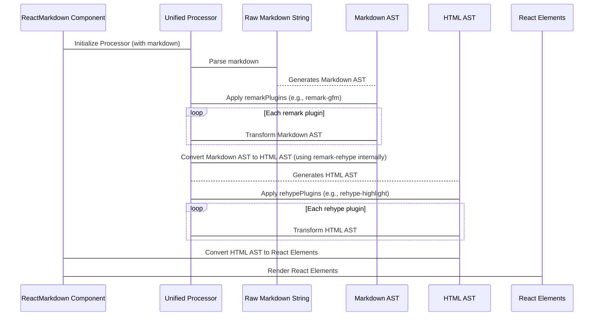

# Chapter 6: Processing Plugins

As we explored in [HTML Safety & Control](chapter_05.md), `react-markdown` provides robust mechanisms to manage the final output. However, rendering basic markdown and ensuring its safety is only part of the story. Modern applications often demand richer features, like syntax highlighting for code blocks, specialized emoji rendering, or the ability to generate a table of contents from headings. Achieving these advanced transformations with just raw markdown and basic HTML output would be a significant challenge, requiring complex custom parsing logic.

### Problem & Motivation

The core `react-markdown` component efficiently converts markdown to React elements. However, markdown's inherent simplicity often means it lacks syntax for complex formatting or interactive elements. Imagine you want to display code snippets with professional syntax highlighting, or you need to process custom directives (e.g., `:::note This is a special note :::`) within your markdown to render specific UI components. Without an extensible mechanism, you'd be forced to preprocess the markdown string yourself, create a massive `components` prop mapping for every potential custom element, or even fork the `react-markdown` library.

This leads to a critical problem: how can we *extend* the markdown processing capabilities beyond standard markdown-to-HTML conversion, without having to rebuild the entire parsing and rendering pipeline? The project needs a modular, robust way to intercept and modify the markdown's structure or content at various stages of its transformation. This is precisely the problem that **Processing Plugins** solve. They provide hooks into the internal parsing and rendering workflow, allowing developers to inject custom logic and transform the Abstract Syntax Tree (AST) at different points, enabling advanced functionalities like syntax highlighting or custom element generation with ease and maintainability.

### Core Concept Explanation

Processing Plugins are reusable modules that integrate into `react-markdown`'s underlying markdown processing engine, which is built upon the `unified` ecosystem. Think of `unified` as a factory assembly line where raw markdown enters, undergoes several transformations, and finally exits as interactive React UI. Plugins are specialized workers on this assembly line, each capable of inspecting, modifying, or adding to the product (the AST) at specific stations.

There are primarily two types of plugins relevant to `react-markdown`, corresponding to the two main ASTs generated during processing:
1.  **`remark` plugins**: These operate on the **Markdown AST**. They are used to parse and transform the raw markdown structure *before* it's converted into an HTML-like structure. Examples include adding GitHub Flavored Markdown (GFM) features, parsing front matter, or processing custom markdown syntax.
2.  **`rehype` plugins**: These operate on the **HTML AST**. After the markdown AST has been converted into an HTML-like AST by `remark-rehype` (a specific `remark` plugin), `rehype` plugins take over. They are ideal for modifying HTML structures, adding attributes, or performing HTML-specific transformations like syntax highlighting, minification, or custom element creation.

By leveraging these plugins, `react-markdown` becomes incredibly flexible. You can chain multiple plugins together, each performing a specific transformation, to achieve complex rendering outcomes without altering the core component's logic. This modular approach ensures that `react-markdown` remains lean while providing extensive extensibility for virtually any markdown processing need.

### Practical Usage Examples

Let's illustrate how to use plugins with our motivating example: adding syntax highlighting to code blocks. For this, we'll typically use `remark-gfm` for basic GitHub Flavored Markdown support and then a `rehype` plugin for highlighting. We'll use `rehype-highlight` as an example (though `rehype-prism-plus` or `rehype-highlight-code` are other popular choices).

First, install the necessary plugins:
```bash
npm install remark-gfm rehype-highlight
# or
yarn add remark-gfm rehype-highlight
```

Now, let's use them in `react-markdown`.

```jsx
import React from 'react';
import ReactMarkdown from 'react-markdown';
import remarkGfm from 'remark-gfm';
import rehypeHighlight from 'rehype-highlight'; // For syntax highlighting

const MarkdownWithPlugins = () => {
  const markdown = `
# Hello, Plugins!

Here's some **bold** text and *italic* text.

\`\`\`javascript
function greet(name) {
  console.log('Hello, ' + name + '!');
}
greet('World');
\`\`\`

- List item 1
- List item 2
`;

  return (
    <ReactMarkdown
      remarkPlugins={[remarkGfm]}
      rehypePlugins={[rehypeHighlight]}
    >
      {markdown}
    </ReactMarkdown>
  );
};

export default MarkdownWithPlugins;
```
In this example, we import `remarkGfm` and `rehypeHighlight`.
- `remarkGfm` is passed to the `remarkPlugins` prop, which enables GitHub Flavored Markdown features like strikethrough, tables, and task lists. This operates on the Markdown AST.
- `rehypeHighlight` is passed to the `rehypePlugins` prop. This plugin looks for `<code>` elements within `<pre>` tags in the HTML AST and applies syntax highlighting classes. It will require a corresponding CSS file from a highlighter library (e.g., `highlight.js`) for visual styles.

The expected output will be the markdown rendered as HTML, but with `<code>` blocks inside `<pre>` tags now containing additional classes (e.g., `hljs`, `language-javascript`) that a CSS stylesheet can use to visually highlight the code.

```html
<!-- Expected output structure (simplified) -->
<h1 id="hello-plugins">Hello, Plugins!</h1>
<p>Here's some <strong>bold</strong> text and <em>italic</em> text.</p>
<pre><code class="hljs language-javascript">
<span class="hljs-keyword">function</span> <span class="hljs-title function_">greet</span>(<span class="hljs-params">name</span>) {
  <span class="hljs-variable console">console</span>.<span class="hljs-title function_">log</span>(<span class="hljs-string">'Hello, '</span> + name + <span class="hljs-string">'!'</span>);
}
<span class="hljs-title function_">greet</span>(<span class="hljs-string">'World'</span>);
</code></pre>
<ul>
<li>List item 1</li>
<li>List item 2</li>
</ul>
```
The key takeaway here is how `react-markdown` provides dedicated props (`remarkPlugins` and `rehypePlugins`) to cleanly integrate these extensible modules, making advanced transformations straightforward.

### Internal Implementation Walkthrough

At its core, `react-markdown` leverages the `unified` processing engine, which orchestrates the transformation of markdown into React elements. When you provide `remarkPlugins` and `rehypePlugins` to the `ReactMarkdown` component, they are integrated into this internal processing pipeline.

Here's a simplified sequence of how plugins fit into `react-markdown`'s workflow:



1.  **Markdown Parsing**: The `ReactMarkdown` component first receives the `markdown` string. It initializes a `unified` processor and uses `remark-parse` to convert this string into a **Markdown Abstract Syntax Tree (MAST)**.
2.  **`remark` Plugin Application**: Any plugins provided in the `remarkPlugins` prop are then chained to the `unified` processor. These plugins operate directly on the MAST, allowing them to add, remove, or modify nodes that represent markdown structures (e.g., adding a `table` node if `remark-gfm` detects a table).
3.  **AST Transformation (`remark-rehype`)**: After all `remark` plugins have run, a critical step occurs: the `remark-rehype` plugin (which `react-markdown` uses internally by default) converts the MAST into an **HTML Abstract Syntax Tree (HAST)**. This changes the structural representation from markdown concepts (like `paragraph`, `heading`) to HTML concepts (like `p`, `h1`).
4.  **`rehype` Plugin Application**: Finally, any plugins specified in the `rehypePlugins` prop are applied. These plugins operate on the HAST, enabling transformations related to HTML structure, attributes, and content. For example, `rehype-highlight` inspects `<code>` nodes within `<pre>` tags in the HAST and modifies their structure to include syntax highlighting classes.
5.  **React Element Generation**: The final HAST, after all plugin transformations, is then traversed by `react-markdown`'s renderer to generate the corresponding React elements, which are ultimately rendered to the DOM.

This layered approach ensures that the processing is highly modular. Each plugin has a single responsibility, and their combined effect leads to the desired complex output.

### System Integration

Processing Plugins are deeply integrated into the core `react-markdown` pipeline and interact with several other key abstractions:

*   **[Markdown Processing Engine](chapter_02.md)**: Plugins are the primary mechanism through which the `unified` processing engine is extended. Without plugins, the engine would only perform basic markdown parsing and conversion. Plugins directly modify the engine's behavior by adding new transformation steps.
*   **[Abstract Syntax Tree (AST)](chapter_03.md)**: Plugins operate directly on the ASTs (both Markdown AST and HTML AST). They are functions that take an AST and return a modified AST. Understanding the AST structure is crucial for writing or debugging plugins.
*   **[Custom Component Mapping](chapter_04.md)**: Plugins can work synergistically with custom component mapping. For instance, a `rehype` plugin might introduce a new, non-standard HTML element (e.g., `<custom-note>`). You would then use the `components` prop to map `<custom-note>` to a specific React component, effectively rendering custom markdown syntax as bespoke React UI.
*   **[HTML Safety & Control](chapter_05.md)**: `rehype` plugins, in particular, interact closely with HTML safety. Plugins that modify or introduce raw HTML elements might be subject to the sanitization rules defined by `react-markdown`'s HTML safety mechanisms. It's often recommended to run `rehype-sanitize` (if used) *before* other `rehype` plugins that might introduce unsafe content, or to ensure custom plugins only generate safe HTML.

This integration highlights the power of the `unified` ecosystem: it provides a standardized way for different concerns (parsing, transforming, rendering, sanitizing) to interact through a common AST interface.

### Best Practices & Tips

*   **Order Matters**: The order in which you supply plugins in `remarkPlugins` and `rehypePlugins` arrays is crucial. Plugins are applied sequentially. A plugin expecting a certain node structure might fail if a preceding plugin has already altered or removed it. For example, a plugin that processes images should come before one that minifies attributes if both affect `` tags.
*   **`remark` vs. `rehype`**: Understand which AST your plugin needs to operate on. If you're transforming markdown syntax (e.g., adding custom block types), use `remark` plugins. If you're modifying HTML attributes, adding classes, or converting specific HTML tags, use `rehype` plugins. If you're unsure, generally `rehype` plugins are for things that are "after markdown parsing and before React rendering".
*   **Performance**: While powerful, adding many plugins can impact performance, especially for large markdown inputs. Profile your application if you notice slowdowns and optimize or selectively apply plugins.
*   **Official `unified` Ecosystem**: Stick to plugins from the `unified` ecosystem (prefixed `remark-` or `rehype-`) where possible, as they are generally well-tested and follow consistent patterns.
*   **Debugging Plugins**: If a plugin isn't working as expected, examine the AST at different stages. Tools like `unist-util-visit` or `unist-util-inspect` can help you log the AST's structure before and after a plugin runs.
*   **Custom Plugins**: If existing plugins don't meet your needs, you can write your own. This typically involves a function that returns a `transformer` function. The `transformer` receives the AST and applies modifications. Consult the `unified` documentation for detailed guides on creating custom plugins.
*   **Safety with Plugins**: Be mindful of security when using or creating `rehype` plugins. Plugins that introduce raw HTML or modify attributes without proper sanitization can reintroduce XSS vulnerabilities if not handled carefully, especially if `rehype-sanitize` is not used or configured correctly.

### Chapter Conclusion

Processing Plugins are the muscle behind `react-markdown`'s extensibility. They empower developers to move beyond basic markdown rendering, enabling sophisticated features like syntax highlighting, advanced typography, custom component integration, and more. By understanding the distinction between `remark` and `rehype` plugins and their integration into the `unified` processing pipeline, you gain precise control over the transformation of your markdown content. This modular approach keeps the core `react-markdown` component lean while offering limitless possibilities for customization.

Up next, we'll delve into another powerful feature that enhances the developer experience and debugging capabilities: [Source Position Tracking](chapter_07.md), which helps map rendered elements back to their original markdown source.