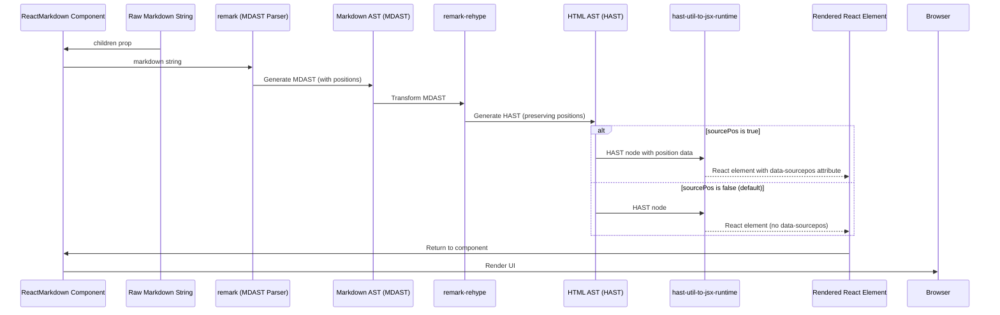

# Chapter 7: Source Position Tracking

Welcome to Chapter 7, where we delve into the powerful capability of **Source Position Tracking**. In the [previous chapter on Processing Plugins](chapter_06.md), we explored how to extend `react-markdown`'s functionality by modifying the AST. Now, we'll examine a feature that allows you to link the rendered UI directly back to its origin in the raw markdown source, offering invaluable insights for advanced tooling.

---

### Problem & Motivation

Imagine building a markdown editor, a static site generator with live preview, or a linter that provides contextual feedback. In such scenarios, when a user clicks on a rendered paragraph or an image, how can your application identify exactly which lines and columns in the original markdown file correspond to that UI element? Without this connection, debugging parsing issues, implementing interactive highlighting, or offering in-editor corrections becomes incredibly difficult, if not impossible.

This is the core problem **Source Position Tracking** solves. `react-markdown` converts a plain string into an interactive UI, and losing the lineage between the source and its output creates a significant gap for advanced applications. By embedding source position data, we empower developers to create highly interactive and intelligent tools that bridge this gap, enhancing user experience and developer productivity alike.

For instance, consider a user highlighting a particular sentence in a live markdown preview. With source position tracking, your application can instantly locate that sentence's exact starting and ending line/column in the raw markdown, allowing for features like "jump to source" or applying formatting changes directly to the original markdown content. This precise mapping is crucial for a truly integrated editing and viewing experience.

---

### Core Concept Explanation

**Source Position Tracking** is `react-markdown`'s mechanism for embedding metadata into the rendered React elements. This metadata precisely points back to the original position (line and column numbers) of the markdown content that generated that particular UI element. It achieves this by adding special **data attributes** to the HTML elements output by `react-markdown`.

When enabled, `react-markdown` leverages the underlying parsing engine's ability to retain source location information within the [Abstract Syntax Tree (AST)](chapter_03.md). As the AST is traversed and transformed into React elements, this positional data is carried along and attached to the corresponding JSX output. This means that every rendered `<p>`, `<h1>`, `<a>`, or `` tag (and others) can potentially carry information about where it came from in your `.md` file.

The primary data attribute used for this is `data-sourcepos`. Its value is a string representing the start and end positions, typically in the format `startLine:startColumn-endLine:endColumn`. For example, `data-sourcepos="1:1-1:10"` would indicate that the element was generated from content starting at line 1, column 1, and ending at line 1, column 10. While `react-markdown` primarily focuses on the `data-sourcepos` attribute, the underlying rendering process might offer further granular tracking options through other `data-*` attributes if specifically configured.

---

### Practical Usage Examples

To enable source position tracking, you simply need to pass the `sourcePos` prop set to `true` to your `ReactMarkdown` component. Let's revisit our motivating use case of linking rendered output to its source.

First, ensure `react-markdown` is installed:
```bash
npm install react-markdown
```

Now, let's render some markdown and inspect the output:

```jsx
import React from 'react';
import { ReactMarkdown } from 'react-markdown';

const markdown = `
# Hello World

This is a paragraph.

*   List item 1
*   List item 2
`;

function App() {
  return (
    <ReactMarkdown sourcePos={true}>
      {markdown}
    </ReactMarkdown>
  );
}

export default App;
```
*Explanation*: By setting `sourcePos={true}`, we instruct `react-markdown` to include source position data in the rendered HTML.

When you render `App` and inspect the generated HTML in your browser's developer tools, you'll observe attributes like these:

```html
<h1 data-sourcepos="2:1-2:12">Hello World</h1>
<p data-sourcepos="4:1-4:19">This is a paragraph.</p>
<ul data-sourcepos="6:1-8:15">
  <li data-sourcepos="7:1-7:15">List item 1</li>
  <li data-sourcepos="8:1-8:15">List item 2</li>
</ul>
```
*Explanation*: Notice the `data-sourcepos` attribute on each element. It shows the starting and ending line and column numbers from the original `markdown` string. For instance, the `<h1>` element started at line 2, column 1, and ended at line 2, column 12.

Now, let's consider how a markdown editor might use this. If a user clicks on the rendered "Hello World", an event listener can capture the `data-sourcepos` attribute:

```jsx
import React from 'react';
import { ReactMarkdown } from 'react-markdown';

const markdown = `
# Hello World

This is a paragraph.
`;

function App() {
  const handleClick = (event) => {
    const sourcePos = event.target.dataset.sourcepos;
    if (sourcePos) {
      console.log('Clicked element source position:', sourcePos);
      // In a real editor, you'd parse sourcePos (e.g., "2:1-2:12")
      // and scroll the raw markdown editor to that line/column.
      alert(`Source position for this element: ${sourcePos}`);
    }
  };

  return (
    <div onClick={handleClick} style={{ cursor: 'pointer' }}>
      <ReactMarkdown sourcePos={true}>
        {markdown}
      </ReactMarkdown>
    </div>
  );
}

export default App;
```
*Explanation*: We attach an `onClick` handler to a parent `div` that wraps `ReactMarkdown`. When an element rendered by `ReactMarkdown` is clicked, the `handleClick` function extracts the `data-sourcepos` attribute from `event.target.dataset` and can then use this information to, for example, highlight the corresponding section in a markdown editor.

---

### Internal Implementation Walkthrough

The journey of source position data in `react-markdown` begins right at the parsing stage and extends through to the final rendering.

1.  **Markdown Parsing**: When the raw markdown string is fed into the [Markdown Processing Engine](chapter_02.md) (specifically, `remark`), the parser doesn't just generate the AST nodes; it also annotates each node with a `position` object. This object contains `start` and `end` properties, each having `line`, `column`, and `offset` values.

    ```json
    // Example AST node snippet
    {
      "type": "heading",
      "depth": 1,
      "children": [...],
      "position": {
        "start": { "line": 2, "column": 1, "offset": 1 },
        "end": { "line": 2, "column": 12, "offset": 12 }
      }
    }
    ```

2.  **AST Transformation (remark -> rehype)**: As the AST moves through `remark` plugins and then gets transformed by `remark-rehype` into a [HAST (HTML AST)](chapter_03.md), these `position` objects are diligently preserved on the corresponding HAST nodes. Plugins can also introduce or modify position data, though this is less common for standard `data-sourcepos` generation.

3.  **React Element Generation**: `react-markdown` then uses `hast-util-to-jsx-runtime` (or similar logic) to traverse the HAST and convert each HAST node into a React element. This is the critical juncture for source position tracking. When the `sourcePos` prop on `ReactMarkdown` is `true`, `hast-util-to-jsx-runtime` is configured to take the `position` property from the HAST node and convert it into the `data-sourcepos` attribute on the resulting React element.

Here's a simplified flow:


*Explanation*: The sequence shows how source position information is parsed with the markdown, carried through the AST, and finally, if `sourcePos` is enabled, transformed into a `data-sourcepos` attribute on the final React elements by the rendering utility.

---

### System Integration

Source Position Tracking is deeply integrated with several core components of the `react-markdown` ecosystem:

*   **[Markdown Processing Engine](chapter_02.md)**: This is where the initial position data is generated. Without a parser that understands and records source positions, `react-markdown` would have no data to expose.
*   **[Abstract Syntax Tree (AST)](chapter_03.md)**: The AST acts as the carrier of the position data. Each node in the AST holds its corresponding `position` object, which is then used downstream. Plugins operating on the AST must be careful not to corrupt or lose this position data if source position tracking is important.
*   **[Processing Plugins](chapter_06.md)**: While plugins generally don't *generate* `data-sourcepos` directly, they operate on the AST nodes which *contain* the `position` data. If a plugin significantly transforms or rewrites parts of the AST, it might affect the accuracy or presence of source positions on the altered elements. Advanced plugins might even choose to generate new `position` data for newly created nodes.
*   **[Custom Component Mapping](chapter_04.md)**: When you use custom components to override default HTML elements (e.g., `components={{ h1: MyCustomHeading }}`), the `data-sourcepos` attribute is typically passed down as a prop to your custom component. This allows your custom component to decide whether to render that attribute onto its root element, or use the position data for its internal logic.
    ```jsx
    import React from 'react';
    import { ReactMarkdown } from 'react-markdown';

    const MyCustomParagraph = ({ children, ...props }) => {
      // Access sourcepos via props['data-sourcepos']
      console.log('Custom Paragraph Source Pos:', props['data-sourcepos']);
      return <p className="custom-paragraph" {...props}>{children}</p>;
    };

    function AppWithCustomComponent() {
      return (
        <ReactMarkdown
          sourcePos={true}
          components={{ p: MyCustomParagraph }}
        >
          {'This is a custom paragraph.'}
        </ReactMarkdown>
      );
    }
    ```
    *Explanation*: The `data-sourcepos` prop is passed to `MyCustomParagraph`, which can then render it or use its value.

---

### Best Practices & Tips

*   **Enable When Needed**: While `sourcePos={true}` is very useful, it adds extra attributes to your DOM, which can slightly increase the HTML size. For simple display-only scenarios where source-to-output mapping isn't required, you can omit `sourcePos` for a marginally leaner DOM. However, the performance impact is usually negligible for most applications.
*   **Debugging & Development**: Always enable `sourcePos={true}` during development and debugging of complex markdown structures or when integrating with other tools. It's an invaluable aid for understanding how `react-markdown` interprets your source.
*   **Editor Integration**: If you're building a rich markdown editor or a preview tool, `sourcePos` is an absolute must-have. It's the foundation for features like "scroll to source," "highlight source on selection," and contextual error reporting.
*   **Custom Component Forwarding**: When using `[Custom Component Mapping](chapter_04.md)`, ensure your custom components correctly forward or consume the `data-sourcepos` prop if you want the tracking to persist through them. A common pattern is to spread all `props` onto the root element of your custom component, as shown in the example above (`{...props}`).
*   **CSS Selectors**: You can use CSS attribute selectors (e.g., `[data-sourcepos]`) to style elements that have source position data, perhaps for visual debugging.

---

### Chapter Conclusion

**Source Position Tracking** stands as a testament to `react-markdown`'s flexibility and its capacity to serve not just as a rendering library, but as a foundational building block for sophisticated markdown-aware applications. By providing a clear, programmatic link between the rendered UI and its raw markdown origin, it unlocks possibilities for interactive editors, advanced linters, and intelligent debugging tools. This capability transforms `react-markdown` from a passive renderer into an active participant in your content workflow.

This chapter concludes our comprehensive tutorial on `react-markdown`. We've journeyed from the core `ReactMarkdown Component` through its internal `Markdown Processing Engine`, the crucial `Abstract Syntax Tree`, powerful `Custom Component Mapping`, vital `HTML Safety & Control`, extensible `Processing Plugins`, and finally, the insightful `Source Position Tracking`. You now possess a deep understanding of `react-markdown`'s architecture and capabilities, empowering you to build robust, customized, and feature-rich markdown applications.