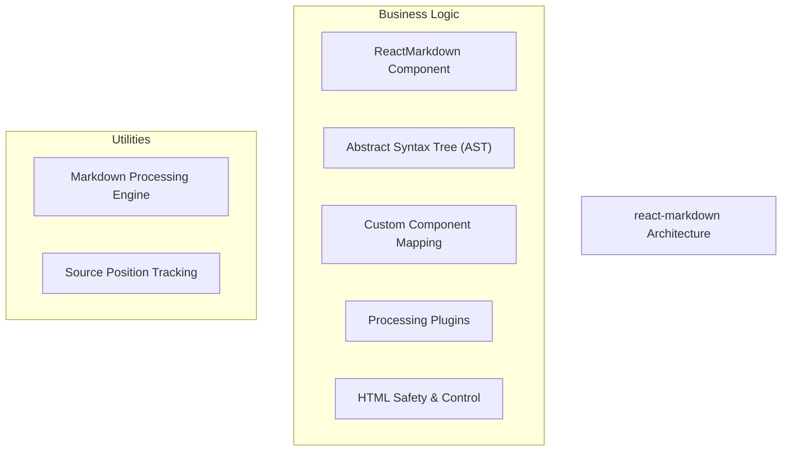
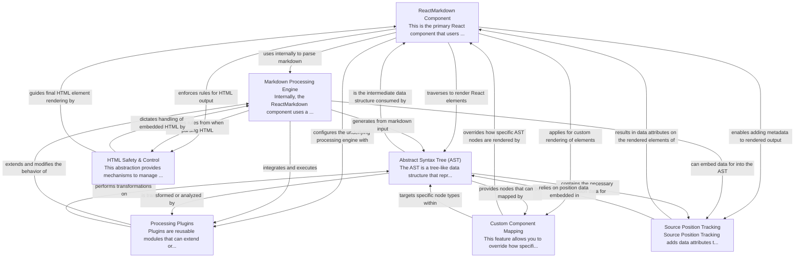

# react-markdown Tutorial

Welcome to the comprehensive tutorial for react-markdown. This tutorial is automatically generated from the codebase to help you understand the core concepts and implementation patterns.

## Project Overview

'react-markdown' is a React component designed to render markdown content into React elements. It achieves this by employing an internal markdown processing engine to convert the raw markdown string into an Abstract Syntax Tree (AST). The component then traverses this AST, offering extensive customization options through plugins, custom component mapping, and control over HTML safety to produce the final interactive UI.

## System Architecture

## Component Relationships

## Table of Contents

1. [Chapter 1: ReactMarkdown Component](chapter_01.md) - Comprehensive documentation for ReactMarkdown Component following structured methodology...
2. [Chapter 2: Markdown Processing Engine](chapter_02.md) - Comprehensive documentation for Markdown Processing Engine following structured methodology...
3. [Chapter 3: Abstract Syntax Tree (AST)](chapter_03.md) - Comprehensive documentation for Abstract Syntax Tree (AST) following structured methodology...
4. [Chapter 4: Custom Component Mapping](chapter_04.md) - Comprehensive documentation for Custom Component Mapping following structured methodology...
5. [Chapter 5: HTML Safety & Control](chapter_05.md) - Comprehensive documentation for HTML Safety & Control following structured methodology...
6. [Chapter 6: Processing Plugins](chapter_06.md) - Comprehensive documentation for Processing Plugins following structured methodology...
7. [Chapter 7: Source Position Tracking](chapter_07.md) - Comprehensive documentation for Source Position Tracking following structured methodology...

## How to Use This Tutorial

1. **Start with Chapter 1** to understand the foundational concepts
2. **Follow the sequence** - each chapter builds upon previous concepts
3. **Practice with code examples** - every chapter includes practical examples
4. **Refer to diagrams** - use architecture diagrams for visual understanding
5. **Cross-reference concepts** - chapters link to related topics

## Tutorial Features

- **Progressive Learning**: Concepts are introduced in logical order
- **Code Examples**: Every chapter includes practical, executable code
- **Visual Diagrams**: Mermaid diagrams illustrate complex relationships
- **Cross-References**: Easy navigation between related concepts
- **Beginner-Friendly**: Written for newcomers to the codebase

## Contributing

This tutorial is auto-generated from the codebase. To improve it:
1. Update the source code documentation
2. Add more detailed comments to key functions
3. Regenerate the tutorial using the documentation system

---

*Generated using AI-powered codebase analysis*
