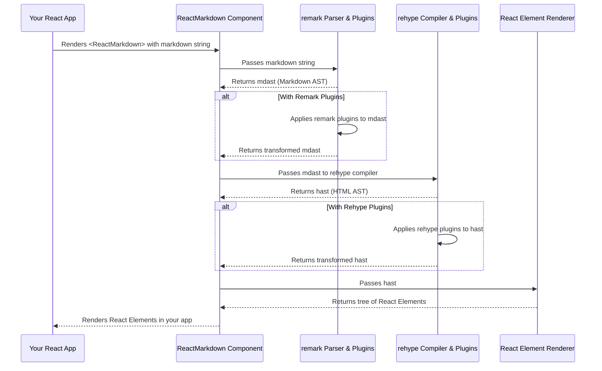

# Chapter 1: The ReactMarkdown Component

This is the first chapter in our journey to master `react-markdown`. We'll start at the very beginning, understanding the core component that brings Markdown rendering to your React applications.

---

### Problem & Motivation

In modern web applications, the ability to display rich, formatted text is crucial. Whether it's user-generated content like blog posts, comments, or dynamically loaded documentation, storing and rendering this content efficiently and securely poses a challenge. Traditional HTML can be cumbersome for users to write and potentially insecure if not sanitized correctly. On the other hand, plain text lacks the formatting capabilities needed for good readability.

This is where Markdown shines. Markdown offers a lightweight, easy-to-write syntax for text formatting, which can then be converted into structured HTML. The problem arises when we need to seamlessly integrate this Markdown parsing and rendering within a React application, ensuring reactivity, extensibility, and performance. `react-markdown` addresses this precise need by providing a dedicated React component that takes Markdown as input and outputs a tree of native React elements, making it an indispensable tool for displaying dynamic content within the `react-markdown` project's ecosystem.

Consider a blog application where authors write their articles in Markdown. Without `react-markdown`, developers would have to manually parse Markdown strings, sanitize the resulting HTML, and then inject it into the DOM, often using `dangerouslySetInnerHTML`. This approach is risky, inflexible, and breaks React's declarative component model.

### Core Concept Explanation

At its heart, `The ReactMarkdown Component` is a wrapper that bridges the gap between Markdown syntax and React's component-based rendering. Imagine it as a translator: you feed it text written in Markdown language, and it "translates" that into a series of standard React components (like `<h1>`, `<p>`, `<a>`, `<strong>`, etc.) that your browser can understand and display.

This component doesn't do all the translation itself. Instead, it leverages a powerful internal pipeline built upon the `remark` and `rehype` ecosystems. These are highly modular tools for processing Markdown and HTML, respectively. `ReactMarkdown` acts as the orchestrator, taking your Markdown content, passing it through this configurable pipeline for parsing and transformation, and then finally rendering the results as a virtual DOM tree using React.

The beauty of `react-markdown` lies in its ability to abstract away the complexities of Markdown processing. As a developer, you simply provide the Markdown content, and the component handles the rest, ensuring that the output is a native React tree, which means it integrates perfectly with your existing React components, styling, and event handling. It's a declarative way to incorporate rich text rendering without sacrificing the benefits of the React framework.

---

### Practical Usage Examples

Let's see how easy it is to get started with `The ReactMarkdown Component` to solve our motivating use case: rendering a blog post.

First, you'll need to install `react-markdown`:

```bash
npm install react-markdown
# or
yarn add react-markdown
```

Now, let's render some basic Markdown.

#### Example 1: Basic Markdown Rendering

Here, we provide the Markdown content directly as children to the `ReactMarkdown` component.

```jsx
import React from 'react';
import ReactMarkdown from 'react-markdown';

function BlogPost() {
  const markdownContent = `# Welcome to My Blog
  This is a **great** post about *React*.
  `;

  return (
    <div className="blog-container">
      <ReactMarkdown>{markdownContent}</ReactMarkdown>
    </div>
  );
}

export default BlogPost;
```

**Explanation:**
The `markdownContent` string contains standard Markdown. `ReactMarkdown` automatically parses this string and renders it into corresponding HTML elements: an `<h1>` for the heading, and a `<p>` containing `<strong>` and `<em>` tags for the emphasized words.

#### Example 2: Markdown from a Prop

Sometimes, Markdown might come from a variable or be fetched dynamically. You can also pass it via the `children` prop, as shown above, or if preferred, a `remark-react` specific prop (though `children` is the primary and recommended way for `react-markdown` itself). The core idea remains the same.

Let's imagine fetching content:

```jsx
import React, { useState, useEffect } from 'react';
import ReactMarkdown from 'react-markdown';

function DynamicContent() {
  const [content, setContent] = useState('');

  useEffect(() => {
    // Simulate fetching markdown content from an API
    const fetchedMarkdown = `## Dynamic Heading
    This content was *fetched* from a **server**!
    - Item 1
    - Item 2
    `;
    setContent(fetchedMarkdown);
  }, []);

  return (
    <div>
      <ReactMarkdown>{content}</ReactMarkdown>
    </div>
  );
}

export default DynamicContent;
```

**Explanation:**
In this example, the Markdown content is initially empty, then updated asynchronously via a `useState` hook, simulating data fetched from an API. `ReactMarkdown` re-renders automatically when its `children` (the `content` state) changes, displaying the formatted Markdown.

---

### Internal Implementation Walkthrough

While `The ReactMarkdown Component` itself appears simple from the outside, a sophisticated process unfolds internally. It acts as the user interface for a powerful, pluggable Markdown processing pipeline.

Here's a simplified step-by-step breakdown of what happens when you pass Markdown to `ReactMarkdown`:

1.  **Markdown Input:** You provide a Markdown string as `children` to the `<ReactMarkdown>` component.
2.  **`remark` Parsing:** The `ReactMarkdown` component first passes this raw Markdown string to the `remark` parser. `remark` is a tool that converts Markdown into an Abstract Syntax Tree (AST), specifically a [mdast](https://github.com/syntax-tree/mdast) (Markdown Abstract Syntax Tree). This AST is a structured, programmatic representation of your Markdown content.
3.  **`remark` Transformation (Optional):** If you've configured `ReactMarkdown` with `remark` plugins (which we'll cover in Chapter 4), these plugins operate on the mdast. They can analyze, modify, or add new nodes to the tree. For instance, a plugin might convert `@mentions` into links.
4.  **`rehype` Compilation:** The transformed mdast is then passed to the `rehype-stringify` compiler (via `remark-rehype`). This step converts the mdast into an [hast](https://github.com/syntax-tree/hast) (Hypertext Abstract Syntax Tree), which is a representation of HTML.
5.  **`rehype` Transformation (Optional):** Similar to `remark` plugins, `rehype` plugins can then operate on the hast. These plugins are ideal for modifying the HTML structure, sanitizing output, or adding attributes to HTML elements.
6.  **React Element Generation:** Finally, the processed hast is traversed, and for each node in the hast, `ReactMarkdown` (or rather, the `remark-react` package it internally uses) creates a corresponding React element. For example, an `<h1>` hast node becomes a `React.createElement('h1', ...)` call.
7.  **React Rendering:** These generated React elements form a virtual DOM tree, which React then efficiently reconciles and renders into the actual browser DOM.

Here's a visual representation of this flow:



This multi-stage pipeline is what makes `react-markdown` so powerful and flexible, allowing deep customization at various points, which we will explore in subsequent chapters.

---

### System Integration

`The ReactMarkdown Component` is designed to be a drop-in solution within any React application. Its primary integration point is the component tree itself. You place it where you want Markdown content to be rendered, just like any other React component.

Here's how it typically integrates:

*   **Data Flow:** Markdown content (as a string) flows *into* `ReactMarkdown` via its `children` prop.
*   **Output:** It *outputs* a tree of React elements (effectively, your rendered HTML) that are part of your application's DOM.
*   **Styling:** You can style the rendered Markdown elements using standard CSS, CSS-in-JS libraries, or CSS modules. `ReactMarkdown` renders standard HTML tags, so you can target `h1`, `p`, `ul`, `a`, etc., just as you would with any other HTML content.
*   **Event Handling:** Since `ReactMarkdown` outputs native React elements, any event listeners (e.g., `onClick` on links) that you might add through custom renderers (covered in [Custom Component Rendering](chapter_03.md)) will work as expected within the React lifecycle.

For example, imagine a component that fetches a README file and displays it:

```jsx
// src/components/ReadmeViewer.jsx
import React, { useState, useEffect } from 'react';
import ReactMarkdown from 'react-markdown';

const ReadmeViewer = ({ filePath }) => {
  const [readmeContent, setReadmeContent] = useState('Loading README...');

  useEffect(() => {
    // In a real app, you might fetch from an API or load dynamically
    fetch(filePath)
      .then(response => {
        if (!response.ok) {
          throw new Error(`HTTP error! status: ${response.status}`);
        }
        return response.text();
      })
      .then(markdown => setReadmeContent(markdown))
      .catch(error => setReadmeContent(`Error loading README: ${error.message}`));
  }, [filePath]); // Re-fetch if filePath changes

  return (
    <div className="readme-display">
      <ReactMarkdown>{readmeContent}</ReactMarkdown>
    </div>
  );
};

export default ReadmeViewer;
```

```jsx
// src/App.js
import React from 'react';
import ReadmeViewer from './components/ReadmeViewer';
import './App.css'; // For basic styling

function App() {
  return (
    <div className="App">
      <h1>Project Documentation</h1>
      <ReadmeViewer filePath="/path/to/my/project/README.md" /> {/* Placeholder path */}
    </div>
  );
}

export default App;
```

This demonstrates a clear data flow: `App` passes a `filePath`, `ReadmeViewer` fetches the content, and `ReactMarkdown` renders it, seamlessly integrating into the React component hierarchy. Its modular design allows it to work hand-in-hand with the powerful [Markdown Processing Pipeline (Remark & Rehype)](chapter_02.md) which will be the focus of our next chapter.

---

### Best Practices & Tips

To get the most out of `ReactMarkdown` and ensure a robust application, consider these best practices:

*   **Sanitization (Security):** By default, `react-markdown` is relatively safe because `rehype-sanitize` is often used internally. However, if you are working with user-generated content or custom plugins, *always* be mindful of Cross-Site Scripting (XSS) vulnerabilities. Ensure that your `rehype` plugins are configured to properly sanitize any potentially malicious HTML or scripts that could be introduced via Markdown. Never blindly trust user input.
*   **Performance with Large Content:** For very large Markdown documents, parsing and rendering can become a performance bottleneck.
    *   **Memoization:** Wrap `ReactMarkdown` in `React.memo` if its `children` prop (or other props like `components`, `rehypePlugins`) do not change frequently, to prevent unnecessary re-renders.
    *   **Lazy Loading:** Consider lazy-loading Markdown content or even the `ReactMarkdown` component itself if the content is not immediately visible.
*   **Accessibility:** Ensure the semantic HTML generated by `ReactMarkdown` is accessible. If you customize rendering (Chapter 3), make sure your custom components also adhere to accessibility guidelines (e.g., proper ARIA attributes, keyboard navigation).
*   **Avoid `dangerouslySetInnerHTML`:** The primary reason to use `react-markdown` is to avoid `dangerouslySetInnerHTML`. Sticking to `ReactMarkdown`'s output ensures that your content is rendered as React elements, which offers better security, composability, and integration with React's event system.
*   **CSS Styling:** Utilize descendant selectors or CSS modules to style the standard HTML elements generated by `ReactMarkdown`. For example, to style headings:
    ```css
    .blog-container h1 {
      color: #333;
      border-bottom: 1px solid #eee;
    }
    ```

---

### Chapter Conclusion

In this chapter, we've introduced `The ReactMarkdown Component` as the cornerstone of our project. We've seen how it elegantly solves the problem of rendering dynamic Markdown content in React applications, acting as a powerful translator from Markdown syntax to native React elements. We explored its basic usage, understood its internal architectural flow from a high level, and discussed best practices for integration and development.

You now have a solid understanding of how to use `ReactMarkdown` to display formatted text within your applications. This component, while seemingly simple, orchestrates a complex and powerful process behind the scenes. In our next chapter, we will delve deeper into this "black box" by exploring the underlying [Markdown Processing Pipeline (Remark & Rehype)](chapter_02.md). We'll uncover how these powerful tools work together to parse, transform, and compile Markdown, laying the foundation for advanced customizations and plugin development.