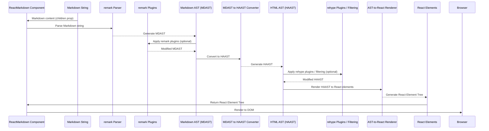

# Chapter 1: ReactMarkdown Component

This is the first chapter of our tutorial.

---

### Problem & Motivation

In modern web applications, presenting dynamic, user-generated, or configuration-driven content is a common requirement. Often, this content needs rich formatting—headings, lists, code blocks, links, and images—without the complexity and security risks of direct HTML input. Markdown has emerged as a lightweight, easy-to-write markup language that addresses this need perfectly. However, integrating raw Markdown strings directly into a React application poses a challenge: browsers don't natively understand Markdown; they only render HTML.

This is precisely the problem the `react-markdown` component solves. It acts as the crucial bridge, enabling developers to seamlessly take Markdown content and transform it into standard React elements, which then render as HTML in the browser. Without `react-markdown`, developers would have to resort to complex manual parsing, custom rendering logic, or rely on `dangerouslySetInnerHTML`, which comes with significant security vulnerabilities.

Consider a scenario where users submit comments or write blog posts using Markdown. For example, a user might type:

```markdown
# My Awesome Post
Hello **world**!

- Item 1
- Item 2
```

The `react-markdown` component allows you to render this markdown directly into your React application as structured and styled HTML, safely and efficiently, making it an indispensable tool for displaying rich textual content.

---

### Core Concept Explanation

The `ReactMarkdown` component is the heart of the `react-markdown` library. At its core, it's a versatile React component that takes a Markdown string as input and outputs a hierarchy of React elements (like `<h1>`, `<p>`, `<ul>`, `<li>`, etc.) that represent the rendered Markdown. It essentially transforms plain text Markdown into a fully functional and stylable part of your React UI.

This transformation isn't magic; it follows a well-defined pipeline. When you provide Markdown to `ReactMarkdown`, it first uses a robust parser (from the `remark` ecosystem) to convert the Markdown string into an Abstract Syntax Tree (AST). This AST is a programmatic representation of your Markdown's structure. Next, it can optionally apply transformations to this AST (using the `rehype` ecosystem) to modify or enhance the content, for instance, by adding IDs to headings or sanitizing potentially malicious elements. Finally, it traverses this processed AST and intelligently converts each node into its corresponding React element, creating a standard React component tree.

Think of `ReactMarkdown` as a sophisticated translator. You give it a document in "Markdown language," and it translates it into "React JSX language," which your React application can then understand and display beautifully. It handles all the intricate details of parsing, sanitization, and rendering, freeing you to focus on your application's logic and design.

---

### Practical Usage Examples

Let's see how easy it is to use the `ReactMarkdown` component to render our motivating use case.

#### Basic Markdown Rendering

The simplest way to use `ReactMarkdown` is by passing your Markdown string directly as children to the component.

```jsx
import React from 'react';
import ReactMarkdown from 'react-markdown';

function App() {
  return (
    <ReactMarkdown>
      # Welcome
      This is a **simple** markdown example.
    </ReactMarkdown>
  );
}

export default App;
```

**Explanation:** In this example, `ReactMarkdown` takes the multi-line string content within its tags, parses it, and renders it as an `<h1>` tag and a `<p>` tag with a `<strong>` element inside.

#### Rendering Markdown from a Variable

Often, your Markdown content will come from a variable, a state, or fetched from an API.

```jsx
import React from 'react';
import ReactMarkdown from 'react-markdown';

function PostContent() {
  const markdownText = `
# My Blog Post
This is content written in **Markdown**.
- Feature 1
- Feature 2
`;
  return <ReactMarkdown>{markdownText}</ReactMarkdown>;
}

export default PostContent;
```

**Explanation:** Here, the Markdown string is stored in the `markdownText` constant. `ReactMarkdown` then processes this string to output a heading, a paragraph, and an unordered list. Notice how we use template literals for multi-line strings.

#### Using the `children` Prop Explicitly

While passing Markdown as children is common, you can also use the explicit `children` prop. This is useful in scenarios where you might be destructuring props or want more explicit control.

```jsx
import React from 'react';
import ReactMarkdown from 'react-markdown';

function Comment({ content }) {
  // content might be a markdown string
  return <ReactMarkdown children={content} />;
}

// Example usage elsewhere: <Comment content="This is a *great* comment!" />
```

**Explanation:** The `ReactMarkdown` component accepts the Markdown string via its `children` prop. This works identically to passing it as direct children, offering an alternative syntax.

---

### Internal Implementation Walkthrough

The `ReactMarkdown` component orchestrates a multi-step process to transform your raw Markdown string into interactive React elements. Understanding this pipeline is key to appreciating its power and extensibility.

Here's a simplified step-by-step breakdown of what happens internally when `ReactMarkdown` receives your Markdown content:

1.  **Receive Markdown Input**: The `ReactMarkdown` component receives the Markdown string, typically via its `children` prop.
2.  **Parsing with `remark`**: It hands off this string to the `remark` parser. `remark` is a powerful Markdown processor that converts the plain text Markdown into a **Markdown Abstract Syntax Tree (MDAST)**. This tree is a structured, programmatic representation of your Markdown content.
3.  **Transformation (Optional `remark` plugins)**: If you've configured any `remark` plugins, they operate on the MDAST, allowing you to modify or augment the Markdown structure before it's converted to HTML-like structures.
4.  **Conversion to `rehype` AST**: The MDAST is then converted into a **HTML Abstract Syntax Tree (HAAST)**, which is the internal representation used by the `rehype` ecosystem. This is a crucial step because `rehype` deals with HTML-like structures, making it ideal for the final rendering phase.
5.  **Further Transformation (Optional `rehype` plugins)**: Similarly, `rehype` plugins can be applied to the HAAST. These plugins are excellent for manipulating HTML structures—for instance, adding classes, modifying attributes, or even sanitizing potentially dangerous elements. This is also where `react-markdown`'s built-in element filtering happens.
6.  **AST-to-React Rendering**: Finally, `ReactMarkdown` takes the processed HAAST and traverses it. For each node in the HAAST (e.g., a heading node, a paragraph node, a link node), it determines the appropriate React component to render (e.g., `<h1>`, `<p>`, `<a>`). It then recursively renders the children of each node, constructing a complete React element tree.
7.  **Output React Elements**: The component returns this fully formed React element tree, which React then efficiently renders to the DOM.

Here's a mermaid sequence diagram illustrating this flow:



This pipeline emphasizes that `ReactMarkdown` isn't just a simple string replacement tool; it's a sophisticated processing engine built upon well-established ecosystems.

---

### System Integration

The `ReactMarkdown` component acts as the user-facing entry point, but it relies heavily on a robust internal architecture that leverages several interconnected concepts and libraries. Its integration within the project is fundamental:

*   **Markdown Parsing (`remark`)**: At its initial stage, `ReactMarkdown` deeply integrates with the `remark` processor. This external library is responsible for taking the raw Markdown string and converting it into a structured data format called an MDAST. This is the subject of the next chapter: [Markdown Parsing](chapter_02.md).
*   **AST Transformation (`rehype`)**: After initial parsing, the MDAST is transformed into a HAAST, which is then processed by the `rehype` ecosystem. `rehype` allows for powerful manipulations of this HTML-like AST, making it ideal for tasks like sanitization and advanced HTML modification. This is further explored in [AST Transformation](chapter_03.md).
*   **AST-to-React Rendering**: The final and crucial step is `ReactMarkdown`'s internal renderer that walks the processed HAAST and constructs the actual React component tree. This is the core logic that translates abstract nodes into concrete React elements and will be detailed in [AST-to-React Rendering](chapter_04.md).
*   **Custom Component Mapping**: `ReactMarkdown` provides a `components` prop that allows developers to override default HTML element renderings with their own custom React components. This powerful feature for fine-grained control is covered in [Custom Component Mapping](chapter_05.md).
*   **Element Filtering and Sanitization**: To ensure security and control over rendered output, `ReactMarkdown` offers mechanisms to filter specific elements or attributes. This is tightly integrated into the `rehype` processing phase and is discussed in [Element Filtering and Sanitization](chapter_06.md).
*   **Processing Plugins**: The `remark` and `rehype` ecosystems thrive on plugins. `ReactMarkdown` exposes `remarkPlugins` and `rehypePlugins` props, allowing users to extend or modify the processing pipeline with custom logic. This advanced feature is detailed in [Processing Plugins](chapter_07.md).

Essentially, `ReactMarkdown` serves as the orchestrator, guiding your Markdown through these distinct, yet interconnected, stages to produce the final React output.

---

### Best Practices & Tips

1.  **Prioritize Security with Untrusted Content**: If you are rendering user-generated Markdown, always assume it could contain malicious scripts or unwanted HTML. `react-markdown` includes built-in sanitization (via `rehype-sanitize` internally), but it's crucial to understand its defaults and configure it if you have specific security requirements. Never rely solely on client-side rendering for security; sanitize content on the server-side as well where possible.
2.  **Control Output with `components` Prop**: For most applications, default HTML elements (`<h1>`, `<p>`, `<a>`) are sufficient. However, for branding, styling, or adding interactive features, use the `components` prop to map custom React components to specific Markdown elements. This gives you granular control over the final rendered output.
    ```jsx
    import ReactMarkdown from 'react-markdown';
    import MyHeading from './MyHeading'; // Custom H1 component

    function CustomRender() {
      const components = {
        h1: MyHeading, // Render <h1> tags with MyHeading component
      };
      return <ReactMarkdown components={components}># Hello World</ReactMarkdown>;
    }
    ```
3.  **Mind Performance for Large Inputs**: For extremely large Markdown documents, parsing and rendering can take time. Consider memoizing your `ReactMarkdown` component or its `children` prop if the content changes infrequently to prevent unnecessary re-renders. For very large, static Markdown, you might pre-render it on the server (SSR) or build time.
4.  **Leverage Plugins for Advanced Functionality**: If you need to extend Markdown syntax (e.g., footnotes, GFM task lists) or modify the HTML output in complex ways (e.g., syntax highlighting for code blocks), explore the vast ecosystem of `remark` and `rehype` plugins. These can be passed via the `remarkPlugins` and `rehypePlugins` props.
5.  **Provide `key` Prop for Lists (When Iterating)**: If you are rendering multiple `ReactMarkdown` components in a list, ensure each has a unique `key` prop for React's reconciliation process. This is a general React best practice, not specific to `react-markdown`.

---

### Chapter Conclusion

In this chapter, we've introduced the `ReactMarkdown` component as the cornerstone of rendering Markdown content in React applications. We've understood the problem it solves, its core concept as a Markdown-to-React translator, and seen practical examples of its basic usage. We then delved into its internal processing pipeline, highlighting its reliance on the `remark` and `rehype` ecosystems, and how it integrates with other project concepts. Finally, we covered essential best practices for secure, performant, and customizable usage.

`ReactMarkdown` serves as your primary interface for bringing rich, formatted text into your React components. With a solid grasp of this foundational component, you're now ready to explore the underlying mechanisms that make it all possible.

Next, we will dive deeper into the first crucial step of the pipeline: [Markdown Parsing](chapter_02.md).