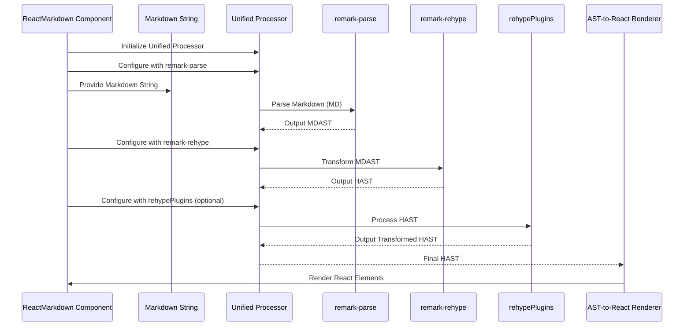
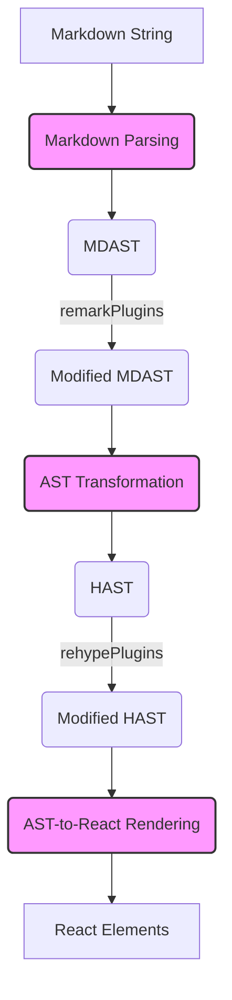

# Chapter 3: AST Transformation

Welcome back to the `react-markdown` journey! In the [previous chapter on Markdown Parsing](chapter_02.md), we learned how raw Markdown text is converted into a structured data format called a Markdown Abstract Syntax Tree (MDAST). This tree provides a programmatic representation of your Markdown content. However, an MDAST isn't quite ready for direct conversion into React elements. That's where **AST Transformation** comes into play.

---

### Problem & Motivation

Imagine you've written a Markdown document with a heading, a paragraph, and a link. After Markdown parsing, you'd have an MDAST that represents these elements with nodes like `heading`, `paragraph`, and `link`. While this is great for understanding the *structure* of the Markdown, it doesn't directly tell a rendering engine how to draw an HTML `<h1>`, `<p>`, or `<a>` tag. Markdown elements often have a more semantic meaning (`emphasis`, `strong`), whereas HTML elements are more specific about presentation (`<em>`, `<strong>`).

The core problem is that `react-markdown` ultimately needs to render standard web components, which align much closer to HTML semantics than pure Markdown semantics. Directly mapping MDAST nodes to React elements can be cumbersome and less flexible for standard HTML output. For instance, an MDAST `link` node might contain properties specific to Markdown, but what we need for React is an HTML-like `a` element with an `href` attribute.

This chapter's central purpose is to explain how `react-markdown` bridges this gap. It introduces a crucial intermediate step: transforming the MDAST into an HTML Abstract Syntax Tree (HAST). This transformation simplifies the subsequent rendering process, allowing `react-markdown` to efficiently convert standard HTML-like nodes into their corresponding React components, making it a highly versatile tool for rendering web content.

---

### Core Concept Explanation

**AST Transformation** is the process of converting one Abstract Syntax Tree (AST) into another, often with a different structure or semantic focus. In the context of `react-markdown`, this specifically refers to the conversion of a **Markdown Abstract Syntax Tree (MDAST)** into an **HTML Abstract Syntax Tree (HAST)**.

The MDAST, generated by `remark-parse`, is tailored to represent Markdown constructs. For example, a Markdown link `[Google](https://google.com)` might be represented as an MDAST node with type `link`, a `url` property, and children representing the text content. While perfectly valid for Markdown, directly translating this to a React `<a />` element might require custom logic for each MDAST node type.

Enter HAST. HAST (HTML Abstract Syntax Tree) is a different tree structure designed to represent HTML. It uses nodes like `element` (for tags like `<div>`, `<p>`, `<a>`), `text` (for plain text content), and `doctype`. When the MDAST `link` node is transformed into HAST, it becomes an `element` node with a `tagName` of `'a'`, an `properties` object containing `{ href: 'https://google.com' }`, and `children` nodes for the link text. This HAST structure is much closer to how a browser or React understands HTML, making the final rendering step significantly simpler and more standardized.

`react-markdown` leverages the `unified` ecosystem, specifically the `remark-rehype` plugin, to perform this transformation. `remark-rehype` acts as the bridge, taking an MDAST as input and producing a HAST that represents the equivalent HTML structure. This allows `react-markdown` to benefit from the rich plugin ecosystems of both `remark` (for Markdown-specific transformations) and `rehype` (for HTML-specific transformations) before the final rendering.

---

### Practical Usage Examples

Since AST Transformation is an internal process within `react-markdown`, you don't directly interact with an API for it. Instead, you provide Markdown, and `react-markdown` orchestrates this transformation behind the scenes. However, understanding what happens under the hood can be incredibly useful, especially when debugging or using `remark` or `rehype` plugins.

Let's consider a simple Markdown string:

```markdown
# Hello World

This is a **bold** paragraph.
```

When `react-markdown` processes this, after parsing the Markdown into MDAST, it will then transform that MDAST into HAST.

Here's a conceptual look at what the transformation entails:

```javascript
// Conceptual MDAST representation (simplified)
const mdastExample = {
  type: 'root',
  children: [
    { type: 'heading', depth: 1, children: [{ type: 'text', value: 'Hello World' }] },
    {
      type: 'paragraph',
      children: [
        { type: 'text', value: 'This is a ' },
        { type: 'strong', children: [{ type: 'text', value: 'bold' }] },
        { type: 'text', value: ' paragraph.' },
      ],
    },
  ],
};

// ... after AST transformation ...

// Conceptual HAST representation (simplified)
const hastExample = {
  type: 'root',
  children: [
    {
      type: 'element',
      tagName: 'h1',
      properties: {},
      children: [{ type: 'text', value: 'Hello World' }],
    },
    {
      type: 'element',
      tagName: 'p',
      properties: {},
      children: [
        { type: 'text', value: 'This is a ' },
        {
          type: 'element',
          tagName: 'strong',
          properties: {},
          children: [{ type: 'text', value: 'bold' }],
        },
        { type: 'text', value: ' paragraph.' },
      ],
    },
  ],
};
```
The first code block shows a simplified version of what the MDAST might look like for our example Markdown. Notice how it uses Markdown-specific types like `heading` and `strong`. The second block then illustrates the corresponding HAST structure after transformation. Here, `heading` becomes an `element` with `tagName: 'h1'`, and `strong` becomes an `element` with `tagName: 'strong'`, aligning perfectly with HTML structure. This makes the next rendering step much more straightforward.

This transformation is seamlessly handled when you use the `ReactMarkdown` component:

```jsx
import ReactMarkdown from 'react-markdown';

function MyComponent() {
  const markdown = '# Hello World\n\nThis is a **bold** paragraph.';
  return (
    <ReactMarkdown>{markdown}</ReactMarkdown>
  );
}
```
In this `ReactMarkdown` component usage, the input Markdown string is first parsed into an MDAST, then the MDAST is transformed into a HAST, and finally, that HAST is rendered into React elements. All these intermediate steps, including the AST transformation, happen without you needing to explicitly call any transformation functions.

---

### Internal Implementation Walkthrough

The AST transformation within `react-markdown` is orchestrated by the `unified` processor, which is a system for parsing and transforming content. `react-markdown` sets up a `unified` pipeline that includes `remark` for Markdown processing and `rehype` for HTML processing.

Here's a step-by-step breakdown of what happens internally:

1.  **Initialization**: `react-markdown` creates a `unified` processor instance.
2.  **Markdown Parsing**: The `remark-parse` plugin is added to the processor. This takes the raw Markdown string and converts it into an MDAST.
3.  **MDAST Transformation**: Next, the crucial `remark-rehype` plugin is added. This plugin takes the MDAST generated in the previous step and traverses it, converting each Markdown-specific node into its HTML-equivalent HAST node. For example, an MDAST `link` node becomes a HAST `element` node with `tagName: 'a'`, and `url` property becomes `href` in the HAST `properties`.
4.  **HAST Processing (Optional)**: After `remark-rehype`, any `rehype` plugins configured (e.g., via the `rehypePlugins` prop on `ReactMarkdown`) operate on the HAST. These plugins can modify the HAST further, for example, to add `id` attributes to headings or sanitize certain elements.
5.  **Output**: The final HAST is then passed to the rendering stage to be converted into React elements.

Here's a sequence diagram illustrating this flow:



The `remark-rehype` plugin is at the heart of this transformation. It intelligently maps Markdown concepts to HTML concepts. For instance, Markdown's `list` and `listItem` nodes are transformed into HAST `ul`/`ol` and `li` `element` nodes respectively. This standard mapping ensures consistency and compatibility with web standards.

---

### System Integration

The AST Transformation phase sits squarely in the middle of `react-markdown`'s processing pipeline, acting as a crucial bridge between two distinct representation formats.

**Input**: It receives an MDAST from the [Markdown Parsing](chapter_02.md) stage. This MDAST is a tree of Markdown-specific nodes generated by `remark-parse`.

**Output**: It produces a HAST, which is a tree of HTML-like nodes. This HAST is then fed into the [AST-to-React Rendering](chapter_04.md) stage.

The transformation is also where `remark` plugins (that modify MDAST) and `rehype` plugins (that modify HAST) can exert their influence. `remark` plugins operate *before* the `remark-rehype` transformation, allowing you to manipulate the Markdown structure. `rehype` plugins operate *after* the `remark-rehype` transformation, allowing you to modify the HTML-like structure. This dual-plugin system provides immense flexibility.


This diagram highlights the central role of AST Transformation (D) in converting MDAST (C) to HAST (E), and how both `remarkPlugins` and `rehypePlugins` can intercept and modify the ASTs at different stages.

---

### Best Practices & Tips

1.  **Understand MDAST vs. HAST**: A clear understanding of the differences between MDAST (Markdown-focused) and HAST (HTML-focused) will greatly assist you when debugging or when developing custom `remark` or `rehype` plugins. If you're seeing unexpected output, knowing which AST format you're dealing with at each stage helps pinpoint where an issue might lie.
2.  **Leverage Plugins for Customization**: While you don't directly control the AST transformation, `react-markdown`'s `remarkPlugins` and `rehypePlugins` props offer powerful ways to intervene.
    *   Use `remarkPlugins` to modify Markdown-specific features (e.g., adding custom syntax, processing frontmatter) *before* it's converted to HTML.
    *   Use `rehypePlugins` to modify HTML-specific features (e.g., adding classes, sanitizing attributes, transforming image URLs) *after* the transformation to HAST.
3.  **Debugging with AST Visualization**: For advanced scenarios, you can use tools like `mdast-util-to-string` or `hast-util-to-html` (not directly part of `react-markdown` but from the unified ecosystem) to inspect the ASTs at different stages within a custom pipeline, which can be invaluable for understanding transformations.
4.  **Performance Considerations**: For most applications, the AST transformation step is highly optimized and very fast. Only in extreme cases with extremely large Markdown documents or a multitude of complex plugins might you consider performance tuning, but typically it's not a bottleneck. Focus on the correctness and desired output first.

---

### Chapter Conclusion

The AST Transformation stage is a quiet but critical workhorse within `react-markdown`. By converting the Markdown-centric MDAST into an HTML-centric HAST, `react-markdown` effectively translates the intent of your Markdown into a format that is easily consumable by web rendering engines. This standardized HAST then serves as the blueprint for creating React elements, making the entire process robust, extensible, and perfectly aligned with modern web development practices.

Having successfully transformed our structured Markdown data into an HTML-like tree, we are now ready for the final step: rendering this tree into actual React components that will display on the screen. Let's move on to the next chapter, [AST-to-React Rendering](chapter_04.md), to see how this magic happens.