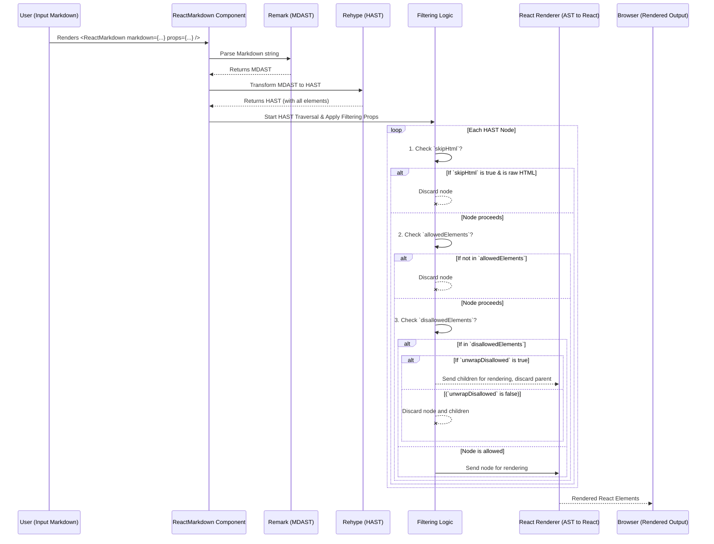

# Chapter 6: Element Filtering and Sanitization

Building upon the flexibility introduced by [Custom Component Mapping](chapter_05.md), which allows you to define *how* specific Markdown elements are rendered, this chapter delves into a crucial aspect of security and content control: **Element Filtering and Sanitization**. While custom mapping gives you creative freedom, filtering provides the necessary boundaries, ensuring that only desired and safe content makes it to your application's UI.

---

### Problem & Motivation

When `react-markdown` renders content, it essentially translates raw Markdown (and potentially embedded HTML) into React elements. This process is incredibly powerful, but it also carries inherent risks, especially when dealing with user-generated or untrusted Markdown input. A malicious user could inject harmful scripts (Cross-Site Scripting - XSS attacks), unwanted iframes, or intrusive styling tags (like `<style>`) directly into the Markdown, which, if rendered without proper precautions, could compromise your application or degrade the user experience.

Consider a scenario where users can submit comments or posts in Markdown format. If a user includes `<script>alert('You are hacked!');</script>` or `<iframe src="malicious-site.com"></iframe>` in their content, `react-markdown`'s default behavior, which aims to faithfully render content, would dangerously execute or display these elements. The core problem is the need to distinguish between benign, desired HTML elements (like `<strong>` or `<a>`) and potentially harmful or unwanted ones. Element filtering and sanitization provide the shield against such vulnerabilities, ensuring your application remains secure and displays only appropriate content.

---

### Core Concept Explanation

Element filtering and sanitization in `react-markdown` are about providing a robust mechanism to control precisely which HTML elements and attributes are permitted to be rendered from your Markdown input. This is achieved by inspecting the parsed HTML Abstract Syntax Tree (HAST) nodes and deciding whether to include them in the final React output based on predefined rules. Think of it as a bouncer at an exclusive club: only elements on the "guest list" (allowed) get in, while others are either completely rejected or stripped down before entry.

`react-markdown` provides several key props for this purpose:

*   **`allowedElements`**: This prop accepts an array of strings, where each string is an HTML tag name (e.g., `'p'`, `'a'`, `'strong'`). If provided, `react-markdown` will *only* render elements whose tag names are present in this array. All other elements, including raw HTML, will be ignored and not rendered. This is a *whitelist* approach, offering maximum security.
*   **`disallowedElements`**: Also an array of strings representing HTML tag names. If an element's tag name is in this array, that element will be explicitly *excluded* from rendering. This is a *blacklist* approach, useful for selectively removing known problematic elements.
*   **`unwrapDisallowed`**: A boolean prop that works in conjunction with `disallowedElements`. If `true`, when a disallowed element is encountered, its *children* will still be rendered, but the disallowed element tag itself will be removed. For instance, if `<div>` is disallowed but `unwrapDisallowed` is `true`, `<div><span>Hello</span></div>` would render just `<span>Hello</span>`. If `false` (default), the disallowed element and all its children are removed.
*   **`skipHtml`**: A boolean prop. If `true`, any raw HTML embedded directly in the Markdown (e.g., `<div>Hello</div>`) will be completely ignored and not rendered. This is useful when you want to ensure that Markdown input only generates elements via Markdown syntax, not via direct HTML injection.

These props empower developers to finely tune the security and rendering behavior of `react-markdown`, safeguarding against XSS and maintaining desired content integrity.

---

### Practical Usage Examples

Let's illustrate these concepts with our motivating use case: allowing user comments in Markdown but rigorously preventing malicious or unwanted HTML.

#### Basic Whitelisting with `allowedElements`

To be absolutely sure, we can whitelist only the very basic formatting elements.

```jsx
import React from 'react';
import { ReactMarkdown } from 'react-markdown';

const markdownInput = `
# My Comment
This is **my** comment with a [link](http://example.com).
<script>alert('Harmful!');</script>
<p>Hello world</p>
`;

function SecureComment() {
  return (
    <ReactMarkdown
      allowedElements={['h1', 'p', 'strong', 'em', 'a']}
    >
      {markdownInput}
    </ReactMarkdown>
  );
}

export default SecureComment;
```
**Explanation:** In this example, only `<h1>`, `<p>`, `<strong>`, `<em>`, and `<a>` elements will be rendered. The `<script>` tag and any other unlisted elements (like `` or `<iframe>`) would be completely omitted from the output. The raw `<p>` tag is also filtered as it's not present in the `allowedElements` list. This provides a very strict security posture.

---

#### Blacklisting Specific Elements with `disallowedElements`

If you want to allow most common Markdown elements but specifically ban a few dangerous ones.

```jsx
import React from 'react';
import { ReactMarkdown } from 'react-markdown';

const markdownInput = `
## My Post
Here's some *important* text.
<script>alert('Evil!');</script>
And an image: 
Also, an iframe: <iframe src="https://example.com"></iframe>
`;

function LessStrictPost() {
  return (
    <ReactMarkdown
      disallowedElements={['script', 'iframe', 'style']}
    >
      {markdownInput}
    </ReactMarkdown>
  );
}

export default LessStrictPost;
```
**Explanation:** Here, `<h2>`, `<p>`, `<em>`, and `` (generated by Markdown) are allowed to render. However, any `<script>`, `<iframe>`, or `<style>` tags, whether from Markdown (unlikely for script/iframe) or raw HTML, will be explicitly blocked and removed from the output.

---

#### Unwrapping Disallowed Elements

Sometimes you want to remove the wrapper but keep its content.

```jsx
import React from 'react';
import { ReactMarkdown } from 'react-markdown';

const markdownInput = `
A paragraph with an unwanted \`div\`:
<div>
  <span>This content should still show.</span>
  And also this.
</div>
`;

function UnwrappedContent() {
  return (
    <ReactMarkdown
      disallowedElements={['div']}
      unwrapDisallowed={true}
    >
      {markdownInput}
    </ReactMarkdown>
  );
}

export default UnwrappedContent;
```
**Explanation:** The `<div>` tag itself is disallowed and will not appear in the final React DOM. However, because `unwrapDisallowed` is `true`, its children (`<span>This content should still show.</span>` and "And also this.") will be rendered directly as siblings to the surrounding content. If `unwrapDisallowed` were `false` (the default), the entire `<div>` and its contents would be removed.

---

#### Skipping All Raw HTML with `skipHtml`

To entirely disable the rendering of any HTML embedded directly within Markdown.

```jsx
import React from 'react';
import { ReactMarkdown } from 'react-markdown';

const markdownInput = `
A simple paragraph.
<p>This is a raw HTML paragraph.</p>
<b>This is also raw HTML.</b>
Markdown **bold** will still work.
`;

function NoRawHtml() {
  return (
    <ReactMarkdown skipHtml={true}>
      {markdownInput}
    </ReactMarkdown>
  );
}

export default NoRawHtml;
```
**Explanation:** The `skipHtml` prop, when `true`, causes `react-markdown` to completely ignore and not render any content that originates from raw HTML tags in the input Markdown. This means `<p>This is a raw HTML paragraph.</p>` and `<b>This is also raw HTML.</b>` will not appear, while `Markdown **bold** will still work.` renders correctly.

---

### Internal Implementation Walkthrough

The process of element filtering and sanitization in `react-markdown` occurs during the transition from the HTML Abstract Syntax Tree (HAST) to React elements, specifically orchestrated by the underlying `rehype-react` renderer or `react-markdown`'s custom rendering logic that wraps it.

Here's a high-level sequence of how these filtering props are applied:

1.  **Markdown Parsing & AST Transformation**: The input Markdown string is first parsed into an MDAST (Markdown AST) and then transformed into a HAST (HTML AST) by `remark` and `rehype` (as covered in [Markdown Parsing](chapter_02.md) and [AST Transformation](chapter_03.md)). At this stage, the AST contains all elements, including potentially malicious ones.

2.  **HAST Traversal and Filtering Logic**: As `react-markdown` begins its [AST-to-React Rendering](chapter_04.md) phase, it iterates through each node of the HAST. Before attempting to convert a HAST node into a React element, it applies the filtering rules based on the provided props:
    *   **`skipHtml` check**: If `skipHtml` is `true` and the current HAST node represents a raw HTML element (not one generated by Markdown syntax), it is immediately discarded.
    *   **`allowedElements` check**: If `allowedElements` is provided, `react-markdown` checks if the current node's tag name is present in this whitelist. If not, the element is discarded.
    *   **`disallowedElements` check**: If `disallowedElements` is provided, `react-markdown` checks if the current node's tag name is present in this blacklist. If it is, the element is handled according to `unwrapDisallowed`.
        *   If `unwrapDisallowed` is `true`, the current node's children are processed, but the node itself is skipped.
        *   If `unwrapDisallowed` is `false` (default), the current node and all its children are discarded.

3.  **Rendering Allowed Elements**: Only elements that pass through these filtering checks are then passed on to the rendering mechanism to be converted into React components.

This filtering mechanism acts as a critical gateway, ensuring that only approved content reaches the final rendering stage, significantly enhancing the security of your `react-markdown` implementation.



---

### System Integration

Element filtering and sanitization are intrinsically tied to several other core `react-markdown` abstractions:

*   **[AST Transformation](chapter_03.md)**: The filtering process operates directly on the output of the AST transformation stage—the HAST. Without the HAST, there would be no structured representation of the HTML elements to filter.
*   **[AST-to-React Rendering](chapter_04.md)**: This is the phase where filtering is actively applied. Filtering decisions are made just before a HAST node is converted into a React element. An element must first pass the filtering checks before it proceeds to be rendered.
*   **[Custom Component Mapping](chapter_05.md)**: Filtering acts as a pre-requisite for custom component mapping. An element must first be *allowed* to render by the filtering rules before `react-markdown` even considers if there's a custom component mapped to its tag name. If an element is filtered out, no custom component mapping will apply to it.
*   **[Processing Plugins](chapter_07.md)**: Plugins (remark or rehype) can introduce new nodes or modify existing ones in the AST. Elements created or modified by plugins are still subject to the same filtering rules applied by `react-markdown`. This is crucial for security, as even elements generated by a plugin could potentially be unwanted if not managed correctly. Conversely, more advanced sanitization logic could be implemented as a `rehype` plugin, providing a more programmatic and flexible approach than the direct `react-markdown` props.

---

### Best Practices & Tips

*   **Prioritize `allowedElements` for Security-Critical Content**: For user-generated content or any input from untrusted sources, using `allowedElements` (whitelisting) is generally the most secure approach. It blocks everything by default and only allows what you explicitly permit.
*   **Use `disallowedElements` for Specific Exclusions**: If your content is largely trusted but you want to ban a few specific elements (e.g., in an internal documentation tool), `disallowedElements` can be more convenient than maintaining a huge whitelist.
*   **Combine with `unwrapDisallowed` Thoughtfully**: Understand the implications of `unwrapDisallowed`. While useful for cleaning up unwanted wrapper elements, it still allows their children to render. Ensure those children themselves are safe.
*   **Always Enable `skipHtml` for Untrusted Content**: If you don't expect or want raw HTML in your Markdown, `skipHtml={true}` provides an excellent first line of defense against HTML injection, preventing common raw HTML tag attacks.
*   **Beware of Attribute Sanitization**: `react-markdown`'s built-in props primarily filter *elements*. While underlying `rehype` libraries often provide robust attribute sanitization (e.g., removing `onclick` attributes), it's crucial to be aware that basic element filtering doesn't inherently sanitize attributes like `href` or `src` for potential malicious URLs unless `rehype-sanitize` or similar plugins are explicitly used in the pipeline. For advanced sanitization, consider integrating `rehype-sanitize` as a `rehypePlugin`.
*   **Order of Operations**: Filtering happens *before* custom component mapping. So, first decide what is allowed, then decide how to render the allowed elements.
*   **Testing is Key**: Always test your filtering configuration with various inputs, including known XSS payloads and unwanted elements, to ensure your rules are effective.

---

### Chapter Conclusion

Element filtering and sanitization are indispensable features of `react-markdown`, transforming it from a mere renderer into a secure and controlled content display tool. By mastering `allowedElements`, `disallowedElements`, `unwrapDisallowed`, and `skipHtml`, you gain granular control over the integrity and safety of the content rendered in your applications. This proactive approach to security is paramount when dealing with any dynamic or user-supplied input.

Having established a solid foundation for controlled rendering, we will now shift our focus to extending `react-markdown`'s capabilities even further. The next chapter, [Processing Plugins](chapter_07.md), will explore how to integrate `remark` and `rehype` plugins to introduce custom functionalities, modify the parsing or transformation process, and unlock advanced use cases beyond what props alone can offer.