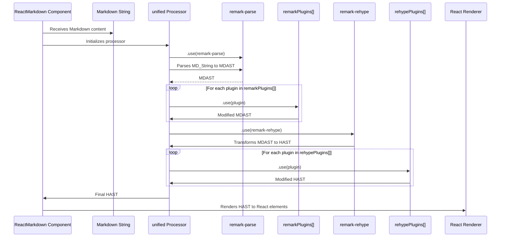

# Chapter 7: Processing Plugins

Having explored how `react-markdown` provides granular control over the rendered output through [Element Filtering and Sanitization](chapter_06.md), allowing you to define exactly what HTML elements and attributes are permitted, we now turn our attention to an even more fundamental and powerful customization mechanism: Processing Plugins. While sanitization dictates what *can* be rendered, plugins dictate *how* the Markdown is parsed and *what* the resulting HTML Abstract Syntax Tree (HAST) looks like before rendering even begins.

---

### Problem & Motivation

The default CommonMark specification for Markdown, while widely adopted, doesn't cover all common real-world use cases. Developers often encounter needs for advanced syntax like footnotes, task lists, tables, or custom containers that extend beyond the standard. Furthermore, even for standard elements, there might be a need to modify their structure or add attributes (e.g., adding `id` attributes to headings for deep linking, applying specific CSS classes to code blocks based on language, or making all external links open in a new tab).

Without a mechanism to extend or modify the core parsing and transformation logic, `react-markdown` would be limited to rendering only standard Markdown in its most basic form. This would force developers to preprocess their Markdown content manually or implement complex, brittle regex-based transformations, which is inefficient, error-prone, and difficult to maintain.

Processing plugins solve this by providing a standardized, robust, and extensible way to inject custom logic into the Markdown processing pipeline. For instance, imagine you want to render GitHub Flavored Markdown (GFM) features like task lists and tables, or perhaps automatically assign unique IDs to all heading elements in your document for easier navigation. Plugins are the dedicated, powerful tools for these kinds of tasks.

---

### Core Concept Explanation

Processing plugins in `react-markdown` leverage the underlying `remark` and `rehype` ecosystems, which are built on a common interface provided by the `unified` processor. These plugins are essentially functions that operate on Abstract Syntax Trees (ASTs) at different stages of the processing pipeline.

`react-markdown` exposes two primary props for integrating these plugins:
1.  **`remarkPlugins`**: These plugins operate on the Markdown Abstract Syntax Tree (MDAST), which is the initial representation of your Markdown content after parsing. `remark` plugins are ideal for:
    *   Adding support for new Markdown syntax (e.g., GFM features like tables, task lists).
    *   Transforming Markdown-level constructs (e.g., converting certain text patterns into custom nodes).
    *   Ensuring Markdown content adheres to specific style guides.
    `remarkPlugins` are executed *before* the MDAST is converted into a HAST.

2.  **`rehypePlugins`**: These plugins operate on the HTML Abstract Syntax Tree (HAST), which represents the HTML structure that will eventually be rendered as React elements. `rehype` plugins are perfect for:
    *   Manipulating HTML attributes (e.g., adding `id`s, `class`es, `target="_blank"`).
    *   Modifying HTML structure (e.g., wrapping images in `<figure>` tags, adding table of contents).
    *   Sanitizing or transforming HTML elements based on specific rules.
    `rehypePlugins` are executed *after* the MDAST-to-HAST conversion but *before* the final [AST-to-React Rendering](chapter_04.md).

Think of the Markdown processing pipeline as an assembly line. `remarkPlugins` are tools that modify the raw materials (Markdown text) into a more refined initial product (MDAST), adding new features or adjusting its shape. Then, `rehypePlugins` are specialized tools that take this product (now HAST, resembling raw HTML) and polish it, add finishing touches, or restructure it, preparing it for its final form as React elements.

---

### Practical Usage Examples

Let's illustrate how to use `remarkPlugins` and `rehypePlugins` to solve common problems, like enabling GitHub Flavored Markdown features and adding IDs to headings.

#### Use Case 1: Enabling GitHub Flavored Markdown (GFM) with `remark-gfm`

By default, `react-markdown` renders CommonMark. To support GFM features like tables and task lists, we use the `remark-gfm` plugin.

First, install the plugin:
```bash
npm install remark-gfm
# or yarn add remark-gfm
```

Then, integrate it into your `ReactMarkdown` component:

```jsx
import React from 'react';
import ReactMarkdown from 'react-markdown';
import remarkGfm from 'remark-gfm'; // Import the plugin

function App() {
  const markdown = `
# My Document

Here's a table:

| Header 1 | Header 2 |
|---|---|
| Cell 1 | Cell 2 |
| Cell 3 | Cell 4 |

And a task list:

- [x] Complete task A
- [ ] Complete task B
- [ ] Complete task C
`;

  return (
    <ReactMarkdown remarkPlugins={[remarkGfm]}>
      {markdown}
    </ReactMarkdown>
  );
}

export default App;
```
**Explanation:** By passing `remarkGfm` within the `remarkPlugins` array, you instruct `react-markdown` to use this plugin during the initial Markdown parsing phase. This enables the recognition and proper interpretation of GFM syntax, transforming it into the appropriate MDAST nodes before further processing. Without `remarkGfm`, the tables and task lists would not render correctly as HTML.

#### Use Case 2: Adding IDs to Headings with `rehype-slug`

For better accessibility and navigation, it's common to add unique `id` attributes to headings, allowing for deep linking. The `rehype-slug` plugin automatically generates these IDs.

First, install the plugin:
```bash
npm install rehype-slug
# or yarn add rehype-slug
```

Then, apply it via `rehypePlugins`:

```jsx
import React from 'react';
import ReactMarkdown from 'react-markdown';
import rehypeSlug from 'rehype-slug'; // Import the plugin

function App() {
  const markdown = `
# My First Heading
This is some content.

## Another Section
More content here.
`;

  return (
    <ReactMarkdown rehypePlugins={[rehypeSlug]}>
      {markdown}
    </ReactMarkdown>
  );
}

export default App;
```
**Explanation:** The `rehypeSlug` plugin runs *after* the Markdown has been parsed and converted into a HAST. It inspects the HAST for heading elements (like `h1`, `h2`) and programmatically adds a unique `id` attribute to each, derived from its text content. The resulting HTML will have headings like `<h1 id="my-first-heading">My First Heading</h1>`, which can then be used for direct links or internal navigation.

#### Use Case 3: Combining `remark` and `rehype` Plugins

You can use both types of plugins simultaneously to achieve sophisticated transformations.

```jsx
import React from 'react';
import ReactMarkdown from 'react-markdown';
import remarkGfm from 'remark-gfm';
import rehypeSlug from 'rehype-slug';
import rehypeHighlight from 'rehype-highlight'; // For code syntax highlighting

// Also install: npm install rehype-highlight lowlight
// Don't forget to import a CSS theme for syntax highlighting (e.g., from 'highlight.js/styles/github.css')

function App() {
  const markdown = `
# My **Awesome** Article

- [ ] Task list item

\`\`\`javascript
const greeting = "Hello, world!";
console.log(greeting);
\`\`\`

## Another Section with a [Link](https://example.com)
`;

  return (
    <ReactMarkdown
      remarkPlugins={[remarkGfm]}
      rehypePlugins={[rehypeSlug, rehypeHighlight]}
    >
      {markdown}
    </ReactMarkdown>
  );
}

export default App;
```
**Explanation:** Here, `remarkGfm` first processes the Markdown string, enabling task lists. Then, `rehypeSlug` adds IDs to headings in the resulting HAST, and `rehypeHighlight` (a common plugin for syntax highlighting) detects code blocks and applies appropriate highlighting classes. This demonstrates the power of chaining multiple plugins to create a rich and interactive output from simple Markdown.

---

### Internal Implementation Walkthrough

`react-markdown` acts as a thin wrapper around the `unified` processor, which orchestrates the entire Markdown parsing, transformation, and rendering pipeline. When you provide `remarkPlugins` and `rehypePlugins`, `react-markdown` passes them directly to the `unified` processor.

Here's a simplified sequence of how `react-markdown` uses these plugins:

1.  **Markdown Input**: You provide a Markdown string to the `ReactMarkdown` component.
2.  **`unified` Processor Initialization**: An instance of the `unified` processor is created.
3.  **`remark` Integration**: The `remark-parse` plugin (from the `remark` ecosystem) is added to the `unified` processor. This is responsible for converting the raw Markdown string into an MDAST.
4.  **`remarkPlugins` Application**: Any plugins provided in the `remarkPlugins` prop are then `use()`d by the `unified` processor. These plugins receive and modify the MDAST. They run sequentially in the order they are provided.
5.  **`rehype` Integration**: The `remark-rehype` plugin (a bridge between `remark` and `rehype`) is added. This transforms the MDAST (potentially modified by `remarkPlugins`) into a HAST.
6.  **`rehypePlugins` Application**: Any plugins provided in the `rehypePlugins` prop are `use()`d. These plugins receive and modify the HAST. They also run sequentially.
7.  **HAST Processing for Rendering**: The final HAST (after all `rehypePlugins` have run) is then processed by `react-markdown`'s internal rendering logic, which translates each HAST node into a corresponding React element. This is where [Custom Component Mapping](chapter_05.md) and [Element Filtering and Sanitization](chapter_06.md) come into play, operating on the final HAST before rendering.



**Code Reference:** Internally, `react-markdown` constructs a `unified` processor and uses its `.use()` method to apply plugins. You can find this logic within `react-markdown`'s source, often in files related to its core `process` function, which handles the `remark().use(...).use(remarkRehype, ...).use(...)` chain.

---

### System Integration

Processing plugins are deeply integrated into the core processing pipeline of `react-markdown`, serving as powerful extension points.

*   **Impact on [Markdown Parsing](chapter_02.md)**: `remarkPlugins` directly extend or modify the initial parsing phase. For example, `remark-gfm` adds new parsing rules for tables and task lists, fundamentally changing how the Markdown string is interpreted and structured into an MDAST.
*   **Impact on [AST Transformation](chapter_03.md)**: Both `remarkPlugins` (by altering the MDAST) and `rehypePlugins` (by altering the HAST) heavily influence this stage. `rehypePlugins` specifically are designed for granular control over the HAST before it's passed to the rendering engine.
*   **Interaction with [AST-to-React Rendering](chapter_04.md)**: The output of the entire plugin pipeline is the HAST. This final HAST is what the `react-markdown` renderer receives and converts into React elements. Therefore, plugins directly dictate the input structure for the rendering phase.
*   **Synergy with [Custom Component Mapping](chapter_05.md)**: Plugins modify the AST (MDAST or HAST), and custom components then render specific nodes *from that modified AST*. For instance, `remark-gfm` might introduce a `TaskListItem` node in the MDAST, which `remark-rehype` converts to an HTML `li` with specific attributes. You could then use custom component mapping to render that specific `li` with a custom `TaskItem` React component for more advanced interactivity.
*   **Relationship with [Element Filtering and Sanitization](chapter_06.md)**: Filtering and sanitization typically occur *after* all plugins have run, on the final HAST structure. This ensures that even if a plugin introduces potentially unsafe elements or attributes, the sanitization step can still remove them, acting as a final security layer.

---

### Best Practices & Tips

1.  **Order Matters**: The order of plugins within `remarkPlugins` and `rehypePlugins` arrays is crucial. Plugins are applied sequentially. If plugin A transforms a node that plugin B then expects, A must come before B.
2.  **Choose the Right Plugin Type**:
    *   Use `remarkPlugins` when you need to extend Markdown syntax or modify the *content* or *structure* at the Markdown level before it becomes HTML (e.g., footnotes, custom directives).
    *   Use `rehypePlugins` when you need to manipulate the *HTML structure* or *attributes* after the Markdown has been converted to HTML (e.g., adding classes, IDs, modifying links, applying syntax highlighting).
3.  **Performance Considerations**: While powerful, each plugin adds processing overhead. Use only the plugins you need. Be mindful of complex plugins that might iterate over large ASTs multiple times.
4.  **Creating Custom Plugins**: For advanced use cases, you can write your own `remark` or `rehype` plugins. This involves learning about the `unist` (Universal Syntax Tree) specification and the `unified` ecosystem. These custom plugins are functions that take an AST and return a modified AST.
5.  **Debugging Plugins**: If your Markdown isn't rendering as expected with plugins, consider logging the AST at different stages. Tools like `unist-util-visit` can help traverse ASTs, and `mdast-util-to-string` (for MDAST) or `hast-util-to-html` (for HAST) can help visualize the output of your plugins.
6.  **Plugin Documentation**: Always refer to the specific documentation for each `remark` or `rehype` plugin you intend to use, as they often have their own configuration options and usage patterns.

---

### Chapter Conclusion

Processing plugins are arguably the most powerful feature of `react-markdown`, transforming it from a simple Markdown renderer into a highly extensible and customizable content processing engine. By leveraging the vast ecosystem of `remark` and `rehype` plugins, you can introduce advanced Markdown syntax, perform intricate AST transformations, and precisely control the generated HTML output. This modular approach ensures that `react-markdown` can adapt to virtually any content rendering requirement, making it an indispensable tool for complex web applications.

This concludes our comprehensive journey through `react-markdown`. We've covered everything from its core architecture and fundamental processing steps to advanced customization techniques like custom component mapping, element filtering, and the incredibly flexible plugin system. You now have a solid foundation to wield `react-markdown` effectively in your projects, creating rich, dynamic, and secure Markdown-driven user interfaces.