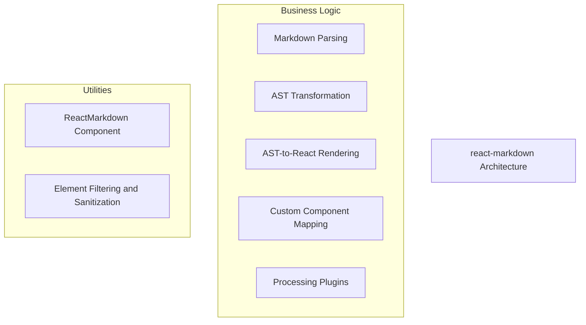
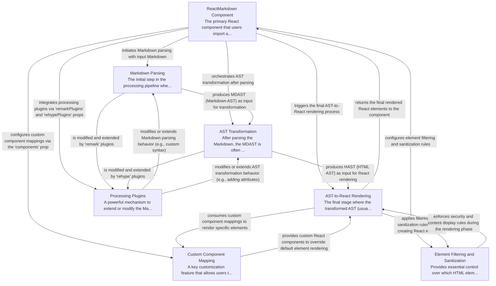

# react-markdown Tutorial

Welcome to the comprehensive tutorial for react-markdown. This tutorial is automatically generated from the codebase to help you understand the core concepts and implementation patterns.

## Project Overview

'react-markdown' is a versatile React component designed to render Markdown content directly into React elements. It achieves this by orchestrating a pipeline involving Markdown parsing, AST transformation, and rendering, leveraging underlying 'remark' and 'rehype' ecosystems. The component offers extensive customization through plugins for modifying the processing pipeline and custom component mapping for granular control over the rendered output, while also providing robust security features like element filtering.

## System Architecture

## Component Relationships

## Table of Contents

1. [Chapter 1: ReactMarkdown Component](chapter_01.md) - Comprehensive documentation for ReactMarkdown Component following structured methodology...
2. [Chapter 2: Markdown Parsing](chapter_02.md) - Comprehensive documentation for Markdown Parsing following structured methodology...
3. [Chapter 3: AST Transformation](chapter_03.md) - Comprehensive documentation for AST Transformation following structured methodology...
4. [Chapter 4: AST-to-React Rendering](chapter_04.md) - Comprehensive documentation for AST-to-React Rendering following structured methodology...
5. [Chapter 5: Custom Component Mapping](chapter_05.md) - Comprehensive documentation for Custom Component Mapping following structured methodology...
6. [Chapter 6: Element Filtering and Sanitization](chapter_06.md) - Comprehensive documentation for Element Filtering and Sanitization following structured methodology...
7. [Chapter 7: Processing Plugins](chapter_07.md) - Comprehensive documentation for Processing Plugins following structured methodology...

## How to Use This Tutorial

1. **Start with Chapter 1** to understand the foundational concepts
2. **Follow the sequence** - each chapter builds upon previous concepts
3. **Practice with code examples** - every chapter includes practical examples
4. **Refer to diagrams** - use architecture diagrams for visual understanding
5. **Cross-reference concepts** - chapters link to related topics

## Tutorial Features

- **Progressive Learning**: Concepts are introduced in logical order
- **Code Examples**: Every chapter includes practical, executable code
- **Visual Diagrams**: Mermaid diagrams illustrate complex relationships
- **Cross-References**: Easy navigation between related concepts
- **Beginner-Friendly**: Written for newcomers to the codebase

## Contributing

This tutorial is auto-generated from the codebase. To improve it:
1. Update the source code documentation
2. Add more detailed comments to key functions
3. Regenerate the tutorial using the documentation system

---

*Generated using AI-powered codebase analysis*
