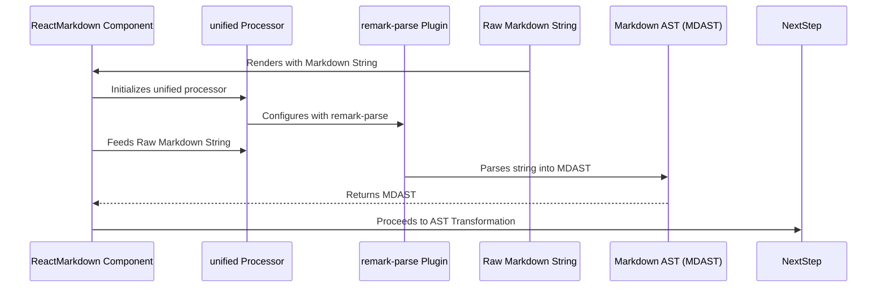

# Chapter 2: Markdown Parsing

In the previous chapter, we introduced the [ReactMarkdown Component](chapter_01.md) as the primary interface for rendering Markdown in your React applications. We saw how simply passing a Markdown string to `ReactMarkdown` transforms it into interactive HTML elements. Now, we'll dive into the very first, critical step of this transformation pipeline: Markdown Parsing.

---

### Problem & Motivation

Imagine you have a raw string of Markdown text: `"## Hello World\nThis is a *simple* paragraph with a [link](https://example.com)."`. To a computer, this is just a sequence of characters. It doesn't inherently understand that `##` signifies a heading, that `*simple*` means italicized, or that `[link](https://example.com)` is a hyperlink. Without this understanding, directly converting it to meaningful HTML (`<h2>Hello World</h2><p>This is a <em>simple</em> paragraph with a <a href="https://example.com">link</a>.</p>`) would be impossible.

This is the problem Markdown Parsing solves. `react-markdown` needs a way to "read" the raw Markdown text, identify its structural components (headings, paragraphs, lists, links, code blocks, etc.), and understand their relationships. It's akin to a human reading a document and mentally outlining its structure before rewriting it in another format. This initial structural analysis is paramount because all subsequent steps—like transforming these structures or rendering them—depend entirely on an accurate and consistent interpretation of the original Markdown. For a project like `react-markdown`, which aims to reliably render user-generated content or static documentation, a robust parsing mechanism is non-negotiable.

---

### Core Concept Explanation

Markdown Parsing is the process of analyzing raw Markdown text and converting it into a machine-readable, hierarchical data structure. This structure is known as an **Abstract Syntax Tree (AST)**, specifically an **MDAST (Markdown Abstract Syntax Tree)** for Markdown content.

Think of an AST as a family tree for your text. At the top is the "document" node. Below it are "children" nodes like "heading," "paragraph," or "list." Each of these children might have its own children; for instance, a "paragraph" node could have "text" nodes and "emphasis" nodes (for italics or bold text). This tree structure precisely represents the grammatical structure of your Markdown content, not just its visual appearance.

`react-markdown` leverages the powerful `remark` ecosystem for this parsing step. `remark` is a Markdown processor that takes your raw Markdown string and systematically breaks it down. It goes through a process often involving a **tokenizer** (which breaks the text into individual meaningful units, like words, punctuation, or special Markdown characters) and then a **parser** (which takes these tokens and builds the AST, respecting Markdown's syntax rules). The output of this stage is always an MDAST, which then becomes the input for the next stage in `react-markdown`'s pipeline: [AST Transformation](chapter_03.md).

---

### Practical Usage Examples

While `react-markdown` handles the parsing internally, understanding how different Markdown inputs are interpreted is key. Let's see how simple Markdown structures are implicitly parsed and rendered.

Here's a basic example:

```jsx
import React from 'react';
import ReactMarkdown from 'react-markdown';

function SimpleMarkdownRenderer() {
  const markdownContent = `
# Welcome
This is a *paragraph*.
`;
  return <ReactMarkdown>{markdownContent}</ReactMarkdown>;
}

export default SimpleMarkdownRenderer;
```
**Explanation:** When `ReactMarkdown` receives the `markdownContent` string, its internal parsing mechanism (powered by `remark`) first identifies `# Welcome` as a `heading` node with a level of 1, and `This is a *paragraph*.` as a `paragraph` node containing plain text and an `emphasis` node for `*paragraph*`. This structured data (MDAST) is then passed down the pipeline.

Let's look at a slightly more complex structure:

```jsx
import React from 'react';
import ReactMarkdown from 'react-markdown';

function ListAndLinkRenderer() {
  const markdownContent = `
- Item one
- Item two with a [link](https://example.com)
`;
  return <ReactMarkdown>{markdownContent}</ReactMarkdown>;
}

export default ListAndLinkRenderer;
```
**Explanation:** In this case, the parser identifies an `list` node containing two `listItem` nodes. The second `listItem` further contains a `paragraph` node, which in turn holds plain `text` and a `link` node, complete with its `url` and `children` (the link text). This hierarchical understanding is what allows `react-markdown` to correctly convert it to `<ul><li>Item one</li><li>Item two with a <a href="https://example.com">link</a></li></ul>`.

---

### Internal Implementation Walkthrough

The `react-markdown` component, at its core, utilizes the `unified` ecosystem, with `remark` being the primary parser for Markdown. Here's a simplified view of what happens when you pass a Markdown string to `ReactMarkdown`:

1.  **Initialization**: `ReactMarkdown` internally sets up a `unified` processor. This processor is configured with `remark-parse`, which is `remark`'s core parser plugin.
2.  **Input**: The raw Markdown string you provide (e.g., as children to `<ReactMarkdown>`) is fed into this `unified` processor.
3.  **Parsing with `remark-parse`**: The `remark-parse` plugin takes the string and applies Markdown syntax rules. It tokenizes the input, identifying distinct elements like `##`, `*`, `[`, `(`, `\n`, and plain text.
4.  **MDAST Generation**: These tokens are then assembled into a complete MDAST. Each node in the MDAST represents a specific Markdown construct (e.g., `heading`, `paragraph`, `list`, `link`, `text`, `emphasis`).

The flow can be visualized like this:



This MDAST is a standard JavaScript object structure that accurately reflects your Markdown's layout and content. For example, the Markdown `## Heading\nParagraph` might become an MDAST similar to (simplified for clarity):

```javascript
{
  "type": "root",
  "children": [
    {
      "type": "heading",
      "depth": 2,
      "children": [ { "type": "text", "value": "Heading" } ]
    },
    {
      "type": "paragraph",
      "children": [ { "type": "text", "value": "Paragraph" } ]
    }
  ]
}
```
This structured object is the critical output of the parsing phase.

---

### System Integration

The Markdown Parsing phase is the foundational step in the `react-markdown` processing pipeline. Its output, the MDAST, is the direct input for the subsequent stages:

*   **[AST Transformation](chapter_03.md)**: The MDAST generated by the parsing stage is then often modified or enriched. This might involve applying `remark` plugins (e.g., `remark-gfm` for GitHub Flavored Markdown features) that analyze or alter the MDAST. For instance, `remark-gfm` might add `table` nodes if your Markdown contains a table.
*   **[AST-to-React Rendering](chapter_04.md)**: After any transformations, the (potentially modified) MDAST is then converted into a HAST (HTML Abstract Syntax Tree) and subsequently rendered into actual React elements.

The integration is a clear producer-consumer relationship: the parser *produces* the MDAST, and the next stage *consumes* it. This modularity allows for powerful customization, where you can insert different types of processing between these stages.

---

### Best Practices & Tips

*   **Understand Markdown Flavors**: Be aware that different Markdown "flavors" (e.g., CommonMark, GitHub Flavored Markdown) have subtle differences in syntax. `react-markdown` by default is largely CommonMark compliant. If you need GFM features (like tables or task lists), you'll need to explicitly add `remark-gfm` as a [Processing Plugin](chapter_07.md).
*   **Validate Input**: While `remark` is robust, feeding malformed Markdown can lead to unexpected AST structures or rendering. If your Markdown comes from an untrusted source, consider pre-validating or sanitizing it *before* passing it to `react-markdown`.
*   **Performance for Large Documents**: For extremely large Markdown documents (e.g., tens of thousands of lines), parsing can become a performance bottleneck. In such cases, consider server-side parsing and caching the resulting HTML, or implementing client-side debouncing/throttling for input changes. `react-markdown` itself is highly optimized, but raw parsing time is inherent to the content size.
*   **Leverage Plugins**: The true power of `remark` (and thus `react-markdown`) comes from its plugin ecosystem. If you need to support specific syntax not covered by default, chances are there's a `remark` plugin for it. These plugins often hook directly into or after the parsing stage.

---

### Chapter Conclusion

Markdown Parsing is the critical first step in `react-markdown`'s journey from raw text to dynamic React elements. By converting unstructured Markdown into a structured, machine-readable MDAST, it lays the groundwork for all subsequent processing. This stage, powered by `remark`, ensures that `react-markdown` accurately interprets your content, making it possible to transform, manipulate, and finally render it effectively.

Now that we have a solid understanding of how Markdown content is parsed into an MDAST, we're ready to explore what happens next: how this raw MDAST can be refined and altered to suit specific needs through AST Transformation.

[AST Transformation](chapter_03.md)