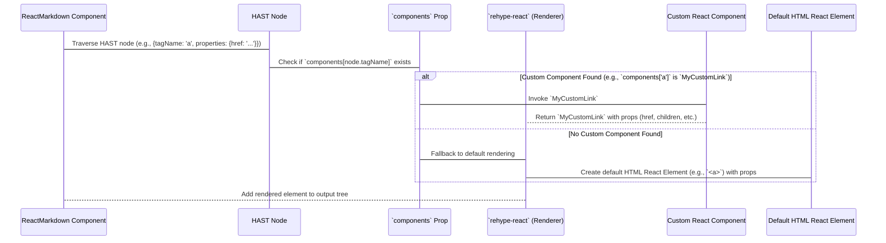

# Chapter 5: Custom Component Mapping

In the previous chapter, [AST-to-React Rendering](chapter_04.md), we delved into the final stage of `react-markdown`'s pipeline: converting the transformed AST (specifically, HAST) into actual React elements. This process typically involves mapping HAST nodes like `h1`, `p`, or `a` to their corresponding standard HTML React elements (`<h1>`, `<p>`, `<a>`). While this default behavior is often sufficient, there are many scenarios where developers need more granular control over the rendered output.

---

### Problem & Motivation

Imagine you're building a design system where every link (`<a>` tag) must adhere to a specific visual style, perhaps using a custom `Link` component from your UI library that handles internal routing differently (e.g., a `Next.js` `<Link>` component). Or perhaps you want to replace all standard `` tags with a custom `Image` component that implements lazy loading, error handling, or an optimized `srcset` attribute. The default rendering, which simply produces standard `<a>` and `` HTML tags, wouldn't allow for this level of customization or integration with your component library.

This problem extends beyond styling; it's about semantic control and integrating `react-markdown`'s output seamlessly into a modern React application's component architecture. Without a mechanism to override default elements, developers would be forced into complex CSS overrides, or even worse, post-processing the DOM after `react-markdown` renders, losing the benefits of React's declarative nature. Custom Component Mapping directly addresses this by providing a powerful way to inject your own React components into the rendering pipeline, enabling complete control over how specific Markdown or HTML elements are ultimately presented.

---

### Core Concept Explanation

Custom Component Mapping is a core customization feature of `react-markdown` that allows you to specify which React components should be used to render particular Markdown or HTML elements. At its heart, `react-markdown` uses a library like `rehype-react` for the final AST-to-React conversion. This library has default mappings (e.g., an HAST node with `tagName: 'p'` becomes a `<p>` React element). Custom component mapping intercepts this default behavior.

You provide these custom mappings via the `components` prop on the `ReactMarkdown` component. This prop accepts an object where keys are the HTML tag names (e.g., `'a'`, `'h1'`, `'p'`, `'img'`) and values are the React components you want to use for those tags. When `react-markdown` encounters an HAST node during rendering, it first checks if a custom component is provided for that node's `tagName`. If a custom component exists, `react-markdown` will use it, passing relevant props such as `children`, `href`, `src`, `alt`, etc., directly to your component.

This mechanism empowers you to replace generic HTML elements with rich, interactive, and styled React components from your design system or third-party libraries. It essentially acts as a highly flexible "find and replace" for rendering elements, transforming a plain Markdown output into a fully integrated part of your React application's UI.

---

### Practical Usage Examples

Let's illustrate Custom Component Mapping with the motivating use case: replacing default `<a>` tags with a custom `Link` component.

#### Basic Custom Link Component

First, define a simple custom `Link` component:

```jsx
import React from 'react';

const MyCustomLink = ({ href, children }) => (
  <a href={href} style={{ color: 'blue', fontWeight: 'bold' }}>
    {children} 👋
  </a>
);
```
This `MyCustomLink` component takes `href` and `children` as props, just like a standard `<a>` tag would receive. It applies a simple style and appends an emoji.

Now, integrate it with `react-markdown`:

```jsx
import React from 'react';
import ReactMarkdown from 'react-markdown';

// Assume MyCustomLink is defined as above
const MyCustomLink = ({ href, children }) => (
  <a href={href} style={{ color: 'blue', fontWeight: 'bold' }}>
    {children} 👋
  </a>
);

function App() {
  const markdown = "This is a [link to Google](https://www.google.com).";

  return (
    <ReactMarkdown components={{ a: MyCustomLink }}>
      {markdown}
    </ReactMarkdown>
  );
}

export default App;
```
**Expected Output:** The link "link to Google" will be rendered with blue, bold text and a 👋 emoji appended, instead of the browser's default link styling. This demonstrates how to completely take over the rendering of an `<a>` element.

#### Custom Image Component for Lazy Loading

Let's create a custom `Image` component that could, in a real application, implement lazy loading or error handling.

```jsx
import React from 'react';

const MyLazyImage = ({ src, alt, ...props }) => {
  // In a real app, you'd use Intersection Observer for lazy loading
  // For demonstration, we just add a border and a caption.
  return (
    <figure style={{ border: '1px solid #ccc', padding: '10px' }}>
      
      {alt && <figcaption style={{ fontStyle: 'italic', marginTop: '5px' }}>{alt}</figcaption>}
    </figure>
  );
};
```
This `MyLazyImage` component wraps the `img` tag in a `figure` and adds a caption based on the `alt` text.

Integrating with `react-markdown`:

```jsx
import React from 'react';
import ReactMarkdown from 'react-markdown';

// Assume MyLazyImage is defined as above
const MyLazyImage = ({ src, alt, ...props }) => { /* ... */ };

function AppWithImages() {
  const markdown = "Here's an image: \n\nAnd another one.";

  return (
    <ReactMarkdown components={{ img: MyLazyImage }}>
      {markdown}
    </ReactMarkdown>
  );
}

export default AppWithImages;
```
**Expected Output:** Each image in the Markdown will be rendered inside a styled `figure` with a caption derived from its `alt` text, demonstrating how `react-markdown` passes all relevant attributes (like `src`, `alt`, etc.) to your custom component.

#### Accessing All Props and Children

Your custom components receive all attributes parsed from the HAST node as props. The inner content of an element (like text inside a paragraph or the visible text of a link) is passed as the `children` prop.

```jsx
import React from 'react';
import ReactMarkdown from 'react-markdown';

const MyHeading = ({ level, children, ...props }) => {
  const HeadingTag = `h${level}`; // Dynamically choose h1, h2, etc.
  return <HeadingTag style={{ color: 'purple', textDecoration: 'underline' }} {...props}>{children}</HeadingTag>;
};

function AppWithHeadings() {
  const markdown = "# My Main Title\n\n## A Subsection";

  return (
    <ReactMarkdown components={{ h1: ({ children }) => <MyHeading level={1}>{children}</MyHeading>,
                                 h2: ({ children }) => <MyHeading level={2}>{children}</MyHeading> }}>
      {markdown}
    </ReactMarkdown>
  );
}

export default AppWithHeadings;
```
**Expected Output:** Both "My Main Title" and "A Subsection" will be rendered as their respective heading tags (`h1`, `h2`) but with purple, underlined text. This shows how you can access `children` and other props (like `level` for headings, or `href` for links) to create dynamic and styled components.

---

### Internal Implementation Walkthrough

Custom Component Mapping deeply integrates with the [AST-to-React Rendering](chapter_04.md) phase. After the initial [Markdown Parsing](chapter_02.md) into MDAST and subsequent [AST Transformation](chapter_03.md) into HAST, `react-markdown` prepares to traverse the HAST and build the React element tree.

Here's a simplified sequence of how `react-markdown` handles a node when the `components` prop is used:



1.  **HAST Traversal**: As `react-markdown` (leveraging `rehype-react`) iterates through each node in the HAST, it identifies the `tagName` of the current node (e.g., `'p'`, `'a'`, `'img'`).
2.  **`components` Prop Check**: Before rendering a default HTML element, `react-markdown` first consults the `components` prop. It checks if the `tagName` of the current HAST node is provided as a key in the `components` object.
3.  **Custom Component Invocation**: If a matching key is found (e.g., `components.a` for an `<a>` tag), `react-markdown` will invoke the associated React component (e.g., `MyCustomLink`). It intelligently passes all relevant HTML attributes from the HAST node's `properties` (like `href`, `src`, `alt`, `className`, `id`, `style`) as props to your custom component. Crucially, any child HAST nodes are recursively rendered and passed as the `children` prop to your custom component.
4.  **Default Fallback**: If no custom component is provided for a particular `tagName`, `react-markdown` falls back to its default behavior, rendering a standard HTML React element (e.g., a regular `<a>` tag).
5.  **Output Construction**: The returned React element (whether custom or default) is then integrated into the final React element tree, which `react-markdown` returns.

This process allows for a seamless substitution, making custom component mapping a powerful hook into the rendering phase without altering the underlying Markdown or AST structure.

---

### System Integration

Custom Component Mapping primarily interacts with the [AST-to-React Rendering](chapter_04.md) phase. It sits conceptually *between* the completely transformed HAST (which is the output of [AST Transformation](chapter_03.md)) and the final generation of React elements.

*   **Input**: It consumes the HAST structure generated by the transformation pipeline. The custom components don't modify the AST itself, but rather how its nodes are represented in React.
*   **Output**: It directly influences the React element tree that `react-markdown` produces, allowing for bespoke UI elements.
*   **Relationship to Plugins**: While custom component mapping focuses on *rendering*, [Processing Plugins](chapter_07.md) often focus on *modifying the AST*. It's common to use both together: a plugin might add a custom attribute to an AST node (e.g., `data-custom-id`), and then a custom component mapping for that element type would read and utilize that `data-custom-id` prop during rendering. For example, a plugin could identify certain images and add a `data-lightbox="gallery"` attribute, and your custom `Image` component would then use this prop to integrate with a lightbox library.

It's important to understand that custom components do not affect the initial [Markdown Parsing](chapter_02.md) or [AST Transformation](chapter_03.md). They only control the final presentation layer, making them a very focused and efficient way to customize the UI without altering the content's structure.

---

### Best Practices & Tips

*   **Prop Forwarding**: Always forward any unconsumed props (`...props`) to the underlying HTML element in your custom component, especially if it's a wrapper. This ensures attributes like `className`, `id`, `style`, and accessibility properties are maintained.
    ```jsx
    const MyCustomParagraph = ({ children, ...props }) => (
      <p style={{ margin: '1em 0', fontSize: '1.1em' }} {...props}>
        {children}
      </p>
    );
    ```
*   **Handle `children` Correctly**: Most custom components will need to render `children`. `react-markdown` intelligently renders the children of an AST node into the `children` prop of your custom component.
*   **Security (especially with `dangerouslySetInnerHTML`)**: If your custom component intends to render raw HTML using `dangerouslySetInnerHTML`, be extremely cautious. Ensure that the HTML comes from a trusted source or is thoroughly sanitized. Rely on `react-markdown`'s built-in [Element Filtering and Sanitization](chapter_06.md) features or a robust third-party sanitizer like `dompurify` if you must handle untrusted raw HTML. Overriding elements like `p` or `div` and then injecting untrusted `innerHTML` can bypass `react-markdown`'s default sanitization.
*   **Performance**: Avoid heavy computations or complex state management directly within your custom components unless absolutely necessary, as they will be re-rendered for every instance of that element. For complex scenarios, consider memoization (`React.memo`).
*   **Semantic HTML**: Strive to maintain semantic HTML where possible. If you're replacing a heading (`h1`), your custom component should ideally render an actual `h1` (or `div` with `role="heading"` and `aria-level="1"`) for accessibility.
*   **Key Prop for Lists**: When rendering lists of children within a custom component, ensure you apply the `key` prop if you're mapping over an array to avoid React warnings and ensure efficient updates. `react-markdown` itself handles keys for its top-level element rendering.
*   **Avoid Over-Customization**: Only override elements when truly necessary. The default rendering is often perfectly adequate and lighter weight.

---

### Chapter Conclusion

Custom Component Mapping is one of `react-markdown`'s most powerful features, offering unparalleled control over the visual presentation and interactive behavior of your Markdown content. By providing the `components` prop, you can seamlessly integrate Markdown-rendered elements with your application's design system, third-party component libraries, or custom logic for elements like links, images, and headings. This capability transforms `react-markdown` from a simple renderer into a flexible framework for building rich, component-driven content displays.

However, with great power comes great responsibility. While custom components offer immense flexibility, they also introduce the potential for new security concerns, especially if raw HTML is handled without proper sanitization. In the next chapter, we will dive deep into [Element Filtering and Sanitization](chapter_06.md), exploring how `react-markdown` protects against XSS attacks and how you can further strengthen your application's security posture when dealing with potentially untrusted Markdown content.