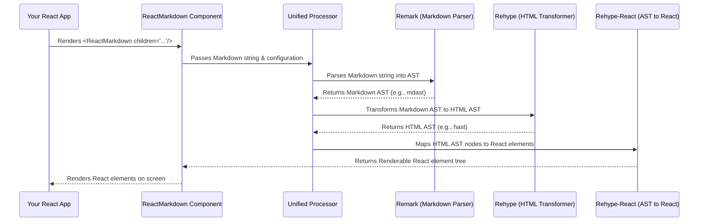

# Chapter 1: The 'ReactMarkdown' Component

Welcome to the comprehensive documentation for `react-markdown`! As this is our first chapter, we'll start right at the heart of the library: the `ReactMarkdown` component itself. This component is the primary entry point for anyone looking to integrate Markdown content into their React applications.

---

### Problem & Motivation

In modern web development, rich text content is ubiquitous. Blog posts, forum comments, documentation, and even chat messages often utilize a lightweight markup language like Markdown for easy authoring. However, browsers inherently understand HTML, not Markdown. Displaying Markdown content dynamically within a React application presents a challenge: how do you reliably convert a Markdown string into a set of renderable HTML or React elements? Manually parsing Markdown is a complex and error-prone task, often leading to inconsistencies and security vulnerabilities.

This is precisely the problem `react-markdown` solves. It provides a robust, standardized, and secure way to take any Markdown text and transform it into structured React components, seamlessly integrating it into your user interface. It eliminates the need for developers to write custom Markdown parsers or renderers, allowing them to focus on application logic rather than content transformation.

Consider a common use case: a blogging platform where authors write their articles in Markdown. Without `react-markdown`, you'd need to implement a parser on the frontend or backend, manage its output, and ensure it correctly translates Markdown into safe HTML. With `ReactMarkdown`, you simply pass the author's Markdown text to the component, and it handles the entire rendering process, delivering a beautifully formatted blog post directly within your React application.

### Core Concept Explanation

At its core, `ReactMarkdown` is a specialized React component designed to accept a Markdown string and output a tree of React elements. It acts as the central orchestrator, providing a simple, declarative interface for a powerful underlying processing pipeline. When you use `<ReactMarkdown>`, you're not directly writing a Markdown parser; instead, you're leveraging a sophisticated ecosystem of tools that handle the heavy lifting for you.

The magic of `ReactMarkdown` lies in its integration with the `unified` processing ecosystem, specifically `remark` for Markdown parsing and `rehype` for HTML transformation. `unified` is a powerful interface for parsing and manipulating various text formats by transforming them into Abstract Syntax Trees (ASTs). `ReactMarkdown` feeds your Markdown string into this pipeline, which converts it first into a Markdown AST, then into an HTML AST, and finally maps these AST nodes to actual React components.

Think of `ReactMarkdown` as a universal translator. You give it a document written in one language (Markdown), and it doesn't just translate it into another language (HTML); it also provides it in a format your application understands (React elements). You, as the developer, simply provide the source Markdown, and `ReactMarkdown` takes care of all the intricate steps to display it correctly on your page, making it the essential entry point for utilizing the library.

---

### Practical Usage Examples

Let's illustrate how straightforward it is to use the `ReactMarkdown` component to display Markdown content.

Here's the most basic way to get started:

```jsx
import React from 'react';
import ReactMarkdown from 'react-markdown';

function App() {
  return (
    // The children prop accepts your Markdown string
    <ReactMarkdown children="# Hello, ReactMarkdown!" />
  );
}

export default App;
```
*Explanation:* This example imports `ReactMarkdown` and renders a simple Markdown heading directly within your `App` component. The `children` prop is where you pass the Markdown string. `ReactMarkdown` will process `"# Hello, ReactMarkdown!"` and render it as an `<h1>` HTML element within your React application.

Now, let's look at a slightly more complex example, demonstrating how `ReactMarkdown` handles various Markdown features like paragraphs, lists, and code blocks, fulfilling our blogging platform use case:

```jsx
import React from 'react';
import ReactMarkdown from 'react-markdown';

const blogPostContent = `
# My First Blog Post

Welcome to my blog! This is a **fantastic** post about *React*.

Here's a list of topics:
- Introduction
- Core Concepts
- Advanced Usage

\`\`\`javascript
const greeting = "Hello, world!";
console.log(greeting);
\`\`\`
`;

function BlogPostPage() {
  return (
    <article className="blog-article">
      <ReactMarkdown children={blogPostContent} />
    </article>
  );
}
```
*Explanation:* In this snippet, we define `blogPostContent` which contains multiple Markdown elements: a heading, bold text, italics, an unordered list, and a JavaScript code block. When `BlogPostPage` renders, `ReactMarkdown` processes this entire string. It converts the Markdown heading to `<h1>`, bold text to `<strong>`, italics to `<em>`, the list to `<ul>` and `<li>` elements, and the code block to `<pre>` and `<code>` elements, all rendered as standard React components in your browser.

---

### Internal Implementation Walkthrough

While `ReactMarkdown` provides a simple interface, its internal mechanics are a testament to the power of modular text processing. The component's primary role is to set up and manage a `unified` processor, feeding it your Markdown content and rendering the resulting React element tree.

Here's a step-by-step look at what happens when `ReactMarkdown` processes your input:

1.  **Receive Input:** The `ReactMarkdown` component receives your Markdown string, typically via the `children` or `value` prop.
2.  **Initialize Processor:** It initializes or reuses an internal `unified` processor instance, configuring it with any provided plugins or options (which we'll cover in later chapters).
3.  **Parsing (remark):** The `unified` processor first passes the Markdown string to **remark**. `remark` is a Markdown processor that parses the text into a Markdown Abstract Syntax Tree (AST). This AST represents the structure of your Markdown document in a hierarchical, programmatic way.
4.  **Transformation (rehype):** Next, the Markdown AST is passed to **rehype**. `rehype` is an HTML processor that takes the Markdown AST and transforms it into an HTML AST. This step prepares the document structure for rendering as HTML.
5.  **Rendering (rehype-react):** Finally, a special integration (often `rehype-react` or similar internal logic within `react-markdown`) traverses the HTML AST. For each node in the HTML AST (e.g., a heading, a paragraph, a link), it finds or creates a corresponding React element.
6.  **Output:** The `ReactMarkdown` component then renders this generated tree of React elements to your application's DOM.

This entire sequence allows for incredible flexibility, as each step can be extended or modified using plugins.


*Explanation:* The diagram illustrates the lifecycle of a Markdown string within `ReactMarkdown`. Your application renders the component, providing the Markdown. `ReactMarkdown` then orchestrates an internal `unified` processor. This processor uses `remark` to parse the Markdown into a structured Markdown AST. This AST is then passed to `rehype`, which converts it into an HTML AST. Finally, a React-specific renderer (like `rehype-react`) transforms this HTML AST into a tree of React components, which `ReactMarkdown` then renders in your application.

---

### System Integration

The `ReactMarkdown` component is the bridge between your React application and the powerful `unified` processing ecosystem. It acts as the primary API for developers, encapsulating the complexity of Markdown parsing and rendering behind a familiar React component interface. It doesn't perform the parsing or transformation itself but rather intelligently delegates these tasks to underlying pluggable processors.

Its integration points with other core concepts in the `react-markdown` project are crucial:

*   **[Markdown String Input](chapter_02.md):** `ReactMarkdown` is the component that *consumes* your raw Markdown string, accepting it through its `children` or `value` props.
*   **[Markdown & HTML Processors (unified, remark, rehype)](chapter_03.md):** These are the *engines* that `ReactMarkdown` utilizes internally. It sets up and manages instances of `unified`, orchestrating the flow between `remark` (for Markdown parsing) and `rehype` (for HTML transformation).
*   **[AST (Abstract Syntax Tree) Node](chapter_04.md):** As shown in the internal walkthrough, ASTs (both Markdown AST and HTML AST) are the *intermediate data structures* that flow through `ReactMarkdown`'s processing pipeline. The component effectively manages the transformation of your input into these trees and then from these trees into React elements.
*   **[Component Map / Custom Renderers](chapter_05.md):** `ReactMarkdown` provides extensive options to *customize* how specific AST nodes are rendered. Instead of the default `<h1>` for a heading, you can tell `ReactMarkdown` to render a custom `<MyHeadingComponent>` using the `components` prop.
*   **[Processor Plugins](chapter_07.md):** The extensibility of `ReactMarkdown` comes from its ability to integrate `unified` plugins. Through props like `remarkPlugins` and `rehypePlugins`, `ReactMarkdown` allows you to inject custom behaviors into the processing pipeline, such as syntax highlighting, table of contents generation, or custom HTML sanitization.

The data flow within `react-markdown` can be visualized as a sophisticated pipeline, with the `ReactMarkdown` component at its entrance and exit:

```mermaid
graph TD
    A[Your React App] --> B(ReactMarkdown Component)
    B --> C{Markdown String (Input)}
    C --> D[Unified Processor Pipeline]
    D --> E(Markdown AST Generation - remark)
    E --> F(HTML AST Transformation - rehype)
    F --> G(React Element Mapping - rehype-react)
    G --> B
    B --> H[Rendered React Elements (Output)]
    H --> A
```
*Explanation:* This diagram emphasizes that the `ReactMarkdown` component serves as the interface between your application and the entire content processing pipeline. It takes the Markdown string, sends it through a series of transformations orchestrated by the `unified` processor, and then renders the final React elements back into your application, ensuring a seamless integration of Markdown content.

---

### Best Practices & Tips

To get the most out of the `ReactMarkdown` component and ensure your application remains performant and secure, consider these best practices:

*   **Choosing Input Prop (`children` vs. `value`):** Both `children` and `value` props can be used to pass Markdown text. For most cases, `children` is idiomatic React. However, if you are working with a component that needs to explicitly control its Markdown input, or if you prefer a more explicit prop, `value` is also available and behaves identically.
    ```jsx
    // Using children (most common)
    <ReactMarkdown children="## My title" />

    // Using value (alternative)
    <ReactMarkdown value="## My title" />
    ```
*   **Security for Untrusted Content:** If you are rendering Markdown from untrusted sources (e.g., user-generated comments), it's crucial to be aware of potential Cross-Site Scripting (XSS) vulnerabilities. `react-markdown` includes built-in sanitization via `rehype-sanitize` when `skipHtml` is not `true` (which is its default behavior), effectively removing potentially dangerous HTML elements and attributes. However, for maximum security and fine-grained control, explicitly configure `rehypePlugins` to include `rehype-sanitize` and understand its options.
*   **Performance with Large Documents:** For very large Markdown documents, the parsing and rendering process can be computationally intensive. If your Markdown content is static or changes infrequently, consider memoizing the `ReactMarkdown` component or the Markdown string itself to prevent unnecessary re-renders.
    ```jsx
    import React, { useMemo } from 'react';
    import ReactMarkdown from 'react-markdown';

    function MemoizedMarkdown({ content }) {
      // Memoize the ReactMarkdown component call if content is static
      const memoizedRender = useMemo(() => {
        return <ReactMarkdown children={content} />;
      }, [content]); // Re-render only if content changes

      return memoizedRender;
    }
    ```
*   **Accessibility:** Ensure that any custom renderers you implement (using the `components` prop) adhere to web accessibility standards. For instance, if you custom render `<a>` tags, make sure they have appropriate `aria-label` attributes if their text content isn't descriptive enough.

---

### Chapter Conclusion

The `ReactMarkdown` component stands as the cornerstone of the `react-markdown` library. It provides a simple yet incredibly powerful interface for transforming Markdown text into dynamic React elements. By effectively orchestrating the `unified` processing pipeline, it liberates developers from the complexities of Markdown parsing, allowing for robust and flexible content rendering within any React application. Understanding this component is the first crucial step to unlocking the full potential of `react-markdown`.

As we move forward, we'll delve deeper into how you provide the Markdown text to this component. In the next chapter, we'll explore the various ways to input your Markdown string, examining the nuances of the `children` and `value` props.

[Markdown String Input](chapter_02.md)