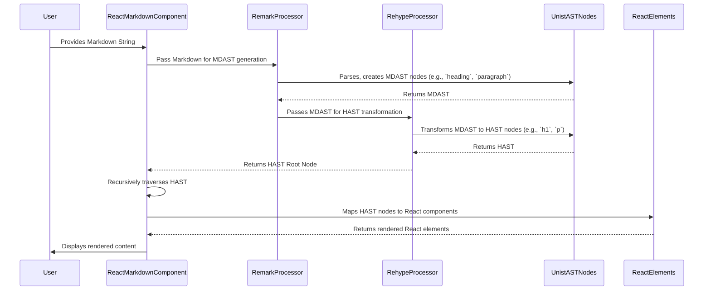

# Chapter 4: AST (Abstract Syntax Tree) Node

In the [previous chapter](chapter_03.md), we explored how `unified`, `remark`, and `rehype` processors work as the engines behind `react-markdown`. These powerful tools take your raw Markdown string and transform it into a structured, machine-readable format. The output of this parsing process is precisely what we'll dive into now: the **Abstract Syntax Tree (AST)**, composed of individual **AST Nodes**. Understanding these nodes is fundamental to unlocking the full power and customization capabilities of `react-markdown`.

---

### Problem & Motivation

Imagine you have a Markdown document and you want to render a specific type of element, like a link or an image, in a completely custom way. Perhaps all external links should open in a new tab with a special icon, or you want to prevent certain images from rendering at all. If `react-markdown` only received a raw text string, how would it know what part of the text is a link versus an image versus a paragraph? It couldn't.

This is the problem the AST solves. Raw Markdown text is unstructured for programmatic interpretation. To accurately identify and manipulate distinct Markdown constructs (like headings, paragraphs, lists, links, or code blocks), we need a structured representation. For `react-markdown`, the AST is crucial because it provides this detailed map of the Markdown's content and structure. Without it, the library wouldn't know how to map different parts of your Markdown to appropriate React components for rendering. For example, if you provide the Markdown `## My Title`, `react-markdown` needs to know that this is specifically a *heading* of *depth 2* and that its content is "My Title" to correctly render it as an `<h2>My Title</h2>`. This granular understanding is only possible through the AST.

---

### Core Concept Explanation

An **Abstract Syntax Tree (AST)** is a tree-like representation of the abstract syntactic structure of source code – in our case, Markdown or HTML. Think of it as an outline or a detailed blueprint of your document. Instead of raw text, the AST represents the document as a hierarchical collection of objects, where each object is an **AST Node**.

Each **AST Node** is a fundamental building block within this tree. It represents a specific piece of the content, like a `paragraph`, a `heading`, a `link`, or even a simple `text` string. Every node typically has:
*   A `type`: This string (`paragraph`, `heading`, `text`, `link`, `image`, `code`, etc.) identifies what kind of content the node represents.
*   `properties` (optional): Additional attributes relevant to the node's type, such as `depth` for a heading, `url` for a link, or `alt` text for an image.
*   `children` (optional): An array of other AST nodes nested within it. For example, a `paragraph` node might have `text` nodes and an `emphasis` node as its children.
*   `value` (optional): For literal nodes like `text` or `code`, this holds the actual string content.

This tree structure allows `react-markdown` to traverse the document, understand each element's role, and apply specific rendering logic based on its `type` and `properties`. It's how the library differentiates between a `[GitHub](https://github.com)` link and `` image, even though both use square and round brackets in Markdown.

---

### Practical Usage Examples

To understand AST Nodes, let's see how a simple Markdown string is transformed into a tree of nodes. `react-markdown` internally uses unified processors (like `remark` and `rehype`) which produce ASTs conforming to the `unist` specification.

Consider a simple Markdown snippet:

```markdown
# My Heading

This is a **paragraph** with a [link](https://example.com).
```

When this Markdown is processed, it is transformed into an AST. Let's look at a simplified, representative structure of the AST nodes it would generate. We can use a tool like `remark` directly to parse this Markdown and observe its AST:

```javascript
import { remark } from 'remark';

const markdown = `
# My Heading

This is a **paragraph** with a [link](https://example.com).
`;

const ast = remark().parse(markdown);
console.log(JSON.stringify(ast, null, 2));
```

The `console.log` output would reveal a detailed JSON structure. Here's a truncated example, focusing on key nodes:

```json
{
  "type": "root",
  "children": [
    {
      "type": "heading",
      "depth": 1,
      "children": [
        { "type": "text", "value": "My Heading" }
      ]
    },
    {
      "type": "paragraph",
      "children": [
        { "type": "text", "value": "This is a " },
        {
          "type": "strong",
          "children": [{ "type": "text", "value": "paragraph" }]
        },
        { "type": "text", "value": " with a " },
        {
          "type": "link",
          "url": "https://example.com",
          "children": [{ "type": "text", "value": "link" }]
        },
        { "type": "text", "value": "." }
      ]
    }
  ]
}
```

**Explanation of the AST Nodes:**

1.  **`root` node**: This is the top-level node for the entire document, and it contains all other nodes as its `children`.
2.  **`heading` node**:
    *   `type: "heading"`: Identifies it as a heading.
    *   `depth: 1`: Indicates it's an H1 (single `#`).
    *   `children`: Contains a `text` node with the value "My Heading".
3.  **`paragraph` node**:
    *   `type: "paragraph"`: Identifies it as a paragraph.
    *   `children`: An array showing the sequence of elements within the paragraph.
        *   A `text` node for "This is a ".
        *   A `strong` node (for `**paragraph**`), which itself contains a `text` node.
        *   Another `text` node for " with a ".
        *   A `link` node (for `[link](https://example.com)`). This node has a `url` property and children (a `text` node for "link").
        *   A final `text` node for ".".

This example clearly demonstrates how each distinct part of the Markdown is represented as a structured node, with its type, properties, and nested children. This is the precise information `react-markdown` uses to render each part correctly.

---

### Internal Implementation Walkthrough

The process of generating and utilizing AST Nodes within `react-markdown` involves several steps, orchestrated by the unified ecosystem:

1.  **Parsing Markdown (Remark):** When you pass a Markdown string to `ReactMarkdown`, the underlying `remark` processor first parses this string. It analyzes the Markdown syntax and constructs a **Markdown Abstract Syntax Tree (MDAST)**. MDAST nodes are specific to Markdown constructs (e.g., `heading`, `paragraph`, `list`, `code`).

2.  **Transforming to HTML (Rehype):** The MDAST is then passed to the `rehype` processor. `rehype` takes the Markdown-specific nodes and transforms them into **Hypertext Abstract Syntax Tree (HAST)** nodes. HAST nodes are closer to HTML, meaning an `heading` node from MDAST might become an `h1` or `h2` node in HAST, and a `strong` node might become an `b` or `strong` node. This standardization makes it easier for `react-markdown` to map to HTML-equivalent React components.

3.  **`react-markdown` Consumption:** `react-markdown` receives this HAST root node. It then recursively traverses the HAST, starting from the root and iterating through its `children`. For each HAST node it encounters, `react-markdown` performs a lookup in its internal component map (or your custom renderers). It matches the node's `type` (e.g., `'p'`, `'h1'`, `'a'`) to a specific React component (`<p>`, `<h1>`, `<a>`).

4.  **Rendering React Elements:** As `react-markdown` finds a match, it instantiates the corresponding React component, passing the current AST node's properties (`url`, `alt`, etc.) and its rendered children as props. This process continues until all nodes in the AST have been visited and transformed into a tree of React elements.

The entire flow can be visualized as follows:



*In this diagram, `UnistASTNodes` represents the intermediate data structure (either MDAST or HAST) that the processors are building and transforming. `react-markdown` operates directly on the final HAST structure.*

---

### System Integration

AST Nodes are the central data structure that links together many core concepts within `react-markdown`:

*   **[Markdown & HTML Processors (unified, remark, rehype)](chapter_03.md):** These processors are directly responsible for *creating* the AST from your Markdown string and *transforming* it (e.g., from Markdown-specific nodes to HTML-like nodes). They are the factories for the AST.
*   **[Component Map / Custom Renderers](chapter_05.md):** The AST is the *input* for the rendering process. Each node's `type` determines which React component (`<p>`, `<h1>`, `<a>`, etc.) from the component map (or your custom renderers) will be used to render it. When you create a custom renderer, you receive the current AST `node` as a prop, allowing you to inspect its `type`, `properties`, and `children`.
*   **[Rendering Control (Skipping & Unwrapping)](chapter_06.md):** The ability to skip or unwrap certain elements relies entirely on identifying specific AST nodes. You tell `react-markdown` to ignore or flatten nodes of a particular `type` (e.g., skip all `img` nodes or unwrap all `p` nodes), directly interacting with the AST structure.
*   **Processor Plugins:** Plugins (discussed in depth in [Chapter 7: Processor Plugins](chapter_07.md)) primarily work by *modifying* the AST. A plugin can add, remove, or change nodes in the AST before `react-markdown` begins its rendering process. This allows for powerful transformations, such as injecting IDs into headings or transforming custom Markdown syntax into standard HTML elements.

Data flow perspective: Markdown String → (Unified Processors) → AST (MDAST → HAST) → (`react-markdown` Traversal + Component Mapping) → React Elements.

---

### Best Practices & Tips

*   **Inspect the AST:** When developing custom renderers or plugins, it's incredibly helpful to inspect the exact structure of the AST nodes you're working with. You can do this by using `console.log(node)` within your custom renderer functions. Tools like `remark-cli` (with `remark --no-stdout --output - your-file.md`) can also show you the full MDAST structure.
*   **Understand `unist` Specification:** `react-markdown` and the `unified` ecosystem adhere to the `unist` (Universal Syntax Tree) specification. Familiarizing yourself with its core node types (`Node`, `Parent`, `Literal`) and common properties will significantly aid in advanced customization.
*   **Node Immutability (for plugins):** When writing plugins that modify the AST, remember that transformations are often functional, meaning they return a *new* AST rather than directly mutating the original. This ensures predictable behavior and avoids side effects.
*   **Performance Considerations:** While AST traversal is highly optimized, very large and deeply nested Markdown documents can result in a large AST, potentially impacting initial rendering performance. Be mindful of complex plugins that might perform many passes or deep searches on the AST.

---

### Chapter Conclusion

In this chapter, we've dissected the **AST (Abstract Syntax Tree) Node**, the foundational data structure that gives `react-markdown` its intelligence. We've seen how raw Markdown is transformed into a hierarchical tree of nodes, each with a `type`, `properties`, and `children`, allowing for precise programmatic understanding and manipulation of your content. This structured representation is what enables `react-markdown` to map different Markdown constructs to appropriate React components, providing the flexibility for both default and highly customized rendering.

Now that we understand the structured data `react-markdown` operates on, the next logical step is to see how these individual AST Nodes are converted into actual visual components on your screen. In the next chapter, we'll delve into the **Component Map / Custom Renderers**, exploring how `react-markdown` decides *what* React component to use for *which* AST Node.

[Component Map / Custom Renderers](chapter_05.md)