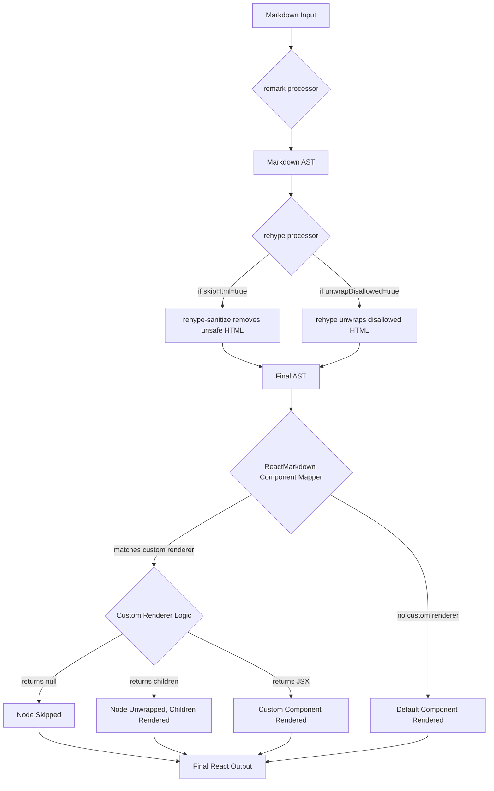

# Chapter 6: Rendering Control (Skipping & Unwrapping)

In the [previous chapter on Component Map / Custom Renderers](chapter_05.md), we explored how to replace the default rendering logic for specific Markdown or HTML nodes with our own custom React components. This powerful mechanism allows for deep customization of how content looks and behaves. However, sometimes customization isn't enough; there are scenarios where you might want to prevent certain elements from rendering entirely, or you might want to render only their children, effectively "unwrapping" the parent element. This chapter delves into these advanced rendering controls.

---

### Problem & Motivation

While custom renderers provide immense flexibility, they don't directly address situations where specific Markdown constructs or embedded HTML should be entirely omitted or structurally simplified. Consider a scenario where your users are allowed to input Markdown, but for security or design reasons, certain HTML tags (like `<script>`, `<iframe>`, or even `<div>`) should never be rendered. Or perhaps, due to a specific styling requirement, you need an image to be rendered directly without the default `<p>` tag wrapper that `react-markdown` typically adds when an image is the sole content of a paragraph. Relying solely on custom renderers for these tasks can be cumbersome, requiring manual checks within each renderer.

This is where rendering control, specifically skipping and unwrapping, becomes crucial. It allows developers to define rules for filtering out unwanted elements or simplifying the HTML structure generated from Markdown without writing complex conditional logic in every custom renderer. For instance, if a user attempts to inject a `<script>` tag, `react-markdown` can be configured to simply ignore it, preventing potential Cross-Site Scripting (XSS) vulnerabilities. Similarly, if your design dictates that blockquotes should not have their default `<blockquote>` wrapper but only their inner text rendered, unwrapping provides a clean solution.

---

### Core Concept Explanation

`react-markdown` offers fine-grained control over the rendering process through various properties, primarily focusing on `skipHtml` and the `unwrapDisallowed` prop, alongside specific patterns within the `components` map. These mechanisms allow you to dictate which parts of the parsed AST are converted into React elements.

**Skipping** refers to completely preventing a specific node and its entire subtree (all its children) from being rendered. When a node is skipped, it's as if it never existed in the Markdown input, at least from the rendering perspective. This is particularly useful for security, like removing potentially harmful HTML, or for filtering out content types that are not desired in a specific context (e.g., removing all headings of a certain level).

**Unwrapping**, on the other hand, is a more nuanced form of control. When a node is unwrapped, the node itself is not rendered, but its *children* are. This effectively removes the parent wrapper element while preserving its content. This is beneficial for structural adjustments, such as eliminating default HTML wrappers around single elements (like a `<p>` tag around an `` tag) to achieve a flatter DOM structure or to conform to specific CSS layouts.

The `react-markdown` component processes the Markdown string into an Abstract Syntax Tree (AST). Before rendering React components, it inspects this AST. The `skipHtml` prop, for instance, operates at a fundamental level, often leveraging HTML processing plugins to remove disallowed HTML nodes from the AST very early. For specific Markdown node types, skipping or unwrapping can be achieved directly through the `components` prop by either returning `null` (to skip) or returning only `props.children` (to unwrap). The `unwrapDisallowed` prop specifically targets nodes that the HTML processor has marked as 'disallowed' but whose children might still be safe and useful to render.

---

### Practical Usage Examples

Let's illustrate how to use `skipHtml`, `unwrapDisallowed`, and custom renderers to control rendering.

#### 1. Skipping Direct HTML for Security

One of the most common uses for skipping is to prevent unsafe or unwanted HTML from being rendered. The `skipHtml` prop is your first line of defense.

```jsx
import ReactMarkdown from 'react-markdown';

const markdownInput = `
# My Content
<script>alert('XSS Attack!');</script>
This is some *safe* text.
`;

function App() {
  return (
    <ReactMarkdown skipHtml={true}>
      {markdownInput}
    </ReactMarkdown>
  );
}

export default App;
```
When `skipHtml={true}`, any raw HTML present in the Markdown string, especially potentially dangerous tags like `<script>`, will be completely removed from the rendering process. The output will only contain `# My Content` and `This is some *safe* text.`, effectively stripping out the script tag for security.

#### 2. Skipping Specific Markdown Node Types

You can also skip specific Markdown elements by providing a custom renderer that returns `null` for that node type.

```jsx
import ReactMarkdown from 'react-markdown';

const markdownInput = `
# Important Heading
## Less Important Subheading
This is a paragraph.
`;

function App() {
  return (
    <ReactMarkdown
      components={{
        h1: ({ node, ...props }) => null // Skip all H1 headings
      }}
    >
      {markdownInput}
    </ReactMarkdown>
  );
}

export default App;
```
In this example, the `h1` heading will not be rendered at all. The output will only show the `<h2>Less Important Subheading</h2>` and the paragraph. This is useful for enforcing content hierarchy or removing specific structural elements.

#### 3. Unwrapping a Paragraph Around an Image

A common scenario is wanting an `` tag to stand alone, rather than being wrapped in a `<p>` tag which is the default for a paragraph containing only an image.

```jsx
import ReactMarkdown from 'react-markdown';

const markdownInput = `
This is some text.


Another paragraph.
`;

function App() {
  return (
    <ReactMarkdown
      components={{
        p: ({ node, children, ...props }) => {
          // Check if the paragraph only contains an image
          if (
            node.children.length === 1 &&
            node.children[0].tagName === 'img'
          ) {
            return <>{children}</>; // Unwrap the paragraph
          }
          return <p {...props}>{children}</p>; // Otherwise, render as normal paragraph
        },
      }}
    >
      {markdownInput}
    </ReactMarkdown>
  );
}

export default App;
```
Here, we've provided a custom renderer for the `p` (paragraph) node. If a paragraph *only* contains an image, we return `children` directly, effectively rendering *only* the image without the `<p>` tag wrapper. For other paragraphs, it renders as usual.

#### 4. Unwrapping Disallowed HTML Elements

The `unwrapDisallowed` prop allows `react-markdown` to render the children of HTML tags that are considered disallowed by the underlying HTML processor (e.g., `rehype-sanitize`), instead of skipping them entirely.

```jsx
import ReactMarkdown from 'react-markdown';

const markdownInput = `
<details>
  <summary>Click to reveal</summary>
  Hidden content.
</details>

This is safe content.
`;

function App() {
  return (
    <ReactMarkdown unwrapDisallowed={true}>
      {markdownInput}
    </ReactMarkdown>
  );
}

export default App;
```
By default, `<details>` and `<summary>` might be considered disallowed for security reasons and would be skipped entirely. With `unwrapDisallowed={true}`, `react-markdown` will render "Click to reveal" and "Hidden content.", but without the `<details>` and `<summary>` tags themselves. This ensures the text content is visible even if the interactive element is stripped for safety.

---

### Internal Implementation Walkthrough

The rendering control mechanisms in `react-markdown` primarily operate during the transformation of the Abstract Syntax Tree (AST) into React elements.

1.  **Parsing & Initial AST Generation:** The Markdown string is first processed by `remark` and then `rehype` (as discussed in [Chapter 3: Markdown & HTML Processors](chapter_03.md)). This generates a complete AST where each node represents a piece of Markdown or HTML content, as detailed in [Chapter 4: AST (Abstract Syntax Tree) Node](chapter_04.md).

2.  **HTML Sanitization (`skipHtml`):**
    *   If `skipHtml={true}`, `react-markdown` uses a `rehype` plugin (often `rehype-sanitize` or similar functionality) configured to remove or sanitize specific HTML elements and attributes. This step occurs *before* the AST is mapped to React components.
    *   Any nodes representing raw HTML that are deemed unsafe or disallowed by this sanitizer are simply removed from the AST. This means they will never even reach the component mapping stage, ensuring security and preventing their rendering.

3.  **Component Mapping & Node Traversal:**
    *   After sanitization, `react-markdown` traverses the (potentially modified) AST. For each AST node, it looks for a corresponding renderer in the `components` prop (as seen in [Chapter 5: Component Map / Custom Renderers](chapter_05.md)).
    *   If a custom renderer is found:
        *   **Skipping with `null`:** If your custom renderer for a node type (e.g., `h1`) returns `null`, `react-markdown` understands that this node and its children should not be rendered. It effectively halts the rendering branch for that node.
        *   **Unwrapping with `props.children`:** If your custom renderer returns `props.children` directly (e.g., `return <>{children}</>;`), `react-markdown` renders only the children of the current AST node, effectively discarding the parent node's React component wrapper.

4.  **Disallowed HTML Handling (`unwrapDisallowed`):**
    *   The `unwrapDisallowed` prop interacts with the sanitization process. When HTML nodes are identified as "disallowed" (e.g., by `rehype-sanitize`), they are typically removed from the AST.
    *   However, if `unwrapDisallowed` is `true`, instead of completely removing the disallowed node, `react-markdown` tells the processor to retain the *children* of that disallowed node and insert them into the AST at the parent's level. This ensures that while the unsafe parent tag is gone, its content is still rendered.

Here's a simplified flow:



This sequence illustrates how `skipHtml` acts early in the pipeline (at the processing/sanitization stage) to prune the AST, while custom renderers for skipping/unwrapping act during the React component mapping phase, directly controlling how AST nodes are transformed into JSX. `unwrapDisallowed` similarly influences the `rehype` processing stage to modify the AST.

---

### System Integration

Rendering control is deeply integrated into `react-markdown`'s core processing and rendering pipeline, affecting how the AST is ultimately translated into a visible UI.

*   **Integration with [Markdown & HTML Processors (unified, remark, rehype)](chapter_03.md):** The `skipHtml` and `unwrapDisallowed` props directly influence the behavior of the underlying `rehype` HTML processor. `skipHtml` enables powerful HTML sanitization features, often leveraging libraries like `rehype-sanitize`, which clean the AST of potentially dangerous HTML nodes. `unwrapDisallowed` provides a nuanced way to handle nodes that would otherwise be entirely removed by sanitization, preserving their children.

*   **Integration with [AST (Abstract Syntax Tree) Node](chapter_04.md):** All skipping and unwrapping operations fundamentally target specific nodes within the AST. Whether it's removing a `<script>` node due to `skipHtml` or dynamically deciding not to render an `h1` node via a custom renderer, these actions modify or bypass the rendering of AST nodes.

*   **Integration with [Component Map / Custom Renderers](chapter_05.md):** Custom renderers are a primary mechanism for achieving fine-grained skipping and unwrapping. By returning `null` or `props.children` from a custom renderer for a specific node type, you directly implement rendering control patterns that are not covered by the more general `skipHtml` or `unwrapDisallowed` props. This offers the most flexible and targeted control.

These controls act as filters and transformers on the data flow, ensuring that only desired and safe content makes it to the final rendering stage, while also allowing for flexible structural adjustments.

---

### Best Practices & Tips

*   **Prioritize `skipHtml` for Security:** Always use `skipHtml={true}` when rendering user-generated content to prevent XSS attacks. Only set it to `false` if you fully trust the input source or have implemented your own robust sanitization.
*   **When to Skip vs. Unwrap:**
    *   **Skip** when the entire element and its content are unwanted or unsafe (e.g., `<script>`, `<style>`, or a specific heading level you don't want to show).
    *   **Unwrap** when the parent element is undesired structurally, but its children contain valuable and safe content (e.g., removing a `<p>` wrapper around an ``, or rendering content of a disallowed `<div>` without the `div` itself).
*   **Combine with Custom Renderers for Granular Control:** For highly specific scenarios (like unwrapping `<p>` only when it contains a single ``), custom renderers offer the most precise control.
*   **Performance Considerations:** Skipping nodes reduces the number of React components `react-markdown` needs to render, which can slightly improve performance for very large Markdown documents by reducing the size of the React component tree.
*   **Troubleshooting:** If an element isn't rendering as expected, check these common pitfalls:
    *   Is `skipHtml` unintentionally removing it?
    *   Does a custom renderer return `null` when it shouldn't?
    *   Is `unwrapDisallowed` allowing children to show when you wanted the whole element gone, or vice-versa?
    *   Ensure your Markdown input is valid; malformed Markdown might lead to unexpected AST structures.

---

### Chapter Conclusion

This chapter has provided a deep dive into `react-markdown`'s powerful rendering control mechanisms, including `skipHtml` for robust security and content filtering, `unwrapDisallowed` for selectively preserving content from disallowed HTML, and the strategic use of custom renderers to skip or unwrap specific Markdown node types. By understanding these options, you can precisely dictate what gets rendered, ensuring both the security and the desired structural integrity of your application's content.

With the ability to control which elements are rendered and how, you have even greater mastery over `react-markdown`'s output. In the upcoming [Chapter 7: Processor Plugins](chapter_07.md), we will explore how `remark` and `rehype` plugins can modify the Abstract Syntax Tree itself, providing another layer of powerful customization *before* the rendering control mechanisms even come into play.