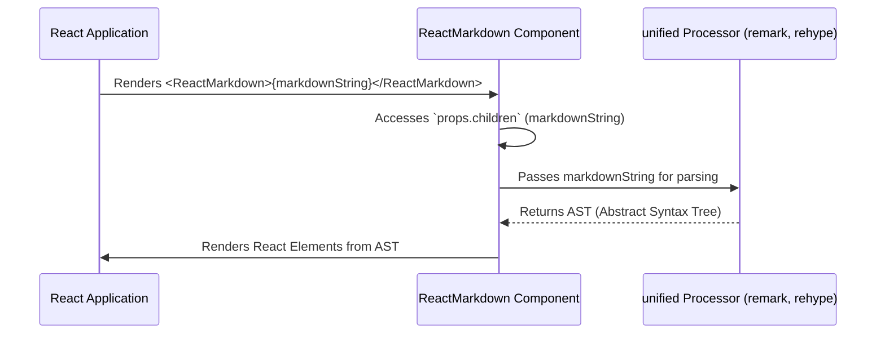

# Chapter 2: Markdown String Input

Welcome back! In [Chapter 1: The 'ReactMarkdown' Component](chapter_01.md), we introduced `ReactMarkdown` as the central component for rendering Markdown in React applications. We learned that it's the entry point for users to transform Markdown text into interactive React elements. But what exactly does `ReactMarkdown` take as its primary ingredient? That's precisely what we'll explore in this chapter: the **Markdown String Input**.

---

### Problem & Motivation

Imagine you have a blogging platform, a documentation site, or a chat application. Users want to write rich text content, but often they don't want to deal with complex HTML directly. They prefer a simpler, human-readable format that still allows for formatting like *bold* text, `code snippets`, and [links](https://example.com). This is where Markdown shines.

The core problem `react-markdown` solves, specifically concerning its input, is providing a robust and secure way to consume raw Markdown text from any source (user input, API responses, static files) and consistently render it as part of a React application. Without a clear, designated input mechanism for the Markdown string, the component wouldn't have any content to process or display. It's the foundational data that kicks off the entire transformation pipeline.

For instance, consider a scenario where users submit comments on a forum using Markdown. Our `ReactMarkdown` component needs to take that raw comment string and render it beautifully, complete with formatting, lists, and code blocks, without exposing the user to the underlying parsing complexities. This raw Markdown string is the initial, untransformed data that everything else builds upon.

### Core Concept Explanation

At its heart, the **Markdown String Input** is simply the raw text content that you feed into the `ReactMarkdown` component. This text adheres to Markdown syntax rules, which are a lightweight markup language for creating formatted text using a plain-text editor. Think of it as giving a set of instructions to `ReactMarkdown` about how to structure and style the content.

In `react-markdown`, this input typically comes through the component's `children` prop. When you pass a string directly as a child to `ReactMarkdown`, it recognizes it as the Markdown content to be processed. This string is the *initial state* of your content before any parsing or transformation occurs. It's crucial because any error or malformation in this input string will directly impact the rendering outcome.

Consider an analogy: If `ReactMarkdown` is a sophisticated coffee machine, the Markdown string is the coffee beans. You provide the raw material, and the machine (along with its internal processors) grinds, brews, and delivers the final product (renderable React elements). Without the beans, the machine has nothing to work with.

---

### Practical Usage Examples

Let's dive into how to provide Markdown string input to `ReactMarkdown`. The most common and recommended way is by passing the Markdown string as the `children` prop.

#### Basic Markdown String

Here's how you'd render a simple Markdown string:

```jsx
import ReactMarkdown from 'react-markdown';

function App() {
  const markdownContent = `
# Hello, React Markdown!

This is a paragraph with **bold** and *italic* text.

- Item 1
- Item 2

\`\`\`javascript
console.log('Hello from code block!');
\`\`\`
  `;

  return (
    <div>
      <h2>Rendered Markdown:</h2>
      <ReactMarkdown>{markdownContent}</ReactMarkdown>
    </div>
  );
}

export default App;
```
*Explanation*: In this example, `markdownContent` is a multi-line string containing various Markdown elements. We pass this string directly as the child of the `<ReactMarkdown>` component. The component then takes this raw string and transforms it into the corresponding HTML structure, rendered as React elements.

#### Dynamic Markdown Input

Often, the Markdown content will come from an external source, like an API call or user input.

```jsx
import React, { useState } from 'react';
import ReactMarkdown from 'react-markdown';

function CommentBox() {
  const [userInput, setUserInput] = useState('Write your **Markdown** comment here...');

  return (
    <div>
      <h3>Your Comment:</h3>
      <textarea
        value={userInput}
        onChange={(e) => setUserInput(e.target.value)}
        rows="5"
        cols="50"
      />
      <h3>Preview:</h3>
      <div style={{ border: '1px solid #ccc', padding: '10px' }}>
        <ReactMarkdown>{userInput}</ReactMarkdown>
      </div>
    </div>
  );
}

export default CommentBox;
```
*Explanation*: This example demonstrates a common use case where the Markdown input is dynamic. The `userInput` state variable holds the Markdown string, which is updated whenever the user types into the `textarea`. `ReactMarkdown` then re-renders the preview automatically as the input string changes. This highlights how flexibly `ReactMarkdown` handles varying input strings.

---

### Internal Implementation Walkthrough

When you provide a Markdown string to the `ReactMarkdown` component, a specific sequence of events is initiated to process that input. The `ReactMarkdown` component itself doesn't directly *parse* the Markdown; instead, it acts as an orchestrator, passing the string to powerful underlying libraries.

1.  **Receiving the Input**: The `ReactMarkdown` component receives the Markdown string via its `children` prop. Internally, the component accesses `props.children` to get the raw string.

2.  **Preparing for Processing**: This raw string is then prepared to be fed into the `unified` processor pipeline. `react-markdown` is built on the `unified` ecosystem, which provides a powerful interface for parsing and transforming text.

Here's a simplified sequence of how the Markdown string input is handled:


*Explanation*: As shown in the diagram, the `ReactMarkdown` component is the bridge. It accepts your raw Markdown string and then hands it off to the `unified` processor. The `unified` processor (which we'll delve into in the next chapter) is responsible for taking this plain string and converting it into a structured data format called an Abstract Syntax Tree (AST). `ReactMarkdown` then takes this AST and renders it into actual React elements. For now, the key takeaway is that the raw Markdown string is the *first and essential step* in this entire process.

---

### System Integration

The Markdown string input is the cornerstone of `react-markdown`'s integration with any system that generates or consumes Markdown.

*   **Source of Content**: It serves as the primary data interface between your application's data layer (e.g., databases, API endpoints, user input forms, static `.md` files) and the rendering capabilities of `react-markdown`.
*   **Pipeline Initiation**: This string is the initial input for the entire processing pipeline involving `[Markdown & HTML Processors (unified, remark, rehype)](chapter_03.md)`. It's what gets tokenized, parsed into an AST (`[AST (Abstract Syntax Tree) Node](chapter_04.md)`), and ultimately transformed.
*   **Renderer Context**: The string dictates what `[Component Map / Custom Renderers](chapter_05.md)` will eventually be called to render specific Markdown elements. A heading in the string will lead to a heading component being rendered.

**Data Flow Example:**

```mermaid
graph LR
    A[User Input / API Data / Static File] --> B(Markdown String)
    B --> C(ReactMarkdown Component)
    C --> D[unified Processor]
    D --> E[AST (Abstract Syntax Tree)]
    E --> F[React Element Rendering]
    F --> G[Browser / UI]
```
*Explanation*: This flow illustrates that the Markdown String acts as the crucial middle layer. It's the standard format that bridges disparate data sources with `react-markdown`'s powerful rendering engine, ensuring content consistency and integrity throughout the application.

---

### Best Practices & Tips

To make the most of the Markdown string input and avoid common pitfalls:

*   **Ensure Valid Markdown**: While `react-markdown` is quite forgiving, adhering to standard Markdown syntax (e.g., CommonMark) will yield the most predictable and consistent results. Use online Markdown validators if you're unsure.
*   **Sanitization is Key (Security)**: If your Markdown string comes from untrusted user input, *always* consider sanitization. While `react-markdown` offers some protection against XSS by default (it escapes raw HTML by default unless `rehype-raw` is used carefully), it's a good practice to clean input on the server-side as well, especially if you're allowing more complex Markdown or potential HTML injection. We will discuss this further in chapters on processors and plugins.
*   **Handle Empty or Null Strings**: `ReactMarkdown` gracefully handles empty strings, rendering nothing. However, if your data source might return `null` or `undefined`, ensure you provide an empty string (`''`) or conditionally render `ReactMarkdown` to prevent errors.
    ```jsx
    const safeContent = myApiData?.content || '';
    <ReactMarkdown>{safeContent}</ReactMarkdown>
    ```
*   **Performance with Large Strings**: For extremely large Markdown strings (e.g., documentation spanning thousands of lines), consider lazy loading or breaking content into smaller chunks if possible. While `remark` and `rehype` are efficient, parsing very large strings can still be computationally intensive.
*   **Avoid Unnecessary Re-renders**: If your Markdown string is static, ensure it's not needlessly re-calculated or re-passed to `ReactMarkdown` on every render cycle of its parent component. Using `React.useMemo` for static strings can help optimize performance.

---

### Chapter Conclusion

In this chapter, we've established the fundamental role of the **Markdown String Input** in `react-markdown`. It's the raw material—the source code, if you will—that drives the entire process of transforming human-readable Markdown into interactive React elements. We've seen how `ReactMarkdown` consumes this string, how it fits into the overall system architecture, and some best practices for handling it effectively.

Understanding that this string is the initial data point is crucial as we move forward. The next logical step is to explore how this raw string is actually processed and transformed. In [Chapter 3: Markdown & HTML Processors (unified, remark, rehype)](chapter_03.md), we will dive deep into the powerful libraries that take this Markdown string, parse it, and begin its journey towards becoming a rich user interface.