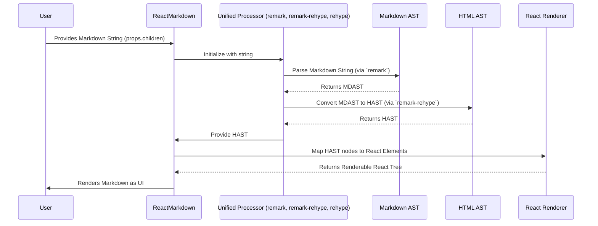

# Chapter 3: Markdown & HTML Processors (unified, remark, rehype)

In the [previous chapter, Markdown String Input](chapter_02.md), we explored how raw Markdown text serves as the initial data for the `ReactMarkdown` component. This string, while human-readable, isn't something a web browser or a React application can directly render into interactive UI elements. It's just text. To transform this plain text into structured and renderable components, a sophisticated processing pipeline is required. This is where Markdown and HTML processors come into play, forming the crucial intermediary layer in `react-markdown`'s architecture.

---

### Problem & Motivation

Imagine you have a Markdown string like `# Hello World` or `*italic text*`. How does `react-markdown` know that `#` means an `<h1>` tag, or `*...*` means an `<em>` tag? A simple string search isn't enough; Markdown has rules for nesting, block elements, inline elements, and special characters that require deep syntactic understanding.

The real-world problem is **converting unstructured Markdown text into a structured, machine-understandable format, and then transforming that structure into renderable elements.** Without this step, `react-markdown` would be unable to parse the user's input, recognize its components, or apply any custom rendering logic.

For example, if a user inputs:

```markdown
# My Heading
This is a paragraph with **bold** text.
```

`react-markdown` needs to understand:
1.  There's a top-level heading.
2.  Followed by a paragraph.
3.  Inside the paragraph, there's some text, then a strong emphasis (bold) segment, then more text.

This detailed understanding is precisely what `unified` processors, specifically `remark` for Markdown and `rehype` for HTML, provide. They are the parsing engines and transformation tools that make `react-markdown` functional.

---

### Core Concept Explanation

At the heart of `react-markdown`'s processing capabilities lies the **unified ecosystem**. `unified` is an interface for processing text with syntax trees. It acts as a framework that allows different processors to work together in a pipeline, each handling a specific transformation step.

Within the `unified` ecosystem, two primary processors are essential for `react-markdown`:

1.  **`remark`**: This is a Markdown processor. Its primary role is to take a Markdown string as input and parse it into a **Markdown Abstract Syntax Tree (MDAST)**. Think of MDAST as a structured, hierarchical representation of your Markdown text, where each node represents a specific Markdown construct (e.g., a heading, a paragraph, a list item, emphasis). `remark` understands Markdown syntax rules and breaks the string down into these logical components.

2.  **`rehype`**: This is an HTML processor. Once `remark` has created the MDAST, `react-markdown` often needs to convert this Markdown-specific tree into an HTML-compatible tree, known as an **HTML Abstract Syntax Tree (HAST)**. This conversion is handled by `remark-rehype`, a plugin that bridges `remark` and `rehype`. After this conversion, `rehype` can then process the HAST, perhaps to sanitize it, modify attributes, or as in `react-markdown`'s case, prepare it for rendering as React elements.

The flow is typically:
**Markdown String (Input) → `remark` (Parses to MDAST) → `remark-rehype` (Converts MDAST to HAST) → `rehype` (Processes HAST) → Renderable Output.**

This modular approach allows `react-markdown` to be highly flexible. You can inject various plugins at different stages of this pipeline to extend functionality, enforce rules, or customize output, which we'll explore further in [Processor Plugins](chapter_07.md).

---

### Practical Usage Examples

While `react-markdown` beautifully abstracts away the direct interaction with `unified`, `remark`, and `rehype`, understanding their conceptual roles helps clarify how `react-markdown` works. Let's trace our motivating use case:

```markdown
# My Heading
This is a paragraph with **bold** text.
```

When you pass this string to `ReactMarkdown`, here’s a conceptual look at what happens:

#### Step 1: Parsing with `remark`

The `react-markdown` component first uses `remark` to parse the input Markdown string into an MDAST.

```javascript
// Conceptual: What remark internally does with the input string
import { remark } from 'remark';

const markdownString = `# My Heading\nThis is a paragraph with **bold** text.`;

// In reality, ReactMarkdown manages this processor instance
const mdast = remark().parse(markdownString);

// A simplified view of the resulting MDAST structure:
// {
//   type: 'root',
//   children: [
//     { type: 'heading', depth: 1, children: [{ type: 'text', value: 'My Heading' }] },
//     {
//       type: 'paragraph',
//       children: [
//         { type: 'text', value: 'This is a paragraph with ' },
//         { type: 'strong', children: [{ type: 'text', value: 'bold' }] },
//         { type: 'text', value: ' text.' }
//       ]
//     }
//   ]
// }
```
*Explanation:* The `remark` processor understands Markdown syntax and converts the flat string into a tree structure (`mdast`). Each part of the Markdown (heading, paragraph, bold text) becomes a specific `node` in this tree, with properties like `type`, `depth`, and `children`.

#### Step 2: Converting MDAST to HAST with `remark-rehype`

Next, `react-markdown` uses the `remark-rehype` plugin (which is part of the `unified` pipeline) to transform the Markdown-specific MDAST into a more generic, HTML-compatible HAST.

```javascript
// Conceptual: remark-rehype converts MDAST to HAST
import { remark } from 'remark';
import remarkRehype from 'remark-rehype';
import { rehype } from 'rehype'; // Often used indirectly for processing HAST

const markdownString = `# My Heading\nThis is a paragraph with **bold** text.`;

const processor = remark().use(remarkRehype).use(() => (tree) => {
  // `tree` here would be the HAST, ready for rehype processing
  // console.log(JSON.stringify(tree, null, 2));
  return tree; // Pass the HAST along
});

// In ReactMarkdown, this entire pipeline runs internally:
// const hast = await processor.process(markdownString);

// A simplified view of the resulting HAST structure:
// {
//   type: 'root',
//   children: [
//     { type: 'element', tagName: 'h1', properties: {}, children: [{ type: 'text', value: 'My Heading' }] },
//     {
//       type: 'element', tagName: 'p', properties: {},
//       children: [
//         { type: 'text', value: 'This is a paragraph with ' },
//         { type: 'element', tagName: 'strong', properties: {}, children: [{ type: 'text', value: 'bold' }] },
//         { type: 'text', value: ' text.' }
//       ]
//     }
//   ]
// }
```
*Explanation:* The `remark-rehype` plugin takes the MDAST and maps Markdown node types (like `heading`, `strong`) to their corresponding HTML element names (`h1`, `strong`). The result is an HTML Abstract Syntax Tree (HAST). Notice how the `type` is now `element` and `tagName` specifies the HTML tag.

#### Step 3: Processing HAST for React Rendering

Finally, `rehype` (or rather, internal logic within `react-markdown` that functions similarly to a `rehype` plugin) takes this HAST and converts it into React elements. This step involves mapping each HAST node (like `{ tagName: 'h1', ... }`) to an actual React component (`<h1>`).

```javascript
// Conceptual: `react-markdown` maps HAST nodes to React components
// This is done internally by `react-markdown`'s rendering logic,
// often using a utility like `rehype-react` or similar custom implementation.

import ReactMarkdown from 'react-markdown';
import React from 'react';
import { createRoot } from 'react-dom/client';

const App = () => {
  const markdown = `# My Heading\nThis is a paragraph with **bold** text.`;
  return <ReactMarkdown>{markdown}</ReactMarkdown>;
};

// When <App /> renders, it produces something like:
// <div>
//   <h1>My Heading</h1>
//   <p>
//     This is a paragraph with <strong>bold</strong> text.
//   </p>
// </div>
```
*Explanation:* The `ReactMarkdown` component takes the final HAST and, using its internal rendering logic (which can be customized via [Component Map / Custom Renderers](chapter_05.md)), translates each HAST element into its corresponding React component, ultimately rendering the Markdown as interactive UI.

---

### Internal Implementation Walkthrough

`react-markdown` uses a `unified` processor internally, configured with `remark` for parsing Markdown, `remark-rehype` for converting to HAST, and then a custom `rehype` phase to transform HAST nodes into React elements.

Here's a simplified sequence diagram illustrating the internal process:



1.  **Input Reception:** The `ReactMarkdown` component receives a Markdown string via its `children` prop.
2.  **Processor Initialization:** Internally, `react-markdown` sets up a `unified` processor pipeline. This pipeline typically includes:
    *   `remark-parse`: The core `remark` parser.
    *   `remark-gfm` (and other `remark` plugins if configured): To handle GitHub Flavored Markdown features.
    *   `remark-rehype`: The crucial plugin that converts the `remark`-generated MDAST into a `rehype`-compatible HAST.
    *   `rehype-sanitize` (and other `rehype` plugins if configured): To clean up the HTML for security or conformity.
3.  **Parsing & Transformation:** The `unified` processor executes this chain:
    *   The Markdown string is fed to `remark-parse`, yielding an **MDAST**.
    *   The MDAST is then passed through `remark-rehype`, which transforms it into a **HAST**.
    *   The HAST may then be processed by other `rehype` plugins.
4.  **React Element Generation:** Once the final HAST is obtained, `react-markdown` takes over. It traverses this HAST and, for each HAST node, it determines which React component to render. This mapping can be customized using the `components` prop. For instance, a HAST node `{ type: 'element', tagName: 'h1', ... }` will be rendered as `<h1 {...}>`.
5.  **Rendering:** The resulting tree of React elements is then rendered by React into the DOM.

This phased approach ensures that parsing, transformation, and rendering are decoupled, allowing for powerful customization through plugins.

---

### System Integration

The `unified`, `remark`, and `rehype` processors are central to `react-markdown`'s functionality, acting as the bridge between raw text input and structured output.

*   **From [Markdown String Input](chapter_02.md):** They take the raw string and give it meaning.
*   **To [AST (Abstract Syntax Tree) Node](chapter_04.md):** The immediate output of the `remark` parsing stage is the MDAST, and after `remark-rehype`, the HAST. These ASTs are the structured representations that `react-markdown` then uses to map to React components.
*   **With [Processor Plugins](chapter_07.md):** The extensibility of `react-markdown` directly stems from the `unified` ecosystem's plugin architecture. Both `remark` and `rehype` stages can accept plugins to modify the AST, add features (like footnotes, tables), or sanitize output.
*   **For [Component Map / Custom Renderers](chapter_05.md):** The HAST, after being processed by `remark` and `rehype`, is what `react-markdown`'s custom renderers consume. Each node in the HAST is matched against a component mapping to decide how it should be rendered.

Essentially, these processors are the "brains" that interpret the Markdown language, making the subsequent steps of mapping to React components possible.

---

### Best Practices & Tips

*   **Understand the Pipeline:** Familiarize yourself with the `unified` processing flow (Markdown String -> MDAST -> HAST -> React Elements). This understanding is key to debugging and custom plugin development.
*   **Leverage Plugins:** For common Markdown extensions (like GFM tables, task lists) or HTML transformations (like syntax highlighting, sanitization), always look for existing `remark` or `rehype` plugins first. They are robust and well-tested.
*   **Security for Untrusted Input:** When processing Markdown from untrusted sources, always use `rehype-sanitize`. This plugin helps prevent XSS attacks by removing potentially malicious HTML or attributes from the generated HAST. `react-markdown` uses this by default, but it's crucial to be aware of its importance.
*   **Performance Considerations:** Large Markdown inputs can lead to large ASTs, potentially impacting parsing and rendering performance. For extremely large documents, consider client-side caching of the rendered output or server-side pre-rendering.
*   **Debugging ASTs:** If you're developing custom plugins or trying to understand why something isn't rendering as expected, temporarily log the MDAST or HAST at various stages of the pipeline. Tools like `unist-util-visit` can help in traversing and inspecting ASTs.

---

### Chapter Conclusion

Markdown and HTML processors (`unified`, `remark`, `rehype`) are the foundational engines that empower `react-markdown` to transform raw Markdown text into interactive user interfaces. They provide the syntactic understanding, structural transformation, and extensibility necessary for a robust Markdown rendering solution. By understanding how `remark` parses Markdown into an MDAST, how `remark-rehype` bridges this to a HAST, and how `rehype` then refines this, you gain critical insight into `react-markdown`'s inner workings. This modular pipeline not only ensures accurate parsing but also opens the door for powerful customizations via plugins.

Now that we understand how these processors convert a Markdown string into a structured tree, let's dive deeper into the structure itself: the Abstract Syntax Tree (AST).

**Next Chapter:** [AST (Abstract Syntax Tree) Node](chapter_04.md)